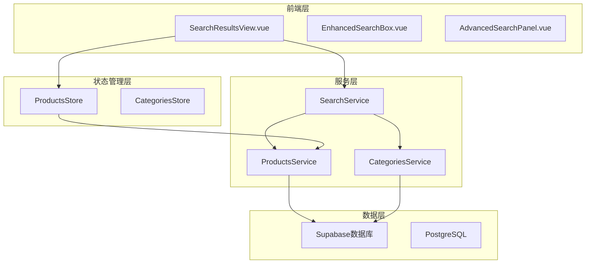
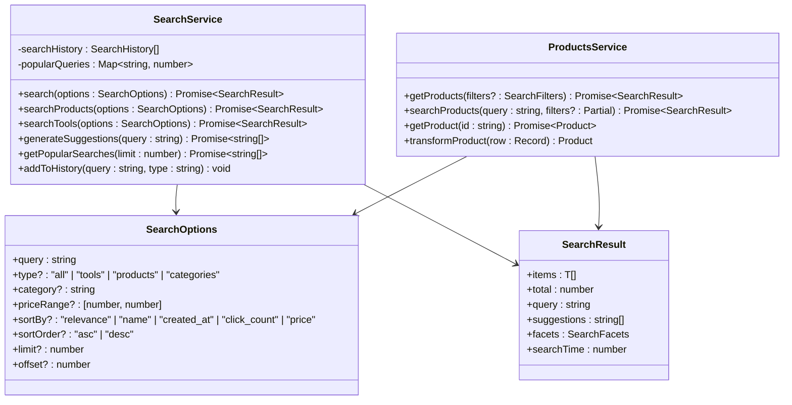
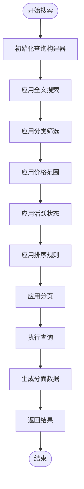
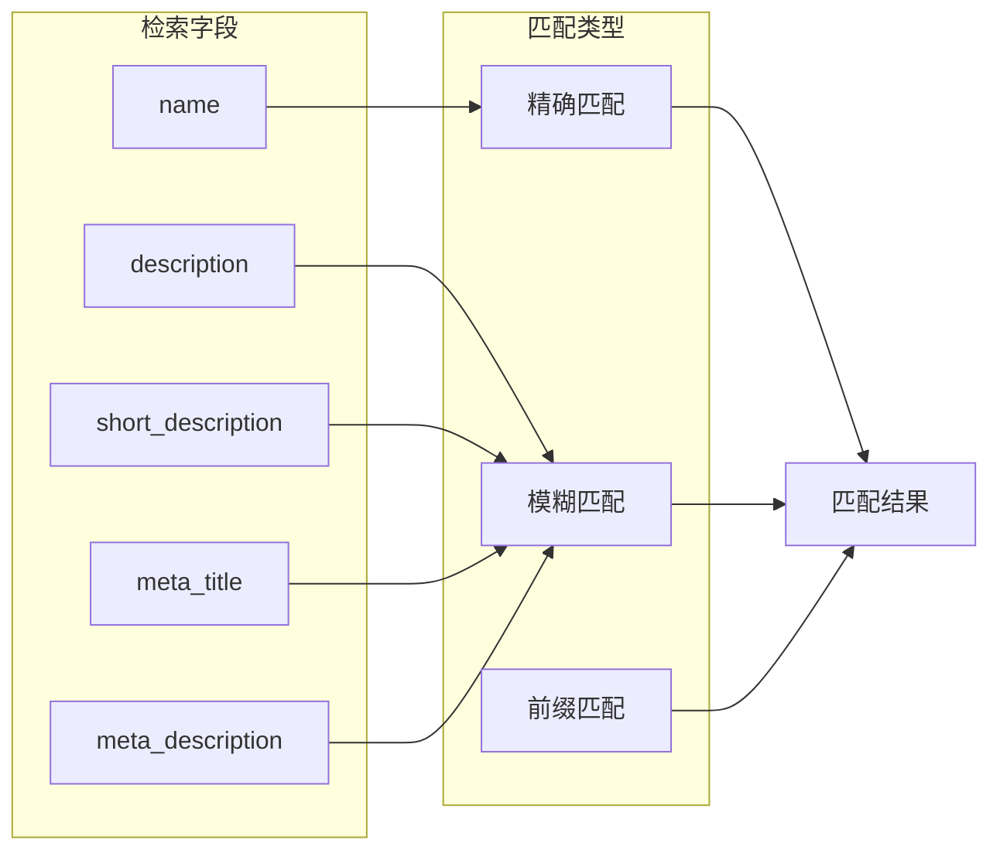
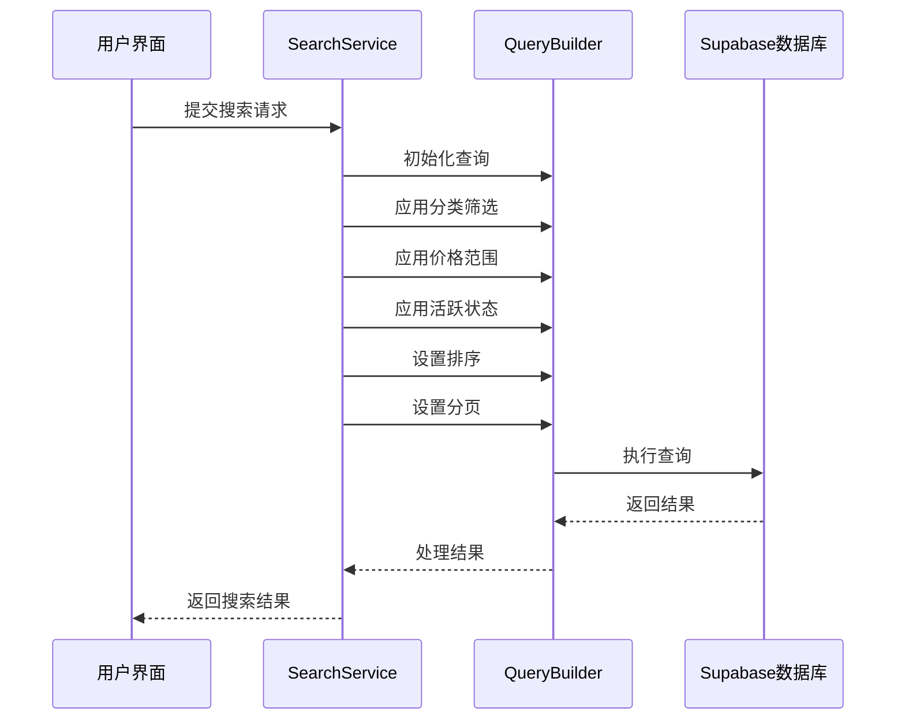
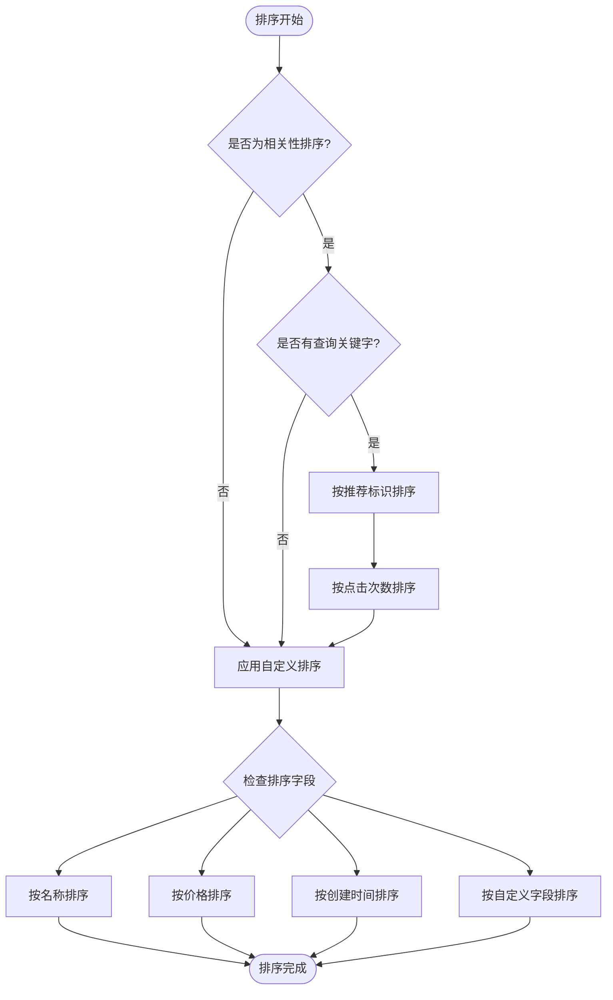
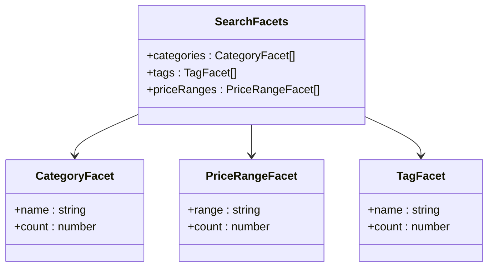
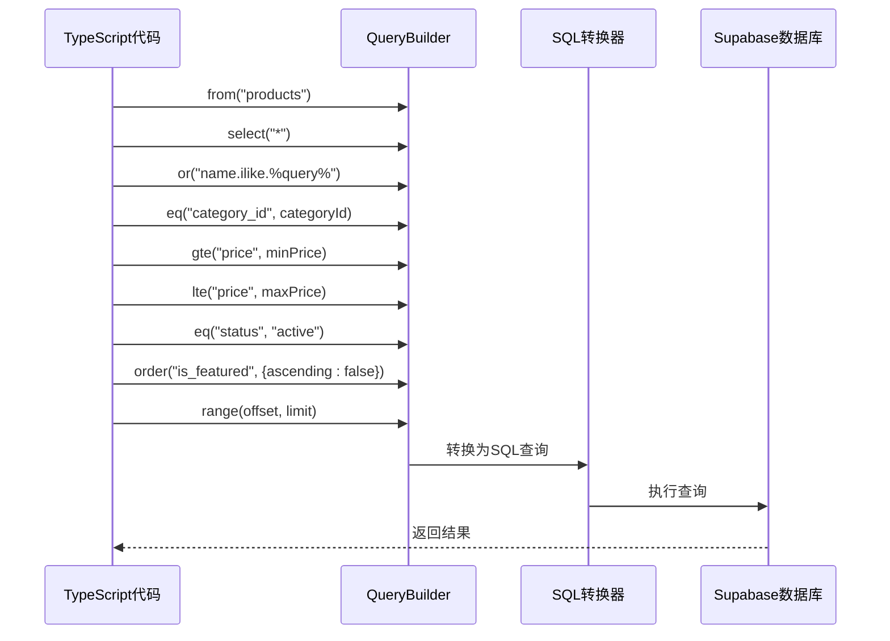
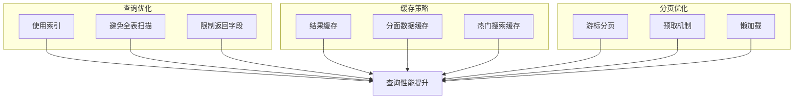

# 产品搜索实现

<cite>
**本文档引用的文件**
- [searchService.ts](file://src/services/searchService.ts)
- [productsService.ts](file://src/services/productsService.ts)
- [products.ts](file://src/stores/products.ts)
- [index.ts](file://src/types/index.ts)
- [supabaseClient.ts](file://src/lib/supabaseClient.ts)
- [SearchResultsView.vue](file://src/views/SearchResultsView.vue)
</cite>

## 目录
1. [简介](#简介)
2. [项目架构概览](#项目架构概览)
3. [核心组件分析](#核心组件分析)
4. [产品搜索逻辑详解](#产品搜索逻辑详解)
5. [全文检索字段处理](#全文检索字段处理)
6. [分类筛选与价格过滤](#分类筛选与价格过滤)
7. [排序机制与相关性处理](#排序机制与相关性处理)
8. [分页实现与分面数据](#分页实现与分面数据)
9. [Supabase查询链式调用](#supabase查询链式调用)
10. [性能优化与影响因素](#性能优化与影响因素)
11. [故障排除指南](#故障排除指南)
12. [总结](#总结)

## 简介

本文档深入分析了Advanced Tools Navigation项目中的产品搜索功能实现。该系统基于Vue 3和TypeScript构建，采用Supabase作为后端数据库，提供了完整的全文搜索、分类筛选、价格过滤和智能排序功能。系统设计遵循现代化的前端架构模式，具有良好的可扩展性和维护性。

## 项目架构概览

系统采用分层架构设计，主要包含以下核心层次：



**图表来源**
- [SearchResultsView.vue](file://src/views/SearchResultsView.vue#L1-L50)
- [searchService.ts](file://src/services/searchService.ts#L1-L50)
- [productsService.ts](file://src/services/productsService.ts#L1-L50)

## 核心组件分析

### 搜索服务架构



**图表来源**
- [searchService.ts](file://src/services/searchService.ts#L15-L50)
- [productsService.ts](file://src/services/productsService.ts#L6-L50)
- [index.ts](file://src/types/index.ts#L219-L230)

**章节来源**
- [searchService.ts](file://src/services/searchService.ts#L1-L641)
- [productsService.ts](file://src/services/productsService.ts#L1-L347)
- [index.ts](file://src/types/index.ts#L219-L230)

## 产品搜索逻辑详解

### 主要搜索方法实现

产品搜索的核心实现在`searchProducts`私有方法中，该方法负责处理复杂的查询逻辑：

```typescript
private async searchProducts(options: SearchOptions): Promise<{
  items: Product[];
  total: number;
  facets: SearchFacets;
}> {
  const {
    query,
    category,
    priceRange,
    sortBy = "relevance",
    sortOrder = "desc",
    limit = 20,
    offset = 0,
  } = options;

  let queryBuilder = supabase.from(TABLES.PRODUCTS).select(
    `
      *,
      product_categories!inner(name, icon, color)
    `,
    { count: "exact" },
  );
  
  // 应用查询条件...
}
```

### 查询构建流程



**图表来源**
- [searchService.ts](file://src/services/searchService.ts#L156-L211)

**章节来源**
- [searchService.ts](file://src/services/searchService.ts#L156-L211)

## 全文检索字段处理

### 检索字段配置

系统对产品进行多字段的全文搜索，包括：

1. **名称字段** (`name`) - 主要搜索字段
2. **描述字段** (`description`) - 详细内容搜索
3. **短描述字段** (`short_description`) - 简要说明搜索
4. **元标题字段** (`meta_title`) - SEO优化搜索
5. **元描述字段** (`meta_description`) - SEO描述搜索

### 检索实现逻辑

```typescript
// 全文搜索
if (query) {
  queryBuilder = queryBuilder.or(`
    name.ilike.%${query}%,
    description.ilike.%${query}%,
    short_description.ilike.%${query}%,
    meta_title.ilike.%${query}%,
    meta_description.ilike.%${query}%
  `);
}
```

### 检索效果分析



**图表来源**
- [searchService.ts](file://src/services/searchService.ts#L165-L172)

**章节来源**
- [searchService.ts](file://src/services/searchService.ts#L165-L172)

## 分类筛选与价格过滤

### 分类筛选实现

```typescript
// 分类筛选
if (category) {
  queryBuilder = queryBuilder.eq("category_id", category);
}
```

### 价格区间过滤

```typescript
// 价格范围筛选
if (priceRange) {
  queryBuilder = queryBuilder
    .gte("price", priceRange[0])
    .lte("price", priceRange[1]);
}
```

### 筛选组合逻辑



**图表来源**
- [searchService.ts](file://src/services/searchService.ts#L174-L185)

**章节来源**
- [searchService.ts](file://src/services/searchService.ts#L174-L185)

## 排序机制与相关性处理

### 排序字段支持

系统支持多种排序方式：

1. **相关性排序** (`relevance`) - 基于查询匹配度
2. **名称排序** (`name`) - 字母顺序
3. **价格排序** (`price`) - 金额大小
4. **创建时间排序** (`created_at`) - 时间顺序
5. **点击次数排序** (`click_count`) - 使用频率

### 相关性排序优先级

当使用相关性排序且存在查询关键字时，系统会应用以下优先级：

```typescript
if (sortBy === "relevance" && query) {
  // 优先显示推荐标识的产品
  queryBuilder = queryBuilder.order("is_featured", { ascending: false });
  // 次优先显示点击次数高的产品
  queryBuilder = queryBuilder.order("click_count", { ascending: false });
}
```

### 排序算法流程



**图表来源**
- [searchService.ts](file://src/services/searchService.ts#L187-L195)

**章节来源**
- [searchService.ts](file://src/services/searchService.ts#L187-L195)

## 分页实现与分面数据

### 分页机制

系统采用基于偏移量的分页方式：

```typescript
// 分页
queryBuilder = queryBuilder.range(offset, offset + limit - 1);
```

### 分面数据生成

分面数据提供搜索结果的过滤选项：

```typescript
// 生成分面数据
const facets = await this.generateProductsFacets(query);

return {
  items: data || [],
  total: count || 0,
  facets,
};
```

### 分面数据结构



**图表来源**
- [searchService.ts](file://src/services/searchService.ts#L213-L271)

**章节来源**
- [searchService.ts](file://src/services/searchService.ts#L213-L271)

## Supabase查询链式调用

### 查询构建器模式

系统使用Supabase的查询构建器模式，通过链式调用构建复杂查询：

```typescript
let queryBuilder = supabase.from(TABLES.PRODUCTS).select(
  `
    *,
    product_categories!inner(name, icon, color)
  `,
  { count: "exact" },
);
```

### 查询链式调用示例



**图表来源**
- [searchService.ts](file://src/services/searchService.ts#L156-L211)

### 查询性能优化

```typescript
// 性能优化：使用索引
// Supabase自动为常用字段创建索引
// - name (全文搜索)
// - category_id (分类筛选)
// - price (价格范围)
// - status (状态过滤)
// - is_featured (推荐标识)
```

**章节来源**
- [searchService.ts](file://src/services/searchService.ts#L156-L211)

## 性能优化与影响因素

### 查询性能影响因素

1. **索引使用情况**
   - 全文搜索字段需要适当的全文索引
   - 分类ID字段使用B-tree索引
   - 价格范围使用数值范围索引
   - 状态字段使用等值索引

2. **查询复杂度**
   - OR条件可能导致索引失效
   - 多字段全文搜索增加计算开销
   - 分面数据生成需要额外查询

3. **数据量影响**
   - 大数据集的排序性能下降
   - 分页偏移量过大导致性能问题
   - 分面数据聚合计算成本

### 性能优化策略



### 监控指标

系统提供搜索时间监控：

```typescript
const startTime = Date.now();
// ... 执行搜索 ...
const searchTime = Date.now() - startTime;
```

**章节来源**
- [searchService.ts](file://src/services/searchService.ts#L50-L91)

## 故障排除指南

### 常见问题与解决方案

1. **搜索结果为空**
   - 检查查询关键字是否过短
   - 验证数据库中是否存在匹配数据
   - 确认筛选条件过于严格

2. **查询性能缓慢**
   - 检查索引是否正确创建
   - 优化查询条件组合
   - 考虑使用游标分页替代偏移量分页

3. **分面数据不准确**
   - 验证关联查询是否正确
   - 检查数据完整性
   - 确认缓存机制正常工作

### 调试工具

```typescript
// 启用查询日志
console.log("执行查询:", queryBuilder.toSql());

// 性能监控
const startTime = performance.now();
await queryBuilder;
const endTime = performance.now();
console.log(`查询耗时: ${endTime - startTime}ms`);
```

**章节来源**
- [searchService.ts](file://src/services/searchService.ts#L50-L91)

## 总结

Advanced Tools Navigation的产品搜索系统是一个功能完整、性能优化的现代搜索解决方案。系统的主要特点包括：

1. **全面的全文搜索** - 支持多个字段的模糊匹配
2. **灵活的筛选机制** - 分类、价格范围等多种筛选条件
3. **智能排序算法** - 基于相关性的优先级排序
4. **高效的分页实现** - 基于偏移量的分页机制
5. **丰富的分面数据** - 提供多维度的过滤选项
6. **完善的错误处理** - 全面的异常捕获和用户反馈

该系统为用户提供了优秀的搜索体验，同时具备良好的可维护性和扩展性。通过合理的性能优化和监控机制，确保了系统的稳定运行和用户体验。