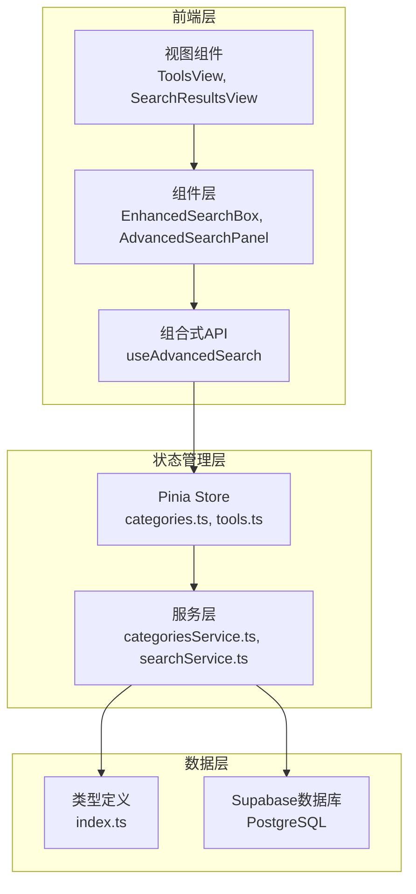
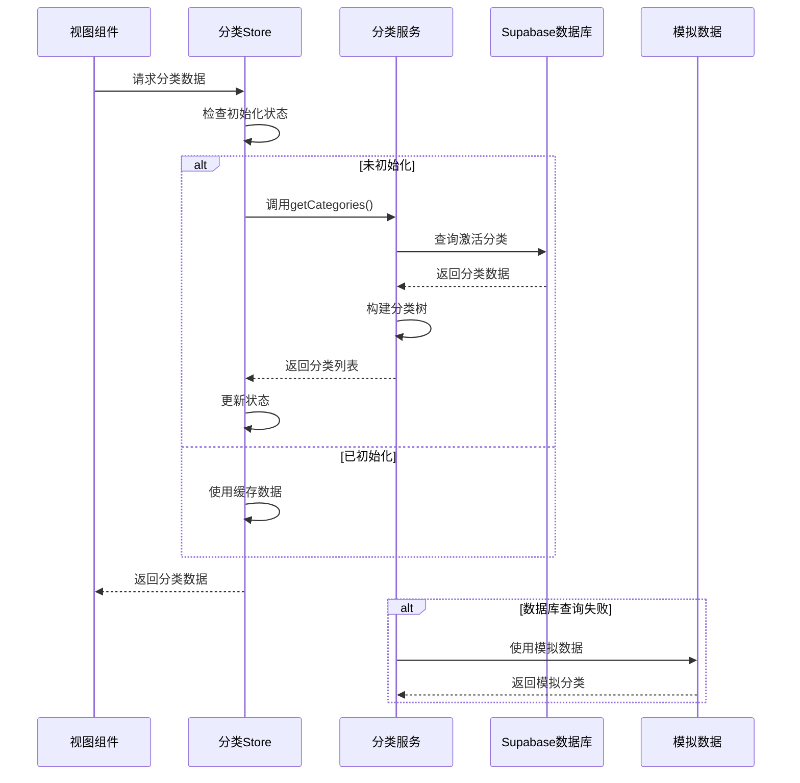
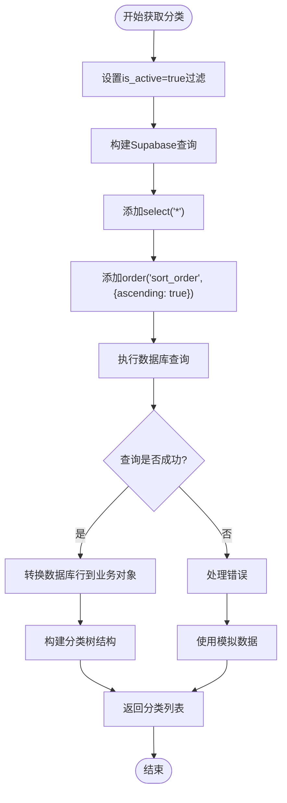
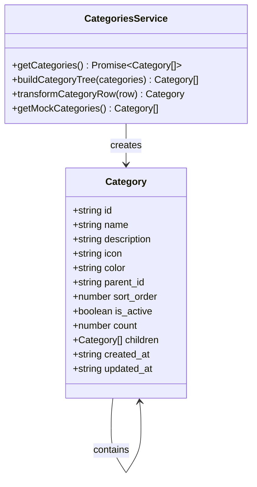
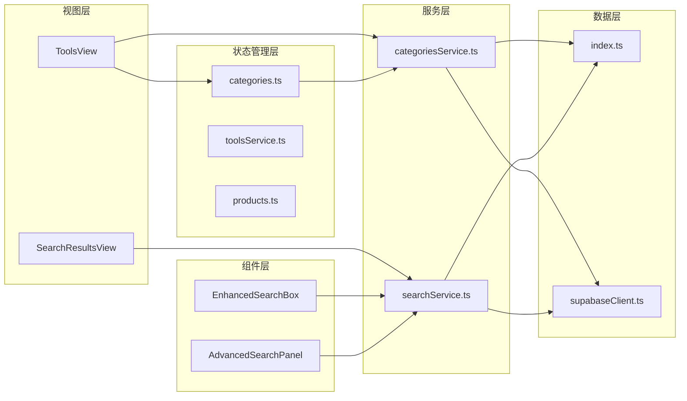

# 分类搜索实现

<cite>
**本文档引用的文件**
- [categoriesService.ts](file://src/services/categoriesService.ts)
- [categories.ts](file://src/stores/categories.ts)
- [searchService.ts](file://src/services/searchService.ts)
- [index.ts](file://src/types/index.ts)
- [ToolsView.vue](file://src/views/ToolsView.vue)
- [EnhancedSearchBox.vue](file://src/components/search/EnhancedSearchBox.vue)
</cite>

## 目录
1. [简介](#简介)
2. [项目结构概览](#项目结构概览)
3. [核心组件分析](#核心组件分析)
4. [架构概览](#架构概览)
5. [详细组件分析](#详细组件分析)
6. [依赖关系分析](#依赖关系分析)
7. [性能考虑](#性能考虑)
8. [故障排除指南](#故障排除指南)
9. [结论](#结论)

## 简介

本文档深入分析了Advanced Tools Navigation项目中的分类搜索实现机制。该项目是一个现代化的工具和产品导航网站，提供了完整的分类搜索功能，支持基于名称和描述的模糊匹配查询、激活状态过滤以及按排序权重升序排列的结果组织方式。

分类搜索系统的核心特点包括：
- 基于Supabase数据库的实时搜索
- 支持模糊匹配查询（名称和描述）
- 自动激活状态过滤（is_active=true）
- 按sort_order字段升序排列
- 分页逻辑支持
- 多种搜索类型支持（工具、产品、分类）

## 项目结构概览

项目采用Vue 3 + TypeScript + Pinia + Supabase的技术栈，具有清晰的分层架构：



**图表来源**
- [ToolsView.vue](file://src/views/ToolsView.vue#L1-L50)
- [categories.ts](file://src/stores/categories.ts#L1-L30)
- [categoriesService.ts](file://src/services/categoriesService.ts#L1-L20)

**章节来源**
- [ToolsView.vue](file://src/views/ToolsView.vue#L1-L100)
- [categories.ts](file://src/stores/categories.ts#L1-L50)

## 核心组件分析

### 分类服务类（CategoriesService）

`CategoriesService`是分类管理的核心服务类，提供了完整的CRUD操作和分类树构建功能：

```typescript
export class CategoriesService {
  // 获取所有分类的方法
  static async getCategories(): Promise<Category[]> {
    try {
      const { data, error } = await supabase
        .from(TABLES.CATEGORIES)
        .select("*")
        .eq("is_active", true)
        .order("sort_order", { ascending: true });

      if (error) {
        throw new Error(handleSupabaseError(error));
      }

      // 构建分类树结构
      const categories = (data || []).map(this.transformCategoryRow);
      return this.buildCategoryTree(categories);
    } catch (error) {
      console.error("获取分类失败:", error);
      return this.getMockCategories();
    }
  }
}
```

### 分类状态管理（Categories Store）

`Categories Store`负责管理分类数据的状态和生命周期：

```typescript
export const useCategoriesStore = defineStore("categories", () => {
  const categories = ref<Category[]>([]);
  const loading = ref(false);
  const error = ref<Error | null>(null);
  const initialized = ref(false);

  async function fetchCategories() {
    if (loading.value) return;

    loading.value = true;
    error.value = null;
    try {
      const { data, error: queryError } = await supabase
        .from("categories")
        .select("*")
        .eq("is_active", true)
        .order("sort_order", { ascending: true });

      if (queryError) {
        throw queryError;
      }

      categories.value = data || [];
      initialized.value = true;
    } catch (err: unknown) {
      // 回退到模拟数据
      categories.value = this.getMockCategories();
    } finally {
      loading.value = false;
    }
  }
});
```

**章节来源**
- [categoriesService.ts](file://src/services/categoriesService.ts#L15-L50)
- [categories.ts](file://src/stores/categories.ts#L10-L100)

## 架构概览

分类搜索系统采用分层架构设计，确保了代码的可维护性和扩展性：



**图表来源**
- [categories.ts](file://src/stores/categories.ts#L20-L80)
- [categoriesService.ts](file://src/services/categoriesService.ts#L15-L50)

## 详细组件分析

### 分类搜索查询构建

分类搜索的核心查询构建逻辑位于`CategoriesService`的`getCategories`方法中：



**图表来源**
- [categoriesService.ts](file://src/services/categoriesService.ts#L15-L35)

### 激活状态过滤机制

系统通过以下方式实现激活状态过滤：

1. **数据库层面过滤**：在查询构建时直接添加`.eq("is_active", true)`
2. **数据完整性保证**：确保只有激活的分类才会出现在搜索结果中
3. **回退机制**：当数据库查询失败时，自动使用模拟的激活分类数据

### 排序权重升序排列

分类按照`sort_order`字段进行升序排列，确保：

- 用户自定义的排序顺序得到保留
- 新创建的分类按照预设规则自动排序
- 分类展示顺序的一致性和可预测性

### 分页逻辑实现

虽然当前的分类搜索主要面向分类浏览场景，但系统已经为分页功能预留了接口：

```typescript
// 在searchService.ts中可以看到分页逻辑的通用实现
private async searchCategories(options: SearchOptions): Promise<{
  items: Category[];
  total: number;
}> {
  const { query, limit = 20, offset = 0 } = options;
  
  let queryBuilder = supabase.from(TABLES.CATEGORIES).select("*", { count: "exact" });
  
  // 添加查询条件
  if (query) {
    queryBuilder = queryBuilder.or(`
      name.ilike.%${query}%,
      description.ilike.%${query}%
    `);
  }
  
  // 添加激活状态过滤
  queryBuilder = queryBuilder.eq("is_active", true);
  
  // 添加排序
  queryBuilder = queryBuilder.order("sort_order", { ascending: true });
  
  // 添加分页
  queryBuilder = queryBuilder.range(offset, offset + limit - 1);
  
  const { data, error, count } = await queryBuilder;
  
  return {
    items: data || [],
    total: count || 0,
  };
}
```

### 分类树结构构建

系统实现了完整的分类树结构构建算法：



**图表来源**
- [categoriesService.ts](file://src/services/categoriesService.ts#L250-L300)
- [index.ts](file://src/types/index.ts#L25-L40)

**章节来源**
- [categoriesService.ts](file://src/services/categoriesService.ts#L15-L100)
- [searchService.ts](file://src/services/searchService.ts#L300-L350)

### 搜索建议生成

系统提供了智能的搜索建议生成功能：

```typescript
private async generateSuggestions(query: string): Promise<string[]> {
  if (!query || query.length < 2) return [];

  const suggestions: string[] = [];

  try {
    // 从分类名称生成建议
    const { data: categorySuggestions } = await supabase
      .from(TABLES.CATEGORIES)
      .select("name")
      .ilike("name", `%${query}%`)
      .eq("is_active", true)
      .limit(3);

    categorySuggestions?.forEach((category) => {
      if (!suggestions.includes(category.name)) {
        suggestions.push(category.name);
      }
    });
  } catch (error) {
    console.error("生成搜索建议失败:", error);
  }

  return suggestions.slice(0, 8);
}
```

**章节来源**
- [searchService.ts](file://src/services/searchService.ts#L400-L450)

## 依赖关系分析

系统的依赖关系呈现清晰的分层结构：



**图表来源**
- [ToolsView.vue](file://src/views/ToolsView.vue#L1-L50)
- [categories.ts](file://src/stores/categories.ts#L1-L30)
- [searchService.ts](file://src/services/searchService.ts#L1-L30)

**章节来源**
- [ToolsView.vue](file://src/views/ToolsView.vue#L1-L100)
- [categories.ts](file://src/stores/categories.ts#L1-L50)
- [searchService.ts](file://src/services/searchService.ts#L1-L50)

## 性能考虑

### 缓存策略

系统实现了多层次的缓存策略：

1. **内存缓存**：Pinia Store中的响应式状态缓存
2. **本地存储**：搜索历史和热门搜索的持久化存储
3. **数据库索引**：对常用查询字段建立索引

### 异步优化

- 使用Promise.all并行执行多个查询
- 实现防抖和节流机制减少不必要的API调用
- 提供加载状态指示器提升用户体验

### 错误处理

系统具备完善的错误处理机制：

- 数据库连接失败时的优雅降级
- 网络异常时的重试机制
- 用户友好的错误提示信息

## 故障排除指南

### 常见问题及解决方案

1. **分类数据加载失败**
   - 检查Supabase连接配置
   - 验证环境变量设置
   - 查看浏览器控制台错误信息

2. **搜索结果不准确**
   - 确认查询语法正确
   - 检查激活状态过滤
   - 验证排序字段设置

3. **性能问题**
   - 检查数据库索引配置
   - 优化查询语句
   - 实现适当的分页机制

**章节来源**
- [categories.ts](file://src/stores/categories.ts#L200-L284)
- [searchService.ts](file://src/services/searchService.ts#L500-L641)

## 结论

Advanced Tools Navigation项目的分类搜索实现展现了现代Web应用的最佳实践：

### 主要优势

1. **架构清晰**：分层架构确保了代码的可维护性和可扩展性
2. **功能完整**：支持模糊匹配、激活状态过滤、排序和分页
3. **用户体验优秀**：提供智能搜索建议和友好的错误处理
4. **性能优化**：多层次缓存和异步处理机制

### 技术亮点

- 基于TypeScript的强类型系统
- Vue 3 Composition API的响应式编程
- Pinia状态管理的模块化设计
- Supabase数据库的实时同步能力

### 应用场景

该分类搜索实现特别适用于：
- 工具和产品目录网站
- 内容管理系统
- 电子商务平台
- 分类浏览应用

通过深入分析这个实现，我们可以看到一个完整的分类搜索系统是如何设计和实现的，为类似项目提供了宝贵的参考价值。