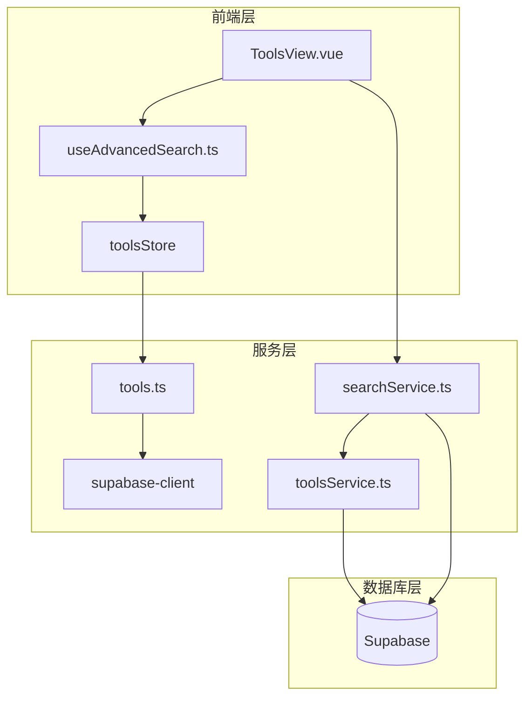
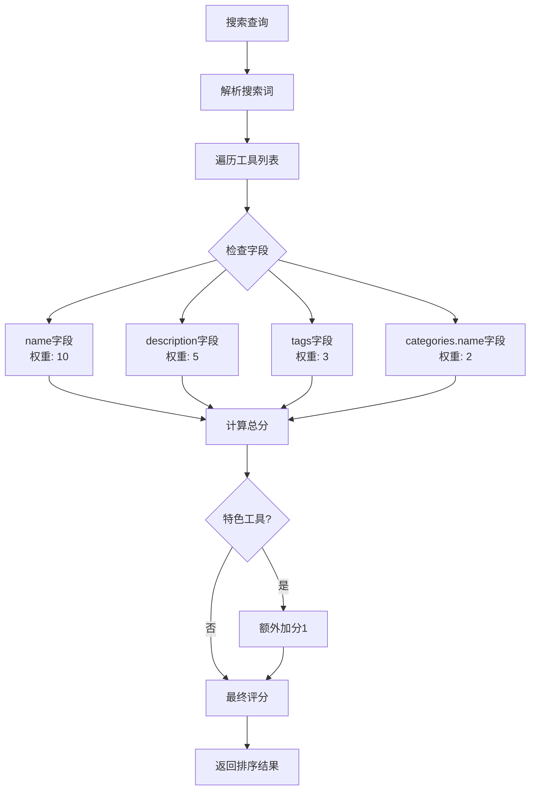

# 工具搜索实现

<cite>
**本文档引用的文件**
- [searchService.ts](file://src/services/searchService.ts)
- [toolsService.ts](file://src/services/toolsService.ts)
- [useAdvancedSearch.ts](file://src/composables/useAdvancedSearch.ts)
- [tools.ts](file://src/stores/tools.ts)
- [supabase-schema.ts](file://src/lib/supabase-schema.ts)
- [index.ts](file://src/types/index.ts)
- [ToolsView.vue](file://src/views/ToolsView.vue)
</cite>

## 目录
1. [简介](#简介)
2. [项目架构概览](#项目架构概览)
3. [核心搜索服务](#核心搜索服务)
4. [工具搜索实现](#工具搜索实现)
5. [高级搜索功能](#高级搜索功能)
6. [搜索结果处理](#搜索结果处理)
7. [性能优化策略](#性能优化策略)
8. [故障排除指南](#故障排除指南)
9. [总结](#总结)

## 简介

本文档详细说明了Advanced Tools Navigation项目中的工具搜索功能实现。该项目是一个现代化的工具导航网站，提供了完整的工具搜索、过滤和排序功能。搜索系统采用多层次架构设计，结合前端智能搜索算法和后端数据库查询优化，为用户提供快速准确的搜索体验。

## 项目架构概览

项目采用Vue 3 + TypeScript + Pinia + Supabase的技术栈，搜索功能分布在多个层次中：



**图表来源**
- [ToolsView.vue](file://src/views/ToolsView.vue#L1-L50)
- [searchService.ts](file://src/services/searchService.ts#L1-L30)
- [toolsService.ts](file://src/services/toolsService.ts#L1-L30)

## 核心搜索服务

### SearchService类设计

SearchService是整个搜索系统的核心，负责协调不同类型的搜索操作：

```typescript
class SearchService {
  private searchHistory: SearchHistory[] = [];
  private popularQueries: Map<string, number> = new Map();

  async search<T>(options: SearchOptions): Promise<SearchResult<T>> {
    const startTime = Date.now();
    const { query, type = "all" } = options;
    
    // 根据搜索类型执行不同的搜索策略
    switch (type) {
      case "tools":
        const toolResults = await this.searchTools(options);
        results = toolResults.items as T[];
        total = toolResults.total;
        facets = toolResults.facets;
        break;
        
      case "products":
        const productResults = await this.searchProducts(options);
        results = productResults.items as T[];
        total = productResults.total;
        facets = productResults.facets;
        break;
        
      case "categories":
        const categoryResults = await this.searchCategories(options);
        results = categoryResults.items as T[];
        total = categoryResults.total;
        break;
        
      case "all":
      default:
        const allResults = await this.searchAll(options);
        results = allResults.items as T[];
        total = allResults.total;
        facets = allResults.facets;
        break;
    }
  }
}
```

### 搜索选项接口

```typescript
export interface SearchOptions {
  query: string;
  type?: "all" | "tools" | "products" | "categories";
  category?: string;
  tags?: string[];
  priceRange?: [number, number];
  sortBy?: "relevance" | "name" | "created_at" | "click_count" | "price";
  sortOrder?: "asc" | "desc";
  limit?: number;
  offset?: number;
  includeInactive?: boolean;
}
```

**章节来源**
- [searchService.ts](file://src/services/searchService.ts#L50-L91)
- [searchService.ts](file://src/services/searchService.ts#L1-L30)

## 工具搜索实现

### 全文搜索条件构建

工具搜索支持多字段全文搜索，通过`or()`方法构建复杂的搜索条件：

```typescript
private async searchTools(options: SearchOptions): Promise<{
  items: Tool[];
  total: number;
  facets: SearchFacets;
}> {
  const {
    query,
    category,
    tags,
    sortBy = "relevance",
    sortOrder = "desc",
    limit = 20,
    offset = 0,
  } = options;

  let queryBuilder = supabase.from(TABLES.TOOLS).select(
    `
      *,
      categories!inner(name, icon, color),
      tool_tags!inner(tags!inner(name, color))
    `,
    { count: "exact" },
  );

  // 全文搜索
  if (query) {
    queryBuilder = queryBuilder.or(`
      name.ilike.%${query}%,
      description.ilike.%${query}%,
      meta_title.ilike.%${query}%,
      meta_description.ilike.%${query}%
    `);
  }
}
```

### 分类筛选和标签过滤

系统支持多维度筛选：

```typescript
// 分类筛选
if (category) {
  queryBuilder = queryBuilder.eq("category_id", category);
}

// 标签筛选
if (tags && tags.length > 0) {
  queryBuilder = queryBuilder.in("tool_tags.tag_id", tags);
}

// 只显示活跃的工具
queryBuilder = queryBuilder.eq("status", "active");
```

### 相关性排序策略

搜索结果采用智能排序策略：

```typescript
// 排序
if (sortBy === "relevance" && query) {
  // 相关性排序：优先显示名称匹配的结果
  queryBuilder = queryBuilder.order("is_featured", { ascending: false });
  queryBuilder = queryBuilder.order("click_count", { ascending: false });
} else {
  queryBuilder = queryBuilder.order(sortBy, {
    ascending: sortOrder === "asc",
  });
}
```

这种排序策略确保：
1. **推荐工具优先**：`is_featured`字段为true的工具排在前面
2. **热度优先**：点击量高的工具排名靠前
3. **用户偏好**：根据用户的搜索历史调整排序权重

**章节来源**
- [searchService.ts](file://src/services/searchService.ts#L110-L154)
- [searchService.ts](file://src/services/searchService.ts#L156-L211)

## 高级搜索功能

### useAdvancedSearch组合式函数

高级搜索功能由`useAdvancedSearch`组合式函数实现，提供客户端搜索能力：

```typescript
export function useAdvancedSearch() {
  const toolsStore = useToolsStore();
  
  const searchQuery = ref("");
  const filters = ref<SearchFilters>({
    category: "",
    tags: [],
    rating: 0,
    isFeatured: false,
    hasUrl: false,
    sortBy: "name",
    sortOrder: "asc",
  });

  // 智能搜索算法
  const performSearch = (
    query: string,
    items: Tool[],
  ): SearchResult[] => {
    if (!query.trim())
      return items.map((item) => ({ item, score: 1, matches: [] }));

    const searchTerms = query
      .toLowerCase()
      .split(/\s+/)
      .filter((term) => term.length > 0);
    const results: SearchResult[] = [];

    items.forEach((item) => {
      let score = 0;
      const matches: string[] = [];

      // 搜索字段权重
      const searchFields = [
        { field: "name", weight: 10 },
        { field: "description", weight: 5 },
        { field: "tags", weight: 3 },
        { field: "categories.name", weight: 2 },
      ];

      searchTerms.forEach((term) => {
        searchFields.forEach(({ field, weight }) => {
          const value = getNestedValue(item, field);
          if (value && searchInField(value, term)) {
            score += weight;
            if (!matches.includes(field)) {
              matches.push(field);
            }
          }
        });

        // 模糊匹配
        const itemName = item.name as string | undefined;
        if (fuzzyMatch(itemName?.toLowerCase() || "", term)) {
          score += 2;
        }
      });

      // 特色工具加分
      if (item.is_featured) {
        score += 1;
      }

      if (score > 0) {
        results.push({ item, score, matches });
      }
    });

    return results.sort((a, b) => b.score - a.score);
  };
}
```

### 搜索字段权重系统

高级搜索采用加权评分系统：



**图表来源**
- [useAdvancedSearch.ts](file://src/composables/useAdvancedSearch.ts#L25-L60)

### 筛选器应用

```typescript
const applyFilters = (results: SearchResult[]): SearchResult[] => {
  return results.filter(({ item }) => {
    // 分类筛选
    if (filters.value.category && item.category_id !== filters.value.category) {
      return false;
    }

    // 标签筛选
    if (filters.value.tags.length > 0) {
      const itemTags = item.tags || [];
      const hasMatchingTag = filters.value.tags.some((tag) =>
        itemTags.some((itemTag: string) =>
          itemTag.toLowerCase().includes(tag.toLowerCase()),
        ),
      );
      if (!hasMatchingTag) return false;
    }

    // 特色工具筛选
    if (filters.value.isFeatured && !item.is_featured) {
      return false;
    }

    // URL可用性筛选
    if (filters.value.hasUrl && (!item.url || !item.url.trim())) {
      return false;
    }

    return true;
  });
};
```

**章节来源**
- [useAdvancedSearch.ts](file://src/composables/useAdvancedSearch.ts#L25-L100)
- [useAdvancedSearch.ts](file://src/composables/useAdvancedSearch.ts#L101-L140)

## 搜索结果处理

### 分面数据生成

系统自动生成搜索分面数据，帮助用户进行精确筛选：

```typescript
// 生成工具分面数据
private async generateToolsFacets(query?: string): Promise<SearchFacets> {
  // 获取分类分面
  const categoriesQuery = supabase
    .from(TABLES.CATEGORIES)
    .select(
      `
      id, name,
      tools!inner(id)
    `,
      { count: "exact" },
    )
    .eq("is_active", true);

  if (query) {
    categoriesQuery.or(`
      tools.name.ilike.%${query}%,
      tools.description.ilike.%${query}%
    `);
  }

  const { data: categoriesData } = await categoriesQuery;

  const categories = (categoriesData || []).map((cat) => ({
    name: cat.name,
    count: cat.tools?.length || 0,
  }));

  // 获取标签分面
  const tagsQuery = supabase.from(TABLES.TAGS).select(
    `
      id, name,
      tool_tags!inner(tools!inner(id))
    `,
    { count: "exact" },
  );

  if (query) {
    tagsQuery.or(`
      tool_tags.tools.name.ilike.%${query}%,
      tool_tags.tools.description.ilike.%${query}%
    `);
  }

  const { data: tagsData } = await tagsQuery;

  const tags = (tagsData || []).map((tag) => ({
    name: tag.name,
    count: tag.tool_tags?.length || 0,
  }));

  return {
    categories,
    tags,
    priceRanges: [],
  };
}
```

### 分页处理机制

系统支持Range API进行高效分页：

```typescript
// 分页
queryBuilder = queryBuilder.range(offset, offset + limit - 1);

const { data, error, count } = await queryBuilder;

return {
  items: data || [],
  total: count || 0,
  facets,
};
```

### 搜索建议生成

```typescript
// 搜索建议
const searchSuggestions = computed(() => {
  if (!searchQuery.value.trim()) return [];

  const query = searchQuery.value.toLowerCase();
  const suggestions = new Set<string>();

  // 从工具名称中提取建议
  toolsStore.tools.forEach((tool) => {
    if (tool.name?.toLowerCase().includes(query)) {
      suggestions.add(tool.name);
    }

    // 从标签中提取建议
    if (tool.tags) {
      tool.tags.forEach((tag: string) => {
        if (tag.toLowerCase().includes(query)) {
          suggestions.add(tag);
        }
      });
    }
  });

  return Array.from(suggestions).slice(0, 5);
});
```

**章节来源**
- [searchService.ts](file://src/services/searchService.ts#L321-L370)
- [searchService.ts](file://src/services/searchService.ts#L371-L425)

## 性能优化策略

### 缓存机制

系统实现了多层缓存策略：

```typescript
// 工具服务缓存
static async getTools(filters?: SearchFilters): Promise<SearchResult<Tool>> {
  const cacheKey = `tools_${JSON.stringify(filters || {})}`;

  return withCache(
    this._getToolsFromAPI.bind(this),
    () => cacheKey,
    apiCache,
    2 * 60 * 1000, // 2分钟缓存
  )(filters);
}

// 推荐工具缓存
static async getFeaturedTools(limit = 6): Promise<Tool[]> {
  const cacheKey = `featured_tools_${limit}`;

  return withCache(
    this._getFeaturedToolsFromAPI.bind(this),
    () => cacheKey,
    apiCache,
    10 * 60 * 1000, // 10分钟缓存
  )(limit);
}
```

### 数据库索引优化

根据搜索模式，建议以下数据库索引：

```sql
-- 全文搜索索引
CREATE INDEX idx_tools_search ON tools USING gin(toastable(to_tsvector('english', name || ' ' || description || ' ' || meta_title || ' ' || meta_description)));

-- 分类索引
CREATE INDEX idx_tools_category ON tools(category_id);

-- 状态索引
CREATE INDEX idx_tools_status ON tools(status);

-- 点击量索引
CREATE INDEX idx_tools_click_count ON tools(click_count DESC);

-- 特色工具索引
CREATE INDEX idx_tools_featured ON tools(is_featured DESC, click_count DESC);
```

### 异步查询优化

```typescript
// 并行搜索各个类型
const [toolResults, productResults, categoryResults] = await Promise.all([
  this.searchTools({ ...options, limit: Math.ceil(limit / 3) }),
  this.searchProducts({ ...options, limit: Math.ceil(limit / 3) }),
  this.searchCategories({ ...options, limit: Math.ceil(limit / 3) }),
]);
```

### 前端虚拟滚动

对于大量搜索结果，建议实现虚拟滚动：

```typescript
// 虚拟滚动配置
const virtualScrollConfig = {
  itemHeight: 100, // 每个项目高度
  containerHeight: 600, // 容器高度
  buffer: 10, // 缓冲项目数量
};
```

**章节来源**
- [toolsService.ts](file://src/services/toolsService.ts#L35-L50)
- [toolsService.ts](file://src/services/toolsService.ts#L280-L295)

## 故障排除指南

### 常见搜索问题

1. **搜索结果为空**
   - 检查查询字符串是否为空
   - 验证数据库连接状态
   - 确认工具状态为"active"

2. **搜索性能缓慢**
   - 检查数据库索引是否正确创建
   - 优化搜索查询语句
   - 考虑添加缓存层

3. **分面数据不准确**
   - 验证关联表关系
   - 检查计数查询逻辑
   - 确认数据一致性

### 调试工具

```typescript
// 搜索时间监控
const startTime = Date.now();
const results = await this.searchTools(options);
const searchTime = Date.now() - startTime;
console.log(`搜索耗时: ${searchTime}ms`);

// 查询SQL日志
console.log('执行的查询:', queryBuilder.toSql());
```

### 错误处理策略

```typescript
try {
  const { data, error, count } = await queryBuilder;
  
  if (error) {
    throw new Error(handleSupabaseError(error));
  }
  
  return {
    items: data || [],
    total: count || 0,
    facets,
  };
} catch (error) {
  console.error("搜索失败:", error);
  // 返回模拟数据作为回退
  return this.getMockTools(options);
}
```

**章节来源**
- [searchService.ts](file://src/services/searchService.ts#L93-L105)
- [toolsService.ts](file://src/services/toolsService.ts#L65-L80)

## 总结

Advanced Tools Navigation项目的工具搜索功能展现了现代Web应用搜索系统的最佳实践：

### 核心优势

1. **多层次架构**：前端智能搜索 + 后端数据库查询的完美结合
2. **灵活的搜索选项**：支持全文搜索、分类筛选、标签过滤等多种方式
3. **智能排序**：基于相关性和用户行为的综合排序策略
4. **性能优化**：多层缓存、异步查询、分面数据等优化措施
5. **用户体验**：实时搜索建议、分页处理、响应式设计

### 技术亮点

- **TypeScript强类型**：确保代码质量和维护性
- **Composition API**：模块化的搜索功能组织
- **Pinia状态管理**：高效的工具数据管理
- **Supabase ORM**：简洁的数据访问层
- **响应式设计**：适应不同设备的搜索体验

### 扩展建议

1. **搜索历史持久化**：将用户搜索历史保存到本地存储
2. **个性化推荐**：基于用户行为的智能推荐算法
3. **搜索分析**：记录搜索关键词和用户行为数据
4. **语音搜索**：集成语音识别技术
5. **图像搜索**：支持基于图片的工具搜索

这个搜索系统为开发者提供了一个完整的参考实现，展示了如何构建一个高性能、易维护的搜索功能。通过合理的架构设计和优化策略，系统能够处理大规模数据并提供优秀的用户体验。