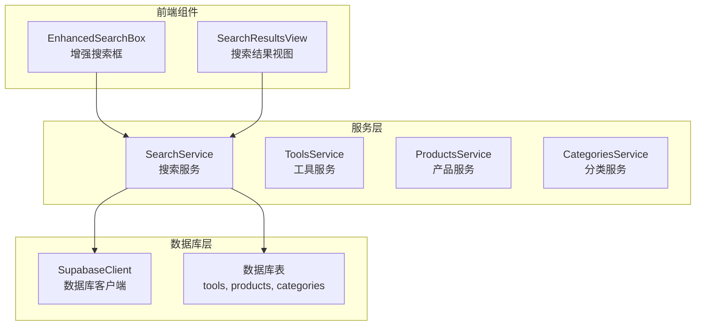
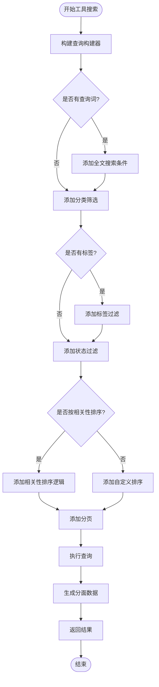
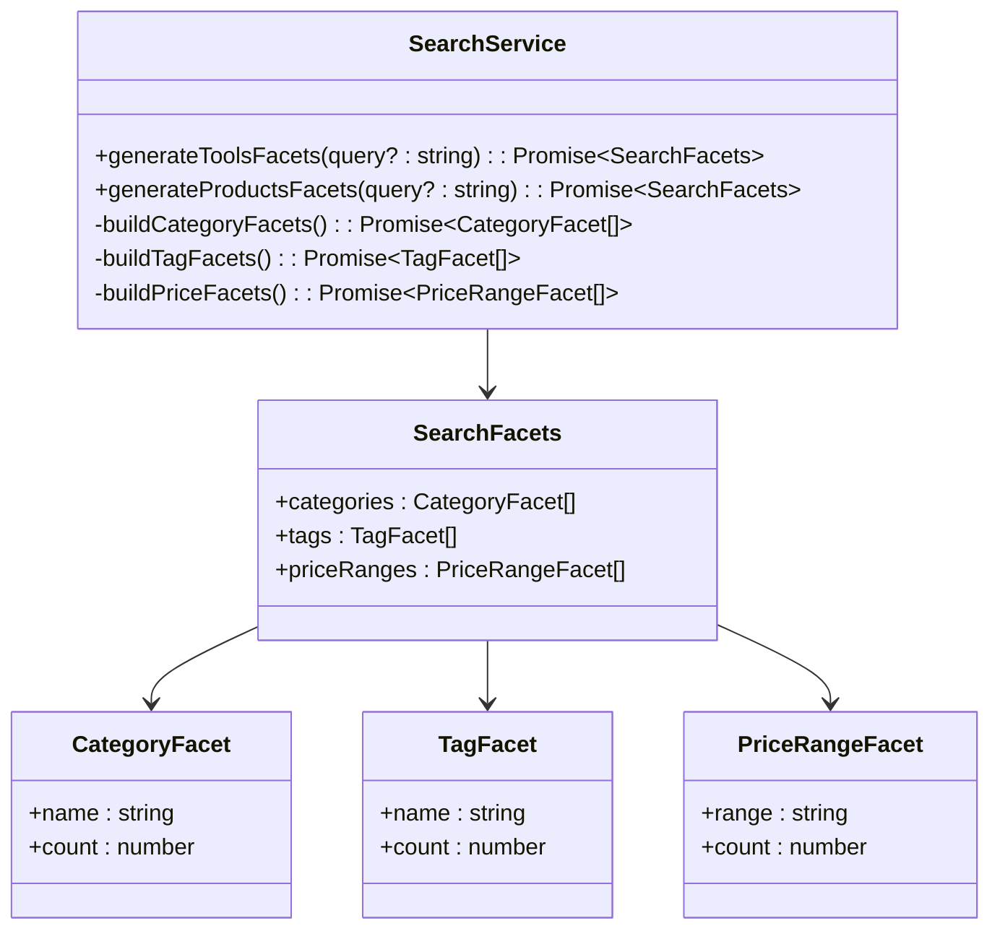

# 服务端搜索接口

<cite>
**本文档引用的文件**
- [searchService.ts](file://src/services/searchService.ts)
- [supabaseClient.ts](file://src/lib/supabaseClient.ts)
- [add_performance_indexes.sql](file://supabase/migrations/20250103000001_add_performance_indexes.sql)
- [EnhancedSearchBox.vue](file://src/components/search/EnhancedSearchBox.vue)
- [index.ts](file://src/types/index.ts)
- [supabase-schema.ts](file://src/lib/supabase-schema.ts)
- [services.test.ts](file://src/tests/integration/services.test.ts)
</cite>

## 目录
1. [简介](#简介)
2. [项目结构](#项目结构)
3. [核心组件](#核心组件)
4. [架构概览](#架构概览)
5. [详细组件分析](#详细组件分析)
6. [依赖关系分析](#依赖关系分析)
7. [性能考虑](#性能考虑)
8. [故障排除指南](#故障排除指南)
9. [结论](#结论)

## 简介

SearchService类是Advanced Tools Navigation项目中的核心搜索服务，提供了强大的后端搜索功能。该服务支持多种搜索类型（工具、产品、分类、综合搜索），通过Supabase数据库进行高效的数据检索，并实现了智能分面数据生成、搜索建议和性能优化等功能。

该服务采用TypeScript开发，具有完善的类型定义和错误处理机制，为前端搜索组件提供了统一的API接口。通过精心设计的查询构建器和索引策略，确保了搜索功能的高性能和可扩展性。

## 项目结构

SearchService位于项目的`src/services`目录下，与其他业务服务模块并列。整个搜索系统的文件组织如下：



**图表来源**
- [searchService.ts](file://src/services/searchService.ts#L1-L50)
- [supabaseClient.ts](file://src/lib/supabaseClient.ts#L1-L30)

**章节来源**
- [searchService.ts](file://src/services/searchService.ts#L1-L641)
- [supabaseClient.ts](file://src/lib/supabaseClient.ts#L1-L246)

## 核心组件

### SearchService类

SearchService是整个搜索系统的核心类，提供了统一的搜索接口和丰富的功能特性：

```typescript
class SearchService {
  private searchHistory: SearchHistory[] = [];
  private popularQueries: Map<string, number> = new Map();
  
  async search<T>(options: SearchOptions): Promise<SearchResult<T>>
  private async searchTools(options: SearchOptions): Promise<{ items: Tool[], total: number, facets: SearchFacets }>
  private async searchProducts(options: SearchOptions): Promise<{ items: Product[], total: number, facets: SearchFacets }>
  private async searchCategories(options: SearchOptions): Promise<{ items: Category[], total: number }>
  private async searchAll(options: SearchOptions): Promise<{ items: SearchAllItem[], total: number, facets: SearchFacets }>
}
```

### 搜索选项接口

```typescript
export interface SearchOptions {
  query: string;
  type?: "all" | "tools" | "products" | "categories";
  category?: string;
  tags?: string[];
  priceRange?: [number, number];
  sortBy?: "relevance" | "name" | "created_at" | "click_count" | "price";
  sortOrder?: "asc" | "desc";
  limit?: number;
  offset?: number;
  includeInactive?: boolean;
}
```

### 搜索结果接口

```typescript
export interface SearchResult<T> {
  items: T[];
  total: number;
  query: string;
  suggestions: string[];
  facets: SearchFacets;
  searchTime: number;
}
```

**章节来源**
- [searchService.ts](file://src/services/searchService.ts#L50-L120)
- [searchService.ts](file://src/services/searchService.ts#L1-L40)

## 架构概览

SearchService采用了模块化的架构设计，支持多种搜索类型和复杂的查询条件：

```mermaid
sequenceDiagram
participant Client as "前端组件"
participant SearchService as "SearchService"
participant Supabase as "Supabase数据库"
participant Index as "数据库索引"
Client->>SearchService : search(options)
SearchService->>SearchService : addToHistory(query, type)
alt 搜索类型判断
case "tools"
SearchService->>SearchService : searchTools(options)
case "products"
SearchService->>SearchService : searchProducts(options)
case "categories"
SearchService->>SearchService : searchCategories(options)
case "all"
SearchService->>SearchService : searchAll(options)
end
SearchService->>Supabase : 构建查询语句
Supabase->>Index : 使用索引优化查询
Index-->>Supabase : 返回查询结果
Supabase-->>SearchService : 查询数据和统计信息
SearchService->>SearchService : generateSuggestions(query)
SearchService->>SearchService : generateFacets()
SearchService-->>Client : 返回完整搜索结果
```

**图表来源**
- [searchService.ts](file://src/services/searchService.ts#L50-L120)
- [searchService.ts](file://src/services/searchService.ts#L130-L200)

## 详细组件分析

### 主搜索方法

主搜索方法`search<T>`是整个搜索服务的核心入口点，负责根据搜索类型执行相应的查询策略：

```typescript
async search<T>(options: SearchOptions): Promise<SearchResult<T>> {
  const startTime = Date.now();
  const { query, type = "all" } = options;
  
  // 记录搜索历史
  this.addToHistory(query, type);
  
  // 根据搜索类型执行不同的搜索策略
  switch (type) {
    case "tools":
      const toolResults = await this.searchTools(options);
      results = toolResults.items as T[];
      total = toolResults.total;
      facets = toolResults.facets;
      break;
      
    case "products":
      const productResults = await this.searchProducts(options);
      results = productResults.items as T[];
      total = productResults.total;
      facets = productResults.facets;
      break;
      
    case "categories":
      const categoryResults = await this.searchCategories(options);
      results = categoryResults.items as T[];
      total = categoryResults.total;
      break;
      
    case "all":
    default:
      const allResults = await this.searchAll(options);
      results = allResults.items as T[];
      total = allResults.total;
      facets = allResults.facets;
      break;
  }
  
  // 生成搜索建议
  const suggestions = await this.generateSuggestions(query);
  
  return {
    items: results,
    total,
    query,
    suggestions,
    facets,
    searchTime: Date.now() - startTime,
  };
}
```

### 工具搜索实现

`searchTools`方法专门处理工具的搜索逻辑，支持全文搜索、分类筛选、标签过滤和相关性排序：



**图表来源**
- [searchService.ts](file://src/services/searchService.ts#L130-L200)

### 产品搜索实现

`searchProducts`方法处理产品的搜索逻辑，特别支持价格范围筛选和产品特有的排序选项：

```typescript
private async searchProducts(options: SearchOptions): Promise<{
  items: Product[];
  total: number;
  facets: SearchFacets;
}> {
  const {
    query,
    category,
    priceRange,
    sortBy = "relevance",
    sortOrder = "desc",
    limit = 20,
    offset = 0,
  } = options;

  let queryBuilder = supabase.from(TABLES.PRODUCTS).select(
    `
      *,
      product_categories!inner(name, icon, color)
    `,
    { count: "exact" },
  );

  // 全文搜索
  if (query) {
    queryBuilder = queryBuilder.or(`
      name.ilike.%${query}%,
      description.ilike.%${query}%,
      short_description.ilike.%${query}%,
      meta_title.ilike.%${query}%,
      meta_description.ilike.%${query}%
    `);
  }

  // 价格范围筛选
  if (priceRange) {
    queryBuilder = queryBuilder
      .gte("price", priceRange[0])
      .lte("price", priceRange[1]);
  }

  // 只显示活跃的产品
  queryBuilder = queryBuilder.eq("status", "active");

  // 排序
  if (sortBy === "relevance" && query) {
    queryBuilder = queryBuilder.order("is_featured", { ascending: false });
  } else {
    queryBuilder = queryBuilder.order(sortBy, {
      ascending: sortOrder === "asc",
    });
  }

  // 分页
  queryBuilder = queryBuilder.range(offset, offset + limit - 1);

  const { data, error, count } = await queryBuilder;
  if (error) throw error;

  // 生成分面数据
  const facets = await this.generateProductsFacets(query);

  return { items: data || [], total: count || 0, facets };
}
```

### 分面数据生成机制

分面数据是搜索服务的重要特性，为用户提供高级筛选功能：



**图表来源**
- [searchService.ts](file://src/services/searchService.ts#L25-L35)
- [searchService.ts](file://src/services/searchService.ts#L350-L450)

### 搜索建议系统

搜索建议系统通过智能匹配和热门搜索推荐，提升用户体验：

```typescript
private async generateSuggestions(query: string): Promise<string[]> {
  if (!query || query.length < 2) return [];

  const suggestions: string[] = [];

  try {
    // 从工具名称生成建议
    const { data: toolSuggestions } = await supabase
      .from(TABLES.TOOLS)
      .select("name")
      .ilike("name", `%${query}%`)
      .eq("status", "active")
      .limit(5);

    toolSuggestions?.forEach((tool) => {
      if (!suggestions.includes(tool.name)) {
        suggestions.push(tool.name);
      }
    });

    // 从产品名称生成建议
    const { data: productSuggestions } = await supabase
      .from(TABLES.PRODUCTS)
      .select("name")
      .ilike("name", `%${query}%`)
      .eq("status", "active")
      .limit(5);

    productSuggestions?.forEach((product) => {
      if (!suggestions.includes(product.name)) {
        suggestions.push(product.name);
      }
    });

    // 从分类名称生成建议
    const { data: categorySuggestions } = await supabase
      .from(TABLES.CATEGORIES)
      .select("name")
      .ilike("name", `%${query}%`)
      .eq("is_active", true)
      .limit(3);

    categorySuggestions?.forEach((category) => {
      if (!suggestions.includes(category.name)) {
        suggestions.push(category.name);
      }
    });
  } catch (error) {
    console.error("生成搜索建议失败:", error);
  }

  return suggestions.slice(0, 8);
}
```

**章节来源**
- [searchService.ts](file://src/services/searchService.ts#L130-L350)
- [searchService.ts](file://src/services/searchService.ts#L350-L500)

## 依赖关系分析

SearchService与多个系统组件存在密切的依赖关系：

```mermaid
graph TB
subgraph "外部依赖"
Supabase["@supabase/supabase-js<br/>数据库客户端"]
VueUse["@vueuse/core<br/>响应式工具"]
end
subgraph "内部依赖"
SupabaseClient["supabaseClient.ts<br/>数据库配置"]
Types["types/index.ts<br/>类型定义"]
Store["stores/categories.ts<br/>分类状态管理"]
end
subgraph "SearchService"
SearchService["SearchService<br/>核心搜索服务"]
end
subgraph "前端组件"
SearchBox["EnhancedSearchBox.vue<br/>搜索框组件"]
SearchResults["SearchResultsView.vue<br/>搜索结果视图"]
end
Supabase --> SupabaseClient
VueUse --> SearchBox
SupabaseClient --> SearchService
Types --> SearchService
Store --> SearchBox
SearchService --> SearchBox
SearchService --> SearchResults
```

**图表来源**
- [searchService.ts](file://src/services/searchService.ts#L1-L10)
- [EnhancedSearchBox.vue](file://src/components/search/EnhancedSearchBox.vue#L1-L20)

**章节来源**
- [searchService.ts](file://src/services/searchService.ts#L1-L10)
- [supabaseClient.ts](file://src/lib/supabaseClient.ts#L1-L30)

## 性能考虑

### 数据库索引优化

项目通过专门的性能优化迁移文件实现了全面的索引策略：

```sql
-- 工具表索引
CREATE INDEX IF NOT EXISTS idx_tools_category_id ON tools(category_id);
CREATE INDEX IF NOT EXISTS idx_tools_status ON tools(status);
CREATE INDEX IF NOT EXISTS idx_tools_is_featured ON tools(is_featured);
CREATE INDEX IF NOT EXISTS idx_tools_click_count ON tools(click_count DESC);
CREATE INDEX IF NOT EXISTS idx_tools_created_at ON tools(created_at DESC);
CREATE INDEX IF NOT EXISTS idx_tools_name_gin ON tools USING gin(to_tsvector('chinese', name));
CREATE INDEX IF NOT EXISTS idx_tools_description_gin ON tools USING gin(to_tsvector('chinese', description));

-- 产品表索引
CREATE INDEX IF NOT EXISTS idx_products_category_id ON products(category_id);
CREATE INDEX IF NOT EXISTS idx_products_status ON products(status);
CREATE INDEX IF NOT EXISTS idx_products_is_featured ON products(is_featured);
CREATE INDEX IF NOT EXISTS idx_products_price ON products(price);
CREATE INDEX IF NOT EXISTS idx_products_created_at ON products(created_at DESC);
CREATE INDEX IF NOT EXISTS idx_products_name_gin ON products USING gin(to_tsvector('chinese', name));
CREATE INDEX IF NOT EXISTS idx_products_description_gin ON products USING gin(to_tsvector('chinese', description));
```

### 查询性能优化策略

1. **全文搜索优化**：使用GIN索引加速中文全文搜索
2. **复合索引**：针对常用查询组合创建复合索引
3. **部分索引**：只对活跃数据创建索引，减少索引大小
4. **相似度搜索**：使用pg_trgm扩展支持模糊匹配

### 缓存和历史管理

```typescript
// 搜索历史缓存
private searchHistory: SearchHistory[] = [];
private popularQueries: Map<string, number> = new Map();

// 本地存储持久化
private saveHistoryToStorage(): void {
  try {
    localStorage.setItem(
      "search_history",
      JSON.stringify(this.searchHistory),
    );
  } catch (error) {
    console.error("保存搜索历史失败:", error);
  }
}

// 搜索历史限制
if (this.searchHistory.length > 50) {
  this.searchHistory = this.searchHistory.slice(0, 50);
}
```

**章节来源**
- [add_performance_indexes.sql](file://supabase/migrations/20250103000001_add_performance_indexes.sql#L1-L100)
- [searchService.ts](file://src/services/searchService.ts#L50-L100)

## 故障排除指南

### 常见问题和解决方案

1. **搜索结果为空**
   - 检查查询词是否包含有效字符
   - 验证数据库中是否存在符合条件的数据
   - 确认索引是否正确创建

2. **查询性能缓慢**
   - 检查数据库连接状态
   - 验证索引是否被正确使用
   - 考虑增加查询限制或分页参数

3. **分面数据不准确**
   - 确认相关表的关联关系
   - 检查分面查询的条件设置
   - 验证统计数据的计算逻辑

### 调试工具和技巧

```typescript
// 启用查询日志
console.log("执行查询:", queryBuilder.toPostgres());

// 性能监控
const startTime = Date.now();
// ... 执行查询
const executionTime = Date.now() - startTime;
console.log(`查询耗时: ${executionTime}ms`);

// 错误处理
try {
  const result = await searchService.search(options);
  return result;
} catch (error) {
  console.error("搜索失败:", error);
  throw error;
}
```

**章节来源**
- [searchService.ts](file://src/services/searchService.ts#L60-L80)
- [services.test.ts](file://src/tests/integration/services.test.ts#L80-L120)

## 结论

SearchService是一个功能完善、性能优化的后端搜索服务，为Advanced Tools Navigation项目提供了强大的搜索能力。通过模块化的架构设计、智能的分面数据生成、完善的性能优化策略和友好的错误处理机制，该服务能够满足各种复杂的搜索需求。

主要特性包括：
- 支持多种搜索类型（工具、产品、分类、综合搜索）
- 智能分面数据生成和高级筛选功能
- 全文搜索和精确匹配双重支持
- 性能优化的数据库索引策略
- 搜索历史管理和热门搜索推荐
- 完善的错误处理和调试支持

该服务为前端搜索组件提供了统一、高效的API接口，是整个搜索系统的核心支柱。通过持续的性能优化和功能扩展，SearchService将继续为用户提供优秀的搜索体验。