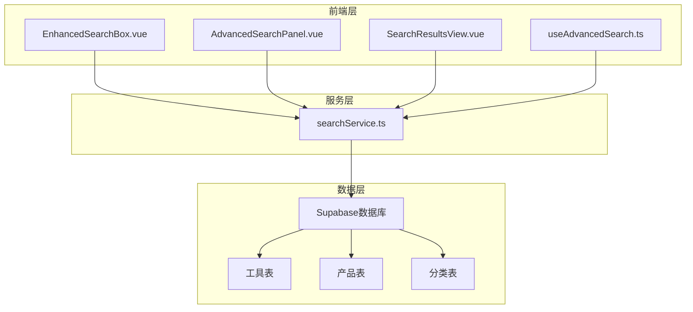
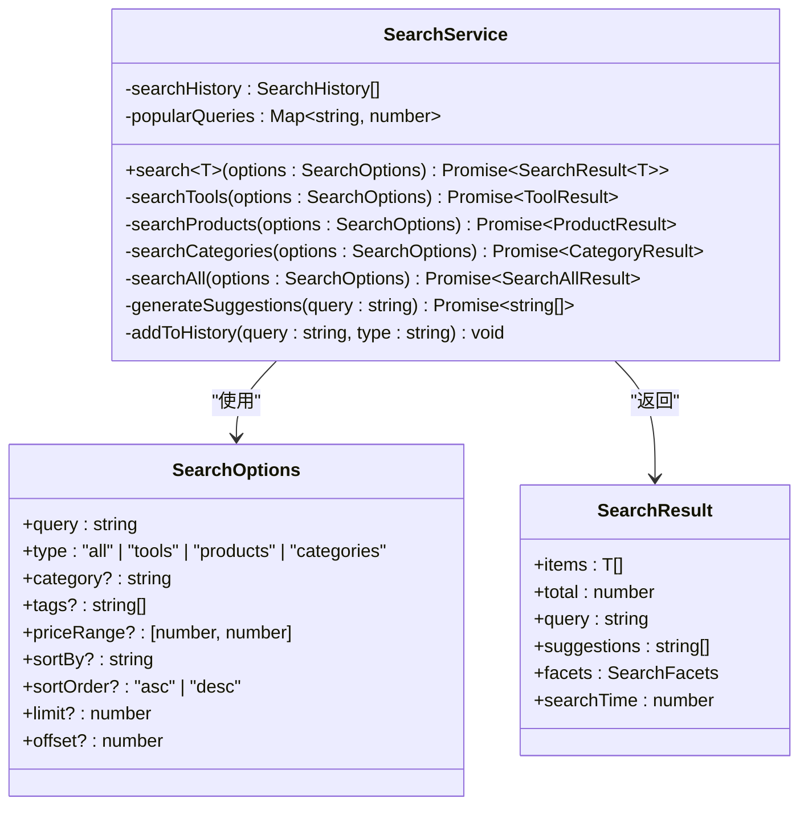
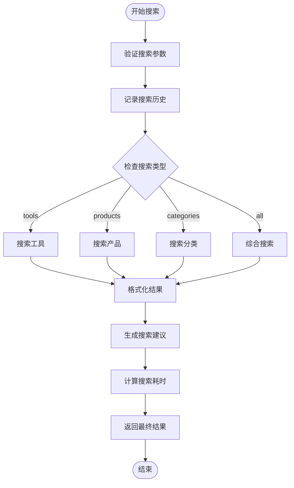
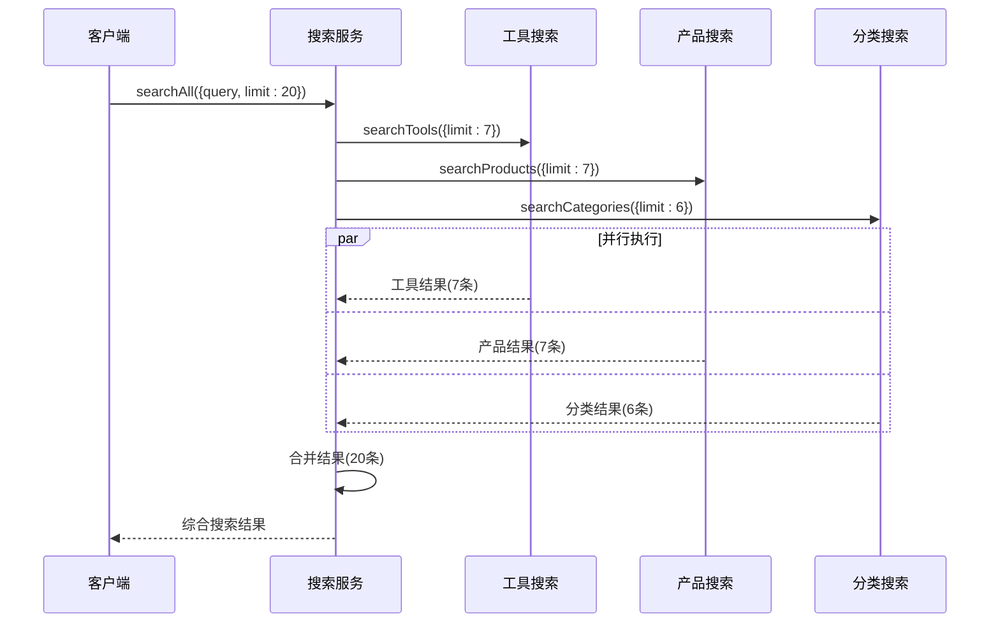
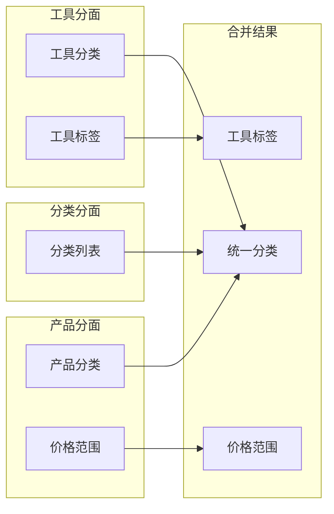
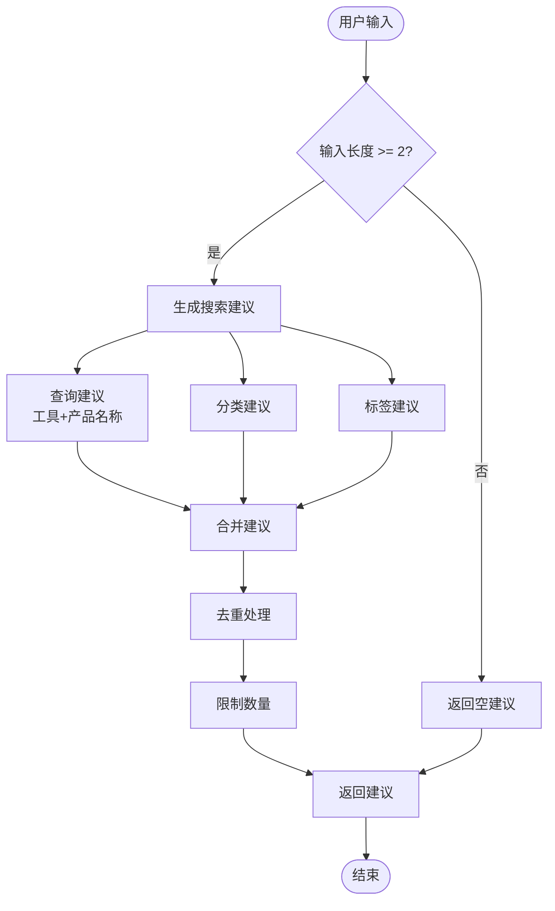

# 综合搜索实现

<cite>
**本文档引用的文件**
- [searchService.ts](file://src/services/searchService.ts)
- [EnhancedSearchBox.vue](file://src/components/search/EnhancedSearchBox.vue)
- [AdvancedSearchPanel.vue](file://src/components/search/AdvancedSearchPanel.vue)
- [useAdvancedSearch.ts](file://src/composables/useAdvancedSearch.ts)
- [SearchResultsView.vue](file://src/views/SearchResultsView.vue)
- [index.ts](file://src/types/index.ts)
- [supabaseClient.ts](file://src/lib/supabaseClient.ts)
</cite>

## 目录
1. [简介](#简介)
2. [项目架构概览](#项目架构概览)
3. [核心组件分析](#核心组件分析)
4. [统一搜索机制详解](#统一搜索机制详解)
5. [性能优化策略](#性能优化策略)
6. [结果合并逻辑](#结果合并逻辑)
7. [分面数据处理](#分面数据处理)
8. [用户体验优化](#用户体验优化)
9. [故障排除指南](#故障排除指南)
10. [总结](#总结)

## 简介

本系统实现了一个强大的综合搜索功能，能够同时搜索工具、产品和分类三大类型的数据。通过Promise.all并行执行多个子搜索任务，显著提升了搜索性能，为用户提供快速、准确的跨类型搜索体验。

综合搜索的核心优势在于：
- **统一搜索接口**：一个API即可完成多类型搜索
- **并行执行**：利用Promise.all同时执行三个子搜索
- **智能合并**：将不同类型的搜索结果整合为统一格式
- **性能优化**：通过结果数量均分策略提升响应速度
- **丰富分面**：提供全面的筛选和统计信息

## 项目架构概览



**图表来源**
- [searchService.ts](file://src/services/searchService.ts#L1-L50)
- [EnhancedSearchBox.vue](file://src/components/search/EnhancedSearchBox.vue#L1-L30)

**章节来源**
- [searchService.ts](file://src/services/searchService.ts#L1-L100)
- [EnhancedSearchBox.vue](file://src/components/search/EnhancedSearchBox.vue#L1-L50)

## 核心组件分析

### 搜索服务类 (SearchService)

搜索服务是整个综合搜索系统的核心，负责协调各种搜索操作：



**图表来源**
- [searchService.ts](file://src/services/searchService.ts#L30-L80)
- [searchService.ts](file://src/services/searchService.ts#L1-L30)

### 搜索选项接口

系统定义了灵活的搜索选项接口，支持多种搜索类型和过滤条件：

```typescript
export interface SearchOptions {
  query: string;
  type?: "all" | "tools" | "products" | "categories";
  category?: string;
  tags?: string[];
  priceRange?: [number, number];
  sortBy?: "relevance" | "name" | "created_at" | "click_count" | "price";
  sortOrder?: "asc" | "desc";
  limit?: number;
  offset?: number;
  includeInactive?: boolean;
}
```

**章节来源**
- [searchService.ts](file://src/services/searchService.ts#L1-L50)

## 统一搜索机制详解

### 主搜索方法流程



**图表来源**
- [searchService.ts](file://src/services/searchService.ts#L50-L120)

### 综合搜索实现

综合搜索是系统的核心功能，它通过Promise.all并行执行三个子搜索任务：

```typescript
private async searchAll(options: SearchOptions): Promise<{
  items: SearchAllItem[];
  total: number;
  facets: SearchFacets;
}> {
  const { limit = 20 } = options;

  // 并行搜索各个类型
  const [toolResults, productResults, categoryResults] = await Promise.all([
    this.searchTools({ ...options, limit: Math.ceil(limit / 3) }),
    this.searchProducts({ ...options, limit: Math.ceil(limit / 3) }),
    this.searchCategories({ ...options, limit: Math.ceil(limit / 3) }),
  ]);
```

这种并行执行策略的优势：
- **性能提升**：三个搜索同时进行，而不是串行执行
- **资源利用**：充分利用网络带宽和数据库连接
- **响应时间**：最快完成的搜索决定整体响应时间
- **负载均衡**：每个子搜索只承担总请求的三分之一

**章节来源**
- [searchService.ts](file://src/services/searchService.ts#L280-L320)

## 性能优化策略

### 结果数量均分策略

系统采用智能的结果数量分配策略，确保每个子搜索都能获得合理的资源：



**图表来源**
- [searchService.ts](file://src/services/searchService.ts#L280-L290)

### 限制与优化建议

1. **默认限制**：每个子搜索最多获取 `Math.ceil(limit / 3)` 条结果
2. **整数处理**：使用 `Math.ceil()` 确保结果数量不会小于预期
3. **性能监控**：记录搜索耗时，便于性能分析
4. **错误处理**：单个子搜索失败不影响其他搜索

**章节来源**
- [searchService.ts](file://src/services/searchService.ts#L280-L320)

## 结果合并逻辑

### 联合类型数组设计

系统使用TypeScript的联合类型来统一不同类型的搜索结果：

```typescript
export type SearchAllItem =
  | (Tool & { _type: "tool" })
  | (Product & { _type: "product" })
  | (Category & { _type: "category" });
```

这种设计的优势：
- **类型安全**：编译时就能发现类型错误
- **运行时识别**：通过 `_type` 字段区分不同类型
- **扩展性强**：易于添加新的搜索类型
- **序列化友好**：JSON格式兼容性好

### 合并过程实现

```typescript
// 合并结果
const items: SearchAllItem[] = [
  ...toolResults.items.map((item) => ({ ...item, _type: "tool" as const })),
  ...productResults.items.map((item) => ({ ...item, _type: "product" as const })),
  ...categoryResults.items.map((item) => ({ ...item, _type: "category" as const })),
];

const total =
  toolResults.total + productResults.total + categoryResults.total;
```

合并逻辑的关键点：
- **类型标记**：为每种类型添加 `_type` 属性
- **总数累加**：简单相加得到总结果数
- **顺序保留**：保持各类型结果的原始顺序

**章节来源**
- [searchService.ts](file://src/services/searchService.ts#L290-L310)

## 分面数据处理

### 分面数据结构

分面数据提供了丰富的筛选和统计信息：

```typescript
export interface SearchFacets {
  categories: { name: string; count: number }[];
  tags: { name: string; count: number }[];
  priceRanges: { range: string; count: number }[];
}
```

### 分面数据合并规则



**图表来源**
- [searchService.ts](file://src/services/searchService.ts#L310-L320)

### 合并实现细节

```typescript
// 合并分面数据
const facets: SearchFacets = {
  categories: [
    ...toolResults.facets.categories,
    ...productResults.facets.categories,
  ],
  tags: toolResults.facets.tags,
  priceRanges: productResults.facets.priceRanges,
};
```

合并规则说明：
- **分类合并**：工具和产品的分类分别添加到统一列表
- **标签保留**：只保留工具的标签，因为产品没有标签概念
- **价格范围**：只保留产品的价格范围分面

**章节来源**
- [searchService.ts](file://src/services/searchService.ts#L310-L320)

## 用户体验优化

### 搜索建议系统

系统实现了智能的搜索建议功能，提升用户体验：



**图表来源**
- [searchService.ts](file://src/services/searchService.ts#L400-L450)

### 智能建议功能

```typescript
async getSmartSuggestions(query: string): Promise<SearchSuggestion[]> {
  const suggestions: SearchSuggestion[] = [];

  if (!query || query.length < 2) {
    // 返回热门搜索
    const popular = await this.getPopularSearches(5);
    return popular.map((q) => ({
      text: q,
      type: "query" as const,
    }));
  }

  // 查询建议、分类建议、标签建议
  // ...
}
```

### 搜索历史管理

系统提供了完整的搜索历史管理功能：

```typescript
// 添加到搜索历史
private addToHistory(query: string, type: string): void {
  const historyItem: SearchHistory = {
    id: Date.now().toString(),
    query,
    type,
    timestamp: new Date(),
    results_count: 0,
  };

  // 避免重复
  this.searchHistory = this.searchHistory.filter(
    (item) => item.query !== query || item.type !== type,
  );

  this.searchHistory.unshift(historyItem);

  // 限制历史记录数量
  if (this.searchHistory.length > 50) {
    this.searchHistory = this.searchHistory.slice(0, 50);
  }
}
```

**章节来源**
- [searchService.ts](file://src/services/searchService.ts#L400-L500)
- [searchService.ts](file://src/services/searchService.ts#L550-L600)

## 故障排除指南

### 常见问题及解决方案

1. **搜索超时问题**
   - 检查网络连接状态
   - 验证数据库查询性能
   - 考虑增加查询超时时间

2. **结果数量不准确**
   - 确认 `Math.ceil(limit / 3)` 的计算逻辑
   - 检查总数累加是否正确
   - 验证分面数据合并规则

3. **类型转换错误**
   - 确保 `_type` 字段正确添加
   - 检查联合类型定义
   - 验证类型断言的使用

4. **分面数据缺失**
   - 检查各子搜索的分面生成逻辑
   - 确认合并规则的正确性
   - 验证数据源的完整性

### 性能监控指标

建议监控以下关键指标：
- **搜索响应时间**：平均和95百分位响应时间
- **并发请求数**：同时进行的搜索请求数量
- **错误率**：搜索失败的比例
- **结果质量**：用户点击率和满意度

**章节来源**
- [searchService.ts](file://src/services/searchService.ts#L120-L150)

## 总结

本综合搜索系统通过精心设计的架构和优化策略，实现了高效、准确的多类型搜索功能。主要特点包括：

### 技术亮点

1. **并行搜索架构**：利用Promise.all实现三个子搜索的并行执行，显著提升性能
2. **智能结果合并**：通过联合类型和类型标记实现不同类型结果的统一处理
3. **灵活分面系统**：提供丰富的筛选和统计信息，支持精细化搜索控制
4. **完善的用户体验**：包括智能建议、搜索历史、热门搜索等功能

### 性能优势

- **响应速度快**：并行执行使搜索时间接近最长子搜索的时间
- **资源利用率高**：充分利用网络和数据库资源
- **可扩展性强**：易于添加新的搜索类型和功能
- **容错能力强**：单个子搜索失败不影响整体搜索结果

### 未来优化方向

1. **缓存机制**：实现搜索结果缓存，减少重复查询
2. **智能排序**：基于用户行为数据优化搜索结果排序
3. **增量更新**：实现实时搜索结果更新
4. **个性化推荐**：结合用户偏好提供个性化搜索结果

通过持续的优化和改进，这个综合搜索系统将继续为用户提供卓越的搜索体验。