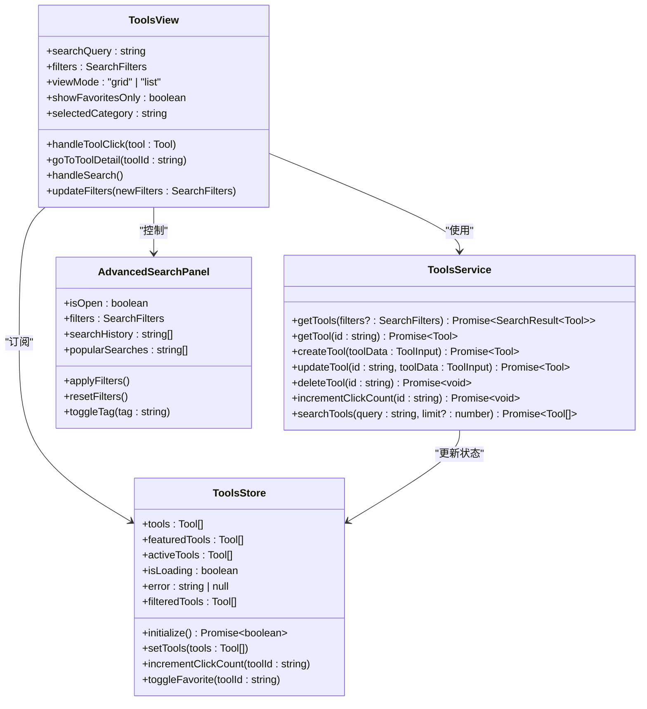
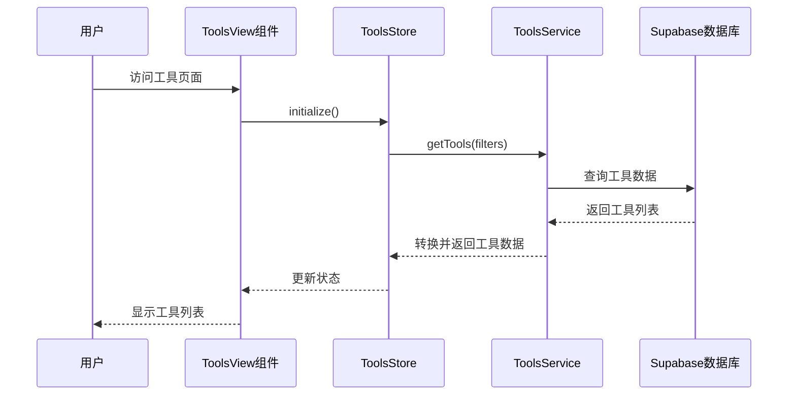
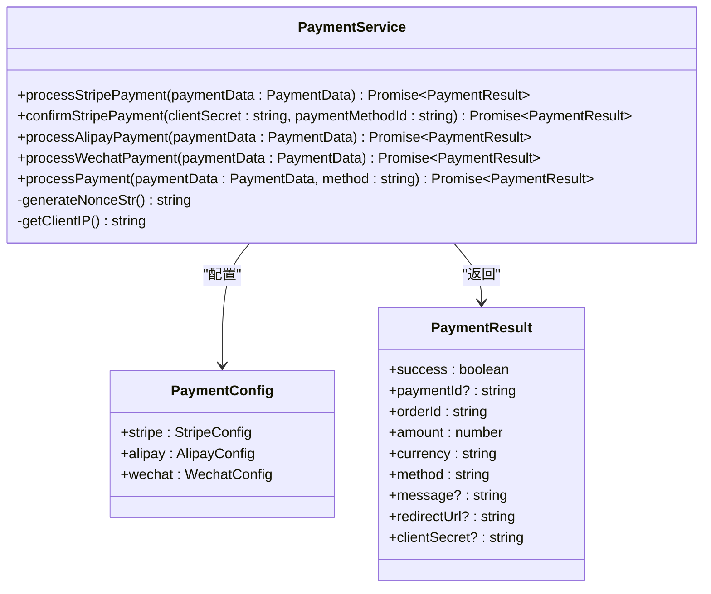
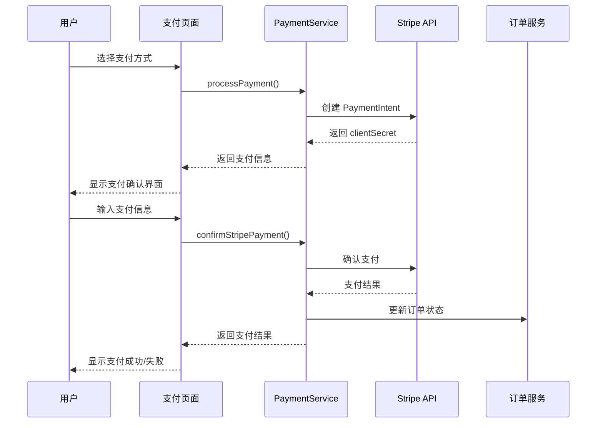
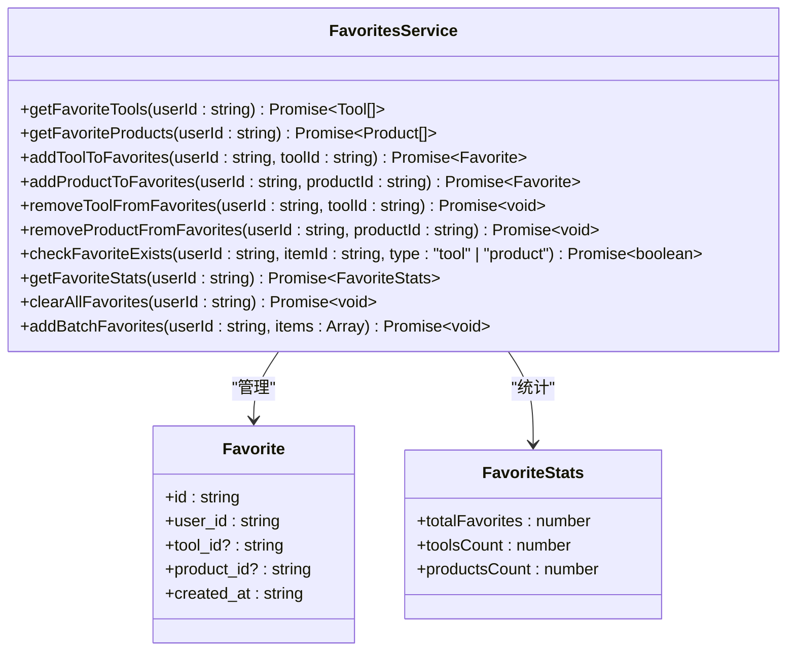
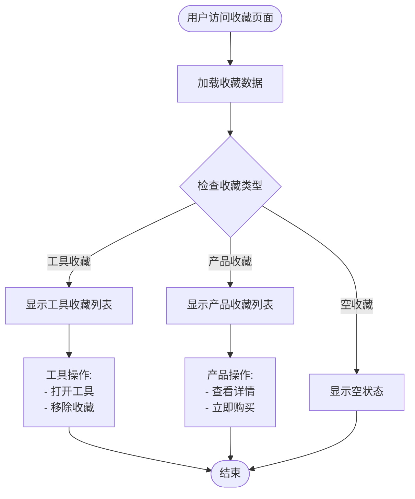
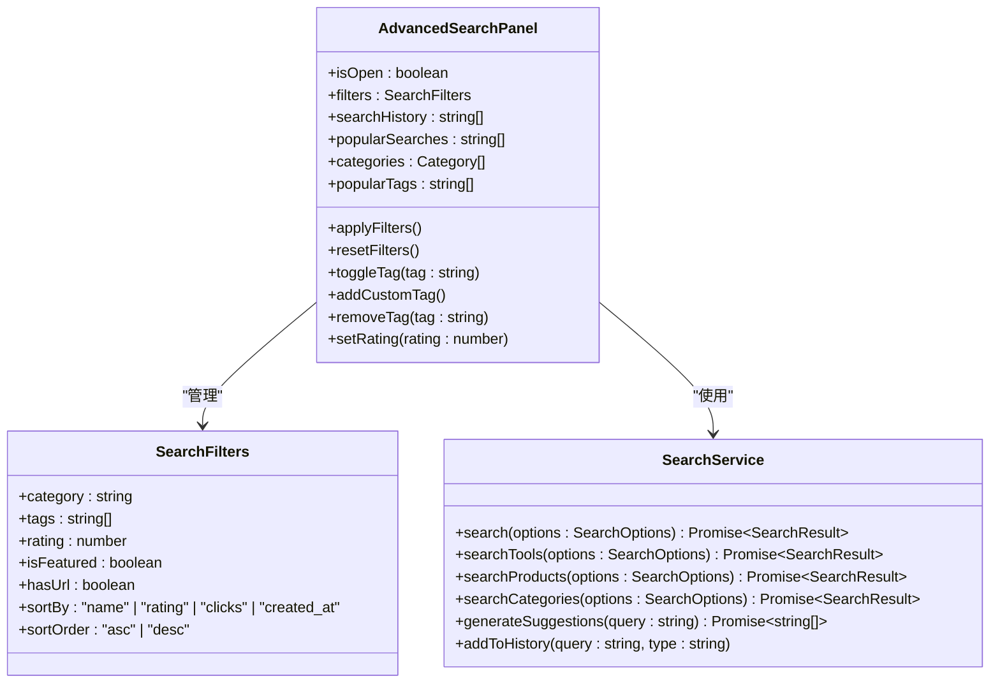
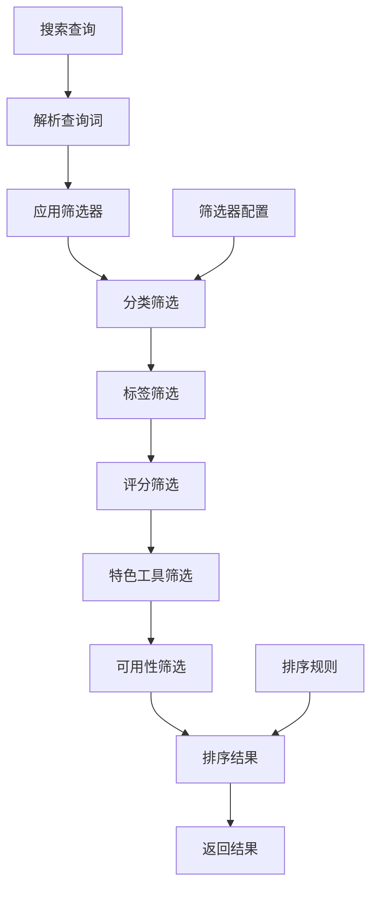
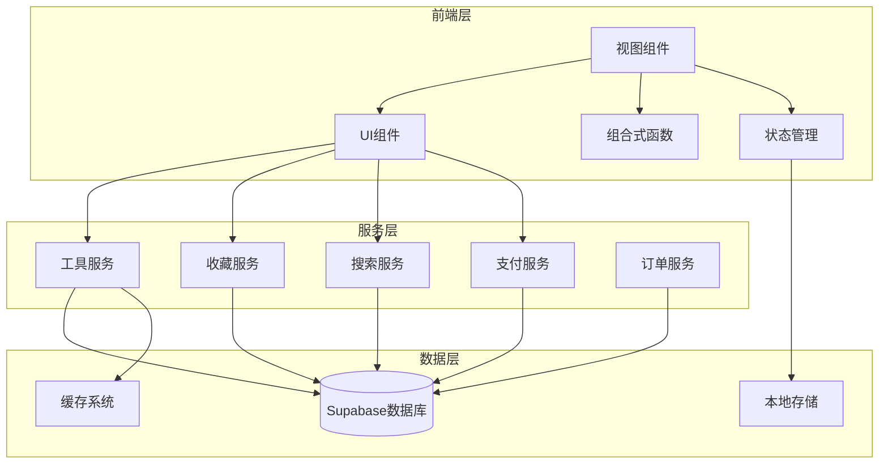
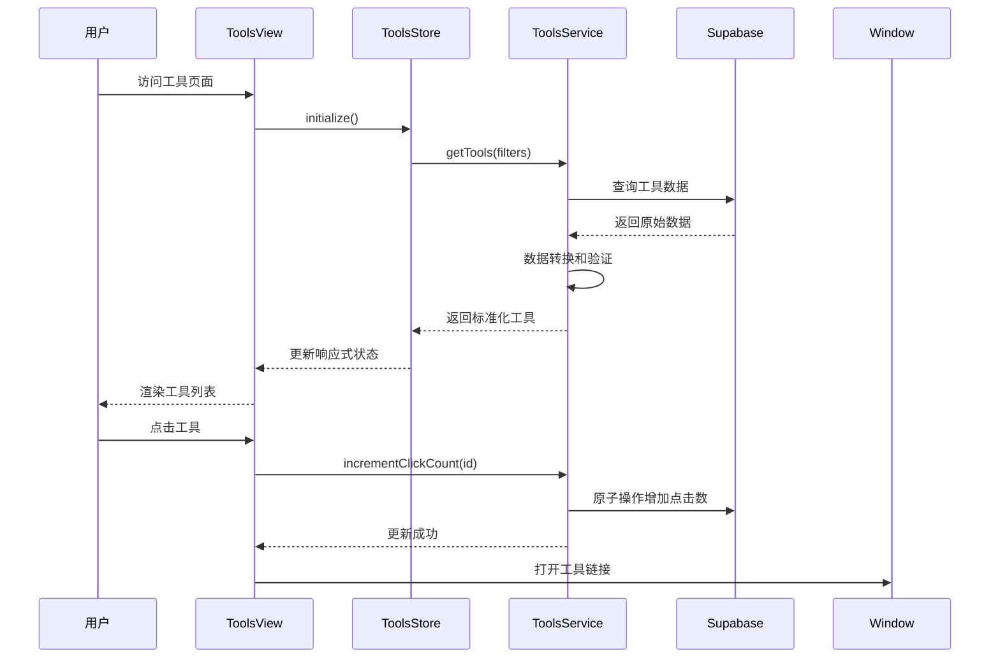

# 核心功能模块

<cite>
**本文档引用的文件**
- [src/views/ToolsView.vue](file://src/views/ToolsView.vue)
- [src/services/toolsService.ts](file://src/services/toolsService.ts)
- [src/services/favoritesService.ts](file://src/services/favoritesService.ts)
- [src/services/searchService.ts](file://src/services/searchService.ts)
- [src/services/paymentService.ts](file://src/services/paymentService.ts)
- [src/stores/tools.ts](file://src/stores/tools.ts)
- [src/components/search/AdvancedSearchPanel.vue](file://src/components/search/AdvancedSearchPanel.vue)
- [src/composables/useAdvancedSearch.ts](file://src/composables/useAdvancedSearch.ts)
- [src/views/user/FavoritesView.vue](file://src/views/user/FavoritesView.vue)
- [src/types/index.ts](file://src/types/index.ts)
</cite>

## 目录
1. [简介](#简介)
2. [工具导航系统](#工具导航系统)
3. [产品购买流程](#产品购买流程)
4. [用户收藏机制](#用户收藏机制)
5. [搜索过滤能力](#搜索过滤能力)
6. [架构概览](#架构概览)
7. [数据流分析](#数据流分析)
8. [性能优化](#性能优化)
9. [总结](#总结)

## 简介

本系统是一个现代化的工具导航平台，提供了完整的工具浏览、搜索、收藏和购买功能。系统采用Vue 3 + TypeScript技术栈，结合Pinia状态管理，实现了响应式的用户界面和高效的后端集成。

核心功能包括：
- **工具导航系统**：提供丰富的工具浏览和筛选功能
- **产品购买流程**：支持多种支付方式的完整购物流程
- **用户收藏机制**：实现工具和产品的个性化收藏管理
- **智能搜索过滤**：提供高级搜索和多维度过滤功能

## 工具导航系统

### 功能概述

工具导航系统是整个平台的核心功能，负责展示和管理各类工具资源。系统提供了网格视图和列表视图两种展示模式，支持实时搜索、分类筛选、排序等功能。

### 架构设计



**图表来源**
- [src/views/ToolsView.vue](file://src/views/ToolsView.vue#L1-L967)
- [src/services/toolsService.ts](file://src/services/toolsService.ts#L1-L642)
- [src/stores/tools.ts](file://src/stores/tools.ts#L1-L319)
- [src/components/search/AdvancedSearchPanel.vue](file://src/components/search/AdvancedSearchPanel.vue#L1-L596)

### 核心组件分析

#### ToolsView 组件

ToolsView 是工具导航系统的主要容器组件，负责协调各种子组件和业务逻辑：

```typescript
// 响应式状态管理
const searchQuery = ref<string>('');
const selectedCategory = ref<string>('all');
const sortBy = ref<string>('name');
const showAdvancedSearch = ref<boolean>(false);
const showFavoritesOnly = ref<boolean>(false);
const viewMode = ref<'grid' | 'list'>('grid');
```

组件实现了以下核心功能：
- **实时搜索**：通过 `searchQuery` 实现即时搜索反馈
- **分类筛选**：支持按分类快速定位目标工具
- **排序功能**：提供多种排序方式（名称、热度、最新）
- **视图切换**：支持网格视图和列表视图的无缝切换
- **收藏过滤**：只显示用户收藏的工具

#### 数据获取流程



**图表来源**
- [src/views/ToolsView.vue](file://src/views/ToolsView.vue#L700-L750)
- [src/stores/tools.ts](file://src/stores/tools.ts#L200-L250)
- [src/services/toolsService.ts](file://src/services/toolsService.ts#L30-L80)

**章节来源**
- [src/views/ToolsView.vue](file://src/views/ToolsView.vue#L1-L967)
- [src/services/toolsService.ts](file://src/services/toolsService.ts#L1-L642)
- [src/stores/tools.ts](file://src/stores/tools.ts#L1-L319)

## 产品购买流程

### 支付系统架构

系统集成了多种支付方式，包括Stripe、支付宝和微信支付，提供了完整的支付处理流程。



**图表来源**
- [src/services/paymentService.ts](file://src/services/paymentService.ts#L1-L387)

### 支付流程实现

#### Stripe支付处理

```typescript
// 创建支付意图
const paymentIntentData = {
  amount: Math.round(paymentData.amount * 100), // Stripe 使用分作为单位
  currency: "cny",
  metadata: {
    order_id: paymentData.order_id,
    payment_method: paymentData.payment_method,
  },
  description: `订单支付 - ${paymentData.order_id}`,
};
```

#### 支付确认流程



**图表来源**
- [src/services/paymentService.ts](file://src/services/paymentService.ts#L50-L150)

### 支付方式支持

系统支持三种主流支付方式：

1. **Stripe支付**：国际通用支付解决方案
2. **支付宝支付**：中国主流移动支付平台
3. **微信支付**：中国最流行的移动支付方式

每种支付方式都有独立的处理逻辑和配置参数，确保支付流程的安全性和可靠性。

**章节来源**
- [src/services/paymentService.ts](file://src/services/paymentService.ts#L1-L387)

## 用户收藏机制

### 收藏系统设计

收藏系统提供了工具和产品的双重收藏功能，支持实时同步和批量操作。



**图表来源**
- [src/services/favoritesService.ts](file://src/services/favoritesService.ts#L1-L374)

### 收藏功能实现

#### 收藏状态管理

```typescript
// 收藏状态切换
async function toggleFavorite(toolId: string) {
  const tool = getToolById(toolId)
  if (tool) {
    tool.is_favorite = !tool.is_favorite
  }
  // TODO: 调用 API 更新服务器端数据
}
```

#### 收藏统计功能

```typescript
// 获取收藏统计数据
static async getFavoriteStats(userId: string): Promise<{
  totalFavorites: number;
  toolsCount: number;
  productsCount: number;
}> {
  try {
    const { data, error } = await supabase
      .from("favorites")
      .select("tool_id, product_id")
      .eq("user_id", userId);

    if (error) throw error;

    const favorites = data || [];
    const toolsCount = favorites.filter((f) => f.tool_id).length;
    const productsCount = favorites.filter((f) => f.product_id).length;

    return {
      totalFavorites: favorites.length,
      toolsCount,
      productsCount,
    };
  } catch (error) {
    console.error("获取收藏统计失败:", error);
    return {
      totalFavorites: 0,
      toolsCount: 0,
      productsCount: 0,
    };
  }
}
```

### 收藏视图组件



**图表来源**
- [src/views/user/FavoritesView.vue](file://src/views/user/FavoritesView.vue#L1-L617)

**章节来源**
- [src/services/favoritesService.ts](file://src/services/favoritesService.ts#L1-L374)
- [src/views/user/FavoritesView.vue](file://src/views/user/FavoritesView.vue#L1-L617)

## 搜索过滤能力

### 高级搜索系统

系统提供了强大的高级搜索功能，支持多维度筛选和智能排序。



**图表来源**
- [src/components/search/AdvancedSearchPanel.vue](file://src/components/search/AdvancedSearchPanel.vue#L1-L596)
- [src/services/searchService.ts](file://src/services/searchService.ts#L1-L200)
- [src/composables/useAdvancedSearch.ts](file://src/composables/useAdvancedSearch.ts#L1-L306)

### 搜索算法实现

#### 智能搜索算法

```typescript
// 搜索算法核心逻辑
const performSearch = (
  query: string,
  items: Tool[],
): SearchResult[] => {
  if (!query.trim())
    return items.map((item) => ({ item, score: 1, matches: [] }));

  const searchTerms = query
    .toLowerCase()
    .split(/\s+/)
    .filter((term) => term.length > 0);
  const results: SearchResult[] = [];

  items.forEach((item) => {
    let score = 0;
    const matches: string[] = [];

    // 搜索字段权重
    const searchFields = [
      { field: "name", weight: 10 },
      { field: "description", weight: 5 },
      { field: "tags", weight: 3 },
      { field: "categories.name", weight: 2 },
    ];

    searchTerms.forEach((term) => {
      searchFields.forEach(({ field, weight }) => {
        const value = getNestedValue(item, field);
        if (value && searchInField(value, term)) {
          score += weight;
          if (!matches.includes(field)) {
            matches.push(field);
          }
        }
      });

      // 模糊匹配
      const itemName = item.name as string | undefined;
      if (fuzzyMatch(itemName?.toLowerCase() || "", term)) {
        score += 2;
      }
    });

    // 特色工具加分
    if (item.is_featured) {
      score += 1;
    }

    if (score > 0) {
      results.push({ item, score, matches });
    }
  });

  return results.sort((a, b) => b.score - a.score);
});
```

#### 筛选器应用



**图表来源**
- [src/composables/useAdvancedSearch.ts](file://src/composables/useAdvancedSearch.ts#L30-L100)

### 搜索历史和建议

系统实现了智能的搜索历史管理和搜索建议功能：

```typescript
// 搜索建议生成
const searchSuggestions = computed(() => {
  if (!searchQuery.value.trim()) return [];

  const query = searchQuery.value.toLowerCase();
  const suggestions = new Set<string>();

  // 从工具名称中提取建议
  toolsStore.tools.forEach((tool) => {
    if (tool.name?.toLowerCase().includes(query)) {
      suggestions.add(tool.name);
    }

    // 从标签中提取建议
    if (tool.tags) {
      tool.tags.forEach((tag: string) => {
        if (tag.toLowerCase().includes(query)) {
          suggestions.add(tag);
        }
      });
    }
  });

  return Array.from(suggestions).slice(0, 5);
});
```

**章节来源**
- [src/components/search/AdvancedSearchPanel.vue](file://src/components/search/AdvancedSearchPanel.vue#L1-L596)
- [src/services/searchService.ts](file://src/services/searchService.ts#L1-L200)
- [src/composables/useAdvancedSearch.ts](file://src/composables/useAdvancedSearch.ts#L1-L306)

## 架构概览

### 整体系统架构



### 技术栈组成

- **前端框架**：Vue 3 + TypeScript
- **状态管理**：Pinia
- **UI组件库**：Lucide Vue Next
- **路由管理**：Vue Router
- **样式系统**：CSS Modules + 自定义主题
- **后端服务**：Supabase (PostgreSQL + RLS)
- **缓存系统**：内存缓存 + Redis (可选)
- **支付集成**：Stripe + 支付宝 + 微信支付

## 数据流分析

### 核心数据流



**图表来源**
- [src/views/ToolsView.vue](file://src/views/ToolsView.vue#L700-L750)
- [src/stores/tools.ts](file://src/stores/tools.ts#L200-L250)
- [src/services/toolsService.ts](file://src/services/toolsService.ts#L30-L80)

### 状态管理模式

系统采用Pinia进行状态管理，实现了清晰的状态分离和响应式更新：

```typescript
// 工具状态管理
export const useToolsStore = defineStore('tools', () => {
  const tools = ref<Tool[]>([])
  const featuredTools = computed(() => tools.value.filter(t => t.is_featured))
  const activeTools = computed(() => tools.value.filter(t => t.status === 'active'))
  const isLoading = ref(false)
  const error = ref<string | null>(null)
  const initialized = ref(false)
  
  // 计算属性：过滤后的工具
  const filteredTools = computed(() => {
    let result = activeTools.value
    
    // 按搜索查询过滤
    if (searchQuery.value.trim()) {
      const query = searchQuery.value.toLowerCase()
      result = result.filter(tool => 
        tool.name.toLowerCase().includes(query) ||
        tool.description.toLowerCase().includes(query)
      )
    }
    
    // 按分类过滤
    if (selectedCategory.value) {
      result = result.filter(tool => tool.category_id === selectedCategory.value)
    }
    
    return result
  })
})
```

## 性能优化

### 缓存策略

系统实现了多层次的缓存策略来提升性能：

1. **API缓存**：使用装饰器模式实现自动缓存
2. **内存缓存**：Pinia状态管理中的响应式缓存
3. **懒加载**：图片和组件的延迟加载
4. **虚拟滚动**：大数据量列表的性能优化

### 优化技术

```typescript
// 缓存装饰器实现
export const withCache = async <T>(
  fn: (...args: any[]) => Promise<T>,
  getKey: () => string,
  cache: Map<string, any>,
  ttl: number
): Promise<T> => {
  const key = getKey();
  const cached = cache.get(key);
  
  if (cached && Date.now() - cached.timestamp < ttl) {
    return cached.data;
  }
  
  const result = await fn();
  cache.set(key, { data: result, timestamp: Date.now() });
  return result;
};
```

### 响应式优化

- **计算属性缓存**：避免重复计算
- **事件防抖**：搜索输入的防抖处理
- **组件懒加载**：大型组件的按需加载
- **图片懒加载**：工具图标和产品图片的延迟加载

## 总结

本系统通过精心设计的架构和完善的功能模块，为用户提供了一个完整的工具导航和购买体验。核心特点包括：

1. **完整的功能覆盖**：从工具浏览到购买支付的全流程支持
2. **高性能设计**：多层次缓存和优化策略确保流畅体验
3. **灵活的扩展性**：模块化设计便于功能扩展和维护
4. **跨平台兼容**：支持多种支付方式和设备平台
5. **用户体验优化**：智能搜索、收藏管理和个性化推荐

系统采用了现代化的技术栈和最佳实践，为构建高质量的企业级应用提供了优秀的参考范例。通过持续的功能迭代和性能优化，系统能够满足不断增长的业务需求和技术挑战。