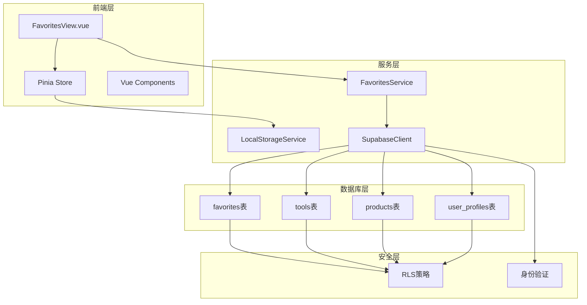
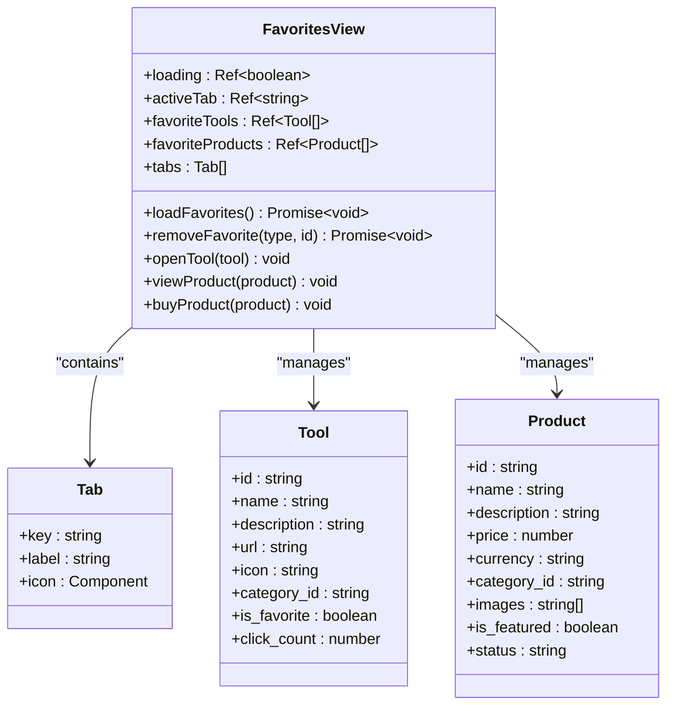
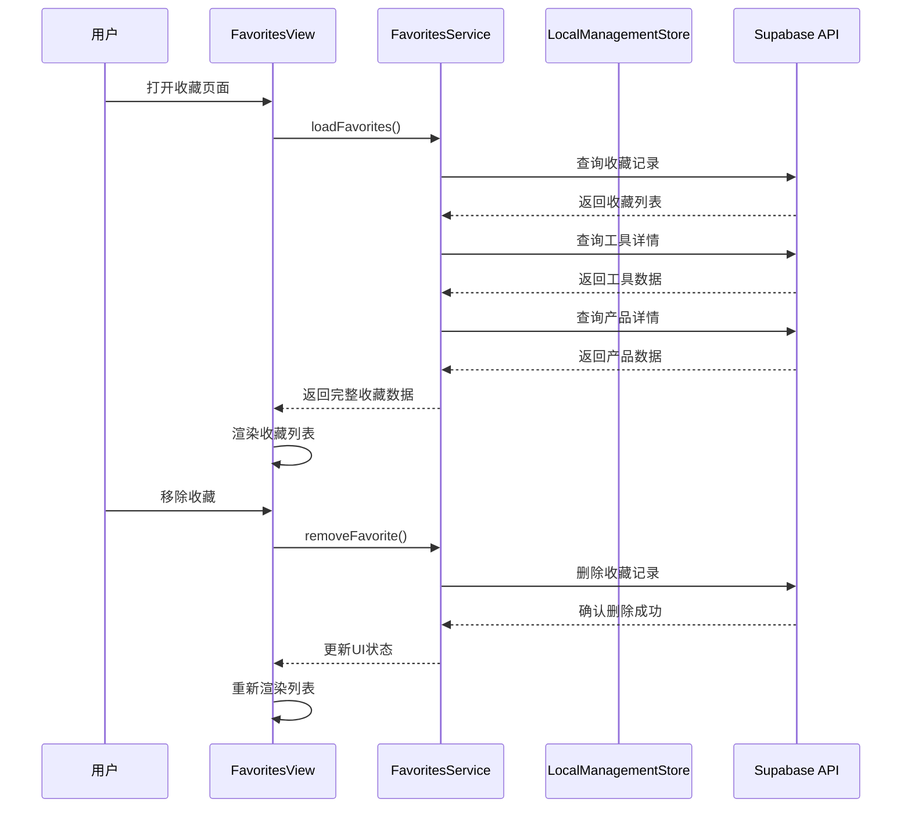
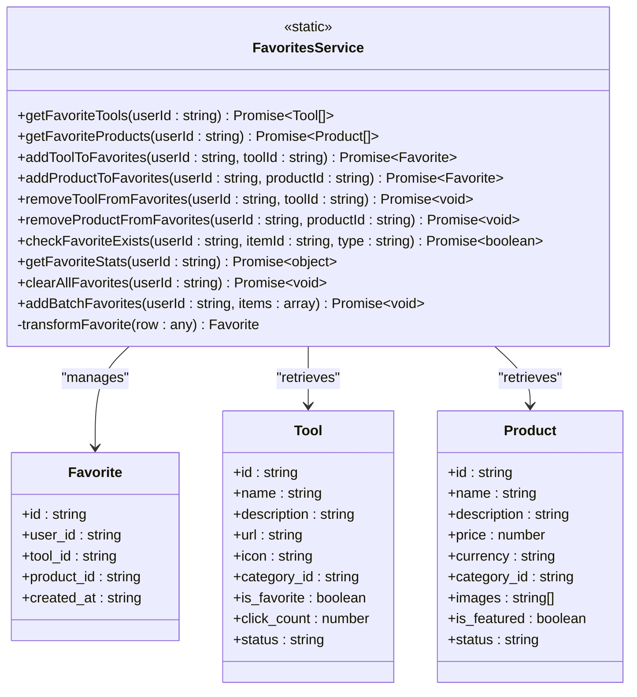
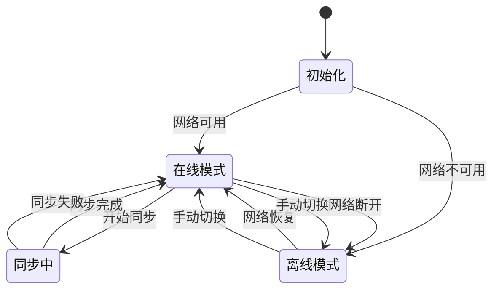
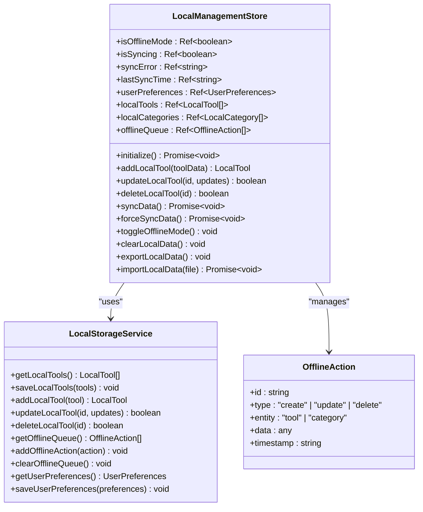
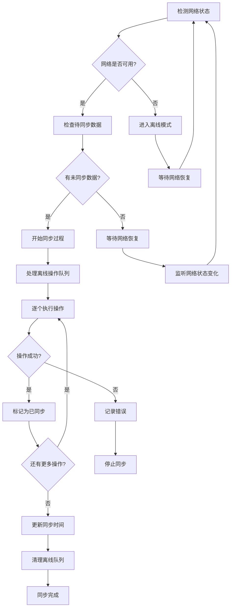
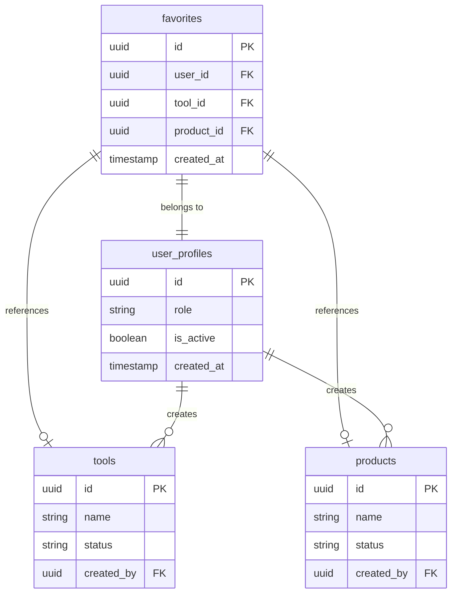
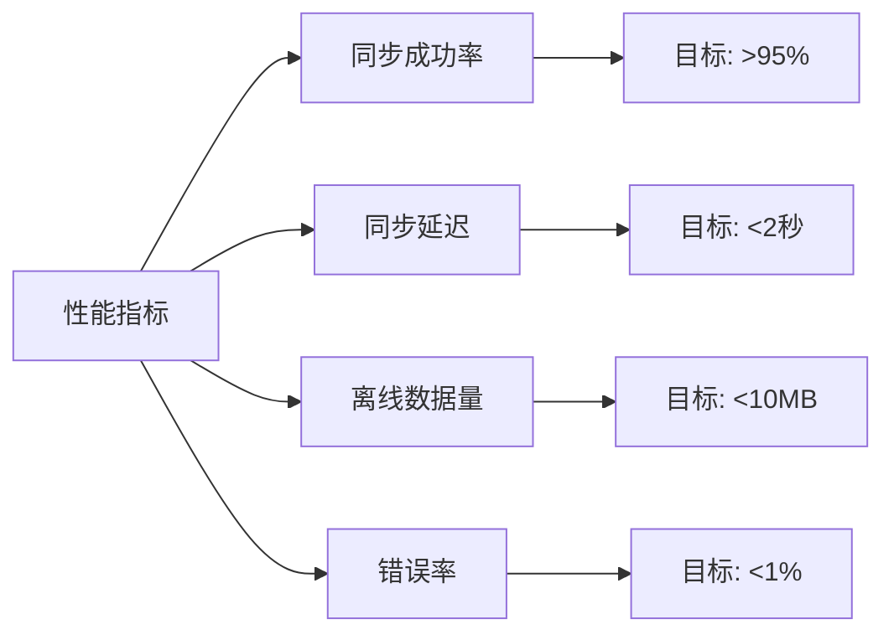

# 用户收藏系统技术实现文档

<cite>
**本文档引用的文件**
- [FavoritesView.vue](file://src/views/user/FavoritesView.vue)
- [favoritesService.ts](file://src/services/favoritesService.ts)
- [localManagement.ts](file://src/stores/localManagement.ts)
- [localStorageService.ts](file://src/services/localStorageService.ts)
- [supabaseClient.ts](file://src/lib/supabaseClient.ts)
- [20250101000002_fix_schema_issues.sql](file://supabase/migrations/20250101000002_fix_schema_issues.sql)
- [index.ts](file://src/types/index.ts)
</cite>

## 目录
1. [简介](#简介)
2. [系统架构概览](#系统架构概览)
3. [前端组件分析](#前端组件分析)
4. [后端服务层分析](#后端服务层分析)
5. [本地数据管理](#本地数据管理)
6. [数据同步机制](#数据同步机制)
7. [行级安全策略](#行级安全策略)
8. [错误处理与故障排除](#错误处理与故障排除)
9. [性能优化建议](#性能优化建议)
10. [总结](#总结)

## 简介

用户收藏系统是高级工具导航平台的核心功能之一，它允许用户收藏和管理他们喜欢的工具和产品。该系统采用前后端分离架构，结合Supabase作为后端服务，实现了完整的收藏功能，包括本地缓存、离线支持、数据同步和行级安全控制。

系统的主要特点包括：
- 前端基于Vue 3 + TypeScript的响应式界面
- 后端使用Supabase提供数据存储和实时同步
- 本地数据缓存支持离线操作
- 自动数据同步机制
- 完整的行级安全策略保护用户数据隐私

## 系统架构概览



**图表来源**
- [FavoritesView.vue](file://src/views/user/FavoritesView.vue#L1-L617)
- [favoritesService.ts](file://src/services/favoritesService.ts#L1-L374)
- [localManagement.ts](file://src/stores/localManagement.ts#L1-L359)

## 前端组件分析

### FavoritesView.vue 组件架构

FavoritesView.vue 是收藏功能的主界面组件，采用Vue 3 Composition API设计，提供了完整的收藏管理体验。



**图表来源**
- [FavoritesView.vue](file://src/views/user/FavoritesView.vue#L60-L120)
- [index.ts](file://src/types/index.ts#L1-L100)

### 前端交互流程



**图表来源**
- [FavoritesView.vue](file://src/views/user/FavoritesView.vue#L150-L200)
- [favoritesService.ts](file://src/services/favoritesService.ts#L150-L200)

**章节来源**
- [FavoritesView.vue](file://src/views/user/FavoritesView.vue#L1-L617)

## 后端服务层分析

### FavoritesService 核心功能

FavoritesService 是收藏功能的核心服务类，负责与Supabase后端进行数据交互。



**图表来源**
- [favoritesService.ts](file://src/services/favoritesService.ts#L8-L50)
- [index.ts](file://src/types/index.ts#L100-L150)

### 数据库查询策略

FavoritesService 采用了高效的数据库查询策略：

1. **分步查询模式**：先获取收藏记录ID，再根据ID查询详细信息
2. **批量查询优化**：使用 `in()` 方法减少数据库往返次数
3. **状态过滤**：只查询活跃状态的数据
4. **关联查询**：通过 `select()` 方法预加载关联数据

**章节来源**
- [favoritesService.ts](file://src/services/favoritesService.ts#L1-L374)

## 本地数据管理

### LocalManagementStore 离线支持

LocalManagementStore 提供了完整的离线数据管理功能，确保用户在没有网络连接时也能正常使用收藏功能。



### 本地存储架构



**图表来源**
- [localManagement.ts](file://src/stores/localManagement.ts#L15-L100)
- [localStorageService.ts](file://src/services/localStorageService.ts#L50-L150)

**章节来源**
- [localManagement.ts](file://src/stores/localManagement.ts#L1-L359)
- [localStorageService.ts](file://src/services/localStorageService.ts#L1-L339)

## 数据同步机制

### 同步流程设计



### 数据一致性保证

系统通过以下机制确保数据一致性：

1. **乐观锁机制**：每个本地数据都有 `syncStatus` 字段跟踪同步状态
2. **冲突检测**：当同一数据在不同设备上修改时，系统会标记为冲突状态
3. **事务性操作**：批量操作在单个事务中执行，确保原子性
4. **回滚机制**：同步失败时自动回滚本地更改

**章节来源**
- [localManagement.ts](file://src/stores/localManagement.ts#L150-L250)

## 行级安全策略

### RLS 策略架构

Supabase 的行级安全（RLS）策略为收藏系统提供了强大的数据保护机制。



**图表来源**
- [20250101000002_fix_schema_issues.sql](file://supabase/migrations/20250101000002_fix_schema_issues.sql#L80-L90)

### 收藏表 RLS 策略详解

收藏表的 RLS 策略设计遵循最小权限原则：

```sql
-- 用户只能查看和管理自己的收藏
CREATE POLICY "用户只能查看和管理自己的收藏" ON favorites
    FOR ALL USING (auth.uid() = user_id);

-- 管理员可以查看所有收藏
CREATE POLICY "管理员可以查看所有收藏" ON favorites
    FOR SELECT USING (auth.jwt() ->> 'role' = 'admin' OR auth.jwt() ->> 'role' = 'super_admin');
```

这种策略确保：
- 普通用户只能访问自己的收藏数据
- 管理员可以审计和管理所有用户的收藏
- 数据访问完全透明且可追踪

**章节来源**
- [20250101000002_fix_schema_issues.sql](file://supabase/migrations/20250101000002_fix_schema_issues.sql#L80-L90)

## 错误处理与故障排除

### 常见问题及解决方案

#### 1. 收藏冲突处理

**问题描述**：多个设备同时修改同一收藏项导致数据冲突

**解决方案**：
```typescript
// 在 LocalStorageService 中处理冲突
static resolveConflict(existing: LocalTool, remote: LocalTool): LocalTool {
  const latest = new Date(existing.lastModified) > new Date(remote.lastModified) 
    ? existing : remote;
  
  return {
    ...latest,
    syncStatus: 'conflict',
    conflictResolution: 'remote' // 或 'local'
  };
}
```

#### 2. 跨设备同步限制

**问题描述**：用户在多设备间切换时遇到同步延迟

**解决方案**：
- 实现增量同步机制
- 使用 WebSocket 实时推送更新
- 添加手动刷新按钮

#### 3. 离线模式数据丢失

**问题描述**：用户切换到离线模式后担心数据丢失

**解决方案**：
- 提供数据导出功能
- 显示本地数据统计信息
- 实现自动备份机制

### 性能监控指标



**章节来源**
- [localManagement.ts](file://src/stores/localManagement.ts#L300-L359)

## 性能优化建议

### 前端性能优化

1. **虚拟滚动**：对于大量收藏项，使用虚拟滚动技术
2. **懒加载**：图片和详细信息采用懒加载
3. **缓存策略**：合理设置浏览器缓存时间
4. **代码分割**：按需加载收藏相关的组件

### 后端性能优化

1. **索引优化**：为 `favorites(user_id)` 和 `favorites(created_at)` 创建复合索引
2. **查询优化**：使用 `EXPLAIN` 分析慢查询
3. **连接池**：合理配置数据库连接池大小
4. **CDN加速**：静态资源使用 CDN 加速

### 数据库优化策略

```sql
-- 创建复合索引提高查询性能
CREATE INDEX idx_favorites_user_created ON favorites(user_id, created_at);

-- 为频繁查询的字段创建索引
CREATE INDEX idx_tools_status ON tools(status);
CREATE INDEX idx_products_status ON products(status);

-- 为 JSONB 字段创建 GIN 索引
CREATE INDEX idx_favorites_metadata_gin ON favorites USING GIN (metadata);
```

## 总结

用户收藏系统是一个功能完善、架构清晰的现代 Web 应用模块。它成功地结合了前端响应式设计、后端云服务、本地数据缓存和行级安全控制，为用户提供了流畅、安全、可靠的收藏体验。

### 系统优势

1. **用户体验优秀**：响应式设计适配各种设备，离线支持提升可用性
2. **数据安全可靠**：RLS 策略确保数据隐私，多重备份防止数据丢失
3. **性能表现优异**：智能缓存和同步机制保证系统响应速度
4. **扩展性强**：模块化设计便于功能扩展和维护

### 技术亮点

- **前后端分离架构**：清晰的职责划分，便于团队协作开发
- **TypeScript 类型安全**：完整的类型定义确保代码质量
- **Pinia 状态管理**：集中化的状态管理简化复杂业务逻辑
- **Supabase 云服务**：降低运维成本，快速迭代开发

这个收藏系统不仅满足了当前的功能需求，还为未来的功能扩展奠定了坚实的基础。通过持续的优化和改进，它将继续为用户提供更好的服务体验。