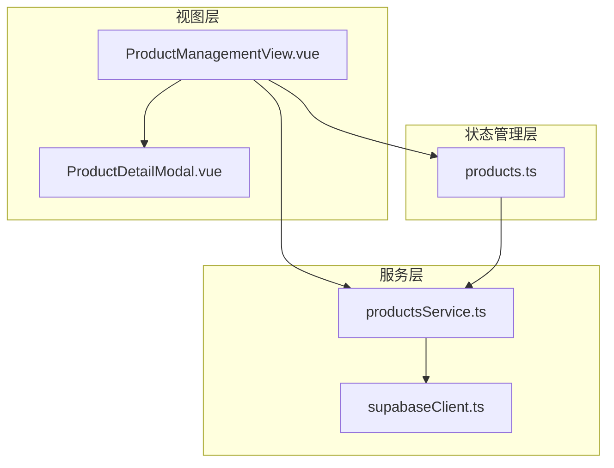
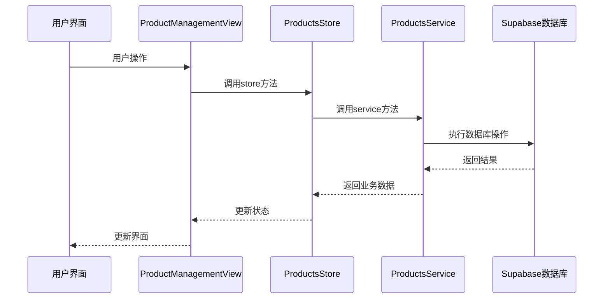
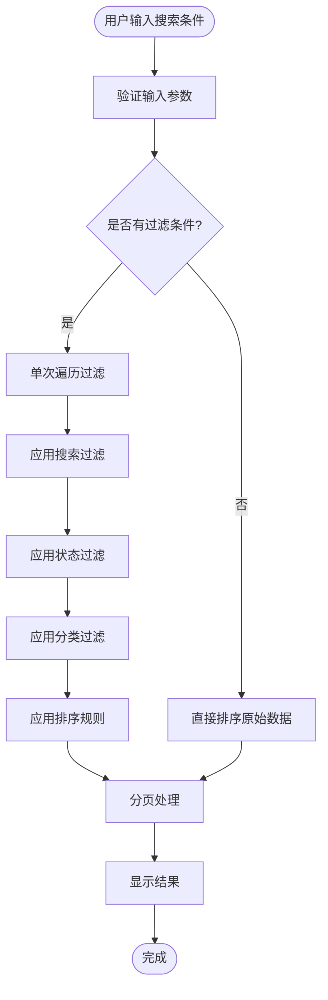
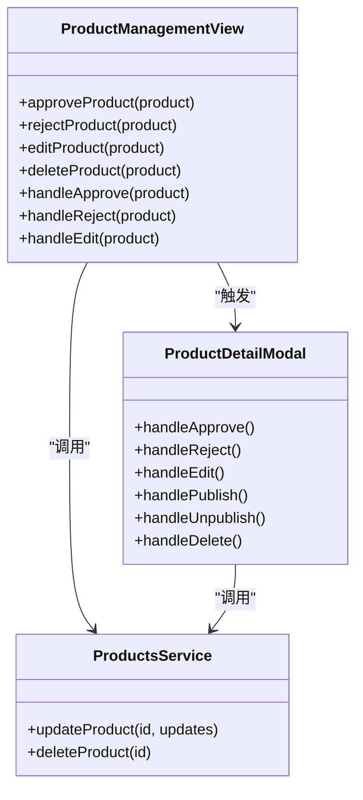
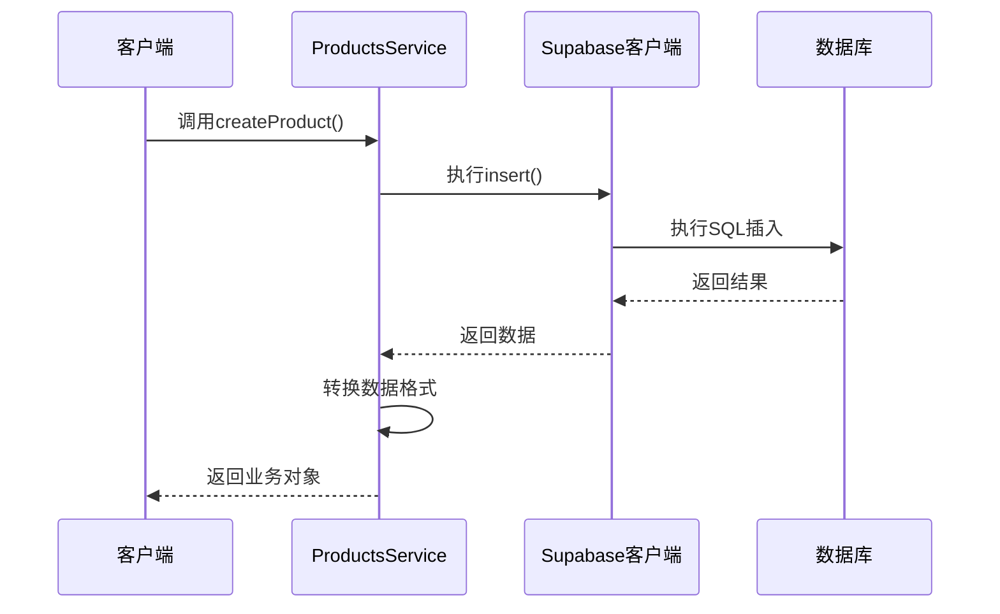
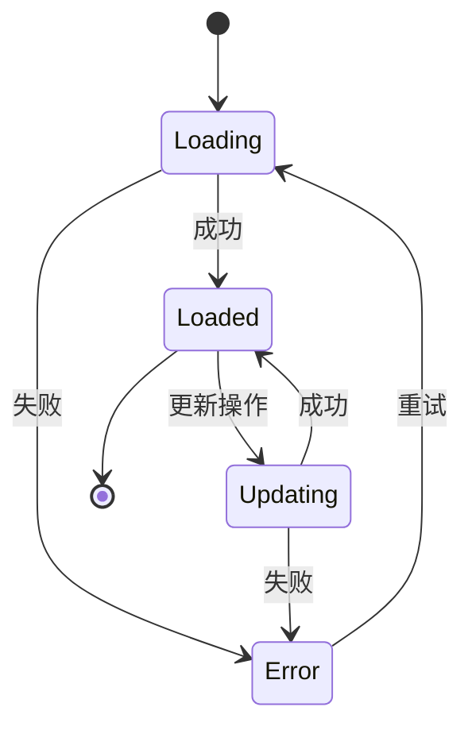

# 产品管理模块技术文档

<cite>
**本文档引用的文件**
- [ProductManagementView.vue](file://src/views/admin/ProductManagementView.vue)
- [ProductDetailModal.vue](file://src/components/admin/ProductDetailModal.vue)
- [productsService.ts](file://src/services/productsService.ts)
- [products.ts](file://src/stores/products.ts)
- [supabaseClient.ts](file://src/lib/supabaseClient.ts)
</cite>

## 目录
1. [简介](#简介)
2. [项目结构](#项目结构)
3. [核心组件](#核心组件)
4. [架构概览](#架构概览)
5. [详细组件分析](#详细组件分析)
6. [服务层分析](#服务层分析)
7. [状态管理](#状态管理)
8. [性能考虑](#性能考虑)
9. [故障排除指南](#故障排除指南)
10. [结论](#结论)

## 简介

产品管理模块是高级工具导航系统中的核心管理功能，负责处理用户提交的产品信息。该模块提供了完整的CRUD操作流程，包括产品列表展示、搜索过滤、分页机制以及批量操作（如启用/禁用、删除）。模块采用Vue 3 Composition API构建，结合Pinia状态管理和Supabase数据库服务，实现了高效的产品生命周期管理。

## 项目结构

产品管理模块的文件组织遵循清晰的分层架构：



**图表来源**
- [ProductManagementView.vue](file://src/views/admin/ProductManagementView.vue#L1-L50)
- [ProductDetailModal.vue](file://src/components/admin/ProductDetailModal.vue#L1-L50)
- [productsService.ts](file://src/services/productsService.ts#L1-L50)

**章节来源**
- [ProductManagementView.vue](file://src/views/admin/ProductManagementView.vue#L1-L664)
- [ProductDetailModal.vue](file://src/components/admin/ProductDetailModal.vue#L1-L397)

## 核心组件

### ProductManagementView - 主管理界面

ProductManagementView是产品管理的主要入口点，提供了完整的管理界面和操作功能：

```typescript
// 核心响应式数据结构
const loading = ref(false);
const products = ref<Product[]>([]);
const categories = ref<Category[]>([]);
const selectedProduct = ref<Product | null>(null);
const currentPage = ref(1);
const pageSize = ref(10);

// 筛选条件
const filters = reactive({
  search: "",
  status: "",
  category: "",
  sort: "created_at_desc",
});
```

该组件实现了以下核心功能：
- **统计卡片展示**：实时显示产品总数、待审核数量、已发布数量和已拒绝数量
- **高级搜索过滤**：支持按名称、描述、状态、分类和价格范围进行多维搜索
- **动态排序**：支持多种排序方式，包括按创建时间、名称、价格等字段排序
- **分页机制**：每页显示10条记录，支持前后翻页操作
- **批量操作**：提供启用/禁用、删除等批量处理功能

### ProductDetailModal - 产品详情模态框

ProductDetailModal提供了产品的详细信息展示和操作界面：

```typescript
// 产品详情模态框的Props定义
interface Product {
  id: string;
  name: string;
  description: string;
  content?: string;
  price: number;
  category_id: string;
  status: "pending" | "approved" | "rejected" | "published";
  image_url?: string;
  url?: string;
  tags?: string[];
  created_at: string;
  updated_at: string;
  submitted_by: string;
}
```

模态框支持的操作包括：
- **状态查看**：显示产品的当前状态和历史记录
- **审核操作**：支持通过审核、拒绝审核等操作
- **编辑功能**：提供产品信息的编辑界面
- **发布管理**：支持产品发布和取消发布操作
- **删除功能**：安全的删除确认机制

**章节来源**
- [ProductManagementView.vue](file://src/views/admin/ProductManagementView.vue#L35-L100)
- [ProductDetailModal.vue](file://src/components/admin/ProductDetailModal.vue#L80-L120)

## 架构概览

产品管理模块采用分层架构设计，确保了代码的可维护性和扩展性：



**图表来源**
- [ProductManagementView.vue](file://src/views/admin/ProductManagementView.vue#L400-L500)
- [products.ts](file://src/stores/products.ts#L50-L150)
- [productsService.ts](file://src/services/productsService.ts#L15-L100)

## 详细组件分析

### 表格展示与搜索过滤

ProductManagementView实现了高效的表格展示和智能搜索过滤机制：



**图表来源**
- [ProductManagementView.vue](file://src/views/admin/ProductManagementView.vue#L150-L200)

搜索过滤的核心实现采用了单次遍历优化策略：

```typescript
// 过滤后的产品 - 优化性能
const filteredProducts = computed(() => {
  const { search, status, category, sort } = filters;

  // 如果没有任何过滤条件，直接返回排序后的原数组
  if (!search && !status && !category) {
    return sortProducts(products.value, sort);
  }

  // 使用单次遍历进行所有过滤
  const filtered = products.value.filter((product) => {
    // 搜索过滤
    if (search) {
      const searchLower = search.toLowerCase();
      const matchesSearch =
        product.name.toLowerCase().includes(searchLower) ||
        product.description.toLowerCase().includes(searchLower);
      if (!matchesSearch) return false;
    }

    // 状态过滤
    if (status && product.status !== status) return false;

    // 分类过滤
    if (category && product.category_id !== category) return false;

    return true;
  });

  return sortProducts(filtered, sort);
});
```

### 分页机制

分页系统支持灵活的分页控制和用户友好的界面：

```typescript
// 分页计算属性
const paginatedProducts = computed(() => {
  const start = (currentPage.value - 1) * pageSize.value;
  const end = start + pageSize.value;
  return filteredProducts.value.slice(start, end);
});

// 总页数计算
const totalPages = computed(() => {
  return Math.ceil(filteredProducts.value.length / pageSize.value);
});
```

分页界面提供了直观的导航控件：
- **显示范围信息**：显示当前显示的记录范围和总记录数
- **分页按钮**：支持上一页、下一页导航
- **页码显示**：显示当前页码和总页数

### 批量操作实现

批量操作通过统一的事件驱动机制实现：



**图表来源**
- [ProductManagementView.vue](file://src/views/admin/ProductManagementView.vue#L300-L400)
- [ProductDetailModal.vue](file://src/components/admin/ProductDetailModal.vue#L200-L300)

**章节来源**
- [ProductManagementView.vue](file://src/views/admin/ProductManagementView.vue#L150-L350)
- [ProductDetailModal.vue](file://src/components/admin/ProductDetailModal.vue#L150-L250)

## 服务层分析

### ProductsService - 核心业务服务

ProductsService提供了完整的数据库操作接口，封装了与Supabase的交互逻辑：

```typescript
export class ProductsService {
  // 获取所有产品
  static async getProducts(filters?: SearchFilters): Promise<SearchResult<Product>> {
    // 实现复杂的查询逻辑
  }

  // 获取单个产品
  static async getProduct(id: string): Promise<Product> {
    // 实现产品详情查询
  }

  // 创建产品
  static async createProduct(productData: ProductInsert): Promise<Product> {
    // 实现产品创建逻辑
  }

  // 更新产品
  static async updateProduct(id: string, updates: ProductUpdate): Promise<Product> {
    // 实现产品更新逻辑
  }

  // 删除产品
  static async deleteProduct(id: string): Promise<void> {
    // 实现产品删除逻辑
  }
}
```

### 数据库交互模式

服务层采用了标准的CRUD操作模式，每个操作都包含完整的错误处理：



**图表来源**
- [productsService.ts](file://src/services/productsService.ts#L150-L200)

### 错误处理与状态同步

服务层实现了完善的错误处理机制：

```typescript
// 统一的错误处理
static async createProduct(productData: ProductInsert): Promise<Product> {
  try {
    const { data, error } = await (supabase as any)
      .from("products")
      .insert(productData)
      .select(`
        *,
        category:product_categories(*)
      `)
      .single();

    if (error) throw error;
    if (!data) throw new Error("创建产品失败");

    return this.transformProduct(data);
  } catch (error) {
    console.error("创建产品失败:", error);
    throw new Error("创建产品失败");
  }
}
```

**章节来源**
- [productsService.ts](file://src/services/productsService.ts#L1-L347)

## 状态管理

### Pinia Store - 状态集中管理

使用Pinia作为状态管理解决方案，提供了类型安全的状态管理和异步操作支持：

```typescript
export const useProductsStore = defineStore("products", () => {
  // 状态
  const loading = ref(false);
  const error = ref<string | null>(null);
  const initialized = ref(false);

  // 数据
  const products = ref<Product[]>([]);
  const categories = ref<Category[]>([]);
  const searchResult = ref<SearchResult<Product> | null>(null);
  const featuredProducts = ref<Product[]>([]);
  const currentProduct = ref<Product | null>(null);

  // 方法
  const loadProducts = async (filters?: SearchFilters) => {
    try {
      loading.value = true;
      error.value = null;

      const result = await ProductsService.getProducts(filters);
      
      if (filters) {
        searchResult.value = result;
      } else {
        products.value = result.items;
        searchResult.value = null;
      }

      return result;
    } catch (err) {
      error.value = err instanceof Error ? err.message : "加载产品失败";
      console.error("Error loading products:", err);
      throw err;
    } finally {
      loading.value = false;
    }
  };
});
```

### 状态同步机制

状态管理实现了自动化的状态同步：



**图表来源**
- [products.ts](file://src/stores/products.ts#L50-L150)

**章节来源**
- [products.ts](file://src/stores/products.ts#L1-L365)

## 性能考虑

### 查询优化策略

系统采用了多种查询优化策略以提升性能：

1. **索引优化**：在关键字段上建立适当的数据库索引
2. **查询缓存**：对频繁查询的数据进行缓存
3. **分页加载**：避免一次性加载大量数据
4. **懒加载**：按需加载相关数据

### 高并发场景处理

针对高并发场景，系统实现了以下保障措施：

1. **乐观锁机制**：防止并发更新冲突
2. **事务处理**：确保数据一致性
3. **连接池管理**：优化数据库连接使用
4. **负载均衡**：分散请求压力

## 故障排除指南

### 常见问题与解决方案

1. **产品加载失败**
   - 检查网络连接状态
   - 验证Supabase配置
   - 查看浏览器控制台错误信息

2. **图片上传失败**
   - 确认存储桶权限设置
   - 检查文件大小限制
   - 验证文件格式支持

3. **搜索结果不准确**
   - 清除浏览器缓存
   - 检查搜索关键词语法
   - 验证数据库索引状态

**章节来源**
- [productsService.ts](file://src/services/productsService.ts#L300-L347)

## 结论

产品管理模块是一个功能完善、架构清晰的管理系统。它通过合理的分层设计、完善的错误处理和高效的性能优化，为用户提供了一个可靠的产品管理平台。模块的可扩展性和可维护性使其能够适应不断变化的业务需求，同时保持良好的用户体验。

该模块的成功实施展示了现代Web应用开发的最佳实践，包括响应式设计、状态管理、数据库集成和错误处理等方面。通过持续的优化和改进，该模块将继续为用户提供更好的产品管理体验。