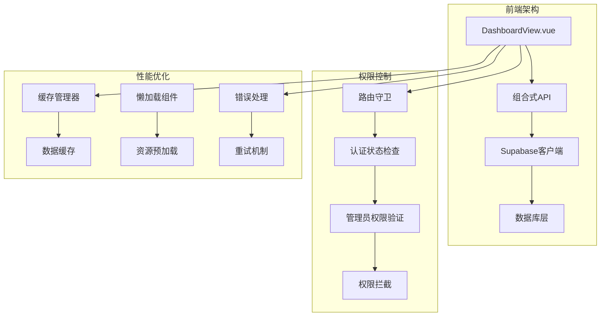
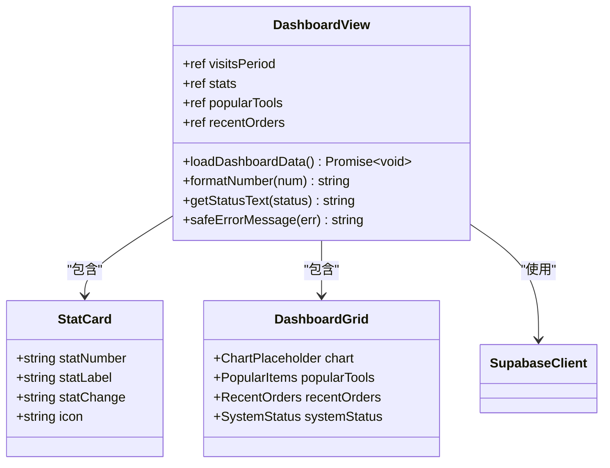
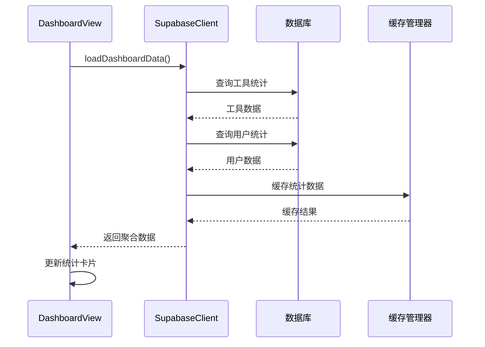
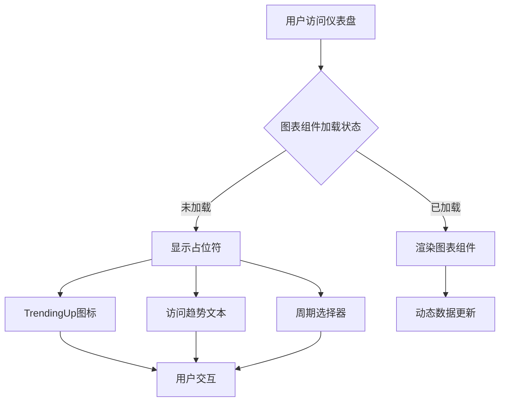
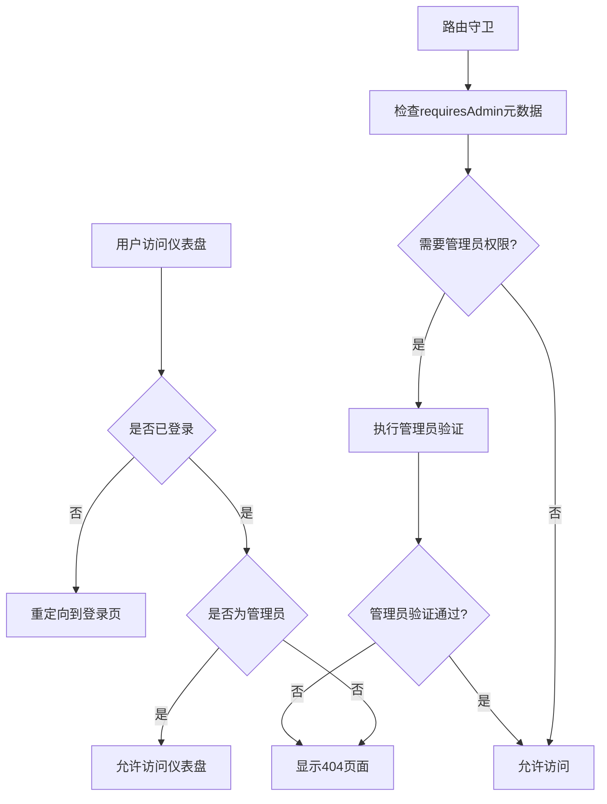
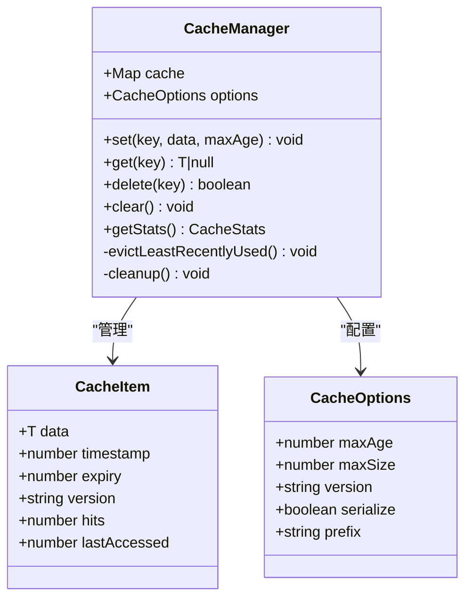
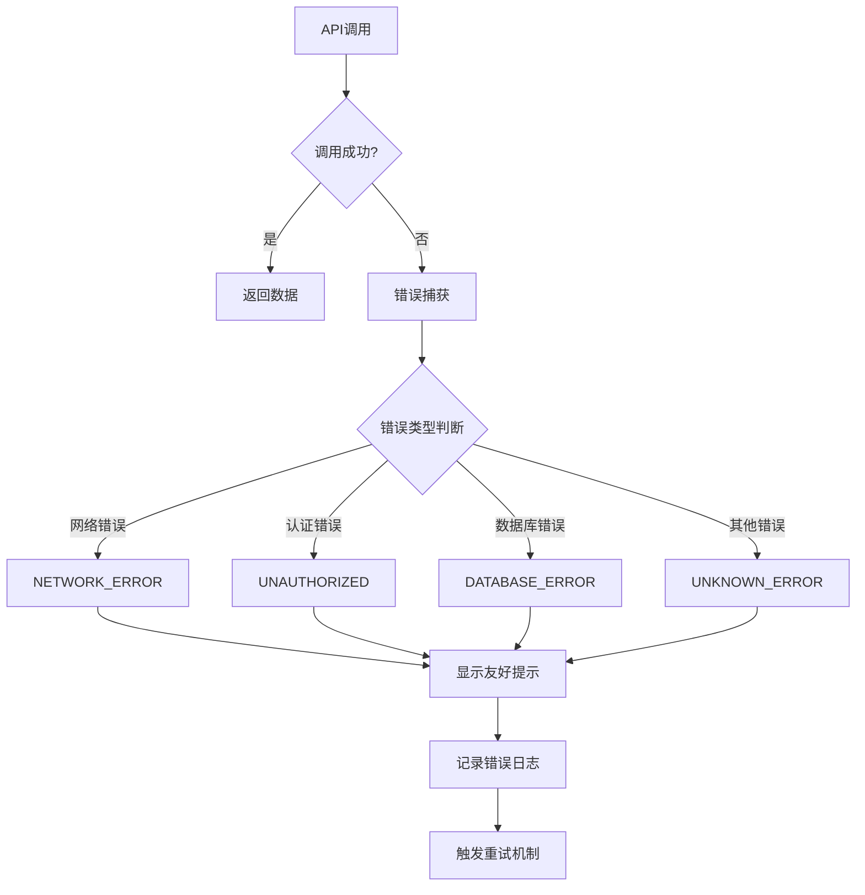

# 仪表盘概览

<cite>
**本文档引用的文件**
- [DashboardView.vue](file://src/views/admin/DashboardView.vue)
- [supabaseClient.ts](file://src/lib/supabaseClient.ts)
- [auth.ts](file://src/stores/auth.ts)
- [router/index.ts](file://src/router/index.ts)
- [cacheManager.ts](file://src/utils/cacheManager.ts)
- [useLazyLoading.ts](file://src/composables/useLazyLoading.ts)
- [errorHandler.ts](file://src/utils/errorHandler.ts)
</cite>

## 目录
1. [简介](#简介)
2. [项目架构概览](#项目架构概览)
3. [核心组件分析](#核心组件分析)
4. [数据可视化实现](#数据可视化实现)
5. [权限控制系统](#权限控制系统)
6. [性能优化策略](#性能优化策略)
7. [错误处理机制](#错误处理机制)
8. [故障排除指南](#故障排除指南)
9. [总结](#总结)

## 简介

仪表盘概览是一个专为管理后台设计的数据可视化界面，基于Vue 3和TypeScript构建。该系统提供了全面的业务指标监控，包括用户增长、工具使用频率、订单转化率等关键业务指标的实时统计与分析。

本系统采用现代化的前端架构，结合Supabase作为后端服务，实现了完整的权限控制、数据缓存和性能优化机制。通过组合式API模式，系统能够高效地从后端服务获取实时数据，并通过图表组件进行直观的渲染展示。

## 项目架构概览

**图表来源**
- [DashboardView.vue](file://src/views/admin/DashboardView.vue#L1-L604)
- [router/index.ts](file://src/router/index.ts#L1-L399)

**章节来源**
- [DashboardView.vue](file://src/views/admin/DashboardView.vue#L1-L604)
- [supabaseClient.ts](file://src/lib/supabaseClient.ts#L1-L246)

## 核心组件分析

### DashboardView.vue 组件结构

DashboardView.vue 是整个仪表盘的核心组件，采用了模块化的架构设计：

**图表来源**
- [DashboardView.vue](file://src/views/admin/DashboardView.vue#L201-L301)

### 关键业务指标统计逻辑

系统通过以下关键指标来监控业务健康状况：

1. **用户增长指标**
   - 总用户数：统计系统注册用户总量
   - 新增用户：按月统计新注册用户数量
   - 用户活跃度：通过登录时间和使用频率计算

2. **工具使用指标**
   - 工具总数：统计已发布工具的数量
   - 新增工具：按月统计新上传工具数量
   - 工具点击率：通过分析工具访问日志计算

3. **订单转化指标**
   - 总订单数：统计所有订单的总量
   - 订单金额：统计总收入和平均订单金额
   - 订单状态分布：按待支付、已支付、已取消等状态分类

**章节来源**
- [DashboardView.vue](file://src/views/admin/DashboardView.vue#L201-L301)

## 数据可视化实现

### 数据获取与聚合方法

系统通过组合式API从Supabase后端服务获取实时数据：

**图表来源**
- [DashboardView.vue](file://src/views/admin/DashboardView.vue#L225-L290)
- [supabaseClient.ts](file://src/lib/supabaseClient.ts#L1-L246)

### 图表组件渲染流程

系统采用占位符设计，在实际图表组件可用前显示提示信息：

**图表来源**
- [DashboardView.vue](file://src/views/admin/DashboardView.vue#L65-L92)

**章节来源**
- [DashboardView.vue](file://src/views/admin/DashboardView.vue#L65-L92)
- [DashboardView.vue](file://src/views/admin/DashboardView.vue#L225-L290)

## 权限控制系统

### 管理员权限验证机制

系统通过多层次的权限控制确保只有授权用户才能访问仪表盘：

**图表来源**
- [router/index.ts](file://src/router/index.ts#L350-L370)
- [auth.ts](file://src/stores/auth.ts#L1-L190)

### 权限控制实现细节

权限控制通过以下机制实现：

1. **路由级别保护**：在路由配置中设置 `requiresAdmin: true`
2. **运行时验证**：通过 `isAdminFunction()` 方法验证用户角色
3. **状态同步**：使用 Pinia store 管理认证状态和用户信息
4. **实时更新**：监听 Supabase 认证状态变化，自动更新权限状态

**章节来源**
- [router/index.ts](file://src/router/index.ts#L350-L370)
- [auth.ts](file://src/stores/auth.ts#L1-L190)

## 性能优化策略

### 数据缓存机制

系统实现了智能缓存管理器来优化数据加载性能：

**图表来源**
- [cacheManager.ts](file://src/utils/cacheManager.ts#L1-L398)

### 懒加载设计

系统采用多种懒加载策略来提升初始加载性能：

1. **图片懒加载**：使用 IntersectionObserver 实现图片延迟加载
2. **组件懒加载**：只在可见区域加载组件
3. **数据预加载**：使用 requestIdleCallback 在浏览器空闲时加载数据
4. **虚拟滚动**：优化大列表渲染性能

**章节来源**
- [cacheManager.ts](file://src/utils/cacheManager.ts#L1-L398)
- [useLazyLoading.ts](file://src/composables/useLazyLoading.ts#L1-L322)

## 错误处理机制

### 多层次错误处理

系统实现了完善的错误处理机制：

**图表来源**
- [errorHandler.ts](file://src/utils/errorHandler.ts#L1-L331)

### 重试机制与降级策略

系统提供了指数退避重试机制和降级策略：

1. **自动重试**：对临时性错误自动重试
2. **指数退避**：逐步增加重试间隔
3. **降级显示**：API调用失败时显示模拟数据
4. **错误监控**：将错误发送到监控服务

**章节来源**
- [errorHandler.ts](file://src/utils/errorHandler.ts#L1-L331)
- [DashboardView.vue](file://src/views/admin/DashboardView.vue#L248-L290)

## 故障排除指南

### 常见问题及解决方案

#### 数据延迟问题

**症状**：仪表盘数据显示滞后或不准确
**可能原因**：
- Supabase 连接问题
- 网络延迟
- 缓存过期

**解决方案**：
1. 检查网络连接状态
2. 清除浏览器缓存
3. 重启应用或刷新页面
4. 检查 Supabase 服务状态

#### 显示异常问题

**症状**：图表组件显示异常或空白
**可能原因**：
- 图表库依赖缺失
- DOM 元素未正确渲染
- CSS 样式冲突

**解决方案**：
1. 检查浏览器控制台错误信息
2. 验证图表组件依赖是否正确安装
3. 检查 CSS 样式冲突
4. 尝试禁用缓存重新加载

#### 权限访问问题

**症状**：非管理员用户无法访问仪表盘
**可能原因**：
- 用户角色配置错误
- 认证状态异常
- 路由守卫配置问题

**解决方案**：
1. 检查用户角色配置
2. 重新登录验证认证状态
3. 清除认证缓存
4. 检查路由守卫配置

**章节来源**
- [DashboardView.vue](file://src/views/admin/DashboardView.vue#L248-L290)
- [errorHandler.ts](file://src/utils/errorHandler.ts#L1-L331)

## 总结

仪表盘概览系统是一个功能完整、性能优异的管理后台数据可视化平台。通过采用现代前端技术栈和最佳实践，系统实现了：

- **完整的权限控制**：基于角色的访问控制和实时权限验证
- **高效的数据获取**：组合式API和智能缓存机制
- **优秀的用户体验**：懒加载、虚拟滚动等性能优化技术
- **可靠的错误处理**：多层次错误处理和自动重试机制
- **可扩展的架构**：模块化设计和清晰的代码组织

该系统为管理员提供了全面的业务洞察，同时保持了良好的性能表现和用户体验。通过持续的优化和维护，系统能够适应不断变化的业务需求和技术发展。