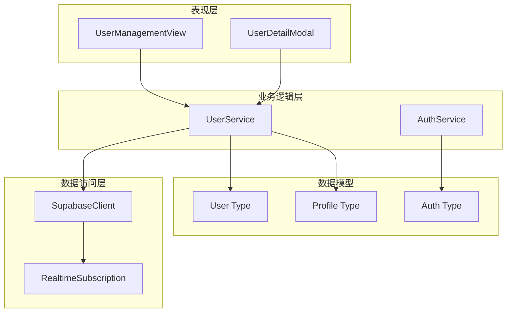
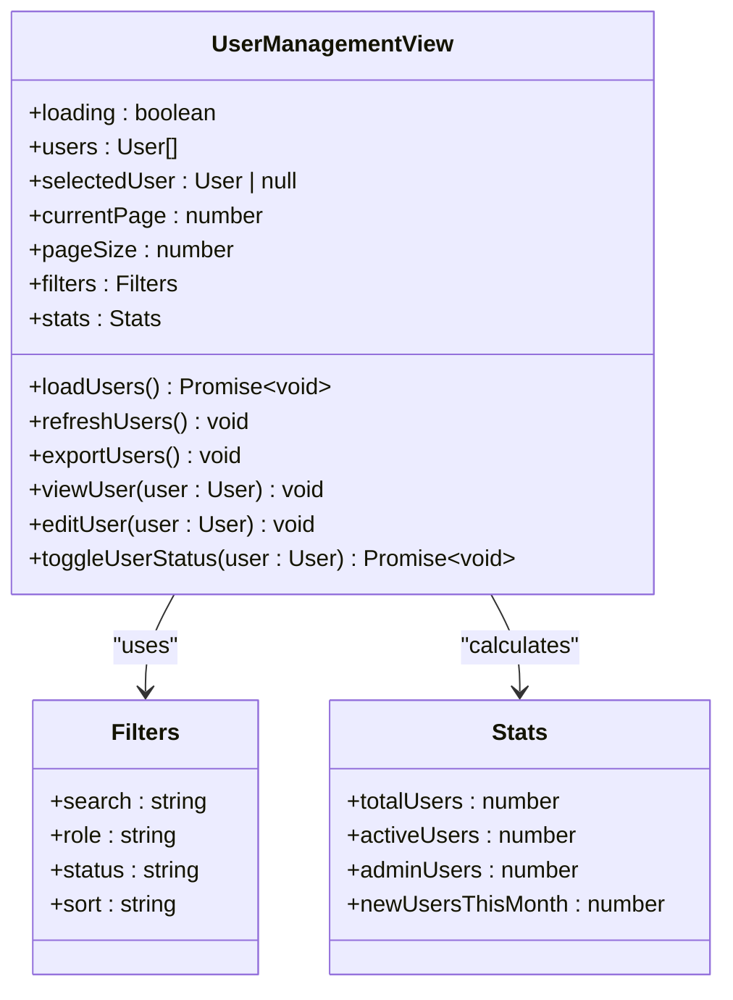
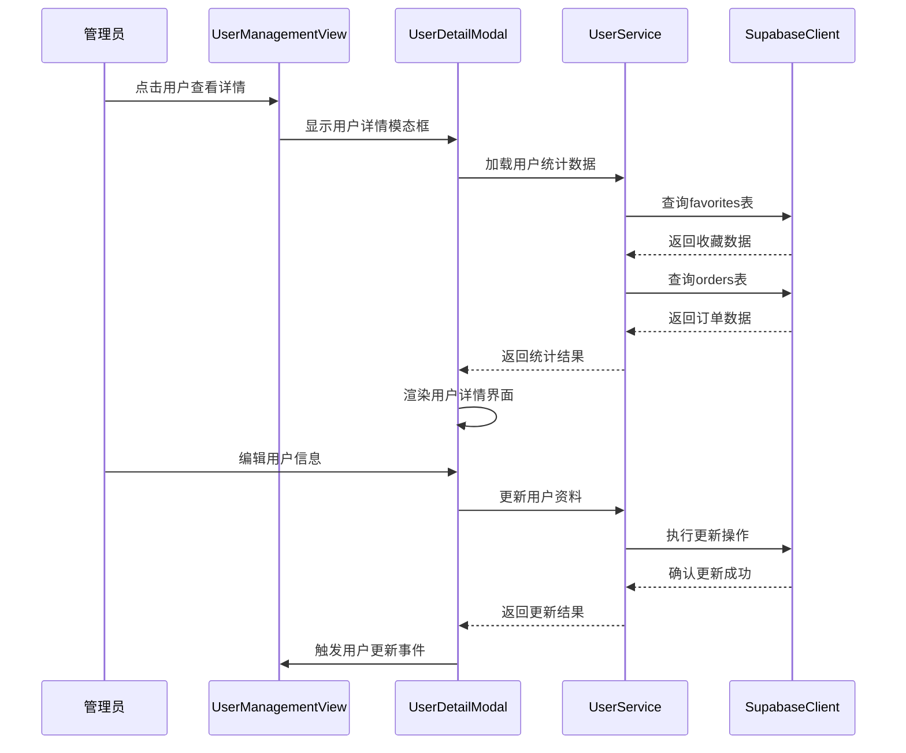
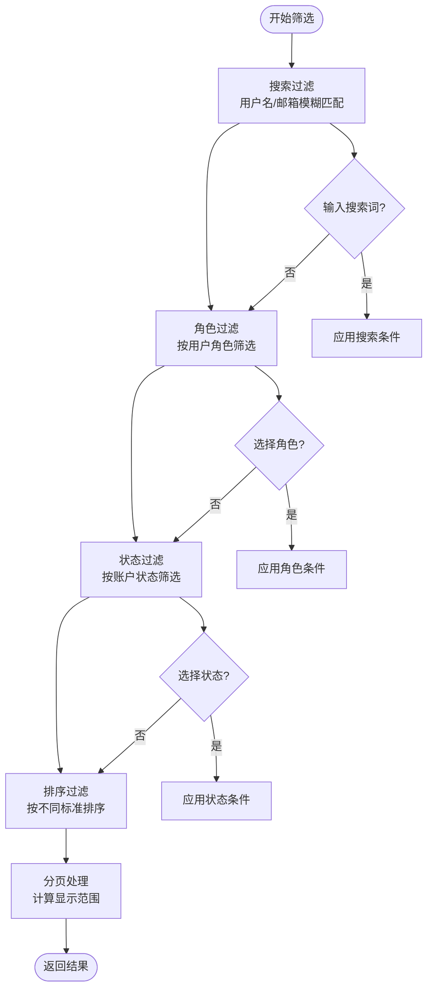
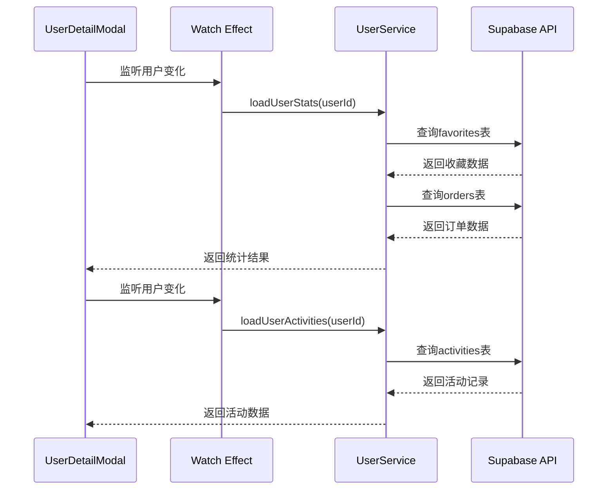
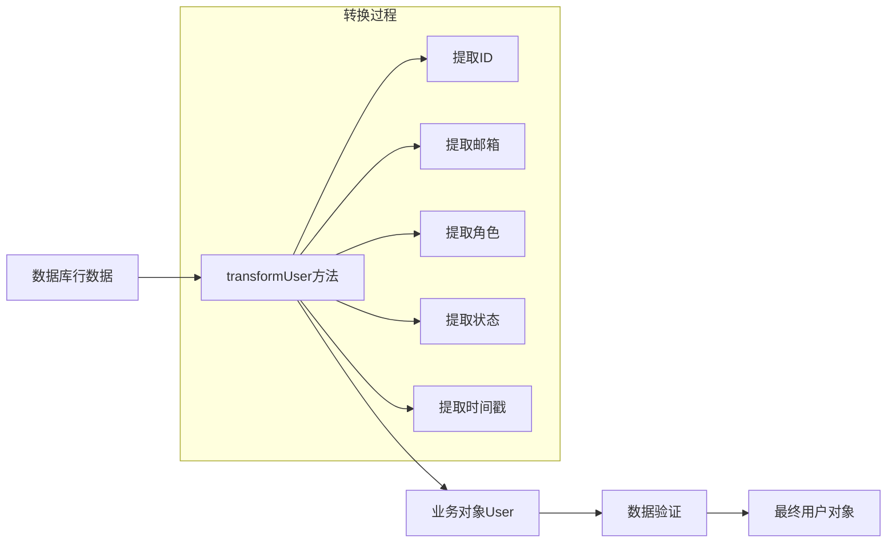
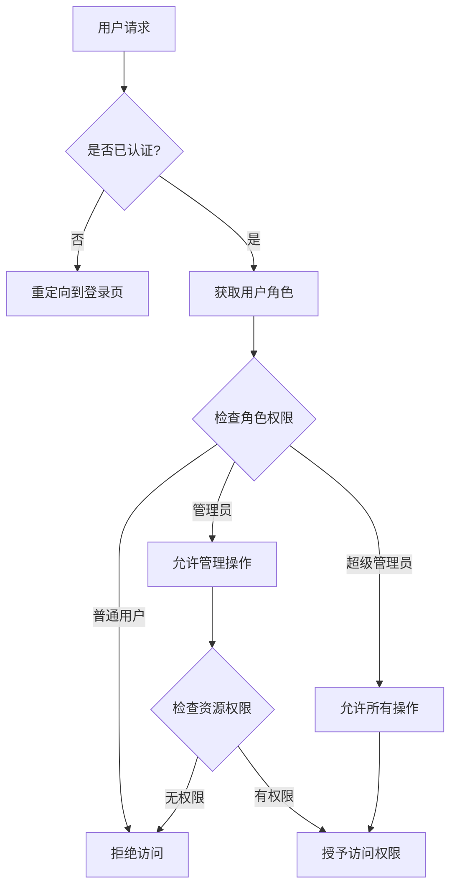
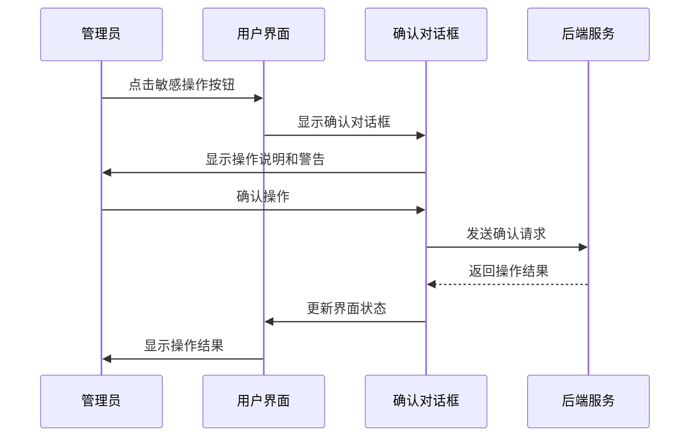

# 用户管理模块技术文档

<cite>
**本文档引用的文件**
- [UserManagementView.vue](file://src/views/admin/UserManagementView.vue)
- [UserDetailModal.vue](file://src/components/admin/UserDetailModal.vue)
- [userService.ts](file://src/services/userService.ts)
- [supabaseClient.ts](file://src/lib/supabaseClient.ts)
- [index.ts](file://src/types/index.ts)
</cite>

## 目录
1. [概述](#概述)
2. [项目架构](#项目架构)
3. [核心组件分析](#核心组件分析)
4. [用户列表管理](#用户列表管理)
5. [用户详情查看](#用户详情查看)
6. [用户服务层](#用户服务层)
7. [权限控制机制](#权限控制机制)
8. [安全防护机制](#安全防护机制)
9. [性能优化建议](#性能优化建议)
10. [故障排除指南](#故障排除指南)
11. [总结](#总结)

## 概述

用户管理模块是系统的核心管理功能之一，负责对用户账户进行全生命周期管理。该模块提供了完整的用户信息展示、筛选、编辑和状态管理功能，确保管理员能够高效地维护用户数据和系统安全。

主要功能包括：
- 用户列表的多维度筛选和排序
- 用户详情的全面展示和编辑
- 用户状态的实时管理和权限控制
- 安全的操作确认和日志记录
- 性能优化的数据加载策略

## 项目架构

用户管理模块采用分层架构设计，清晰分离表现层、业务逻辑层和服务层：



**图表来源**
- [UserManagementView.vue](file://src/views/admin/UserManagementView.vue#L1-L50)
- [UserDetailModal.vue](file://src/components/admin/UserDetailModal.vue#L1-L50)
- [userService.ts](file://src/services/userService.ts#L1-L50)

## 核心组件分析

### UserManagementView - 用户管理视图

UserManagementView是用户管理的主要入口组件，提供完整的用户列表界面和管理功能：



**图表来源**
- [UserManagementView.vue](file://src/views/admin/UserManagementView.vue#L200-L250)

### UserDetailModal - 用户详情模态框

UserDetailModal提供用户信息的详细查看和编辑功能，包含多个信息板块：



**图表来源**
- [UserDetailModal.vue](file://src/components/admin/UserDetailModal.vue#L150-L200)
- [userService.ts](file://src/services/userService.ts#L50-L100)

**章节来源**
- [UserManagementView.vue](file://src/views/admin/UserManagementView.vue#L1-L350)
- [UserDetailModal.vue](file://src/components/admin/UserDetailModal.vue#L1-L300)

## 用户列表管理

### 字段含义和筛选条件

用户列表界面展示了用户的多个关键字段，每个字段都有特定的含义和用途：

#### 基本字段说明

1. **用户信息列**
   - **头像**: 用户的个人头像，来自用户资料或默认图标
   - **姓名**: 用户的显示名称，优先使用full_name，否则显示邮箱
   - **邮箱**: 用户的注册邮箱地址
   - **用户名**: 用户的唯一标识符，@前缀显示

2. **角色字段**
   - **普通用户**: 拥有基本功能权限的用户
   - **管理员**: 具备部分管理权限的用户
   - **超级管理员**: 拥有最高权限的用户

3. **状态字段**
   - **活跃**: 当前可以正常使用的用户账户
   - **非活跃**: 被暂时禁用的用户账户
   - **已封禁**: 因违规行为被永久禁用的账户

4. **时间字段**
   - **注册时间**: 用户账户创建的时间
   - **最后登录**: 用户最近一次登录系统的时间

#### 筛选条件实现



**图表来源**
- [UserManagementView.vue](file://src/views/admin/UserManagementView.vue#L250-L300)

**章节来源**
- [UserManagementView.vue](file://src/views/admin/UserManagementView.vue#L60-L150)

## 用户详情查看

### UserDetailModal功能详解

UserDetailModal是一个功能丰富的模态框组件，提供用户信息的全面展示和操作功能：

#### 信息板块设计

1. **基本信息板块**
   - 用户ID、用户名、邮箱等基础信息
   - 用户角色和状态显示
   - 注册时间和最后登录时间
   - 邮箱验证状态

2. **个人资料板块**
   - 显示名称和个人简介
   - 用户头像展示
   - 网站链接和位置信息

3. **活动统计板块**
   - 收藏工具数量
   - 订单数量和总消费金额
   - 登录次数统计

4. **最近活动板块**
   - 用户登录、下单、收藏等操作记录
   - 活动类型图标和描述
   - 时间戳显示

#### 数据加载机制



**图表来源**
- [UserDetailModal.vue](file://src/components/admin/UserDetailModal.vue#L120-L180)

**章节来源**
- [UserDetailModal.vue](file://src/components/admin/UserDetailModal.vue#L1-L400)

## 用户服务层

### UserService核心功能

UserService是用户管理的核心业务逻辑层，封装了所有用户相关的操作：

#### 主要功能模块

1. **用户信息管理**
   ```typescript
   // 获取当前用户信息
   static async getCurrentUser(): Promise<User | null>
   
   // 获取用户资料
   static async getUserProfile(userId: string): Promise<User | null>
   
   // 更新用户资料
   static async updateProfile(userId: string, profileData: ProfileForm): Promise<User>
   ```

2. **用户状态管理**
   ```typescript
   // 更新最后登录时间
   static async updateLastLogin(userId: string): Promise<void>
   
   // 检查用户名可用性
   static async checkUsernameAvailability(username: string, excludeUserId?: string): Promise<boolean>
   ```

3. **用户统计信息**
   ```typescript
   // 获取用户统计信息
   static async getUserStats(userId: string): Promise<{
     favoriteToolsCount: number;
     favoriteProductsCount: number;
     ordersCount: number;
     totalSpent: number;
   }>
   ```

4. **用户账户管理**
   ```typescript
   // 删除用户账户
   static async deleteAccount(userId: string): Promise<void>
   ```

#### 数据转换机制

UserService通过transformUser方法将数据库行数据转换为业务对象：



**图表来源**
- [userService.ts](file://src/services/userService.ts#L280-L308)

**章节来源**
- [userService.ts](file://src/services/userService.ts#L1-L308)

## 权限控制机制

### 角色权限体系

系统采用基于角色的权限控制(RBAC)机制，确保不同级别的管理员拥有相应的操作权限：

#### 角色层级定义

1. **普通用户**: 基础功能权限
2. **管理员**: 部分管理权限
3. **超级管理员**: 完全管理权限

#### 权限检查实现



**图表来源**
- [supabaseClient.ts](file://src/lib/supabaseClient.ts#L90-L110)

### 动态权限控制

系统在多个层面实现了动态权限控制：

1. **路由级权限控制**
   ```typescript
   meta: {
     requiresAuth: true,
     requiresAdmin: true,
   }
   ```

2. **组件级权限控制**
   ```typescript
   const isAdmin = computed(() => {
     return user.value?.role === "admin" || user.value?.role === "super_admin";
   });
   ```

3. **操作级权限控制**
   ```typescript
   if (user.role !== 'super_admin') {
     // 只有非超级管理员才能执行此操作
     await toggleUserStatus(user);
   }
   ```

**章节来源**
- [supabaseClient.ts](file://src/lib/supabaseClient.ts#L70-L120)
- [auth.ts](file://src/stores/auth.ts#L30-L50)

## 安全防护机制

### 二次确认机制

系统在执行敏感操作时实施二次确认机制，防止误操作：

#### 确认对话框设计



**图表来源**
- [UserManagementView.vue](file://src/views/admin/UserManagementView.vue#L140-L180)

### 日志记录机制

系统自动记录所有重要操作的日志信息：

#### 操作日志类型

1. **用户状态变更日志**
   - 激活/禁用用户
   - 角色权限变更
   - 账户删除操作

2. **个人信息修改日志**
   - 用户资料更新
   - 头像更换
   - 邮箱验证状态变更

3. **系统管理日志**
   - 管理员操作记录
   - 权限变更记录
   - 系统配置修改

### 数据安全保护

#### 敏感数据处理

1. **密码安全**
   - 密码不存储明文
   - 使用安全的哈希算法
   - 定期更新密码策略

2. **个人信息保护**
   - 敏感信息脱敏显示
   - 数据传输加密
   - 访问权限控制

3. **文件安全管理**
   ```typescript
   // 头像文件上传安全处理
   const avatarUrl = await this.uploadAvatar(userId, profileData.avatar);
   updateData.avatar_url = avatarUrl;
   ```

**章节来源**
- [userService.ts](file://src/services/userService.ts#L80-L120)

## 性能优化建议

### 数据加载优化

1. **分页加载策略**
   - 默认每页显示10个用户
   - 使用虚拟滚动减少DOM节点
   - 懒加载用户详情数据

2. **缓存机制**
   - 用户统计数据缓存
   - 活动记录缓存
   - 角色权限缓存

3. **并发优化**
   ```typescript
   // 并发获取用户统计信息
   const [favoritesResult, ordersResult] = await Promise.all([
     supabase.from("favorites").select("tool_id, product_id").eq("user_id", userId),
     supabase.from("orders").select("total_amount, status").eq("user_id", userId),
   ]);
   ```

### 内存管理

1. **组件卸载清理**
   - 清理定时器和订阅
   - 释放大对象引用
   - 重置响应式状态

2. **大数据处理**
   - 使用流式处理大数据集
   - 分批处理大量数据
   - 实现数据压缩和去重

### 网络优化

1. **请求合并**
   - 合并相似的API请求
   - 使用批量操作减少网络往返
   - 实现智能请求去重

2. **CDN加速**
   - 用户头像图片CDN缓存
   - 静态资源CDN分发
   - 地理位置优化

## 故障排除指南

### 常见问题诊断

#### 用户数据加载失败

**症状**: 用户列表显示空白或加载失败
**可能原因**:
1. Supabase连接异常
2. 权限配置错误
3. 网络连接问题

**解决方案**:
```typescript
// 检查Supabase连接状态
try {
  const { data, error } = await supabase
    .from("user_profiles")
    .select("*")
    .limit(1);
  
  if (error) {
    console.error("Supabase连接失败:", error);
    // 实施重连机制
  }
} catch (error) {
  console.error("用户数据加载失败:", error);
}
```

#### 用户状态切换失效

**症状**: 点击激活/禁用按钮无反应
**可能原因**:
1. 权限不足
2. 网络超时
3. 数据同步问题

**解决方案**:
```typescript
// 实施操作确认和重试机制
const toggleUserStatus = async (user: User) => {
  try {
    // 显示确认对话框
    const confirmed = await showConfirmationDialog();
    if (!confirmed) return;
    
    // 执行状态切换
    await userService.toggleUserStatus(user.id, !user.is_active);
    
    // 刷新用户列表
    await loadUsers();
  } catch (error) {
    console.error("状态切换失败:", error);
    showErrorNotification("状态切换失败，请稍后重试");
  }
};
```

### 性能监控

#### 关键指标监控

1. **响应时间监控**
   - 用户列表加载时间
   - 详情页面打开时间
   - 操作响应时间

2. **错误率监控**
   - API调用失败率
   - 页面加载失败率
   - 操作执行失败率

3. **用户体验监控**
   - 页面加载速度
   - 交互流畅度
   - 错误提示准确性

**章节来源**
- [UserManagementView.vue](file://src/views/admin/UserManagementView.vue#L300-L350)

## 总结

用户管理模块是一个功能完善、架构清晰的管理组件，具备以下核心优势：

### 技术特点

1. **模块化设计**: 采用Vue 3 Composition API，组件职责明确，易于维护和扩展
2. **类型安全**: 完整的TypeScript类型定义，提供编译时错误检查
3. **响应式架构**: 基于Vue响应式系统，实现数据驱动的界面更新
4. **权限控制**: 完善的角色权限体系，确保系统安全性

### 功能完整性

1. **全生命周期管理**: 从用户创建到删除的完整流程覆盖
2. **多维度筛选**: 支持多种条件组合的用户筛选和排序
3. **详细信息展示**: 提供用户的所有相关信息和统计数据
4. **安全操作机制**: 实施二次确认和日志记录，保障操作安全

### 性能考虑

1. **数据优化**: 实施分页、缓存和并发优化策略
2. **内存管理**: 合理的组件生命周期管理和内存释放
3. **网络优化**: 智能的请求合并和CDN加速

### 安全保障

1. **权限隔离**: 不同角色拥有不同的操作权限
2. **操作审计**: 完整的操作日志记录和追踪
3. **数据保护**: 敏感数据的安全处理和传输

该模块为系统管理员提供了强大而易用的用户管理工具，同时确保了系统的安全性和稳定性。通过合理的架构设计和完善的错误处理机制，为用户提供可靠的用户体验。