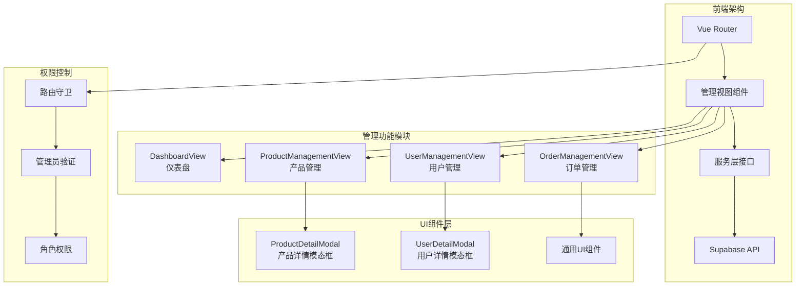
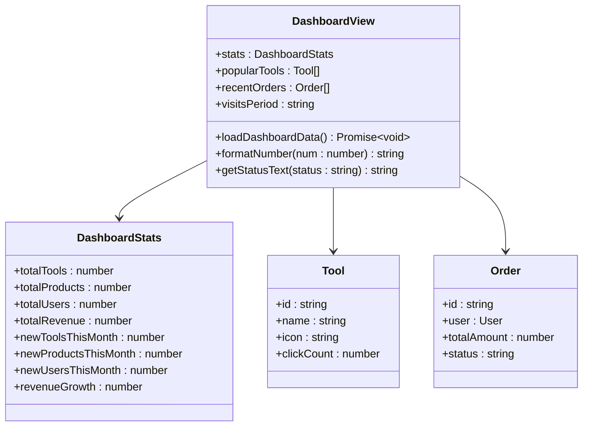
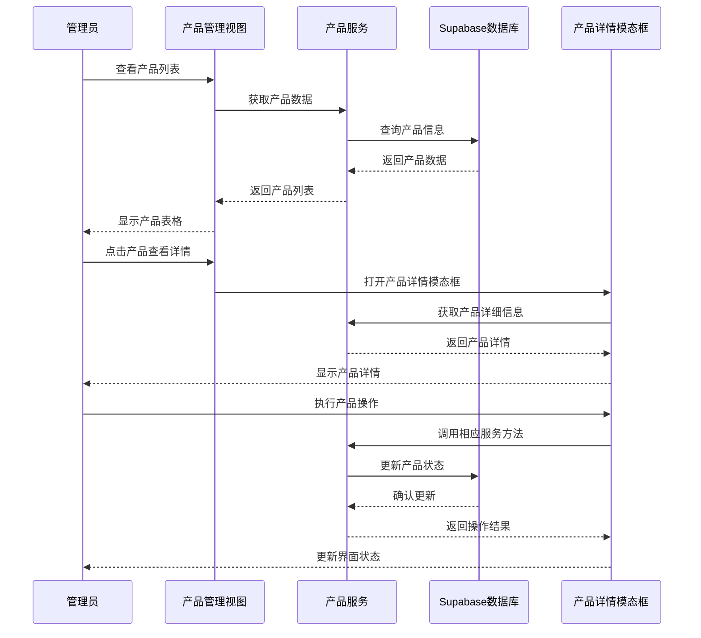
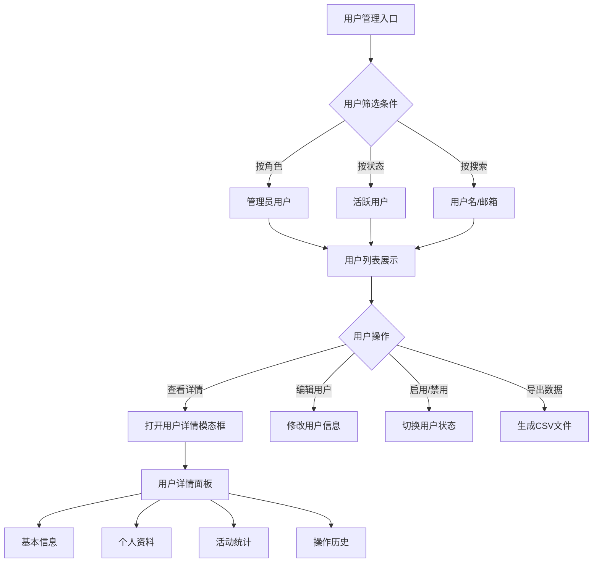
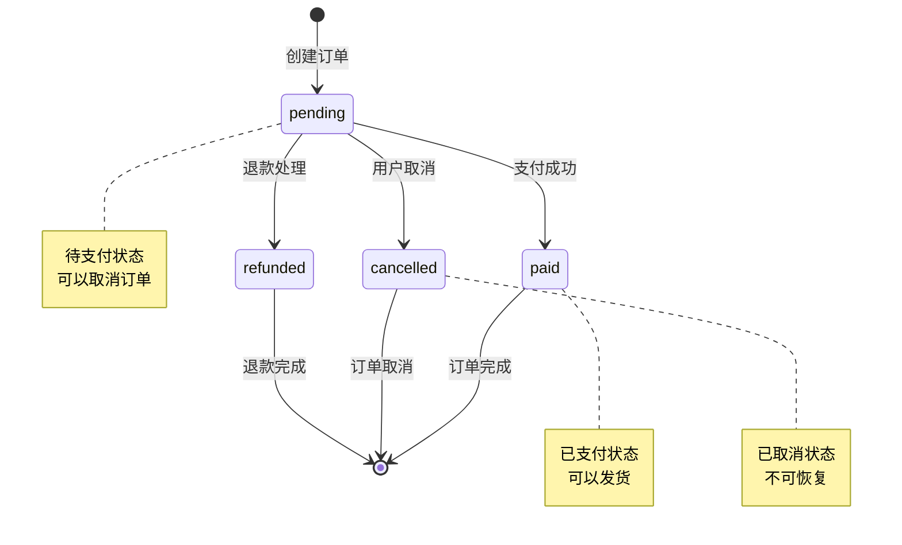
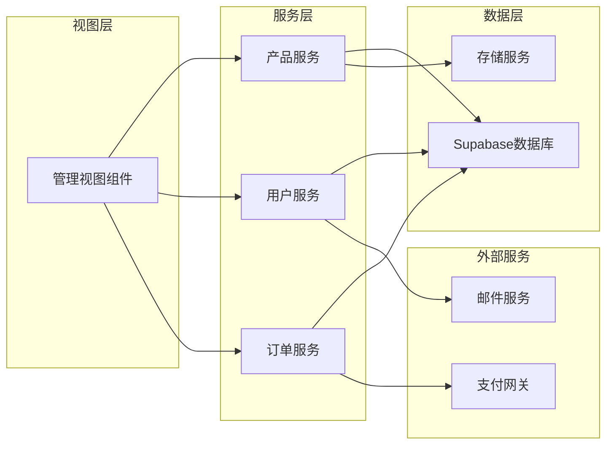
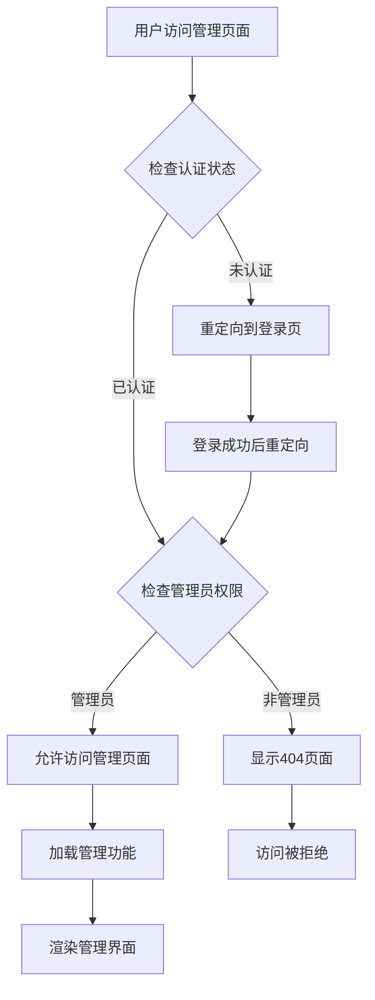
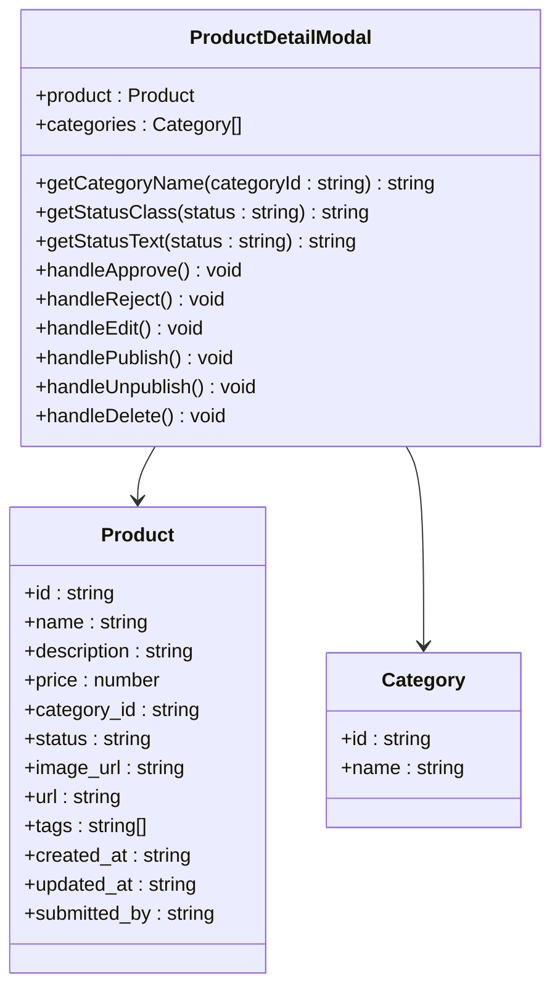
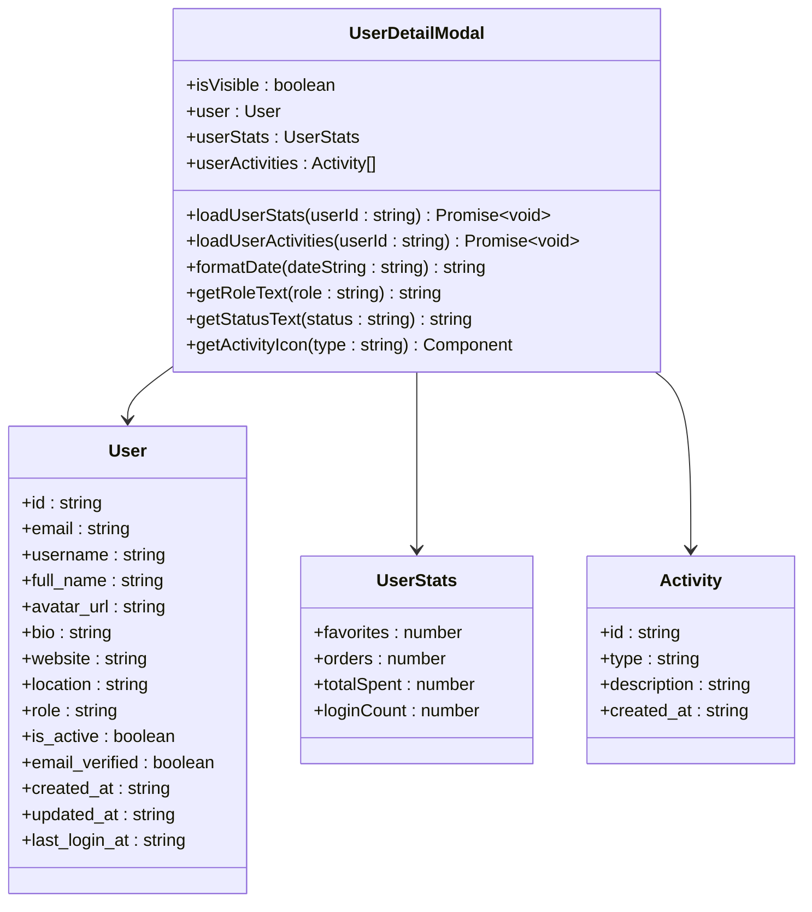

# 管理后台系统

<cite>
**本文档引用的文件**
- [DashboardView.vue](file://src/views/admin/DashboardView.vue)
- [ProductManagementView.vue](file://src/views/admin/ProductManagementView.vue)
- [UserManagementView.vue](file://src/views/admin/UserManagementView.vue)
- [OrderManagementView.vue](file://src/views/admin/OrderManagementView.vue)
- [productsService.ts](file://src/services/productsService.ts)
- [userService.ts](file://src/services/userService.ts)
- [orderService.ts](file://src/services/orderService.ts)
- [ProductDetailModal.vue](file://src/components/admin/ProductDetailModal.vue)
- [UserDetailModal.vue](file://src/components/admin/UserDetailModal.vue)
- [index.ts](file://src/router/index.ts)
</cite>

## 目录
1. [系统概述](#系统概述)
2. [项目架构](#项目架构)
3. [核心功能模块](#核心功能模块)
4. [数据流分析](#数据流分析)
5. [权限控制机制](#权限控制机制)
6. [模态框组件应用](#模态框组件应用)
7. [服务层接口](#服务层接口)
8. [性能优化策略](#性能优化策略)
9. [故障排除指南](#故障排除指南)
10. [总结](#总结)

## 系统概述

管理后台系统是一个基于Vue 3和TypeScript构建的现代化管理界面，专为高效工具导航平台设计。该系统提供了全面的管理功能，包括仪表盘数据可视化、工具与产品管理、用户与订单监控等核心功能模块。

系统采用前后端分离架构，前端使用Vue 3 Composition API，后端依赖Supabase数据库服务。通过精心设计的组件化架构，实现了高度可维护和可扩展的管理界面。

## 项目架构



**图表来源**
- [DashboardView.vue](file://src/views/admin/DashboardView.vue#L1-L50)
- [ProductManagementView.vue](file://src/views/admin/ProductManagementView.vue#L1-L50)
- [UserManagementView.vue](file://src/views/admin/UserManagementView.vue#L1-L50)
- [OrderManagementView.vue](file://src/views/admin/OrderManagementView.vue#L1-L50)

## 核心功能模块

### 仪表盘数据可视化

仪表盘是整个管理后台的核心入口，提供实时的系统概览和关键指标统计。



**图表来源**
- [DashboardView.vue](file://src/views/admin/DashboardView.vue#L150-L200)

仪表盘包含以下关键统计指标：
- **工具总数**：显示系统中所有工具的数量
- **产品总数**：统计用户提交的产品数量
- **用户总数**：跟踪系统注册用户的总量
- **总收入**：计算所有已完成订单的累计收入

同时提供实时的访问趋势图表、热门工具排行和最新订单列表，帮助管理员快速掌握系统运营状况。

**章节来源**
- [DashboardView.vue](file://src/views/admin/DashboardView.vue#L1-L100)

### 产品管理功能

产品管理模块提供了完整的产品生命周期管理功能，支持产品审核、编辑、发布和删除等操作。



**图表来源**
- [ProductManagementView.vue](file://src/views/admin/ProductManagementView.vue#L50-L150)
- [productsService.ts](file://src/services/productsService.ts#L100-L200)
- [ProductDetailModal.vue](file://src/components/admin/ProductDetailModal.vue#L200-L300)

产品管理支持以下功能：
- **产品审核**：对用户提交的产品进行审核，支持通过或拒绝
- **状态管理**：支持产品发布、下架等状态变更
- **批量操作**：支持批量审核、批量删除等操作
- **数据导出**：支持将产品数据导出为CSV格式

**章节来源**
- [ProductManagementView.vue](file://src/views/admin/ProductManagementView.vue#L1-L200)
- [productsService.ts](file://src/services/productsService.ts#L1-L100)

### 用户管理功能

用户管理模块提供了全面的用户信息管理和权限控制功能。



**图表来源**
- [UserManagementView.vue](file://src/views/admin/UserManagementView.vue#L100-L200)

用户管理功能包括：
- **用户信息查看**：查看用户的基本信息、角色状态、注册时间等
- **用户状态管理**：支持启用、禁用用户账户
- **角色权限控制**：管理用户的角色权限，包括普通用户、管理员等
- **活动统计**：展示用户的收藏数量、订单数量、消费总额等统计信息

**章节来源**
- [UserManagementView.vue](file://src/views/admin/UserManagementView.vue#L1-L200)
- [userService.ts](file://src/services/userService.ts#L1-L100)

### 订单管理功能

订单管理模块提供了完整的订单生命周期管理，支持订单状态跟踪、支付处理和数据分析。



**图表来源**
- [OrderManagementView.vue](file://src/views/admin/OrderManagementView.vue#L150-L250)
- [orderService.ts](file://src/services/orderService.ts#L300-L400)

订单管理支持以下功能：
- **订单状态跟踪**：实时跟踪订单的支付状态、处理进度
- **支付方式管理**：支持多种支付方式的集成和管理
- **订单统计分析**：提供订单数量、收入金额等关键指标统计
- **订单导出功能**：支持将订单数据导出为CSV格式

**章节来源**
- [OrderManagementView.vue](file://src/views/admin/OrderManagementView.vue#L1-L200)
- [orderService.ts](file://src/services/orderService.ts#L1-L200)

## 数据流分析

管理后台的数据流遵循清晰的分层架构，确保数据的一致性和安全性。



**图表来源**
- [productsService.ts](file://src/services/productsService.ts#L1-L50)
- [userService.ts](file://src/services/userService.ts#L1-L50)
- [orderService.ts](file://src/services/orderService.ts#L1-L50)

数据流特点：
- **单向数据流**：数据从服务层流向视图层，确保数据一致性
- **响应式更新**：使用Vue 3的响应式系统，自动更新视图
- **错误处理**：完善的错误处理机制，提供友好的用户反馈
- **缓存策略**：合理的缓存策略，提升用户体验

## 权限控制机制

系统实现了严格的权限控制机制，确保只有授权用户才能访问管理功能。



**图表来源**
- [index.ts](file://src/router/index.ts#L350-L398)

权限控制特性：
- **路由守卫**：在路由级别实施权限检查
- **动态权限**：根据用户角色动态调整可访问的功能
- **细粒度控制**：支持不同级别的权限控制
- **安全审计**：记录管理员的操作日志

**章节来源**
- [index.ts](file://src/router/index.ts#L350-L398)

## 模态框组件应用

系统广泛使用模态框组件来处理数据编辑和详情查看，提供良好的用户体验。

### 产品详情模态框



**图表来源**
- [ProductDetailModal.vue](file://src/components/admin/ProductDetailModal.vue#L150-L250)

产品详情模态框提供以下功能：
- **产品信息展示**：完整展示产品的基本信息和状态
- **审核操作**：支持通过审核、拒绝审核等操作
- **状态管理**：支持发布、下架等状态变更
- **批量操作**：支持删除等危险操作

### 用户详情模态框



**图表来源**
- [UserDetailModal.vue](file://src/components/admin/UserDetailModal.vue#L100-L200)

用户详情模态框提供以下功能：
- **用户信息展示**：展示用户的基本信息和个人资料
- **活动统计**：展示用户的收藏、订单、消费等统计信息
- **操作历史**：记录和展示用户的操作历史
- **编辑功能**：支持跳转到用户编辑页面

**章节来源**
- [ProductDetailModal.vue](file://src/components/admin/ProductDetailModal.vue#L1-L100)
- [UserDetailModal.vue](file://src/components/admin/UserDetailModal.vue#L1-L100)

## 服务层接口

系统采用服务层架构，将业务逻辑与数据访问分离，提高代码的可维护性和可测试性。

### 产品服务接口

产品服务提供了完整的产品管理功能：

```typescript
// 获取产品列表
static async getProducts(filters?: SearchFilters): Promise<SearchResult<Product>>

// 获取单个产品
static async getProduct(id: string): Promise<Product>

// 创建产品
static async createProduct(productData: ProductInsert): Promise<Product>

// 更新产品
static async updateProduct(id: string, updates: ProductUpdate): Promise<Product>

// 删除产品
static async deleteProduct(id: string): Promise<void>

// 上传产品图片
static async uploadProductImage(file: File, productId: string): Promise<string>
```

### 用户服务接口

用户服务提供了完整的用户管理功能：

```typescript
// 获取当前用户信息
static async getCurrentUser(): Promise<User | null>

// 获取用户资料
static async getUserProfile(userId: string): Promise<User | null>

// 更新用户资料
static async updateProfile(userId: string, profileData: ProfileForm): Promise<User>

// 上传头像
static async uploadAvatar(userId: string, file: File): Promise<string>

// 获取用户统计信息
static async getUserStats(userId: string): Promise<UserStats>

// 删除用户账户
static async deleteAccount(userId: string): Promise<void>
```

### 订单服务接口

订单服务提供了完整的订单管理功能：

```typescript
// 创建订单
static async createOrder(orderData: CreateOrderData, userId: string): Promise<Order>

// 处理支付
static async processPayment(paymentData: PaymentData): Promise<void>

// 获取用户订单列表
static async getUserOrders(userId: string): Promise<Order[]>

// 管理员获取所有订单
static async getAllOrders(filters?: OrderFilters): Promise<OrderResult>

// 更新订单状态
static async updateOrderStatus(orderId: string, status: OrderStatus, adminUserId: string): Promise<void>

// 导出订单数据
static async exportOrders(filters?: ExportFilters): Promise<string>
```

**章节来源**
- [productsService.ts](file://src/services/productsService.ts#L1-L100)
- [userService.ts](file://src/services/userService.ts#L1-L100)
- [orderService.ts](file://src/services/orderService.ts#L1-L100)

## 性能优化策略

系统采用了多种性能优化策略，确保管理后台的高效运行：

### 数据加载优化
- **懒加载**：使用Vue Router的异步组件实现按需加载
- **分页处理**：大数据集采用分页加载，避免一次性加载过多数据
- **缓存策略**：合理使用浏览器缓存和内存缓存

### 渲染性能优化
- **虚拟滚动**：对于大量数据的列表，使用虚拟滚动技术
- **防抖节流**：对频繁触发的操作使用防抖和节流
- **组件复用**：最大化组件复用，减少重复渲染

### 网络请求优化
- **批量请求**：将多个小请求合并为批量请求
- **请求去重**：避免重复发送相同的请求
- **超时处理**：合理的请求超时设置和重试机制

## 故障排除指南

### 常见问题及解决方案

**1. 仪表盘数据加载失败**
- 检查Supabase连接状态
- 验证API密钥配置
- 确认网络连接正常

**2. 产品管理功能异常**
- 检查用户权限设置
- 验证数据库表结构
- 确认存储桶权限配置

**3. 用户管理界面卡顿**
- 检查数据量大小
- 优化查询条件
- 启用分页功能

**4. 订单导出功能失败**
- 检查CSV生成逻辑
- 验证数据格式正确性
- 确认文件大小限制

### 调试技巧

- 使用浏览器开发者工具监控网络请求
- 启用Vue DevTools查看组件状态
- 在控制台输出关键变量值
- 使用断点调试复杂逻辑

## 总结

管理后台系统是一个功能完善、架构清晰的现代化管理平台。通过合理的模块划分、完善的服务层设计和严格的安全控制，为管理员提供了高效、便捷的管理体验。

系统的主要优势包括：
- **模块化设计**：清晰的功能模块划分，便于维护和扩展
- **响应式架构**：基于Vue 3的响应式设计，提供良好的用户体验
- **完善的安全机制**：多层次的权限控制和安全验证
- **丰富的功能**：涵盖产品管理、用户管理、订单管理等核心功能
- **优秀的性能**：采用多种优化策略，确保系统高效运行

未来可以考虑的功能增强方向：
- 实现更高级的数据分析功能
- 增加更多自定义报表选项
- 优化移动端管理体验
- 增强与其他系统的集成能力