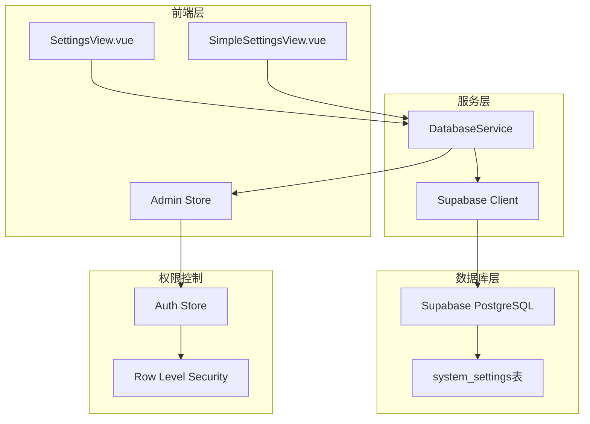
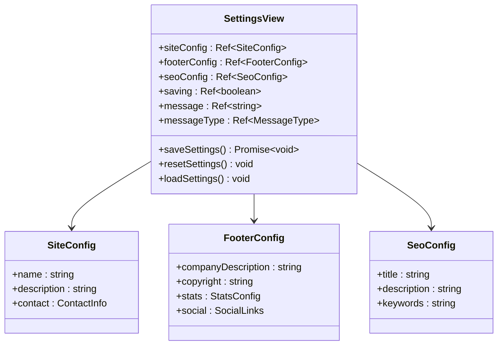
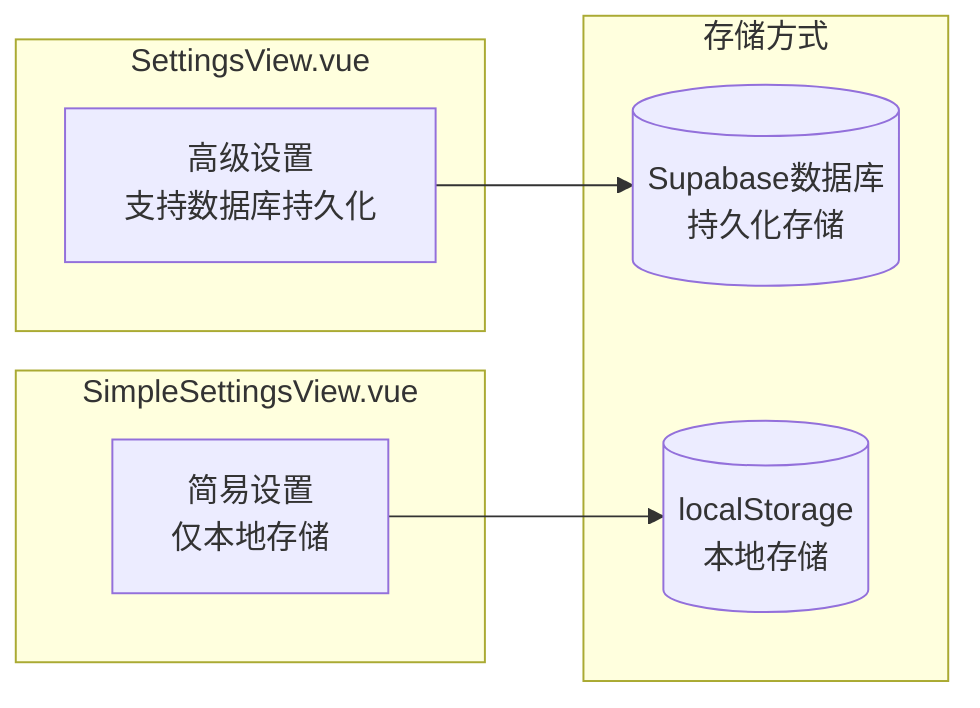
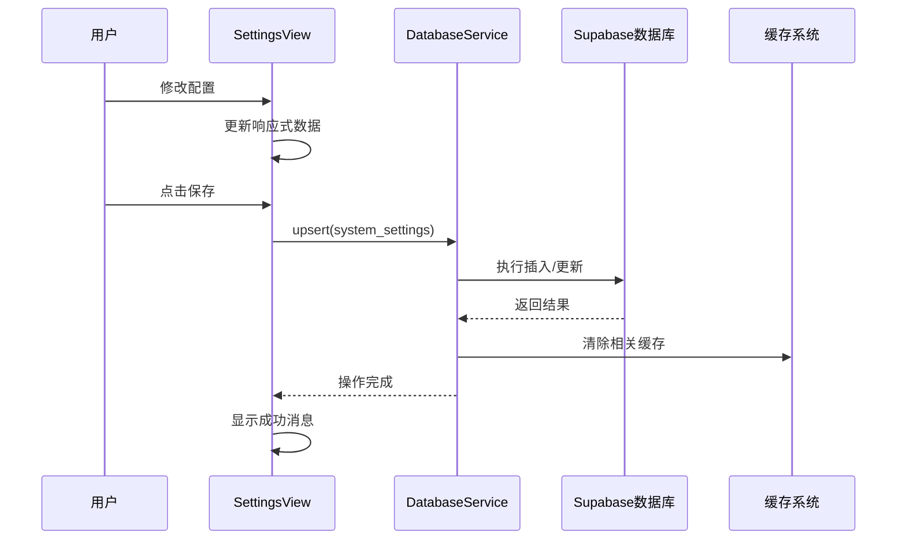
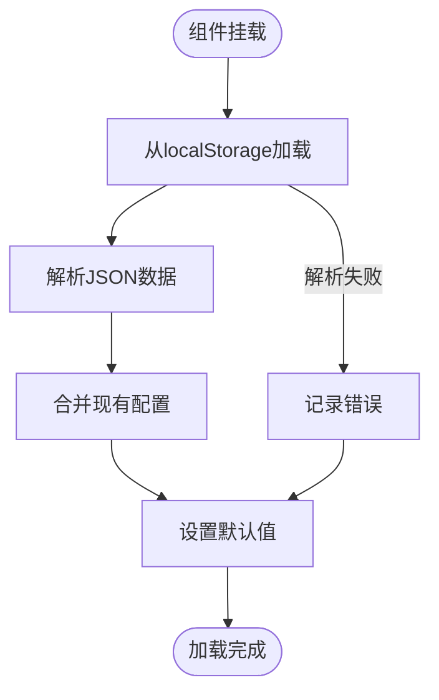
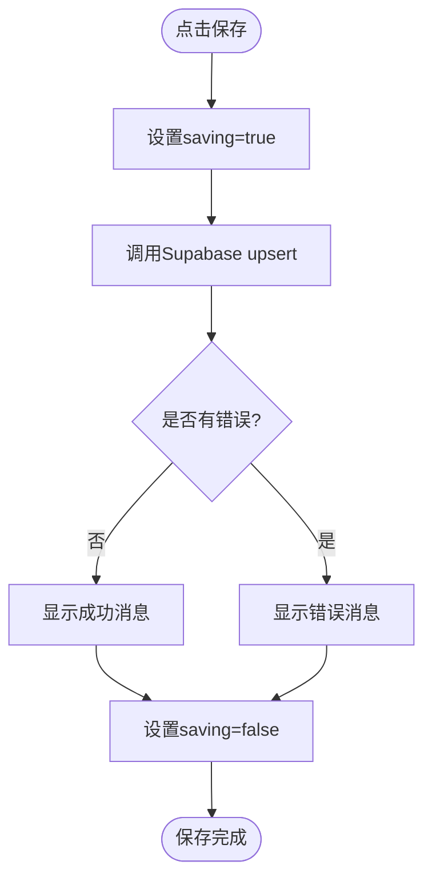
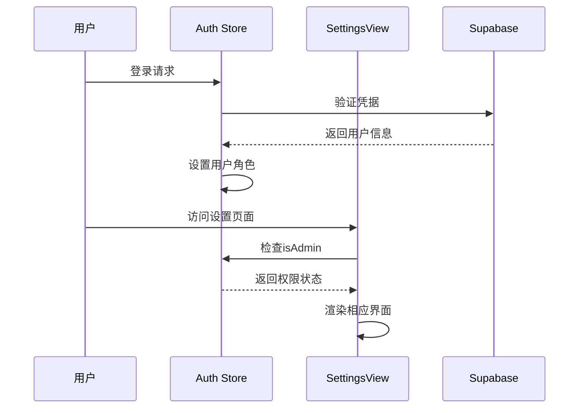
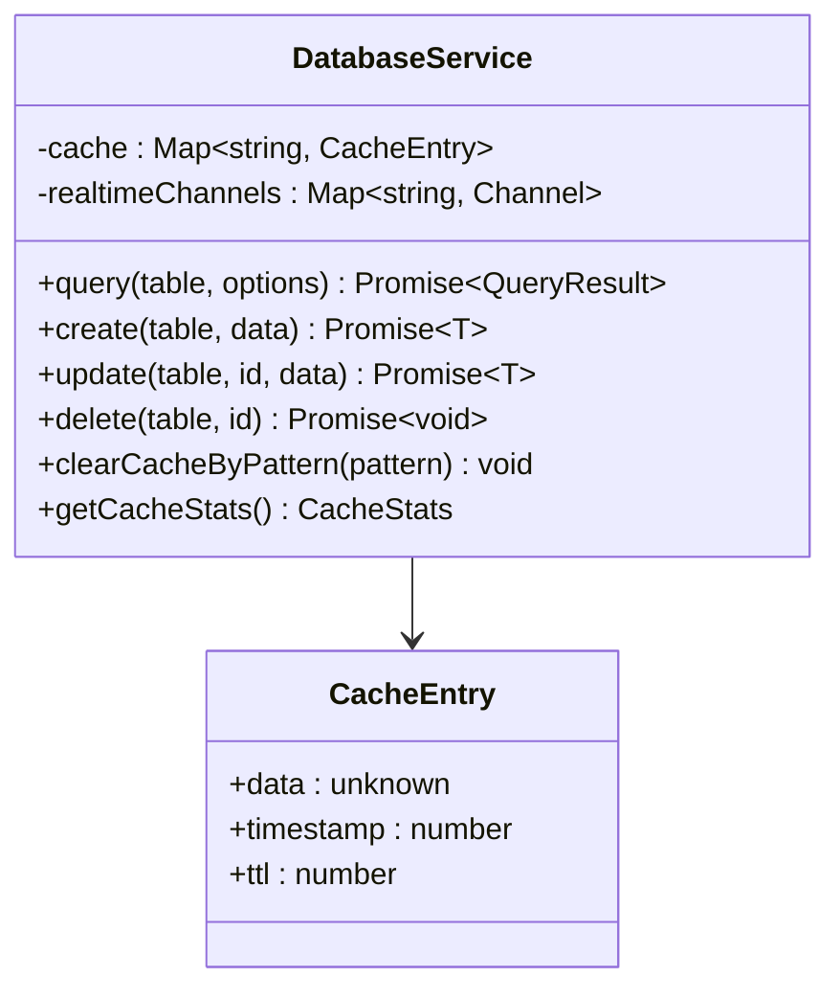
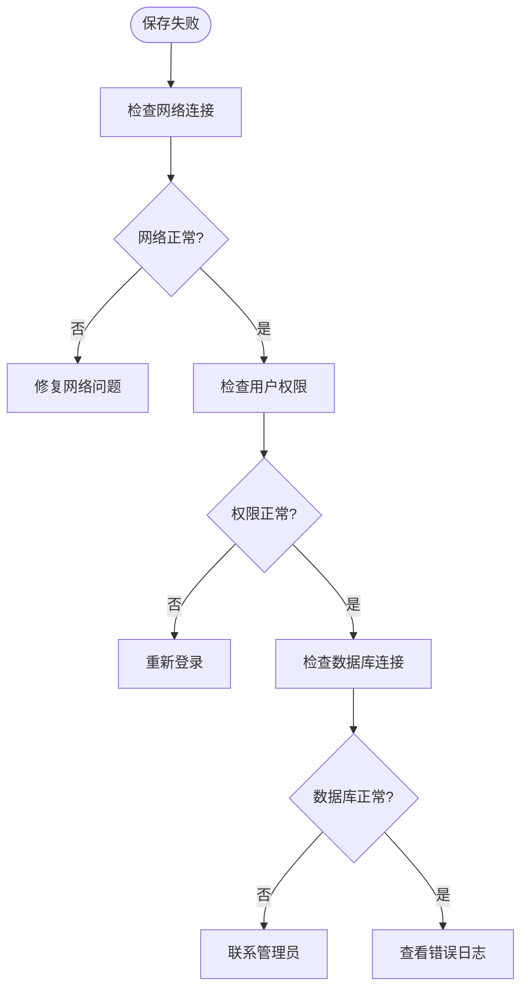

# 系统设置管理

<cite>
**本文档中引用的文件**
- [SettingsView.vue](file://src/views/admin/SettingsView.vue)
- [SimpleSettingsView.vue](file://src/views/SimpleSettingsView.vue)
- [databaseService.ts](file://src/services/databaseService.ts)
- [supabaseClient.ts](file://src/lib/supabaseClient.ts)
- [auth.ts](file://src/stores/auth.ts)
- [initial_schema.sql](file://supabase/migrations/20241224000001_initial_schema.sql)
- [services.test.ts](file://src/tests/integration/services.test.ts)
- [toolsService.ts](file://src/services/toolsService.ts)
</cite>

## 目录
1. [概述](#概述)
2. [系统架构](#系统架构)
3. [核心组件分析](#核心组件分析)
4. [配置存储机制](#配置存储机制)
5. [数据流分析](#数据流分析)
6. [安全与权限控制](#安全与权限控制)
7. [性能优化策略](#性能优化策略)
8. [故障排除指南](#故障排除指南)
9. [最佳实践](#最佳实践)
10. [总结](#总结)

## 概述

系统设置管理是Advanced Tools Navigation项目的核心功能模块，负责维护网站的各项配置参数。该系统提供了两个主要的设置界面：`SettingsView.vue`（高级设置）和`SimpleSettingsView.vue`（简易设置），通过Supabase数据库实现配置的持久化存储和实时同步。

系统设置涵盖了网站的基础信息、页面底部配置、SEO设置等多个维度，支持配置的增删改查操作，并具备完善的权限控制和日志追踪机制。

## 系统架构



**图表来源**
- [SettingsView.vue](file://src/views/admin/SettingsView.vue#L1-L519)
- [databaseService.ts](file://src/services/databaseService.ts#L1-L405)
- [supabaseClient.ts](file://src/lib/supabaseClient.ts#L1-L246)

## 核心组件分析

### SettingsView组件架构



**图表来源**
- [SettingsView.vue](file://src/views/admin/SettingsView.vue#L60-L120)

### 配置数据结构

系统设置采用分层的数据结构设计：

```typescript
// 网站基本信息配置
interface SiteConfig {
  name: string;
  description: string;
  contact: {
    email: string;
    phone: string;
  };
}

// 页面底部配置
interface FooterConfig {
  companyDescription: string;
  copyright: string;
  stats: {
    toolsCount: number;
    categoriesCount: number;
    usersCount: number;
  };
  social: {
    wechat: string;
    weibo: string;
    github: string;
    email: string;
  };
}

// SEO配置
interface SeoConfig {
  title: string;
  description: string;
  keywords: string;
}
```

**章节来源**
- [SettingsView.vue](file://src/views/admin/SettingsView.vue#L60-L120)

## 配置存储机制

### 数据库表设计

系统设置通过Supabase的`system_settings`表进行存储，该表采用键值对的形式存储配置数据：

```sql
CREATE TABLE system_settings (
    id UUID DEFAULT uuid_generate_v4() PRIMARY KEY,
    key TEXT NOT NULL,
    value JSONB NOT NULL,
    updated_at TIMESTAMP WITH TIME ZONE DEFAULT NOW(),
    UNIQUE(key)
);
```

### 存储策略对比



**图表来源**
- [SettingsView.vue](file://src/views/admin/SettingsView.vue#L232-L267)
- [SimpleSettingsView.vue](file://src/views/SimpleSettingsView.vue#L280-L320)

### 数据持久化流程



**图表来源**
- [SettingsView.vue](file://src/views/admin/SettingsView.vue#L232-L267)
- [databaseService.ts](file://src/services/databaseService.ts#L80-L120)

**章节来源**
- [SettingsView.vue](file://src/views/admin/SettingsView.vue#L232-L267)
- [databaseService.ts](file://src/services/databaseService.ts#L80-L120)

## 数据流分析

### 配置加载流程



**图表来源**
- [SettingsView.vue](file://src/views/admin/SettingsView.vue#L280-L300)

### 配置保存流程



**图表来源**
- [SettingsView.vue](file://src/views/admin/SettingsView.vue#L232-L267)

**章节来源**
- [SettingsView.vue](file://src/views/admin/SettingsView.vue#L232-L300)

## 安全与权限控制

### 权限验证机制



**图表来源**
- [auth.ts](file://src/stores/auth.ts#L15-L50)

### Row Level Security策略

系统设置了严格的数据库访问控制：

```sql
-- 系统设置表的RLS策略
CREATE POLICY "只有管理员可以管理设置" ON system_settings
    FOR ALL USING (auth.jwt() ->> 'role' = 'admin' OR auth.jwt() ->> 'role' = 'super_admin');
```

**章节来源**
- [auth.ts](file://src/stores/auth.ts#L15-L190)

## 性能优化策略

### 缓存管理机制



**图表来源**
- [databaseService.ts](file://src/services/databaseService.ts#L15-L30)

### 缓存策略

系统实现了智能的缓存管理：

1. **查询缓存**: 对频繁查询的结果进行缓存
2. **失效策略**: 基于表名的缓存失效机制
3. **内存管理**: 自动清理过期缓存条目

**章节来源**
- [databaseService.ts](file://src/services/databaseService.ts#L280-L320)

## 故障排除指南

### 常见问题及解决方案

#### 1. 配置保存失败

**症状**: 点击保存按钮后出现错误消息

**排查步骤**:


#### 2. 配置不生效

**可能原因**:
- 浏览器缓存问题
- localStorage损坏
- 数据库同步延迟

**解决方法**:
1. 清除浏览器缓存
2. 重置设置到默认值
3. 检查数据库记录

#### 3. 权限不足

**症状**: 无法访问设置页面或保存配置

**解决方法**:
- 确认用户角色为admin或super_admin
- 检查Supabase RLS策略
- 联系系统管理员

**章节来源**
- [SettingsView.vue](file://src/views/admin/SettingsView.vue#L232-L267)
- [databaseService.ts](file://src/services/databaseService.ts#L80-L120)

## 最佳实践

### 配置管理最佳实践

1. **备份重要配置**: 在修改前备份当前配置
2. **分批修改**: 避免同时修改多个配置项
3. **测试验证**: 修改后立即测试功能
4. **版本控制**: 记录配置变更历史

### 安全最佳实践

1. **最小权限原则**: 仅授予必要的管理权限
2. **定期审计**: 定期检查配置变更记录
3. **监控告警**: 设置配置异常的监控告警
4. **应急预案**: 准备配置恢复的应急方案

### 性能优化建议

1. **合理缓存**: 根据配置更新频率设置合适的缓存时间
2. **批量操作**: 对于大量配置修改，考虑批量操作
3. **异步处理**: 非关键配置修改可以采用异步处理
4. **资源监控**: 监控数据库查询性能和缓存命中率

## 总结

系统设置管理模块通过精心设计的架构，提供了完整的配置管理解决方案。它不仅支持灵活的配置编辑和持久化存储，还具备完善的权限控制、性能优化和安全保障机制。

通过本模块，管理员可以轻松地管理网站的各项配置参数，包括网站基本信息、页面底部配置、SEO设置等。系统的响应式设计和实时同步机制确保了配置变更的及时生效，而强大的缓存机制和错误处理则保证了系统的稳定性和性能。

对于开发者而言，该模块提供了清晰的接口和良好的扩展性，便于后续的功能增强和维护。完善的测试覆盖和错误处理机制也为系统的可靠性提供了保障。