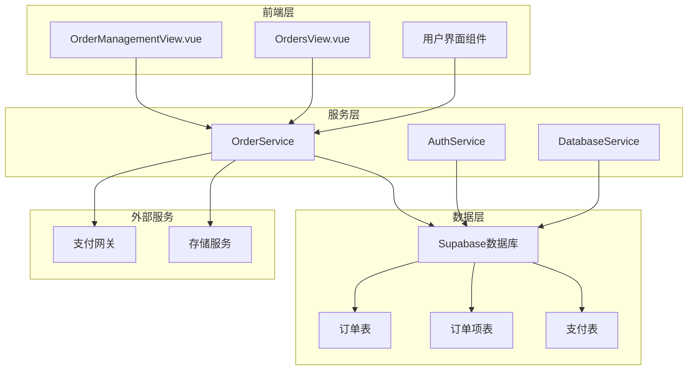
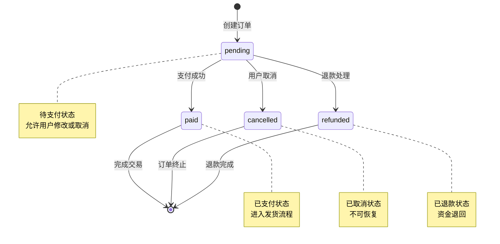
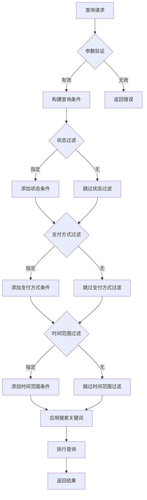
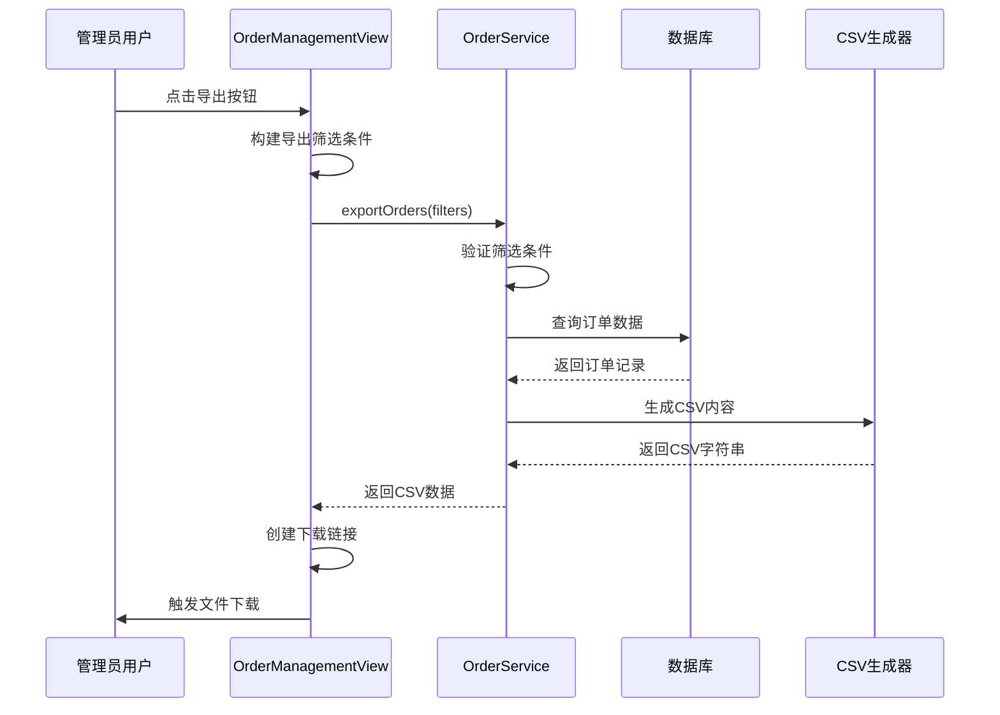
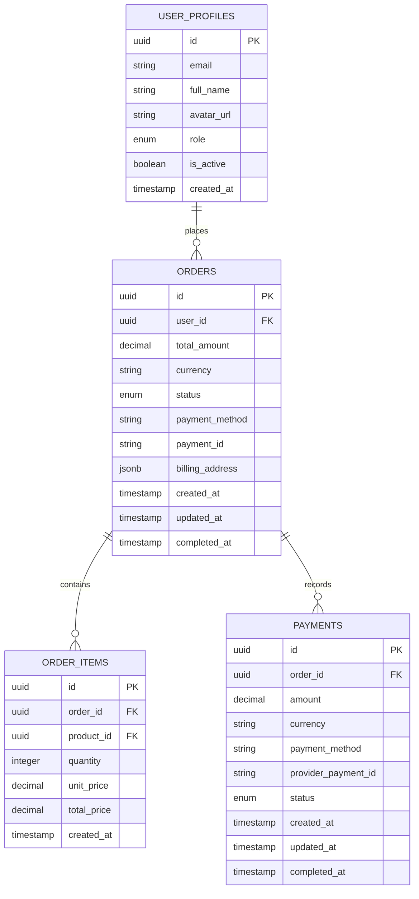
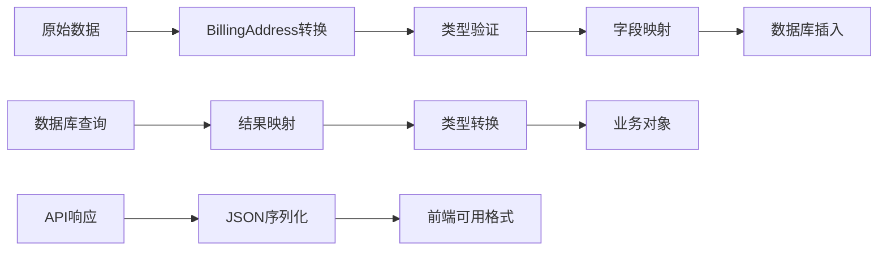
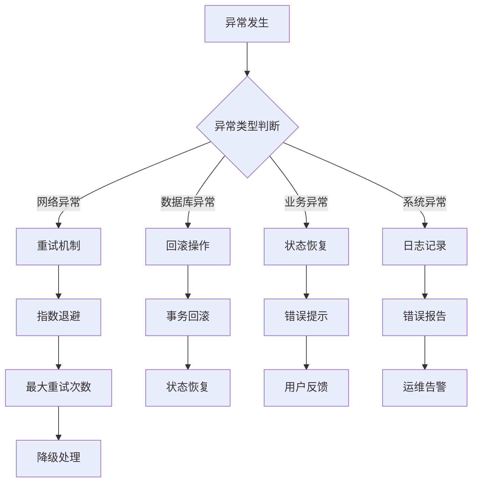
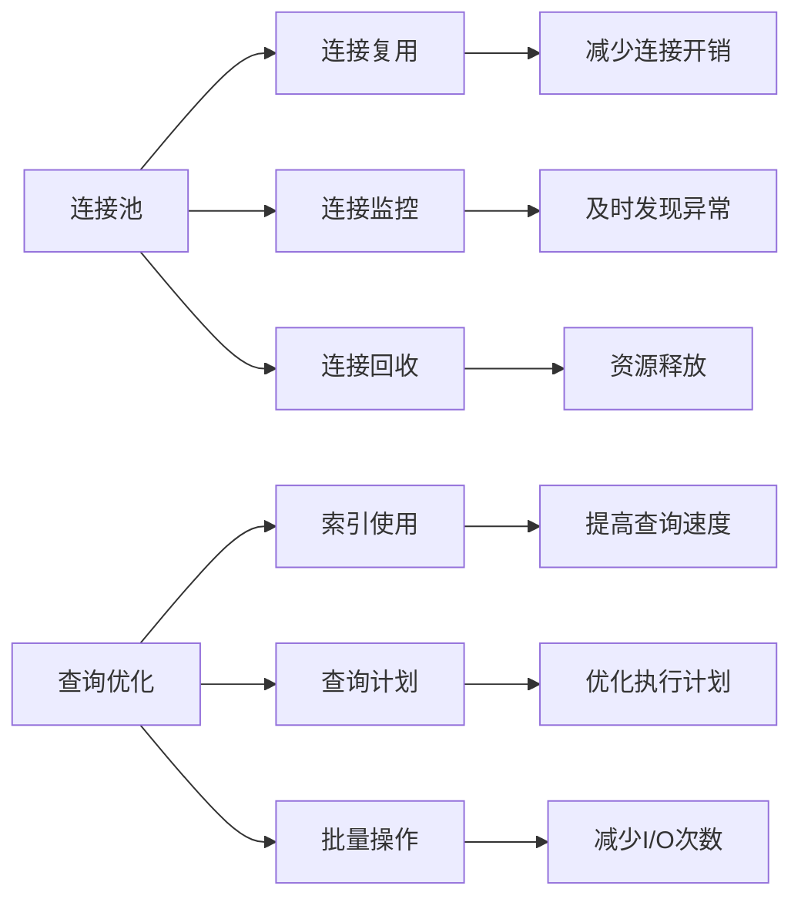

# 订单监控系统

<cite>
**本文档引用的文件**
- [OrderManagementView.vue](file://src/views/admin/OrderManagementView.vue)
- [orderService.ts](file://src/services/orderService.ts)
- [index.ts](file://src/types/index.ts)
- [initial_schema.sql](file://supabase/migrations/20241224000001_initial_schema.sql)
- [supabaseClient.ts](file://src/lib/supabaseClient.ts)
- [OrdersView.vue](file://src/views/user/OrdersView.vue)
</cite>

## 目录
1. [简介](#简介)
2. [系统架构概览](#系统架构概览)
3. [订单状态机设计](#订单状态机设计)
4. [订单查询接口](#订单查询接口)
5. [数据导出功能](#数据导出功能)
6. [数据库交互细节](#数据库交互细节)
7. [异常处理与事务完整性](#异常处理与事务完整性)
8. [性能优化策略](#性能优化策略)
9. [故障排除指南](#故障排除指南)
10. [总结](#总结)

## 简介

订单监控系统是一个基于Vue 3和TypeScript构建的综合性订单管理平台，专为电商平台设计。该系统提供了完整的订单生命周期管理功能，包括订单创建、状态跟踪、支付处理、数据导出和实时监控等核心功能。

系统采用现代化的技术栈，结合Supabase作为后端服务，实现了前后端分离的架构模式。通过精心设计的状态机和查询接口，系统能够高效地处理大量订单数据，同时保证数据的一致性和完整性。

## 系统架构概览

订单监控系统采用分层架构设计，主要包含以下核心组件：

**图表来源**
- [OrderManagementView.vue](file://src/views/admin/OrderManagementView.vue#L1-L50)
- [orderService.ts](file://src/services/orderService.ts#L1-L100)
- [supabaseClient.ts](file://src/lib/supabaseClient.ts#L1-L50)

**章节来源**
- [OrderManagementView.vue](file://src/views/admin/OrderManagementView.vue#L1-L799)
- [orderService.ts](file://src/services/orderService.ts#L1-L787)

## 订单状态机设计

订单状态机是系统的核心组件，负责管理订单在整个生命周期中的状态转换。系统定义了四种基本状态：

### 状态定义

**图表来源**
- [orderService.ts](file://src/services/orderService.ts#L591-L634)
- [index.ts](file://src/types/index.ts#L85-L95)

### 状态转换逻辑

系统通过严格的条件控制状态转换，确保数据一致性：

1. **待支付状态 (pending)**：新创建的订单默认处于此状态
   - 允许用户修改订单内容
   - 支持用户主动取消订单
   - 可以被管理员手动标记为已支付

2. **已支付状态 (paid)**：支付成功后的状态
   - 自动设置完成时间
   - 触发发货流程
   - 生成支付记录

3. **已取消状态 (cancelled)**：用户或系统取消的订单
   - 不再参与任何交易活动
   - 可能涉及退款处理

4. **已退款状态 (refunded)**：支付后发生退款的情况
   - 资金退回用户账户
   - 记录退款详细信息

**章节来源**
- [orderService.ts](file://src/services/orderService.ts#L591-L634)
- [index.ts](file://src/types/index.ts#L85-L95)

## 订单查询接口

订单查询接口提供了灵活的多维度检索功能，支持按多种条件进行精确查询：

### 查询参数构造

**图表来源**
- [orderService.ts](file://src/services/orderService.ts#L470-L530)

### 查询功能特性

系统支持以下查询维度：

1. **基础查询条件**
   - 订单ID精确匹配
   - 用户邮箱模糊搜索
   - 用户姓名模糊搜索

2. **状态过滤**
   - 待处理 (pending)
   - 处理中 (processing)
   - 已完成 (completed)
   - 已取消 (cancelled)

3. **支付方式过滤**
   - 支付宝 (alipay)
   - 微信支付 (wechat)
   - 信用卡 (credit_card)

4. **时间范围过滤**
   - 开始日期
   - 结束日期
   - 自动处理日期边界

5. **分页支持**
   - 可配置每页显示数量
   - 总记录数统计
   - 页码导航

**章节来源**
- [OrderManagementView.vue](file://src/views/admin/OrderManagementView.vue#L60-L120)
- [orderService.ts](file://src/services/orderService.ts#L470-L530)

## 数据导出功能

数据导出功能提供了将订单数据导出为CSV格式的能力，支持灵活的筛选条件和异步处理机制：

### 导出流程设计

**图表来源**
- [OrderManagementView.vue](file://src/views/admin/OrderManagementView.vue#L150-L180)
- [orderService.ts](file://src/services/orderService.ts#L700-L750)

### CSV导出格式

导出的CSV文件包含以下字段：

| 字段名 | 描述 |
|--------|------|
| 订单ID | 唯一标识符 |
| 用户邮箱 | 用户注册邮箱 |
| 用户姓名 | 用户全名 |
| 商品名称 | 订单包含的商品名称 |
| 数量 | 商品购买数量 |
| 单价 | 商品单价 |
| 总金额 | 订单总金额 |
| 货币 | 币种(CNY) |
| 状态 | 订单当前状态 |
| 支付方式 | 支付渠道 |
| 支付ID | 支付平台订单号 |
| 创建时间 | 订单创建时间 |
| 完成时间 | 订单完成时间 |

### 异步处理机制

系统采用异步处理模式，确保大数据量导出不会阻塞用户界面：

1. **后台任务处理**：导出操作在服务器端异步执行
2. **进度反馈**：提供加载状态指示
3. **错误处理**：捕获并处理导出过程中的异常
4. **文件清理**：自动清理临时生成的文件

**章节来源**
- [OrderManagementView.vue](file://src/views/admin/OrderManagementView.vue#L150-L180)
- [orderService.ts](file://src/services/orderService.ts#L700-L750)

## 数据库交互细节

订单监控系统与数据库的交互通过封装的服务层实现，确保数据操作的安全性和一致性：

### 数据库表结构

**图表来源**
- [initial_schema.sql](file://supabase/migrations/20241224000001_initial_schema.sql#L100-L150)
- [orderService.ts](file://src/services/orderService.ts#L40-L80)

### 事务处理机制

系统通过以下机制确保数据完整性：

1. **原子性操作**：订单创建包含多个步骤的事务
2. **一致性检查**：状态转换前的条件验证
3. **隔离性保障**：并发操作的正确处理
4. **持久性保证**：数据变更的可靠存储

### 数据验证与转换

**图表来源**
- [orderService.ts](file://src/services/orderService.ts#L20-L40)
- [orderService.ts](file://src/services/orderService.ts#L300-L350)

**章节来源**
- [orderService.ts](file://src/services/orderService.ts#L40-L100)
- [supabaseClient.ts](file://src/lib/supabaseClient.ts#L1-L100)

## 异常处理与事务完整性

系统实现了完善的异常处理机制，确保在各种异常情况下都能保持数据的一致性和系统的稳定性：

### 异常类型与处理策略

### 事务完整性保障

系统通过以下措施确保事务完整性：

1. **严格的状态检查**：在状态转换前验证前置条件
2. **条件更新**：使用精确的WHERE条件防止并发冲突
3. **错误回滚**：捕获异常时自动回滚未提交的更改
4. **数据验证**：在写入前进行完整的数据验证

### 常见异常场景

| 异常场景 | 处理策略 | 影响范围 |
|----------|----------|----------|
| 订单重复创建 | 幂等性检查 | 单个订单 |
| 支付状态不一致 | 状态同步机制 | 单个订单 |
| 数据库连接超时 | 连接池管理 | 所有操作 |
| 权限验证失败 | 认证检查 | 当前操作 |
| 网络中断 | 重试机制 | 当前请求 |

**章节来源**
- [orderService.ts](file://src/services/orderService.ts#L358-L402)
- [orderService.ts](file://src/services/orderService.ts#L591-L634)

## 性能优化策略

系统采用了多层次的性能优化策略，确保在高负载情况下仍能提供良好的用户体验：

### 查询优化

1. **索引策略**：
   - 在常用查询字段上建立复合索引
   - 使用GIN索引处理JSONB字段查询
   - 优化ORDER BY子句的排序字段

2. **查询缓存**：
   - 缓存频繁查询的结果
   - 实现智能缓存失效机制
   - 区分不同用户的查询结果

3. **分页优化**：
   - 使用LIMIT/OFFSET进行高效分页
   - 实现游标分页减少偏移量计算
   - 提供预估总数功能

### 数据库连接优化

### 前端性能优化

1. **懒加载**：按需加载订单数据
2. **虚拟滚动**：处理大量订单列表
3. **防抖节流**：优化用户输入响应
4. **缓存策略**：本地缓存常用数据

## 故障排除指南

### 常见问题诊断

1. **订单状态异常**
   - 检查状态转换条件
   - 验证用户权限
   - 查看数据库约束

2. **查询性能问题**
   - 分析查询执行计划
   - 检查索引使用情况
   - 优化查询条件

3. **数据导出失败**
   - 检查文件系统权限
   - 验证内存使用情况
   - 查看错误日志

### 监控指标

系统提供以下关键监控指标：

| 指标类别 | 具体指标 | 监控目的 |
|----------|----------|----------|
| 性能指标 | 查询响应时间 | 系统性能评估 |
| 业务指标 | 订单成功率 | 业务健康度 |
| 系统指标 | 数据库连接数 | 系统稳定性 |
| 错误指标 | 异常发生率 | 系统可靠性 |

### 日志分析

系统记录详细的操作日志，包括：

- 订单状态变更记录
- 用户操作轨迹
- 系统异常堆栈
- 性能监控数据

**章节来源**
- [orderService.ts](file://src/services/orderService.ts#L591-L634)
- [supabaseClient.ts](file://src/lib/supabaseClient.ts#L50-L100)

## 总结

订单监控系统是一个功能完善、架构清晰的订单管理平台。通过精心设计的状态机、灵活的查询接口、可靠的数据库交互和完善的异常处理机制，系统能够高效地处理复杂的订单业务场景。

### 系统优势

1. **完整的订单生命周期管理**：从创建到完成的全流程覆盖
2. **灵活的数据查询和导出**：支持多维度检索和批量导出
3. **强大的状态管理**：严格的订单状态机确保数据一致性
4. **高性能的数据库交互**：优化的查询和缓存策略
5. **可靠的异常处理**：完善的错误处理和恢复机制

### 技术特色

- 基于Vue 3和TypeScript的现代前端架构
- 与Supabase深度集成的后端服务
- 分层设计的清晰架构
- 完善的类型定义和接口规范
- 全面的测试覆盖和质量保证

该系统为企业级订单管理提供了坚实的技术基础，能够满足各种规模的电商和交易平台的需求。通过持续的优化和改进，系统将继续为用户提供更加稳定、高效的订单管理体验。