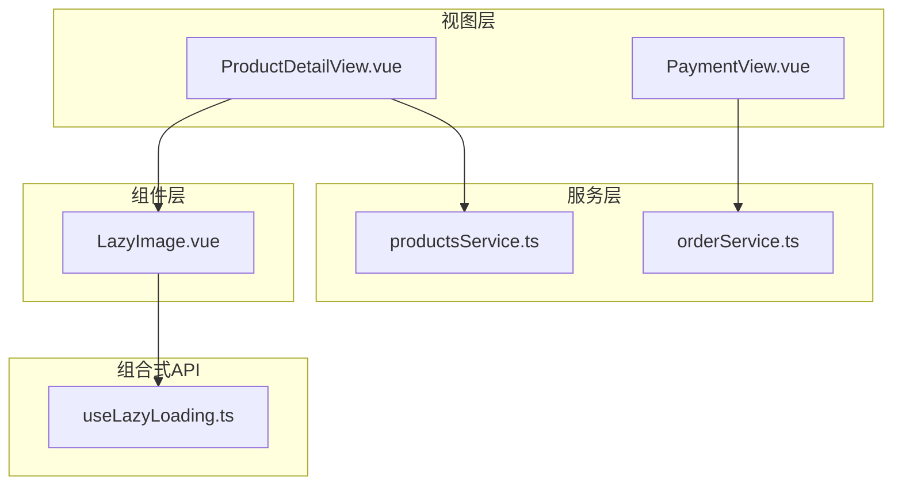
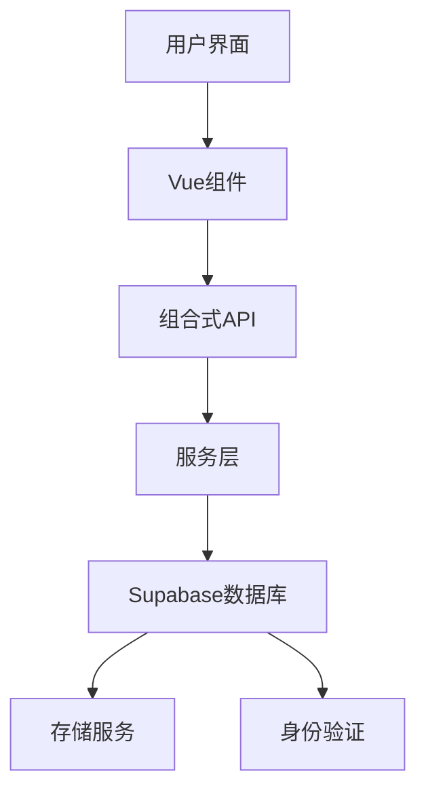
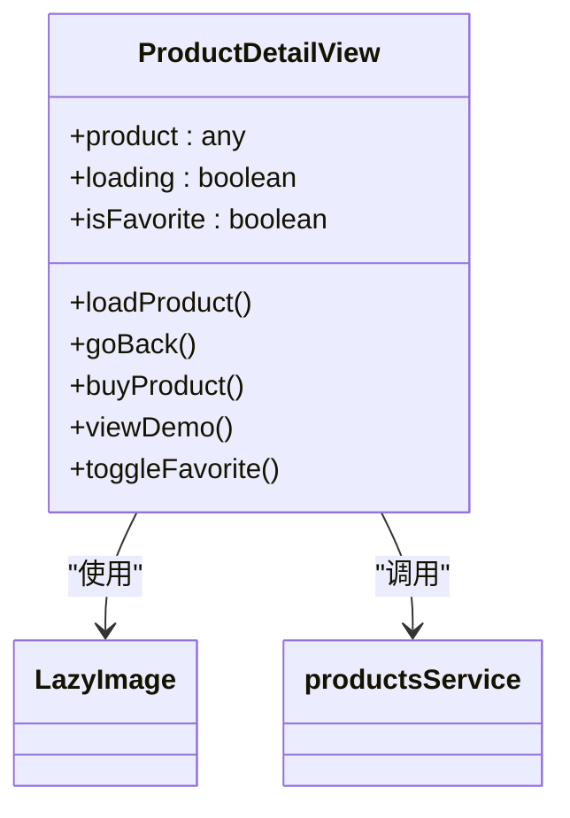
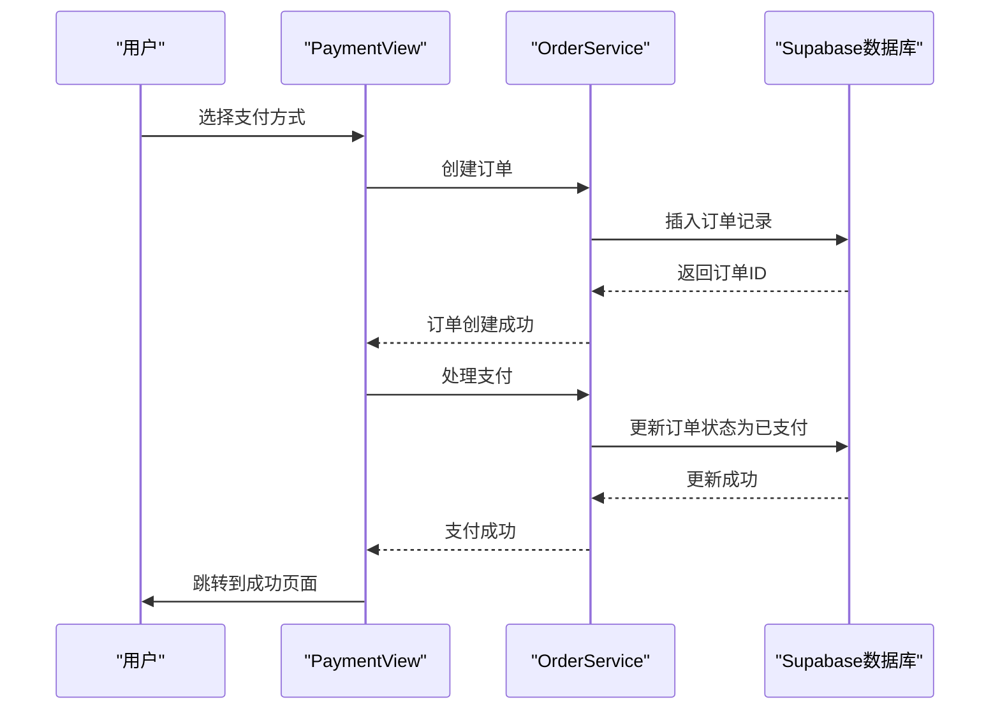
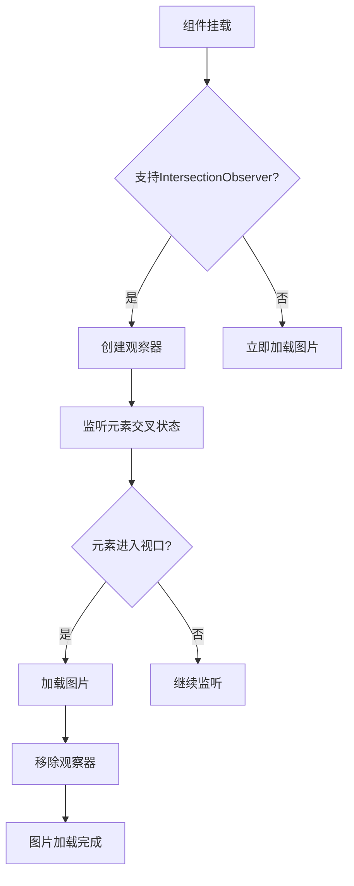
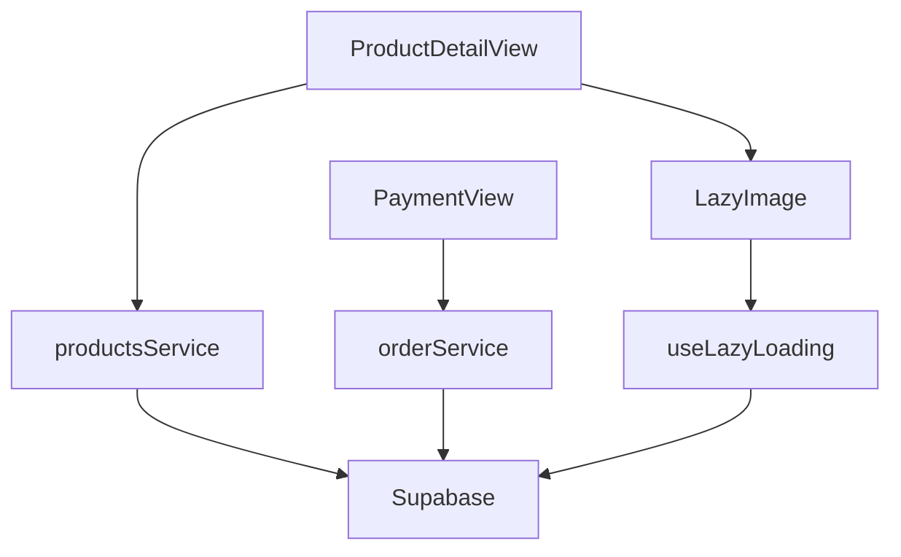

# 产品商城模块

<cite>
**本文档引用的文件**  
- [productsService.ts](file://src/services/productsService.ts)
- [orderService.ts](file://src/services/orderService.ts)
- [ProductDetailView.vue](file://src/views/ProductDetailView.vue)
- [PaymentView.vue](file://src/views/PaymentView.vue)
- [LazyImage.vue](file://src/components/common/LazyImage.vue)
- [useLazyLoading.ts](file://src/composables/useLazyLoading.ts)
- [supabase_complete_deploy.sql](file://scripts/database/supabase_complete_deploy.sql)
</cite>

## 目录
1. [简介](#简介)
2. [项目结构](#项目结构)
3. [核心组件](#核心组件)
4. [架构概述](#架构概述)
5. [详细组件分析](#详细组件分析)
6. [依赖分析](#依赖分析)
7. [性能考虑](#性能考虑)
8. [故障排除指南](#故障排除指南)
9. [结论](#结论)

## 简介
本文档全面文档化产品商城模块的业务流程与技术实现。详细描述商品列表渲染、详情页展示、加入购物车与支付流程（集成Supabase与第三方支付）的完整链路；说明订单创建、状态更新与支付结果回调的处理机制；结合productsService与orderService分析数据交互与事务一致性保障；展示商品图片懒加载、库存校验与价格计算等关键逻辑；提供“用户浏览商品并完成购买”的端到端流程图与调试日志示例；涵盖支付失败、库存不足等异常情况的处理方案与用户体验优化建议。

## 项目结构
产品商城模块的文件组织遵循功能划分原则，主要包含视图、服务、组件和组合式API。视图层负责页面展示，服务层处理业务逻辑与数据交互，通用组件提供可复用的UI元素，组合式API封装通用功能。

**图示来源**  
- [ProductDetailView.vue](file://src/views/ProductDetailView.vue)
- [PaymentView.vue](file://src/views/PaymentView.vue)
- [productsService.ts](file://src/services/productsService.ts)
- [orderService.ts](file://src/services/orderService.ts)
- [LazyImage.vue](file://src/components/common/LazyImage.vue)
- [useLazyLoading.ts](file://src/composables/useLazyLoading.ts)

## 核心组件
核心组件包括商品服务、订单服务、商品详情视图和支付视图。商品服务负责商品数据的获取与管理，订单服务处理订单创建、支付与状态更新，商品详情视图展示商品信息，支付视图处理支付流程。

**本节来源**  
- [productsService.ts](file://src/services/productsService.ts)
- [orderService.ts](file://src/services/orderService.ts)
- [ProductDetailView.vue](file://src/views/ProductDetailView.vue)
- [PaymentView.vue](file://src/views/PaymentView.vue)

## 架构概述
系统采用分层架构，前端通过Vue组件展示数据，通过组合式API实现懒加载等优化功能，服务层与Supabase数据库交互，处理业务逻辑。

**图示来源**  
- [ProductDetailView.vue](file://src/views/ProductDetailView.vue)
- [PaymentView.vue](file://src/views/PaymentView.vue)
- [productsService.ts](file://src/services/productsService.ts)
- [orderService.ts](file://src/services/orderService.ts)
- [useLazyLoading.ts](file://src/composables/useLazyLoading.ts)

## 详细组件分析
### 商品详情视图分析
商品详情视图负责展示商品的详细信息，包括名称、价格、描述和操作按钮。通过懒加载技术优化图片加载性能。

#### 组件结构

**图示来源**  
- [ProductDetailView.vue](file://src/views/ProductDetailView.vue)
- [LazyImage.vue](file://src/components/common/LazyImage.vue)
- [productsService.ts](file://src/services/productsService.ts)

### 支付流程分析
支付流程从用户选择支付方式开始，经过订单创建、支付处理，最终跳转到成功页面。

#### 支付流程

**图示来源**  
- [PaymentView.vue](file://src/views/PaymentView.vue)
- [orderService.ts](file://src/services/orderService.ts)

### 懒加载功能分析
懒加载功能通过Intersection Observer API实现，当图片进入视口时才加载，减少初始页面加载时间。

#### 懒加载流程

**图示来源**  
- [LazyImage.vue](file://src/components/common/LazyImage.vue)
- [useLazyLoading.ts](file://src/composables/useLazyLoading.ts)

## 依赖分析
系统依赖Supabase作为后端服务，提供数据库、存储和身份验证功能。前端通过服务层与Supabase交互，组合式API提供通用功能。

**图示来源**  
- [productsService.ts](file://src/services/productsService.ts)
- [orderService.ts](file://src/services/orderService.ts)
- [useLazyLoading.ts](file://src/composables/useLazyLoading.ts)

## 性能考虑
系统通过多种方式优化性能，包括图片懒加载、数据缓存和虚拟滚动。图片懒加载减少初始加载时间，数据缓存避免重复请求，虚拟滚动优化大列表渲染性能。

## 故障排除指南
常见问题包括支付失败、库存不足和图片加载失败。支付失败可能是网络问题或支付服务异常，库存不足需要检查商品库存逻辑，图片加载失败可通过重试机制解决。

**本节来源**  
- [orderService.ts](file://src/services/orderService.ts)
- [LazyImage.vue](file://src/components/common/LazyImage.vue)

## 结论
产品商城模块实现了完整的购物流程，从商品浏览到支付完成。通过合理的架构设计和性能优化，提供了良好的用户体验。未来可进一步优化支付流程，增加更多支付方式，并完善库存管理功能。