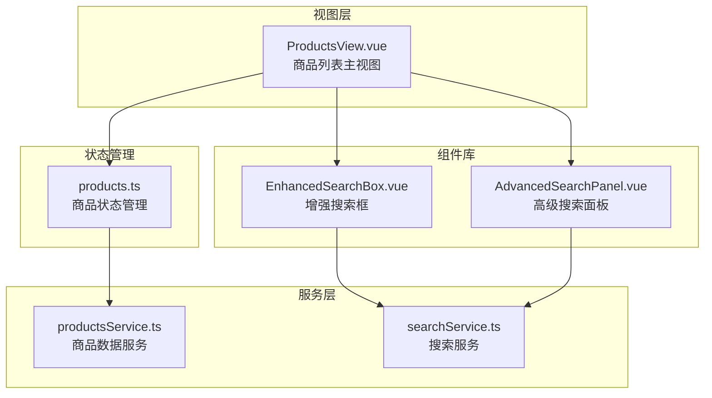
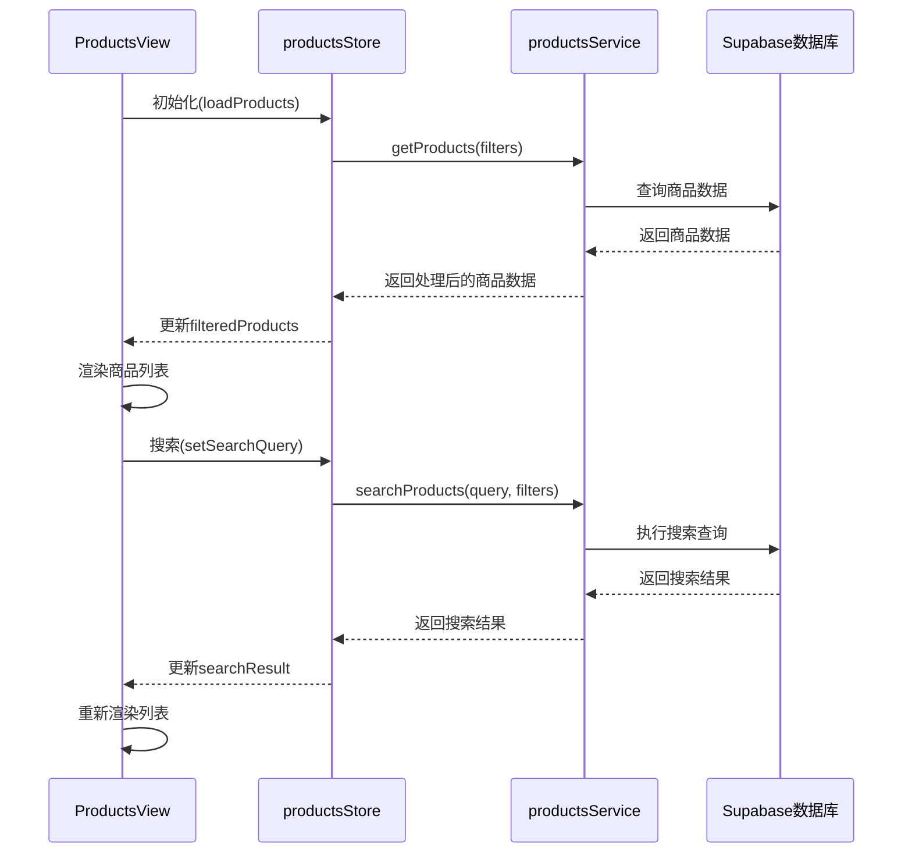
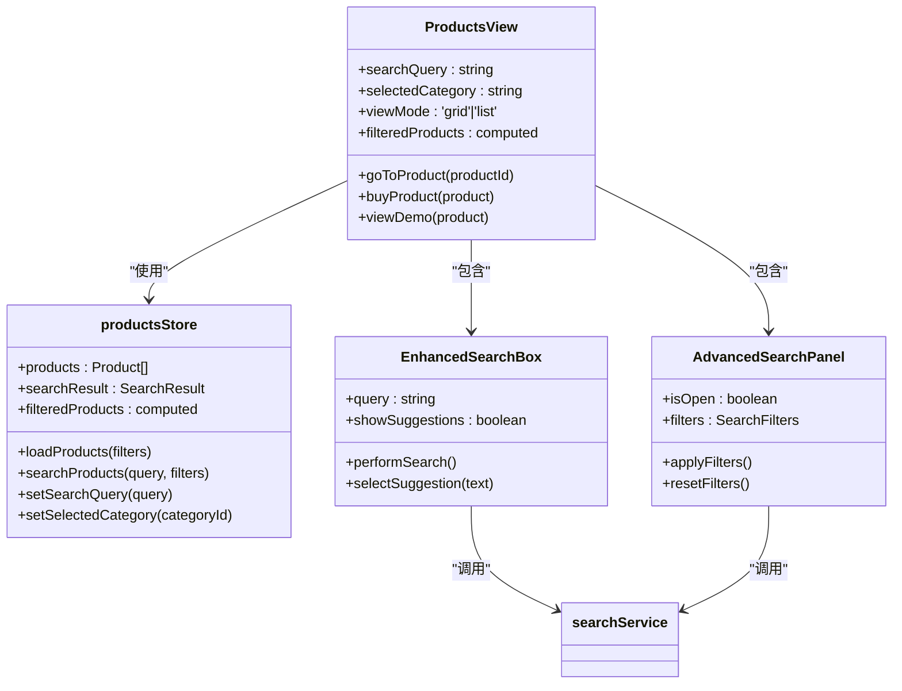
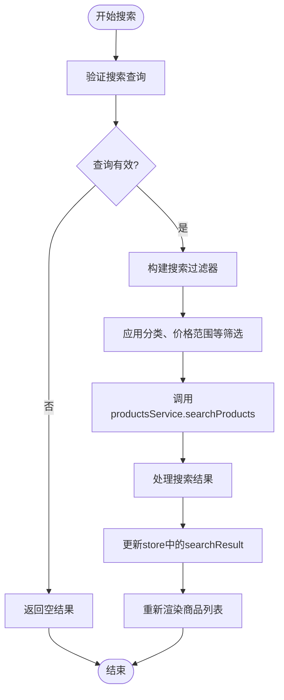
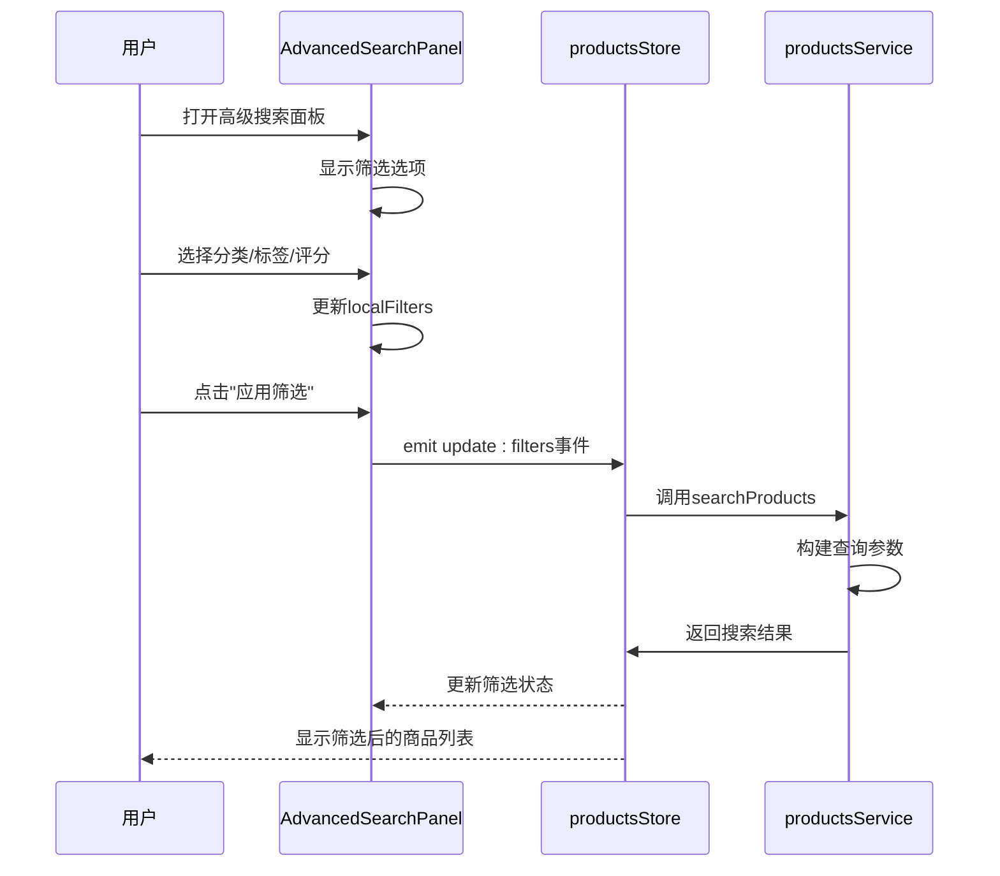
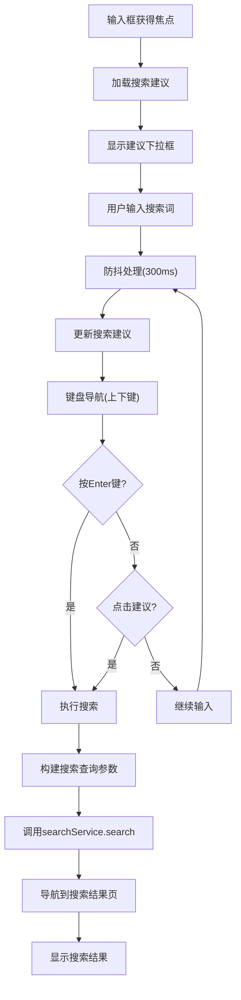
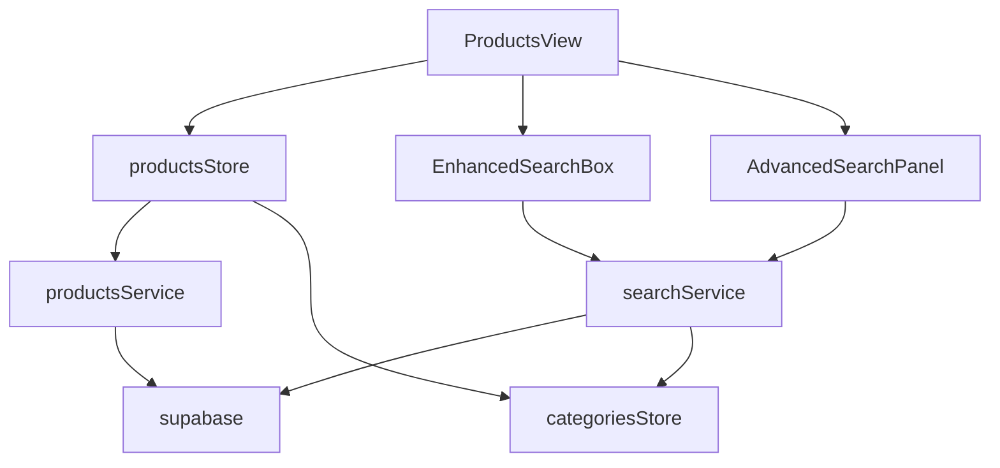
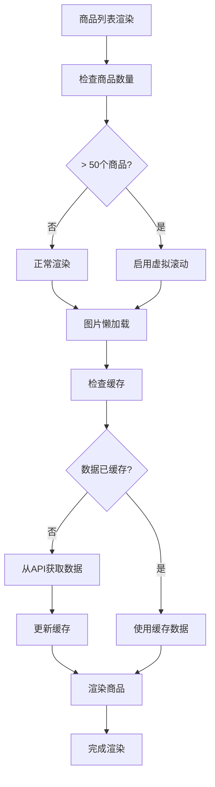
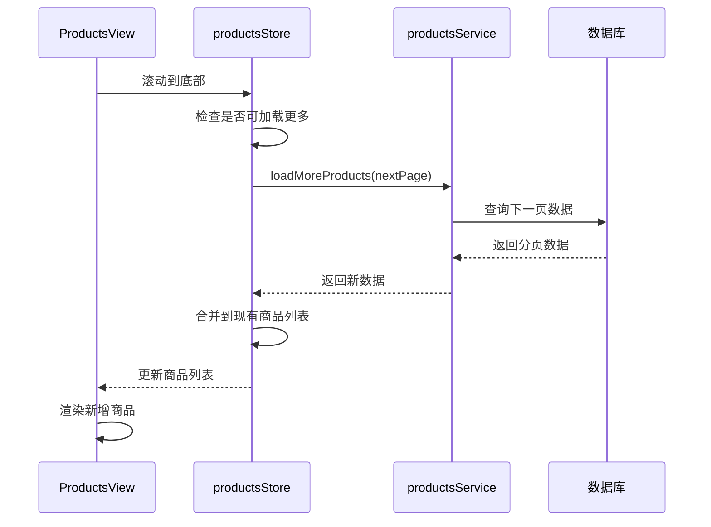

# 商品列表与浏览

<cite>
**本文档引用的文件**   
- [ProductsView.vue](file://src/views/ProductsView.vue)
- [productsService.ts](file://src/services/productsService.ts)
- [products.ts](file://src/stores/products.ts)
- [AdvancedSearchPanel.vue](file://src/components/search/AdvancedSearchPanel.vue)
- [EnhancedSearchBox.vue](file://src/components/search/EnhancedSearchBox.vue)
- [searchService.ts](file://src/services/searchService.ts)
</cite>

## 目录
1. [项目结构](#项目结构)
2. [核心组件](#核心组件)
3. [架构概述](#架构概述)
4. [详细组件分析](#详细组件分析)
5. [依赖分析](#依赖分析)
6. [性能考虑](#性能考虑)
7. [故障排除指南](#故障排除指南)
8. [结论](#结论)

## 项目结构

项目采用模块化架构，主要分为视图层、服务层、状态管理、组件库和工具服务。商品列表功能集中在`src/views/ProductsView.vue`中，通过Pinia进行状态管理，并与搜索组件深度集成。

**图源**
- [ProductsView.vue](file://src/views/ProductsView.vue)
- [products.ts](file://src/stores/products.ts)
- [productsService.ts](file://src/services/productsService.ts)
- [AdvancedSearchPanel.vue](file://src/components/search/AdvancedSearchPanel.vue)
- [EnhancedSearchBox.vue](file://src/components/search/EnhancedSearchBox.vue)
- [searchService.ts](file://src/services/searchService.ts)

**本节来源**
- [ProductsView.vue](file://src/views/ProductsView.vue)
- [products.ts](file://src/stores/products.ts)

## 核心组件

商品列表页面的核心组件包括`ProductsView.vue`作为主视图，`productsStore`进行状态管理，`productsService`提供数据服务，以及`AdvancedSearchPanel`和`EnhancedSearchBox`提供搜索功能。这些组件通过清晰的职责分离和良好的接口设计，实现了商品分类筛选、搜索集成、分页加载和响应式布局等功能。

**本节来源**
- [ProductsView.vue](file://src/views/ProductsView.vue#L1-L737)
- [products.ts](file://src/stores/products.ts#L1-L362)
- [productsService.ts](file://src/services/productsService.ts#L1-L339)

## 架构概述

商品列表页面采用典型的Vue 3组合式API架构，结合Pinia状态管理，实现了数据获取、状态管理和UI渲染的分离。页面通过productsStore统一管理商品数据状态，利用productsService与后端Supabase数据库交互，同时集成高级搜索组件提供复杂的筛选功能。

**图源**
- [ProductsView.vue](file://src/views/ProductsView.vue#L1-L737)
- [products.ts](file://src/stores/products.ts#L1-L362)
- [productsService.ts](file://src/services/productsService.ts#L1-L339)

## 详细组件分析

### ProductsView分析

`ProductsView.vue`是商品列表的主视图组件，负责UI渲染和用户交互。它通过Pinia store获取商品数据，并提供分类筛选、搜索和视图模式切换功能。

#### 组件交互逻辑

**图源**
- [ProductsView.vue](file://src/views/ProductsView.vue#L1-L737)
- [products.ts](file://src/stores/products.ts#L1-L362)
- [AdvancedSearchPanel.vue](file://src/components/search/AdvancedSearchPanel.vue#L1-L593)
- [EnhancedSearchBox.vue](file://src/components/search/EnhancedSearchBox.vue#L1-L799)

#### 搜索查询参数构建

**图源**
- [products.ts](file://src/stores/products.ts#L1-L362)
- [productsService.ts](file://src/services/productsService.ts#L1-L339)

**本节来源**
- [ProductsView.vue](file://src/views/ProductsView.vue#L1-L737)
- [products.ts](file://src/stores/products.ts#L1-L362)
- [productsService.ts](file://src/services/productsService.ts#L1-L339)
- [AdvancedSearchPanel.vue](file://src/components/search/AdvancedSearchPanel.vue#L1-L593)
- [EnhancedSearchBox.vue](file://src/components/search/EnhancedSearchBox.vue#L1-L799)

### 搜索组件分析

#### 高级搜索面板交互

**图源**
- [AdvancedSearchPanel.vue](file://src/components/search/AdvancedSearchPanel.vue#L1-L593)
- [products.ts](file://src/stores/products.ts#L1-L362)
- [productsService.ts](file://src/services/productsService.ts#L1-L339)

#### 增强搜索框工作流

**图源**
- [EnhancedSearchBox.vue](file://src/components/search/EnhancedSearchBox.vue#L1-L799)
- [searchService.ts](file://src/services/searchService.ts#L1-L652)

**本节来源**
- [AdvancedSearchPanel.vue](file://src/components/search/AdvancedSearchPanel.vue#L1-L593)
- [EnhancedSearchBox.vue](file://src/components/search/EnhancedSearchBox.vue#L1-L799)
- [searchService.ts](file://src/services/searchService.ts#L1-L652)

## 依赖分析

商品列表功能涉及多个组件和服务的协同工作，形成了清晰的依赖关系链。主视图依赖状态管理store，store依赖数据服务，搜索组件依赖搜索服务。

**图源**
- [ProductsView.vue](file://src/views/ProductsView.vue)
- [products.ts](file://src/stores/products.ts)
- [productsService.ts](file://src/services/productsService.ts)
- [searchService.ts](file://src/services/searchService.ts)
- [EnhancedSearchBox.vue](file://src/components/search/EnhancedSearchBox.vue)
- [AdvancedSearchPanel.vue](file://src/components/search/AdvancedSearchPanel.vue)

**本节来源**
- [products.ts](file://src/stores/products.ts#L1-L362)
- [productsService.ts](file://src/services/productsService.ts#L1-L339)
- [searchService.ts](file://src/services/searchService.ts#L1-L652)

## 性能考虑

### 数据渲染性能优化

商品列表页面可通过以下策略优化数据渲染性能：

1. **虚拟滚动**: 对于大量商品数据，实现虚拟滚动以减少DOM节点数量
2. **懒加载**: 图片和非关键组件采用懒加载策略
3. **缓存机制**: 利用Pinia store的状态缓存避免重复请求
4. **防抖处理**: 搜索输入采用防抖技术减少API调用频率

**图源**
- [products.ts](file://src/stores/products.ts#L1-L362)
- [productsService.ts](file://src/services/productsService.ts#L1-L339)

### 分页加载策略

**图源**
- [products.ts](file://src/stores/products.ts#L1-L362)
- [productsService.ts](file://src/services/productsService.ts#L1-L339)

## 故障排除指南

### 常见问题排查

#### 数据加载延迟
- **检查网络连接**: 确认Supabase API连接正常
- **查看控制台错误**: 检查是否有API调用错误
- **验证store状态**: 确认productsStore的loading状态正确更新
- **检查查询性能**: 优化数据库查询，添加适当索引

#### 筛选逻辑错误
- **验证过滤器参数**: 确认传递给服务的筛选参数正确
- **检查计算属性**: 验证filteredProducts计算属性的逻辑
- **调试搜索服务**: 确认searchService构建的查询条件正确
- **查看数据库响应**: 验证后端返回的数据是否符合预期

#### 用户体验优化建议
1. **添加加载状态**: 在数据加载时显示骨架屏或加载动画
2. **优化搜索响应**: 实现搜索防抖，避免频繁API调用
3. **提供空状态提示**: 当无搜索结果时显示友好的提示信息
4. **增强交互反馈**: 为按钮点击等操作提供视觉反馈
5. **优化移动端体验**: 确保在小屏幕上布局合理，操作便捷

**本节来源**
- [ProductsView.vue](file://src/views/ProductsView.vue#L1-L737)
- [products.ts](file://src/stores/products.ts#L1-L362)
- [productsService.ts](file://src/services/productsService.ts#L1-L339)
- [searchService.ts](file://src/services/searchService.ts#L1-L652)

## 结论

商品列表页面通过清晰的架构设计和组件化开发，实现了高效的商品展示和搜索功能。ProductsView作为主视图，通过Pinia store统一管理状态，与productsService和searchService协同工作，提供了流畅的用户体验。通过虚拟滚动、懒加载等性能优化策略，确保了在大量数据下的良好性能表现。未来可进一步优化搜索算法，增强个性化推荐功能，提升用户发现商品的效率。