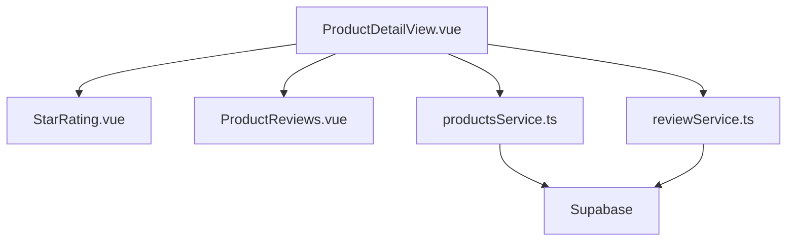
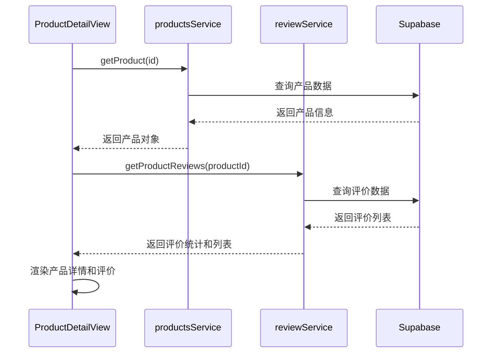
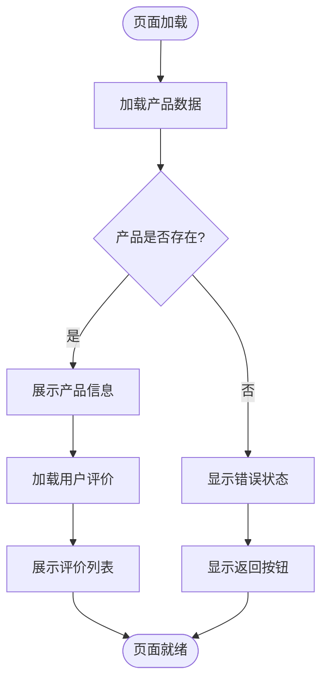
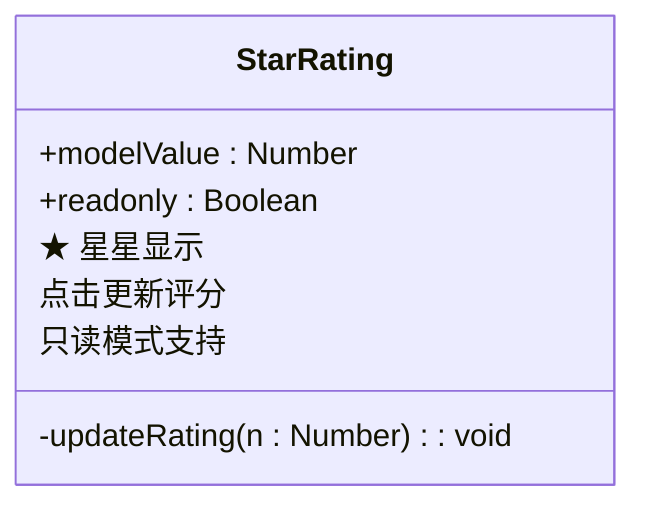
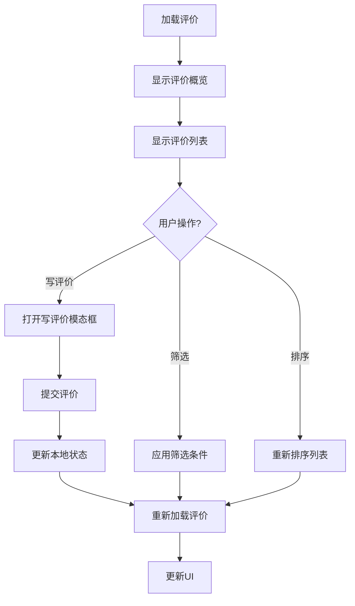
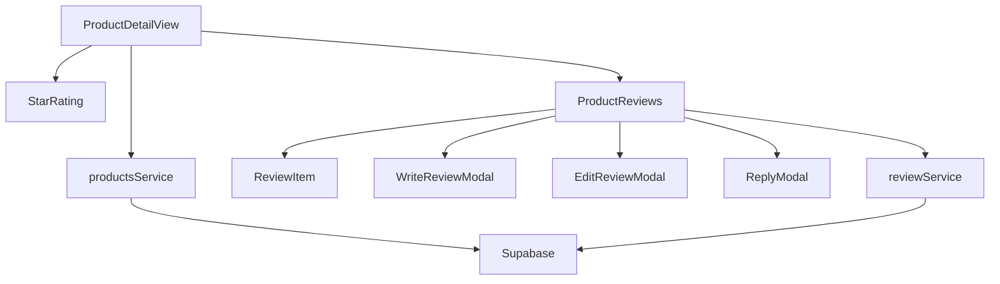

# 商品详情页展示

<cite>
**本文档引用的文件**
- [ProductDetailView.vue](file://src/views/ProductDetailView.vue)
- [StarRating.vue](file://src/components/ui/StarRating.vue)
- [ProductReviews.vue](file://src/components/reviews/ProductReviews.vue)
- [productsService.ts](file://src/services/productsService.ts)
- [reviewService.ts](file://src/services/reviewService.ts)
</cite>

## 目录
1. [介绍](#介绍)
2. [项目结构](#项目结构)
3. [核心组件](#核心组件)
4. [架构概览](#架构概览)
5. [详细组件分析](#详细组件分析)
6. [依赖分析](#依赖分析)
7. [性能考虑](#性能考虑)
8. [故障排除指南](#故障排除指南)
9. [结论](#结论)

## 介绍
本项目实现了一个完整的商品详情页展示系统，包含产品信息展示、评分系统、用户评价列表与提交功能。页面通过 `ProductDetailView.vue` 作为主视图组件，协调多个子组件完成内容聚合，并与后端服务进行数据交互。

## 项目结构

**图示来源**
- [ProductDetailView.vue](file://src/views/ProductDetailView.vue#L1-L501)
- [productsService.ts](file://src/services/productsService.ts#L1-L340)

**本节来源**
- [ProductDetailView.vue](file://src/views/ProductDetailView.vue#L1-L501)

## 核心组件

该页面的核心功能由 `ProductDetailView.vue` 实现，负责加载和展示商品基本信息，同时集成评分系统和用户评价功能。页面采用响应式设计，支持移动端和桌面端访问。

**本节来源**
- [ProductDetailView.vue](file://src/views/ProductDetailView.vue#L25-L100)

## 架构概览

**图示来源**
- [ProductDetailView.vue](file://src/views/ProductDetailView.vue#L150-L200)
- [productsService.ts](file://src/services/productsService.ts#L50-L80)
- [reviewService.ts](file://src/services/reviewService.ts#L30-L60)

## 详细组件分析

### 产品详情组件分析

`ProductDetailView.vue` 是商品详情页的主视图组件，负责协调各个子组件完成页面内容的展示。

#### 组件交互流程

**图示来源**
- [ProductDetailView.vue](file://src/views/ProductDetailView.vue#L150-L250)

**本节来源**
- [ProductDetailView.vue](file://src/views/ProductDetailView.vue#L1-L501)

### 评分系统分析

`StarRating.vue` 组件实现了星级评分功能，支持只读模式和可编辑模式。

**图示来源**
- [StarRating.vue](file://src/components/ui/StarRating.vue#L1-L55)

**本节来源**
- [StarRating.vue](file://src/components/ui/StarRating.vue#L1-L55)

### 评价系统分析

`ProductReviews.vue` 组件实现了完整的用户评价功能，包括评价列表展示、筛选、排序和提交。

#### 评价功能流程

**图示来源**
- [ProductReviews.vue](file://src/components/reviews/ProductReviews.vue#L1-L611)

**本节来源**
- [ProductReviews.vue](file://src/components/reviews/ProductReviews.vue#L1-L611)

## 依赖分析

**图示来源**
- [ProductDetailView.vue](file://src/views/ProductDetailView.vue#L1-L501)
- [ProductReviews.vue](file://src/components/reviews/ProductReviews.vue#L1-L611)
- [productsService.ts](file://src/services/productsService.ts#L1-L340)
- [reviewService.ts](file://src/services/reviewService.ts#L1-L200)

**本节来源**
- [ProductDetailView.vue](file://src/views/ProductDetailView.vue#L1-L501)
- [ProductReviews.vue](file://src/components/reviews/ProductReviews.vue#L1-L611)

## 性能考虑

商品详情页通过以下方式优化性能：
- 使用懒加载技术减少初始加载时间
- 对产品数据和评价数据进行分页加载
- 在服务层实现数据缓存机制
- 使用 CDN 加速静态资源加载

**本节来源**
- [productsService.ts](file://src/services/productsService.ts#L50-L80)
- [reviewService.ts](file://src/services/reviewService.ts#L30-L60)

## 故障排除指南

### 常见问题及解决方案

| 问题现象 | 可能原因 | 解决方案 |
|---------|--------|--------|
| 产品信息加载失败 | 网络问题或产品ID无效 | 检查网络连接，确认产品ID正确 |
| 评价无法提交 | 用户未登录或内容审核失败 | 确保用户已登录，检查评价内容是否符合规范 |
| 页面加载缓慢 | 网络延迟或资源过大 | 检查网络状况，优化图片大小 |

**本节来源**
- [ProductDetailView.vue](file://src/views/ProductDetailView.vue#L300-L350)
- [productsService.ts](file://src/services/productsService.ts#L100-L150)

## 结论

商品详情页通过 `ProductDetailView.vue` 组件协调多个子组件，实现了完整的产品信息展示和用户评价功能。系统与 `productsService` 和 `reviewService` 服务进行数据交互，确保数据的一致性和实时性。通过合理的架构设计和性能优化，提供了良好的用户体验。