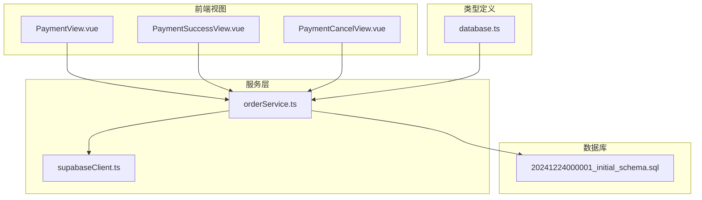
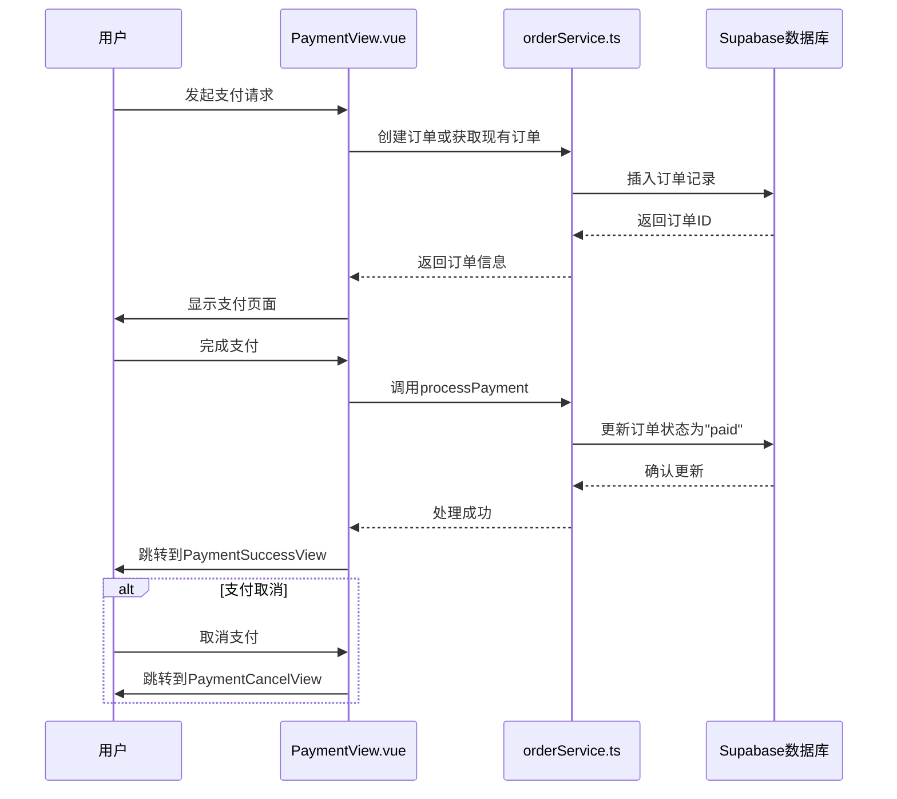
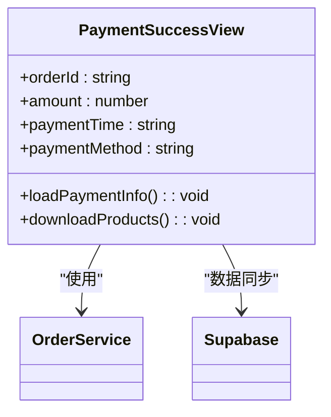
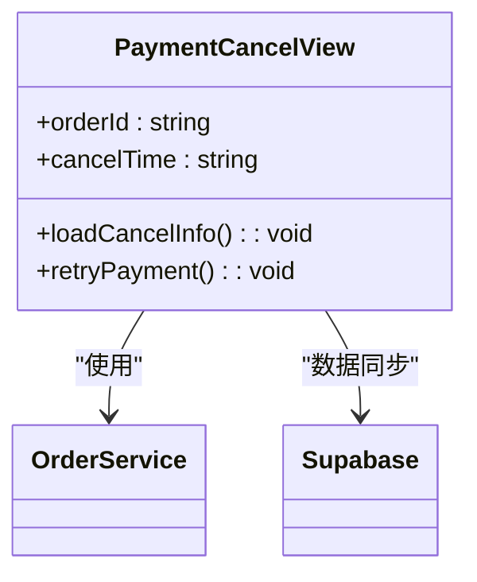
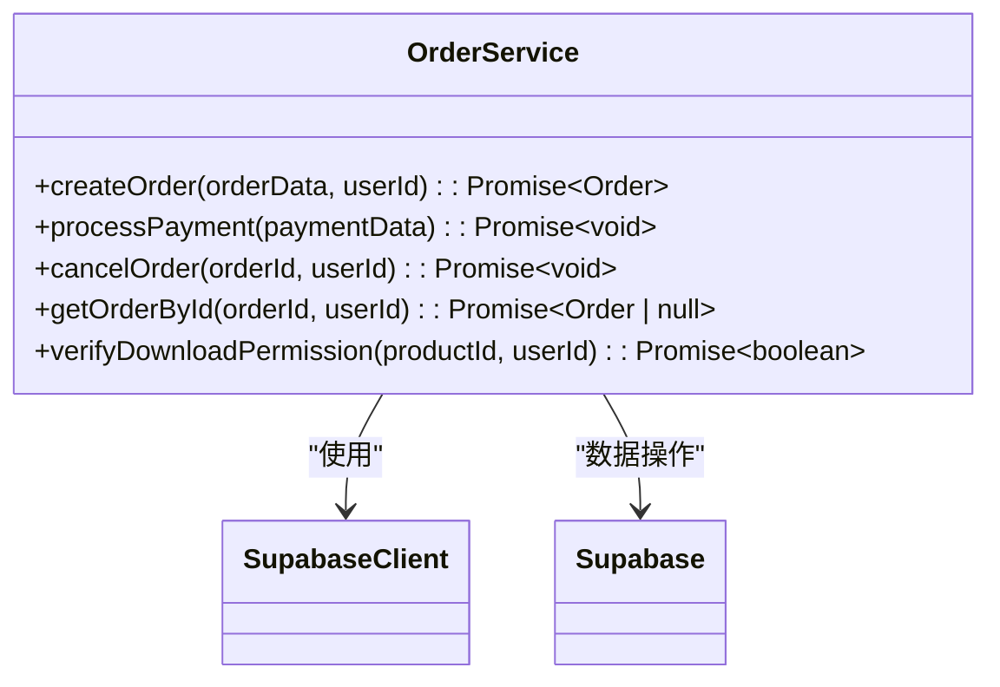
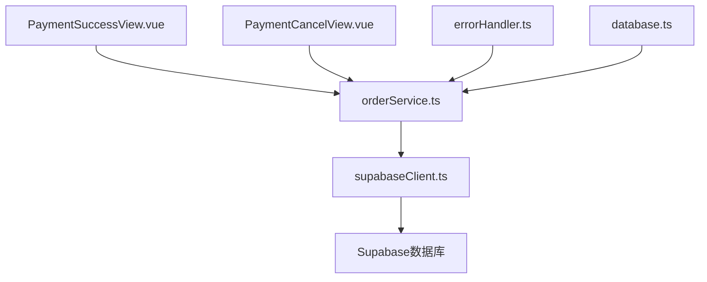

# 支付集成与结果处理

<cite>
**本文档引用的文件**
- [PaymentSuccessView.vue](file://src/views/PaymentSuccessView.vue)
- [PaymentCancelView.vue](file://src/views/PaymentCancelView.vue)
- [orderService.ts](file://src/services/orderService.ts)
- [supabaseClient.ts](file://src/lib/supabaseClient.ts)
- [database.ts](file://src/types/database.ts)
- [errorHandler.ts](file://src/utils/errorHandler.ts)
- [20241224000001_initial_schema.sql](file://supabase/migrations/20241224000001_initial_schema.sql)
</cite>

## 目录
1. [简介](#简介)
2. [项目结构](#项目结构)
3. [核心组件](#核心组件)
4. [架构概述](#架构概述)
5. [详细组件分析](#详细组件分析)
6. [依赖分析](#依赖分析)
7. [性能考虑](#性能考虑)
8. [故障排除指南](#故障排除指南)
9. [结论](#结论)

## 简介
本文档系统化地记录了支付结果回调的处理机制，涵盖成功、取消与失败三种状态的前端响应策略。文档详细说明了 PaymentSuccessView 和 PaymentCancelView 如何接收并验证支付网关返回的参数，通过 orderService 更新订单状态并同步至 Supabase 数据库。同时描述了支付状态轮询或 Webhook 验证的可选实现方式，确保数据一致性。提供了支付调试日志记录方法、错误码映射表及用户友好提示文案设计建议。包含对重复通知处理、超时订单关闭等边缘情况的应对策略，并指导如何利用 Supabase 函数增强后端验证。

## 项目结构
项目结构清晰地组织了前端组件、服务、类型定义和数据库迁移文件。支付相关视图位于 `src/views` 目录下，包括 `PaymentView.vue`、`PaymentSuccessView.vue` 和 `PaymentCancelView.vue`。服务层位于 `src/services` 目录，其中 `orderService.ts` 负责订单和支付的业务逻辑。类型定义在 `src/types` 目录中，数据库迁移脚本位于 `supabase/migrations` 目录。

**Diagram sources**
- [PaymentSuccessView.vue](file://src/views/PaymentSuccessView.vue)
- [PaymentCancelView.vue](file://src/views/PaymentCancelView.vue)

**Section sources**
- [PaymentSuccessView.vue](file://src/views/PaymentSuccessView.vue)
- [PaymentCancelView.vue](file://src/views/PaymentCancelView.vue)
- [orderService.ts](file://src/services/orderService.ts)

## 核心组件
核心组件包括 `PaymentSuccessView.vue` 和 `PaymentCancelView.vue`，它们分别处理支付成功和取消的场景。这些组件通过路由参数接收订单信息，并使用 `orderService` 更新订单状态。`orderService.ts` 提供了处理支付、取消订单和获取订单详情的方法，确保与 Supabase 数据库的同步。

**Section sources**
- [PaymentSuccessView.vue](file://src/views/PaymentSuccessView.vue#L0-L444)
- [PaymentCancelView.vue](file://src/views/PaymentCancelView.vue#L0-L382)
- [orderService.ts](file://src/services/orderService.ts#L0-L590)

## 架构概述
系统架构采用前后端分离的设计，前端通过 Vue.js 构建用户界面，后端使用 Supabase 作为数据库和身份验证服务。支付流程从 `PaymentView.vue` 开始，用户选择支付方式并提交支付请求。支付成功后，跳转到 `PaymentSuccessView.vue`，显示支付成功信息并提供下载产品等后续操作。如果支付被取消，则跳转到 `PaymentCancelView.vue`，提示用户支付已取消并提供重新支付的选项。

**Diagram sources**
- [PaymentView.vue](file://src/views/PaymentView.vue)
- [orderService.ts](file://src/services/orderService.ts)
- [20241224000001_initial_schema.sql](file://supabase/migrations/20241224000001_initial_schema.sql)

## 详细组件分析
### PaymentSuccessView 分析
`PaymentSuccessView.vue` 负责展示支付成功后的信息，包括订单号、支付金额、支付时间和支付方式。该组件通过路由参数获取订单信息，并在页面加载时调用 `loadPaymentInfo` 方法初始化数据。用户可以在此页面下载购买的产品或查看订单详情。

#### 组件结构

**Diagram sources**
- [PaymentSuccessView.vue](file://src/views/PaymentSuccessView.vue#L0-L444)

### PaymentCancelView 分析
`PaymentCancelView.vue` 处理支付取消的场景，显示订单号和取消时间，并提供重新支付的选项。该组件通过路由参数获取订单信息，并在页面加载时调用 `loadCancelInfo` 方法初始化数据。用户可以选择重新支付或继续购物。

#### 组件结构

**Diagram sources**
- [PaymentCancelView.vue](file://src/views/PaymentCancelView.vue#L0-L382)

### OrderService 分析
`orderService.ts` 是处理订单和支付的核心服务，提供了创建订单、处理支付、取消订单和获取订单详情的方法。该服务通过 Supabase 客户端与数据库交互，确保数据的一致性和完整性。

#### 服务方法

**Diagram sources**
- [orderService.ts](file://src/services/orderService.ts#L0-L590)

**Section sources**
- [orderService.ts](file://src/services/orderService.ts#L0-L590)

## 依赖分析
系统依赖于 Supabase 作为后端服务，提供数据库、身份验证和实时功能。前端使用 Vue.js 框架构建用户界面，通过 Vue Router 实现页面导航。`orderService.ts` 依赖于 `supabaseClient.ts` 进行数据库操作，而视图组件依赖于 `orderService.ts` 获取和更新订单状态。

**Diagram sources**
- [orderService.ts](file://src/services/orderService.ts)
- [supabaseClient.ts](file://src/lib/supabaseClient.ts)

**Section sources**
- [orderService.ts](file://src/services/orderService.ts)
- [supabaseClient.ts](file://src/lib/supabaseClient.ts)

## 性能考虑
为了提高性能，系统采用了以下策略：
- 使用 Supabase 的实时功能，减少不必要的轮询。
- 在前端缓存订单信息，避免重复请求。
- 使用指数退避重试机制处理网络错误，提高系统的稳定性。
- 通过索引优化数据库查询性能，特别是在订单和支付表上。

## 故障排除指南
### 常见问题
- **支付成功但状态未更新**：检查 `processPayment` 方法是否正确调用，确保 Supabase 更新操作成功。
- **支付取消后无法重新支付**：确认 `retryPayment` 方法正确传递订单参数。
- **订单信息加载失败**：检查网络连接，确保 Supabase 客户端配置正确。

### 错误码映射
| 错误码 | 描述 | 解决方案 |
| --- | --- | --- |
| BAD_REQUEST | 请求参数错误 | 检查请求参数是否完整 |
| UNAUTHORIZED | 未授权访问 | 重新登录 |
| NOT_FOUND | 数据不存在 | 检查订单ID是否正确 |
| DATABASE_ERROR | 数据库操作失败 | 检查数据库连接 |

**Section sources**
- [errorHandler.ts](file://src/utils/errorHandler.ts)
- [orderService.ts](file://src/services/orderService.ts)

## 结论
本文档详细记录了支付结果回调的处理机制，涵盖了从前端响应到后端验证的完整流程。通过 `PaymentSuccessView` 和 `PaymentCancelView` 组件，系统能够有效地处理支付成功和取消的场景。`orderService.ts` 提供了可靠的订单管理功能，确保与 Supabase 数据库的同步。未来可以考虑引入 Webhook 验证机制，进一步提高支付状态的可靠性。