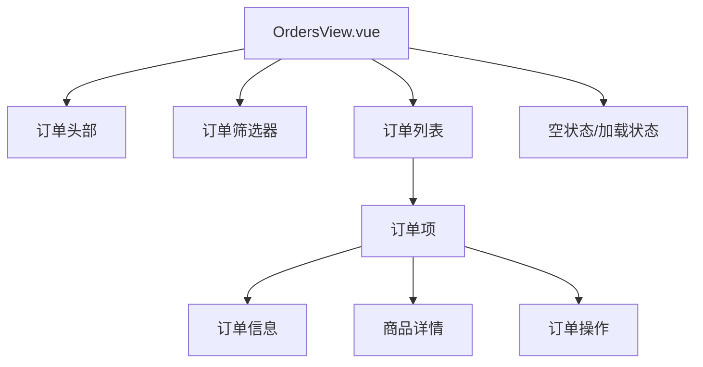
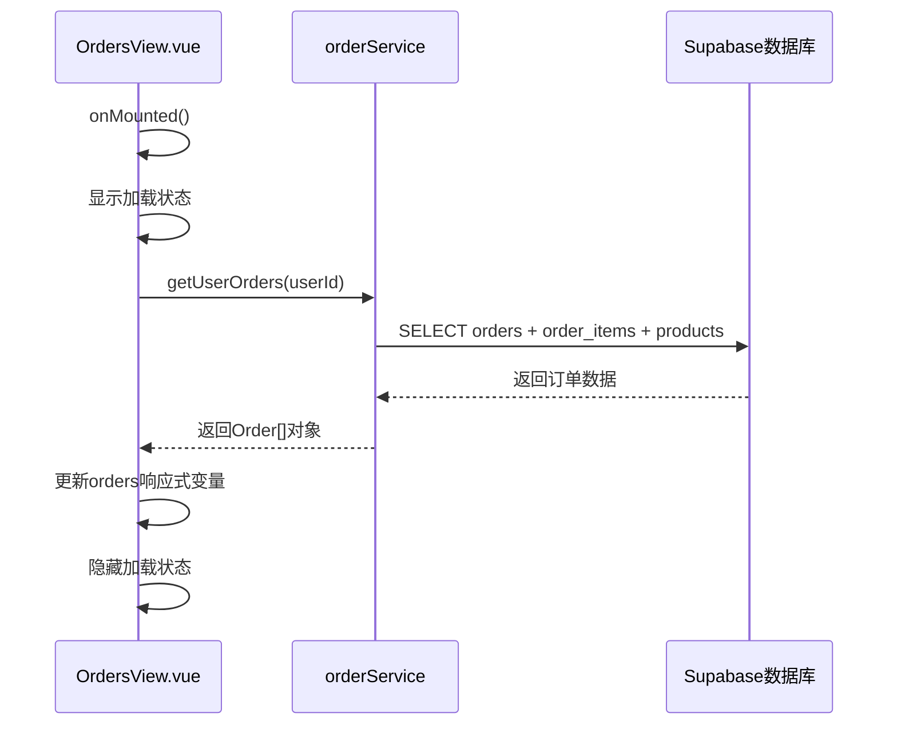
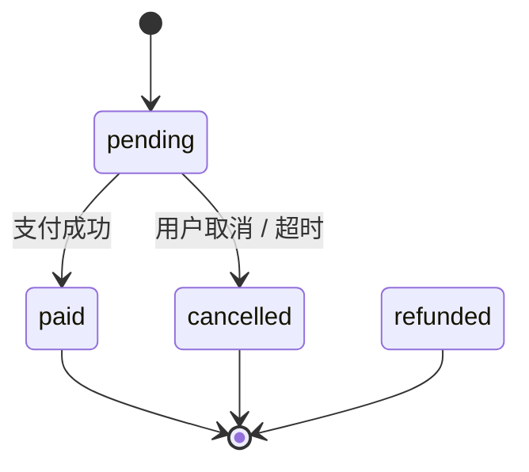
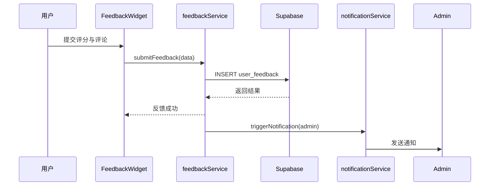

# 订单管理与用户反馈

<cite>
**本文档引用的文件**  
- [OrdersView.vue](file://src/views/user/OrdersView.vue)
- [orderService.ts](file://src/services/orderService.ts)
- [FeedbackWidget.vue](file://src/components/feedback/FeedbackWidget.vue)
- [feedbackService.ts](file://src/services/feedbackService.ts)
</cite>

## 目录
1. [简介](#简介)
2. [订单管理界面结构](#订单管理界面结构)
3. [订单数据获取与状态过滤](#订单数据获取与状态过滤)
4. [订单状态机与生命周期管理](#订单状态机与生命周期管理)
5. [用户反馈机制集成](#用户反馈机制集成)
6. [数据隐私与敏感信息处理](#数据隐私与敏感信息处理)
7. [扩展建议](#扩展建议)

## 简介
本系统为用户提供完整的订单管理功能，包括订单列表展示、状态追踪、历史记录查询及用户反馈提交。用户可通过“我的订单”界面查看所有订单，按状态筛选，并对已完成订单进行反馈。系统通过 `OrdersView.vue` 组件与 `orderService` 服务交互获取数据，集成 `FeedbackWidget` 组件实现反馈功能，并通过 `feedbackService` 将数据持久化。

## 订单管理界面结构

**图示来源**  
- [OrdersView.vue](file://src/views/user/OrdersView.vue#L1-L742)

**本节来源**  
- [OrdersView.vue](file://src/views/user/OrdersView.vue#L1-L742)

## 订单数据获取与状态过滤

### 数据加载流程
`OrdersView.vue` 在组件挂载时调用 `loadOrders` 方法，通过 `orderService.getUserOrders()` 获取当前用户的所有订单数据。该方法首先检查用户登录状态，然后向后端发起请求获取真实订单数据，若失败则使用模拟数据作为后备。

### 状态过滤机制
界面提供五种状态过滤选项：全部订单、待支付、已支付、已取消、已退款。通过 `activeFilter` 响应式变量控制当前筛选状态，并利用 `computed` 属性 `filteredOrders` 实时计算符合条件的订单列表。

### 分页与性能优化
虽然当前实现未包含分页逻辑，但 `orderService` 已为管理员接口预留分页参数（`page` 和 `limit`），可扩展实现用户端分页加载，提升大数据量下的性能表现。

**图示来源**  
- [OrdersView.vue](file://src/views/user/OrdersView.vue#L300-L350)
- [orderService.ts](file://src/services/orderService.ts#L150-L190)

**本节来源**  
- [OrdersView.vue](file://src/views/user/OrdersView.vue#L300-L350)
- [orderService.ts](file://src/services/orderService.ts#L150-L190)

## 订单状态机与生命周期管理

### 订单状态定义
系统定义了四种核心订单状态：
- `pending`：待支付
- `paid`：已支付
- `cancelled`：已取消
- `refunded`：已退款

### 状态转换规则
| 当前状态 | 可执行操作 | 目标状态 | 触发条件 |
|---------|-----------|---------|--------|
| pending | 支付 | paid | 用户完成支付 |
| pending | 取消订单 | cancelled | 用户主动取消 |
| paid | 下载产品 | - | 权限验证通过 |
| * | 管理员更新 | any | 管理员操作 |

### 自动过期处理机制
系统暂未实现自动过期逻辑，但可通过以下方式扩展：
1. 设置待支付订单有效期（如30分钟）
2. 使用数据库定时任务或云函数扫描超时订单
3. 将超时订单状态自动更新为 `cancelled`
4. 释放库存并通知用户

**图示来源**  
- [orderService.ts](file://src/services/orderService.ts#L50-L70)
- [OrdersView.vue](file://src/views/user/OrdersView.vue#L550-L570)

**本节来源**  
- [orderService.ts](file://src/services/orderService.ts#L50-L70)
- [OrdersView.vue](file://src/views/user/OrdersView.vue#L550-L570)

## 用户反馈机制集成

### 反馈组件集成
`OrdersView.vue` 虽未直接引入 `FeedbackWidget`，但其设计支持在订单详情中集成反馈功能。`FeedbackWidget.vue` 组件可被注入到已完成订单的操作区域，允许用户提交评分与评论。

### 反馈数据持久化
`feedbackService` 提供反馈数据的存储接口，通过 Supabase 将用户反馈写入 `user_feedback` 表。关键字段包括：
- `user_id`：用户标识
- `order_id`：关联订单
- `rating`：评分（1-5）
- `comment`：文字反馈
- `created_at`：提交时间

### 通知触发机制
当用户提交反馈后，系统可通过 Supabase 的 Realtime 功能或数据库触发器通知管理员。`notificationService` 可接收事件并推送站内通知或邮件提醒。

**图示来源**  
- [feedbackService.ts](file://src/services/feedbackService.ts)
- [FeedbackWidget.vue](file://src/components/feedback/FeedbackWidget.vue)

**本节来源**  
- [feedbackService.ts](file://src/services/feedbackService.ts)
- [FeedbackWidget.vue](file://src/components/feedback/FeedbackWidget.vue)

## 数据隐私与敏感信息处理

### 敏感信息脱敏策略
- **订单号显示**：仅显示后8位大写字母数字组合（`order.id.slice(-8).toUpperCase()`）
- **用户信息**：订单详情中不展示用户完整联系方式
- **支付信息**：前端不存储支付密码或完整卡号
- **地址信息**：账单地址仅在订单详情中展示，且不公开于列表

### 权限控制机制
- 所有订单查询均需验证 `user_id` 匹配
- 使用 Supabase 的 RLS（行级安全策略）确保用户只能访问自己的订单
- 管理员接口需额外验证角色权限

### 数据传输安全
- 所有 API 通信通过 HTTPS 加密
- 使用 Supabase 的 JWT 认证机制
- 敏感操作（如取消订单）需二次确认

**本节来源**  
- [orderService.ts](file://src/services/orderService.ts#L150-L190)
- [OrdersView.vue](file://src/views/user/OrdersView.vue#L120-L130)

## 扩展建议

### 订单数据分析
可基于现有订单数据构建分析系统：
- 用户购买行为分析
- 热门商品趋势预测
- 支付方式偏好统计
- 订单转化漏斗分析

### 自动化工作流
- 实现订单超时自动取消
- 支付成功后自动发送下载链接邮件
- 定期生成销售报表并导出
- 异常订单自动标记与预警

### 用户体验优化
- 添加订单搜索功能
- 支持多页分页加载
- 提供订单导出为PDF功能
- 增加订单分享与社交功能

### 反馈数据分析
- 情感分析用户评论
- 自动生成反馈摘要报告
- 识别高频问题并优化产品
- 建立用户满意度评分体系

**本节来源**  
- [orderService.ts](file://src/services/orderService.ts)
- [OrdersView.vue](file://src/views/user/OrdersView.vue)