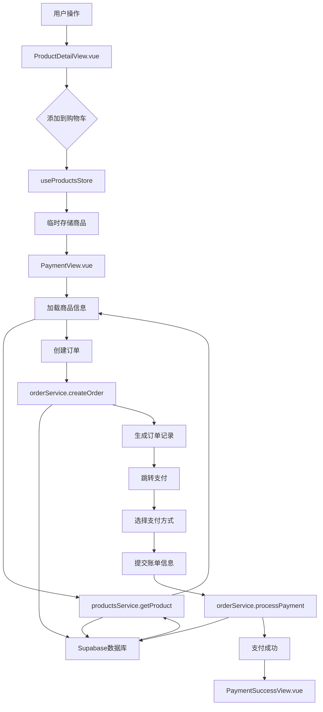
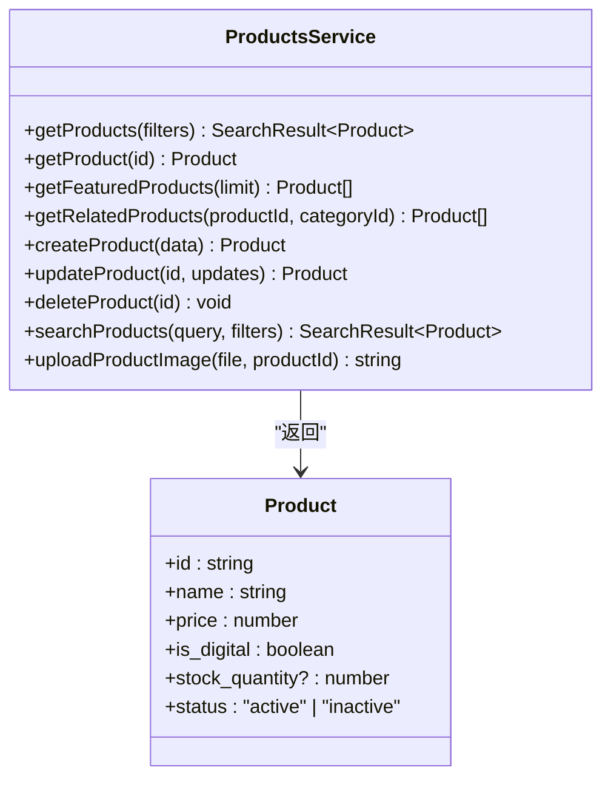
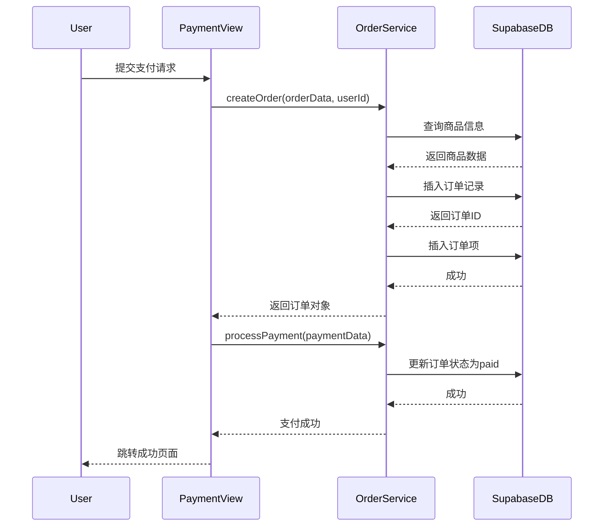
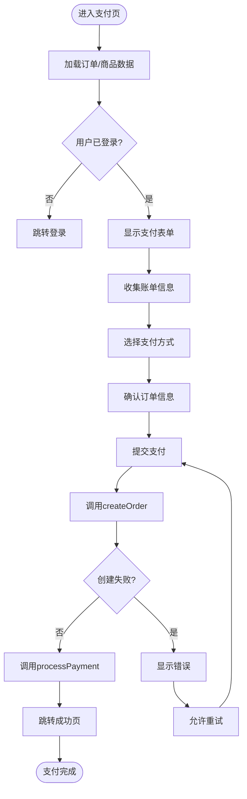

# 购物车与下单流程

<cite>
**本文档引用文件**  
- [products.ts](file://src/stores/products.ts)
- [productsService.ts](file://src/services/productsService.ts)
- [orderService.ts](file://src/services/orderService.ts)
- [PaymentView.vue](file://src/views/PaymentView.vue)
- [index.ts](file://src/types/index.ts)
</cite>

## 目录
1. [简介](#简介)
2. [项目结构](#项目结构)
3. [核心组件](#核心组件)
4. [架构概览](#架构概览)
5. [详细组件分析](#详细组件分析)
6. [依赖分析](#依赖分析)
7. [性能考虑](#性能考虑)
8. [故障排除指南](#故障排除指南)
9. [结论](#结论)

## 简介
本文档全面阐述了从商品添加到购物车、生成订单直至进入支付页面的完整业务链路。重点说明前端如何通过 store 管理临时购物车状态，调用 `productsService` 校验库存与价格，使用 `orderService` 创建订单记录并生成支付会话。解析 `PaymentView.vue` 中支付流程的初始化逻辑，包括订单信息确认、用户身份验证与第三方支付接口对接准备。同时提供订单幂等性处理、并发下单控制的技术方案，并结合实际代码展示关键事务的异常捕获与回滚机制。最后包含对敏感信息加密传输、CSRF 防护等安全实践的说明。

## 项目结构
项目采用典型的 Vue 3 + Pinia + TypeScript 架构，结合 Supabase 作为后端服务。主要目录结构如下：
- `src/components`：通用 UI 组件
- `src/services`：业务逻辑服务层，封装 API 调用
- `src/stores`：Pinia 状态管理，维护全局状态
- `src/views`：页面级组件，如支付页、订单页
- `src/types`：类型定义文件，统一接口结构
- `src/lib`：Supabase 客户端初始化配置

购物车与下单相关的核心模块集中在 `productsService`、`orderService` 和 `productsStore` 中，支付流程由 `PaymentView.vue` 驱动。

**Section sources**
- [products.ts](file://src/stores/products.ts)
- [productsService.ts](file://src/services/productsService.ts)
- [orderService.ts](file://src/services/orderService.ts)
- [PaymentView.vue](file://src/views/PaymentView.vue)

## 核心组件
系统围绕商品、订单和支付三大核心构建。`ProductsService` 负责商品信息获取与校验；`OrderService` 处理订单创建、状态更新与支付处理；`useProductsStore` 在前端维护购物车状态；`PaymentView.vue` 作为支付入口，协调整个支付流程。

**Section sources**
- [products.ts](file://src/stores/products.ts#L0-L41)
- [productsService.ts](file://src/services/productsService.ts#L0-L339)
- [orderService.ts](file://src/services/orderService.ts#L16-L589)
- [index.ts](file://src/types/index.ts#L0-L388)

## 架构概览


**Diagram sources**
- [products.ts](file://src/stores/products.ts)
- [productsService.ts](file://src/services/productsService.ts)
- [orderService.ts](file://src/services/orderService.ts)
- [PaymentView.vue](file://src/views/PaymentView.vue)

## 详细组件分析

### 商品服务分析
`ProductsService` 提供商品查询、详情获取、库存校验等功能。通过 Supabase 的 RLS（行级安全）策略确保数据访问安全。



**Diagram sources**
- [productsService.ts](file://src/services/productsService.ts#L0-L339)
- [index.ts](file://src/types/index.ts#L150-L180)

### 订单服务分析
`OrderService` 实现订单创建、支付处理、状态管理等核心功能。支持幂等性控制与事务回滚。



**Diagram sources**
- [orderService.ts](file://src/services/orderService.ts#L16-L589)
- [PaymentView.vue](file://src/views/PaymentView.vue#L0-L682)

### 支付视图分析
`PaymentView.vue` 是支付流程的入口组件，负责订单初始化、用户输入验证与支付提交。



**Diagram sources**
- [PaymentView.vue](file://src/views/PaymentView.vue#L0-L682)
- [orderService.ts](file://src/services/orderService.ts#L16-L589)

**Section sources**
- [PaymentView.vue](file://src/views/PaymentView.vue#L0-L682)
- [orderService.ts](file://src/services/orderService.ts#L16-L589)

## 依赖分析
```mermaid
graph TB
subgraph "前端"
A[PaymentView.vue]
B[useProductsStore]
C[productsService]
D[orderService]
end
subgraph "后端"
E[Supabase]
F[products表]
G[orders表]
H[order_items表]
end
A --> B : "读取购物车"
A --> C : "获取商品详情"
A --> D : "创建订单"
C --> E : "查询商品"
D --> E : "写入订单"
E --> F
E --> G
E --> H
```

**Diagram sources**
- [products.ts](file://src/stores/products.ts)
- [productsService.ts](file://src/services/productsService.ts)
- [orderService.ts](file://src/services/orderService.ts)
- [supabase/migrations](file://supabase/migrations)

**Section sources**
- [products.ts](file://src/stores/products.ts)
- [productsService.ts](file://src/services/productsService.ts)
- [orderService.ts](file://src/services/orderService.ts)

## 性能考虑
- 所有服务方法均使用 `async/await` 并包含错误处理，避免阻塞主线程
- 商品列表采用分页加载，限制每页数量为 12 条
- 支付流程中使用 `Promise.all` 并行加载必要资源
- 图片上传使用 Supabase Storage，支持 CDN 加速
- 订单创建与支付处理分离，减少单次请求耗时

## 故障排除指南
- **订单创建失败**：检查商品状态是否为 `active`，用户是否登录
- **支付无法提交**：确认账单信息填写完整，支付方式已选择
- **库存校验缺失**：当前 `productsService` 未强制校验库存，需在 `createOrder` 中补充逻辑
- **重复下单问题**：可通过订单号幂等性或用户+商品+待支付状态唯一索引控制
- **CSRF 防护**：Supabase 自动处理 JWT 认证，无需额外 CSRF token

**Section sources**
- [orderService.ts](file://src/services/orderService.ts#L16-L589)
- [PaymentView.vue](file://src/views/PaymentView.vue#L0-L682)

## 结论
本系统通过 Pinia 管理前端购物车状态，结合 `productsService` 与 `orderService` 实现完整的下单流程。支付流程在 `PaymentView.vue` 中完成初始化与协调，具备良好的可维护性与扩展性。建议后续增强库存校验、幂等性控制与支付回调验证机制，以提升系统健壮性。