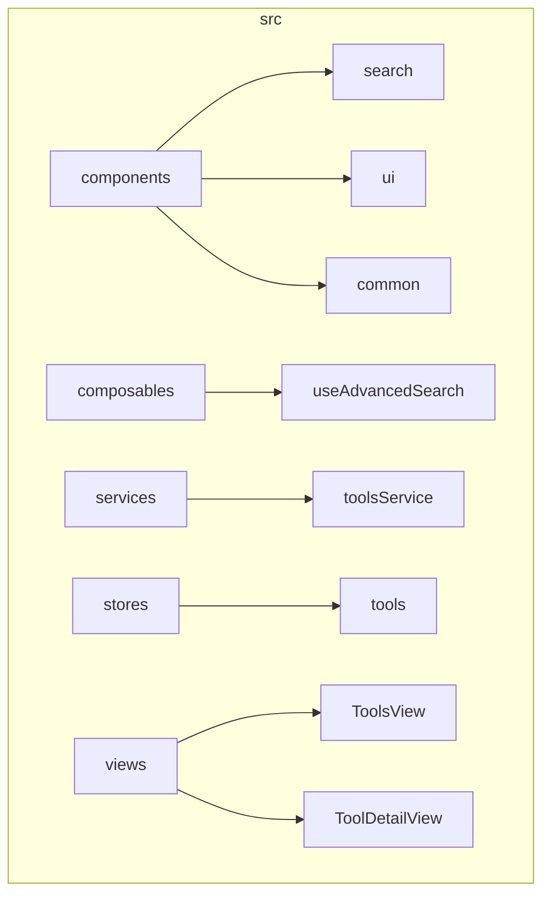
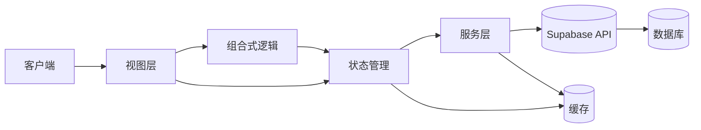
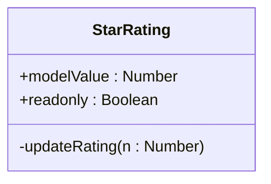
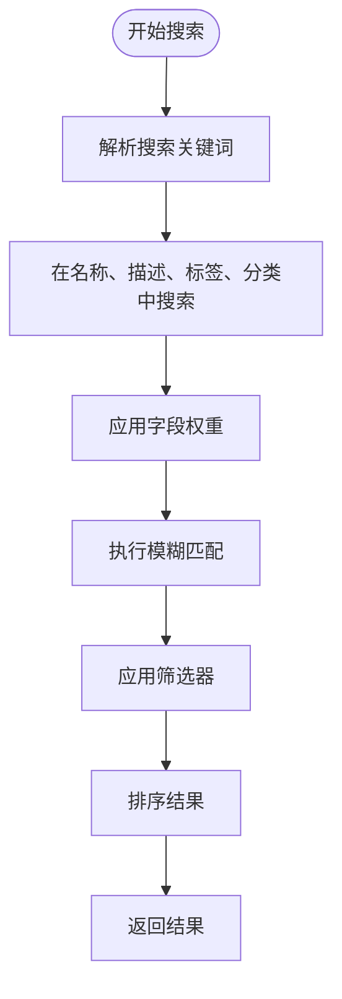
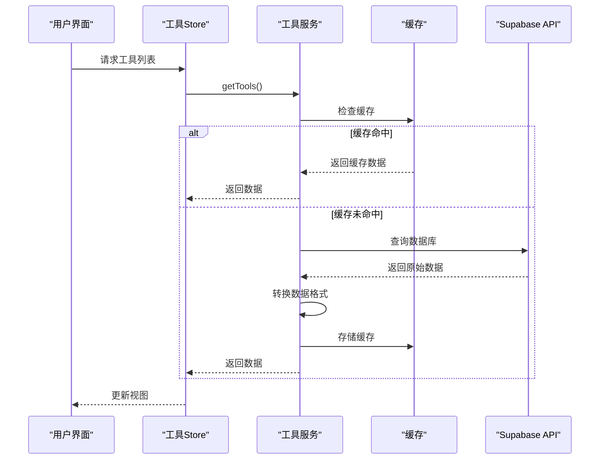
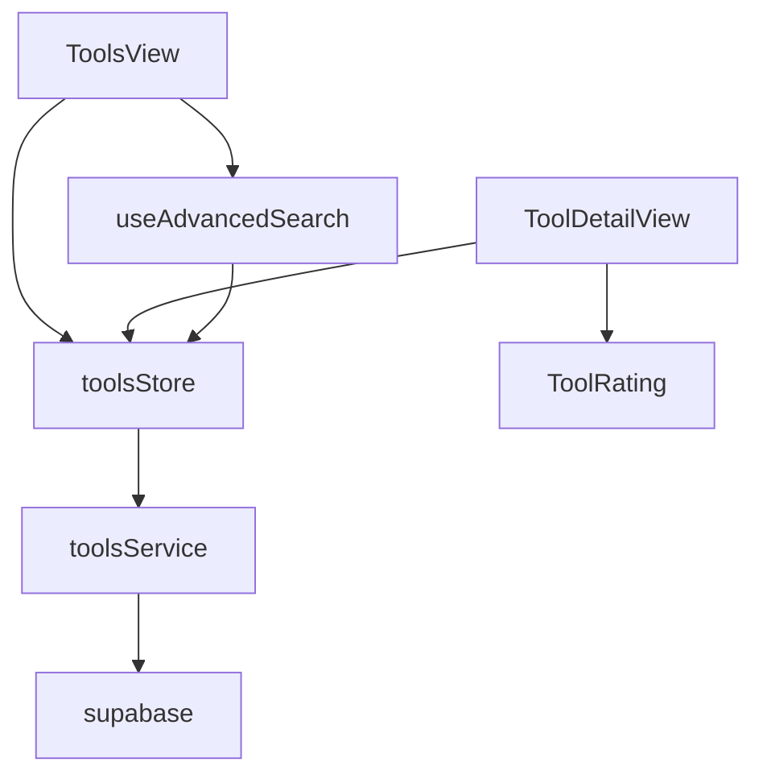

# 工具导航模块

<cite>
**本文档中引用的文件**  
- [useAdvancedSearch.ts](file://src/composables/useAdvancedSearch.ts)
- [toolsService.ts](file://src/services/toolsService.ts)
- [tools.ts](file://src/stores/tools.ts)
- [StarRating.vue](file://src/components/ui/StarRating.vue)
- [ToolDetailView.vue](file://src/views/ToolDetailView.vue)
- [ToolsView.vue](file://src/views/ToolsView.vue)
- [AdvancedSearchPanel.vue](file://src/components/search/AdvancedSearchPanel.vue)
</cite>

## 目录
1. [简介](#简介)
2. [项目结构](#项目结构)
3. [核心组件](#核心组件)
4. [架构概览](#架构概览)
5. [详细组件分析](#详细组件分析)
6. [依赖分析](#依赖分析)
7. [性能考量](#性能考量)
8. [故障排除指南](#故障排除指南)
9. [结论](#结论)

## 简介
本项目是一个高级工具导航系统，旨在为用户提供高效、直观的工具发现与管理体验。系统支持工具分类展示、详情查看、评分收藏、高级搜索等功能，结合Vue 3组合式API与状态管理机制，实现响应式交互与数据同步。后端通过Supabase集成，提供数据持久化与实时能力。

## 项目结构

**图示来源**  
- [ToolsView.vue](file://src/views/ToolsView.vue)
- [ToolDetailView.vue](file://src/views/ToolDetailView.vue)
- [useAdvancedSearch.ts](file://src/composables/useAdvancedSearch.ts)
- [toolsService.ts](file://src/services/toolsService.ts)
- [tools.ts](file://src/stores/tools.ts)

**本节来源**  
- [ToolsView.vue](file://src/views/ToolsView.vue)
- [ToolDetailView.vue](file://src/views/ToolDetailView.vue)

## 核心组件

系统核心由三大模块构成：状态管理（tools store）、服务层（toolsService）与组合式逻辑（useAdvancedSearch）。状态管理负责全局工具数据的存储与响应式更新；服务层封装与Supabase的交互逻辑，提供数据获取与缓存策略；组合式逻辑则实现高级搜索、排序与过滤功能，提升用户体验。

**本节来源**  
- [tools.ts](file://src/stores/tools.ts#L188-L226)
- [toolsService.ts](file://src/services/toolsService.ts#L43-L90)
- [useAdvancedSearch.ts](file://src/composables/useAdvancedSearch.ts#L19-L308)

## 架构概览

**图示来源**  
- [tools.ts](file://src/stores/tools.ts)
- [toolsService.ts](file://src/services/toolsService.ts)
- [useAdvancedSearch.ts](file://src/composables/useAdvancedSearch.ts)

## 详细组件分析

### 工具分类展示与详情页渲染

工具列表在 `ToolsView.vue` 中通过网格或列表模式展示，支持分类筛选、排序与搜索。详情页 `ToolDetailView.vue` 提供工具图标、名称、描述、功能特性、使用教程、优缺点分析与价格信息的完整展示，并集成评分与收藏操作。

**本节来源**  
- [ToolsView.vue](file://src/views/ToolsView.vue)
- [ToolDetailView.vue](file://src/views/ToolDetailView.vue)

### 评分与收藏功能

评分功能通过 `StarRating.vue` 组件实现，支持点击更新评分值，组件为只读模式时不可更改。收藏功能在工具卡片与详情页中通过星标按钮触发，调用 `toolsStore.toggleFavorite` 方法更新状态，当前实现中收藏状态尚未与后端同步。

#### 评分组件交互设计

**图示来源**  
- [StarRating.vue](file://src/components/ui/StarRating.vue)

**本节来源**  
- [StarRating.vue](file://src/components/ui/StarRating.vue)
- [ToolDetailView.vue](file://src/views/ToolDetailView.vue)

### 高级搜索功能解析

`useAdvancedSearch` 组合式函数提供强大的搜索能力，支持关键词搜索、分类筛选、标签匹配、评分过滤、特色工具筛选与URL可用性判断。搜索算法采用加权评分机制，对名称、描述、标签与分类字段赋予不同权重，并结合模糊匹配提升结果相关性。

#### 高级搜索查询逻辑

**图示来源**  
- [useAdvancedSearch.ts](file://src/composables/useAdvancedSearch.ts#L19-L308)

**本节来源**  
- [useAdvancedSearch.ts](file://src/composables/useAdvancedSearch.ts#L19-L308)
- [AdvancedSearchPanel.vue](file://src/components/search/AdvancedSearchPanel.vue)

### 数据获取与缓存策略

`toolsService` 服务层使用 `withCache` 装饰器实现多级缓存策略。工具列表缓存2分钟，单个工具详情缓存5分钟，推荐工具缓存10分钟。缓存键基于查询参数生成，确保不同筛选条件下的数据独立缓存。每次更新操作后清除相关缓存，保证数据一致性。

#### 数据流与缓存机制

**图示来源**  
- [toolsService.ts](file://src/services/toolsService.ts#L43-L90)
- [tools.ts](file://src/stores/tools.ts#L188-L226)

**本节来源**  
- [toolsService.ts](file://src/services/toolsService.ts#L43-L90)
- [tools.ts](file://src/stores/tools.ts#L188-L226)

## 依赖分析

**图示来源**  
- [ToolsView.vue](file://src/views/ToolsView.vue)
- [ToolDetailView.vue](file://src/views/ToolDetailView.vue)
- [useAdvancedSearch.ts](file://src/composables/useAdvancedSearch.ts)
- [tools.ts](file://src/stores/tools.ts)
- [toolsService.ts](file://src/services/toolsService.ts)

**本节来源**  
- [ToolsView.vue](file://src/views/ToolsView.vue)
- [ToolDetailView.vue](file://src/views/ToolDetailView.vue)
- [useAdvancedSearch.ts](file://src/composables/useAdvancedSearch.ts)
- [tools.ts](file://src/stores/tools.ts)
- [toolsService.ts](file://src/services/toolsService.ts)

## 性能考量

系统通过多级缓存显著减少数据库查询次数，提升响应速度。高级搜索在客户端执行，避免频繁API调用。分页加载机制控制每次请求的数据量，防止内存溢出。未来可引入虚拟滚动优化大量工具渲染性能，并通过Web Worker将复杂搜索算法移至后台线程执行，避免阻塞主线程。

**本节来源**  
- [toolsService.ts](file://src/services/toolsService.ts#L43-L90)
- [useAdvancedSearch.ts](file://src/composables/useAdvancedSearch.ts#L19-L308)

## 故障排除指南

常见问题包括工具加载失败、搜索无结果、收藏状态不同步等。加载失败通常由Supabase连接问题引起，可检查网络与API密钥配置。搜索无结果可能因关键词匹配算法过于严格，建议优化模糊匹配逻辑。收藏功能当前为前端模拟，需集成后端服务实现持久化存储。

**本节来源**  
- [tools.ts](file://src/stores/tools.ts#L188-L226)
- [ToolsView.vue](file://src/views/ToolsView.vue)
- [ToolDetailView.vue](file://src/views/ToolDetailView.vue)

## 结论

工具导航模块通过清晰的分层架构与响应式设计，实现了功能丰富且性能优良的工具管理体验。未来可进一步完善用户认证与个性化推荐，提升系统智能化水平。