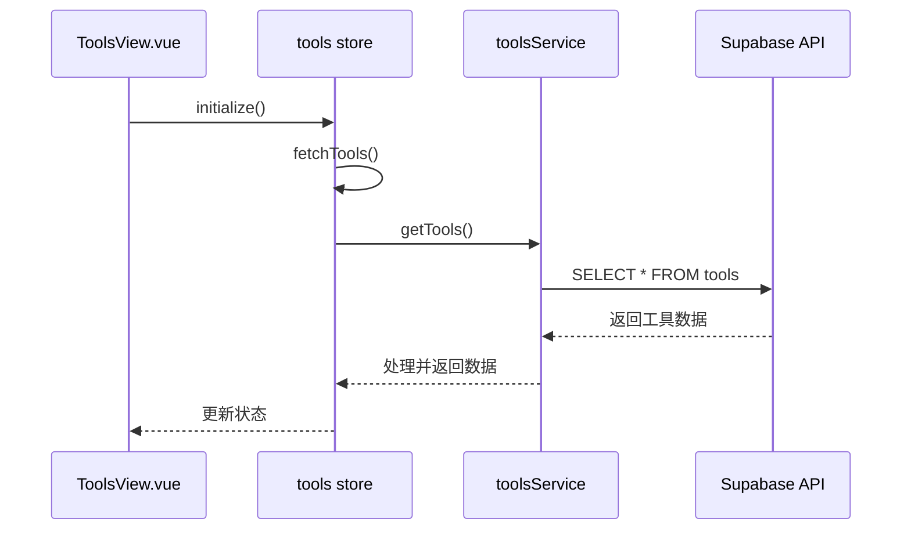
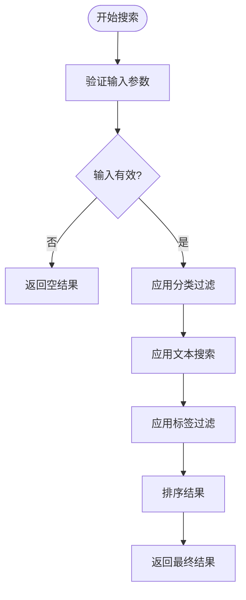
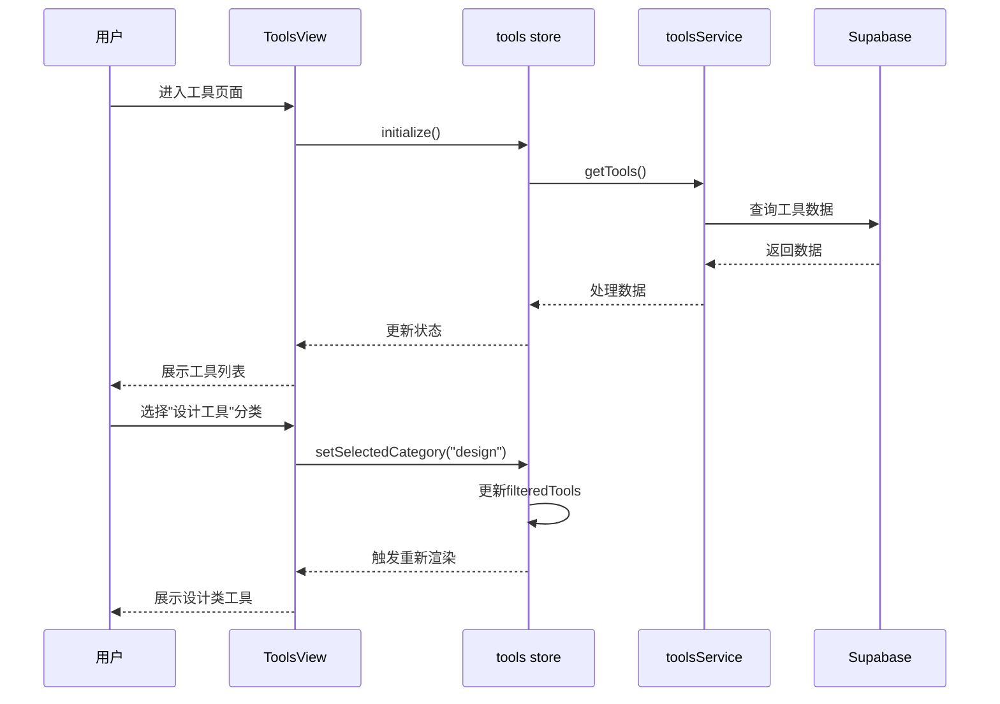

# 工具浏览与分类展示

<cite>
**本文档引用文件**  
- [ToolsView.vue](file://src/views/ToolsView.vue)
- [tools.ts](file://src/stores/tools.ts)
- [toolsService.ts](file://src/services/toolsService.ts)
- [useAdvancedSearch.ts](file://src/composables/useAdvancedSearch.ts)
- [AdvancedSearchPanel.vue](file://src/components/search/AdvancedSearchPanel.vue)
</cite>

## 目录
1. [简介](#简介)
2. [组件与状态管理](#组件与状态管理)
3. [数据获取与服务层交互](#数据获取与服务层交互)
4. [工具分类过滤与搜索逻辑](#工具分类过滤与搜索逻辑)
5. [工具卡片渲染与懒加载](#工具卡片渲染与懒加载)
6. [用户操作流程图](#用户操作流程图)
7. [性能优化建议](#性能优化建议)
8. [常见问题排查指南](#常见问题排查指南)
9. [结论](#结论)

## 简介
本系统实现了完整的工具浏览功能，通过 `ToolsView.vue` 组件结合 Pinia 状态管理（`tools store`）和后端服务（`toolsService`），提供工具列表展示、分类筛选、搜索过滤、排序及响应式更新能力。用户可按类别浏览工具，支持网格与列表两种视图模式，并集成高级搜索与收藏功能。

## 组件与状态管理

`ToolsView.vue` 是工具浏览的核心组件，负责展示工具列表并处理用户交互。该组件通过 `useToolsStore()` 从 Pinia store 中获取工具数据和状态。

### 核心状态属性
- **tools**: 存储所有工具的原始数据
- **loading**: 表示数据加载状态
- **error**: 存储错误信息
- **initialized**: 标记是否已完成初始化
- **searchQuery**: 当前搜索关键词
- **selectedCategory**: 当前选中的分类
- **sidebarCollapsed**: 侧边栏折叠状态

### 计算属性
```ts
const filteredTools = computed(() => {
  if (!searchQuery.value) {
    return tools.value;
  }
  const lowerCaseQuery = searchQuery.value.toLowerCase();
  return tools.value.filter(
    (tool) =>
      tool.name.toLowerCase().includes(lowerCaseQuery) ||
      tool.description.toLowerCase().includes(lowerCaseQuery) ||
      (tool.categories && tool.categories.name.toLowerCase().includes(lowerCaseQuery))
  );
});
```

该计算属性实现了基础搜索过滤功能，根据 `searchQuery` 对工具名称、描述和分类名称进行模糊匹配。

**Section sources**
- [tools.ts](file://src/stores/tools.ts#L35-L74)
- [ToolsView.vue](file://src/views/ToolsView.vue#L275-L324)

## 数据获取与服务层交互

工具数据通过分层架构从后端获取，流程如下：



**Diagram sources**
- [tools.ts](file://src/stores/tools.ts#L78-L187)
- [toolsService.ts](file://src/services/toolsService.ts#L43-L90)

### 初始化流程
1. 组件挂载时调用 `toolsStore.initialize()`
2. 若未初始化，则执行 `fetchTools()`
3. 检查 Supabase 环境变量配置
4. 发起数据库查询获取工具数据
5. 处理关联数据（分类、标签）
6. 更新本地状态

### 错误处理与降级策略
当 Supabase 配置缺失或请求失败时，系统会自动降级使用模拟数据，确保页面基本功能可用。

**Section sources**
- [tools.ts](file://src/stores/tools.ts#L78-L226)
- [toolsService.ts](file://src/services/toolsService.ts#L43-L141)

## 工具分类过滤与搜索逻辑

### 分类筛选机制
分类筛选通过 `selectedCategory` 状态实现，支持路由参数同步：

```ts
watch(selectedCategory, (newCategory) => {
  toolsStore.setSelectedCategory(newCategory);
  // 更新 URL 参数
  const query = { ...route.query };
  if (newCategory === "all") {
    delete query.category;
  } else {
    query.category = newCategory;
  }
  router.replace({ query });
});
```

### 搜索功能实现
系统提供两级搜索：
1. **基础搜索**：通过输入框实时过滤
2. **高级搜索**：通过 `AdvancedSearchPanel` 提供多维度筛选

高级搜索使用 `useAdvancedSearch` 组合式函数，支持按分类、标签、评分等条件过滤。



**Diagram sources**
- [ToolsView.vue](file://src/views/ToolsView.vue#L275-L324)
- [useAdvancedSearch.ts](file://src/composables/useAdvancedSearch.ts#L0-L53)

**Section sources**
- [ToolsView.vue](file://src/views/ToolsView.vue#L275-L324)
- [useAdvancedSearch.ts](file://src/composables/useAdvancedSearch.ts#L0-L53)
- [AdvancedSearchPanel.vue](file://src/components/search/AdvancedSearchPanel.vue#L200-L254)

## 工具卡片渲染与懒加载

### 渲染结构
工具卡片支持网格和列表两种视图模式：

#### 网格视图
```html
<div class="tools-grid">
  <div v-for="tool in filteredTools" :key="tool.id" class="tool-card">
    <div class="card-header">
      <div class="tool-icon">{{ tool.icon || "🔧" }}</div>
      <button class="favorite-button" @click.stop="toggleFavorite(tool.id)">
        <StarIcon class="icon" />
      </button>
    </div>
    <div class="card-content">
      <h3 class="tool-name">{{ tool.name }}</h3>
      <p class="tool-description">{{ tool.description }}</p>
      <div class="tool-tags">...</div>
    </div>
    <div class="card-footer">...</div>
  </div>
</div>
```

#### 列表视图
列表视图提供更紧凑的布局，适合移动设备。

### 懒加载优化
虽然当前实现未使用分页加载，但可通过以下方式优化：
- 实现虚拟滚动（Virtual Scrolling）
- 添加无限滚动（Infinite Scroll）支持
- 使用 Intersection Observer 懒加载图片

**Section sources**
- [ToolsView.vue](file://src/views/ToolsView.vue#L153-L193)

## 用户操作流程图



**Diagram sources**
- [ToolsView.vue](file://src/views/ToolsView.vue#L275-L324)
- [tools.ts](file://src/stores/tools.ts#L258-L275)

## 性能优化建议

### 1. 数据缓存策略
当前 `toolsService` 已实现缓存机制，建议：
- 增加缓存失效策略
- 实现更精细的缓存粒度
- 添加缓存大小限制

### 2. 渲染性能优化
- 对 `v-for` 列表添加 `key` 属性优化
- 使用 `v-memo` 跳过不必要的重新渲染
- 实现工具卡片的懒加载

### 3. 网络请求优化
- 合并多个小请求为批量请求
- 使用 WebSocket 实现数据实时同步
- 添加请求节流和防抖

### 4. 内存管理
- 监听组件销毁事件清理订阅
- 避免在计算属性中创建新对象
- 使用 WeakMap 存储临时数据

## 常见问题排查指南

### 问题1：数据未更新
**可能原因**：
- store 未正确初始化
- API 请求失败
- 计算属性依赖未正确声明

**解决方案**：
1. 检查 `toolsStore.initialized` 是否为 `true`
2. 查看浏览器控制台是否有网络错误
3. 确认 `filteredTools` 计算属性的依赖项

```ts
onMounted(async () => {
  if (!toolsStore.initialized) {
    await toolsStore.initialize();
  }
});
```

### 问题2：分类筛选失效
**可能原因**：
- `selectedCategory` 状态未正确更新
- 路由参数未同步
- 过滤逻辑有误

**解决方案**：
1. 检查 `setSelectedCategory` 方法调用
2. 验证 `watch` 监听器是否正常工作
3. 确认分类 ID 匹配逻辑

### 问题3：搜索功能无响应
**可能原因**：
- `searchQuery` 双向绑定失效
- `handleSearch` 事件未触发
- 高级搜索组件未正确集成

**解决方案**：
1. 检查 `v-model` 绑定
2. 验证 `@input` 事件监听
3. 确认 `useAdvancedSearch` 正确导入

### 问题4：点击统计不准确
**可能原因**：
- RPC 调用失败
- 本地状态未同步更新
- 并发请求冲突

**解决方案**：
1. 检查 `increment_click_count` 函数是否存在
2. 验证 Supabase 权限策略
3. 确保本地计数器同步更新

## 结论
本系统通过 `ToolsView.vue` 组件与 `tools store` 的紧密配合，实现了功能完整的工具浏览功能。数据流清晰，状态管理规范，具备良好的扩展性和维护性。建议后续增加分页加载、更精细的缓存控制和更好的错误处理机制，以提升用户体验和系统性能。