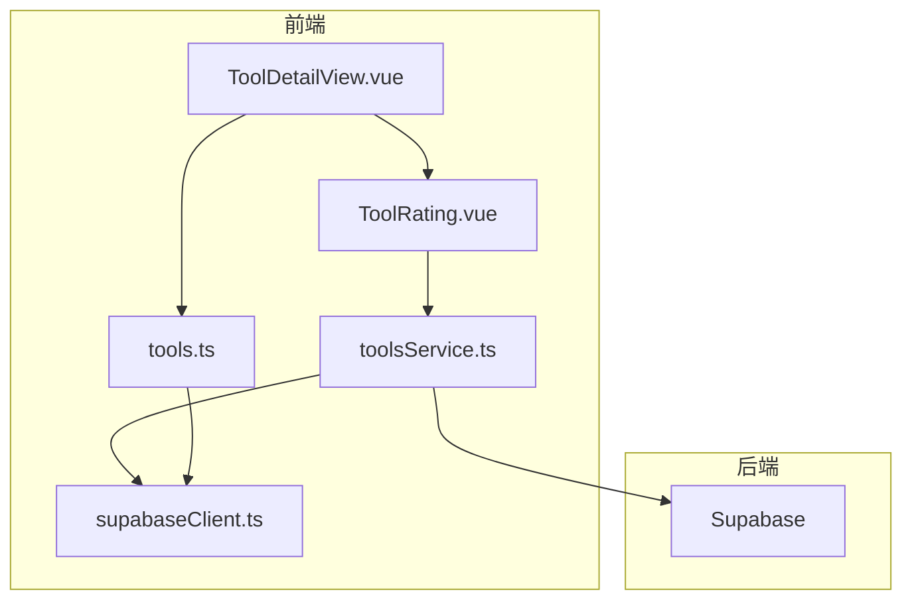
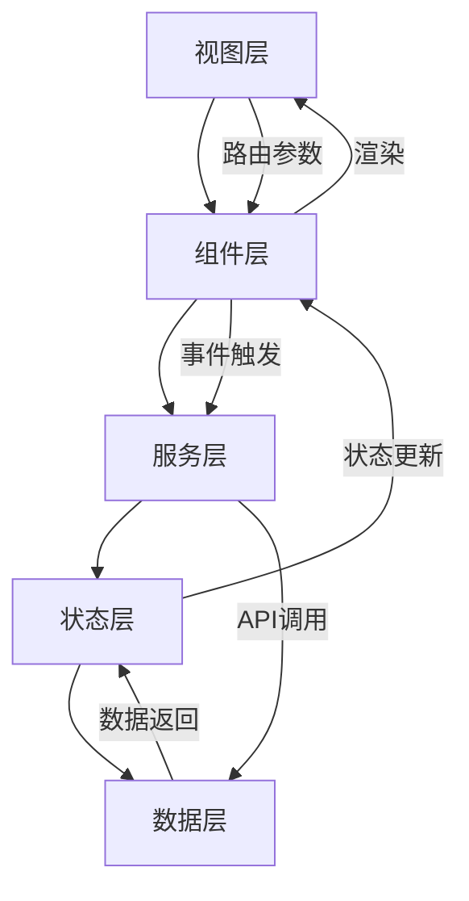
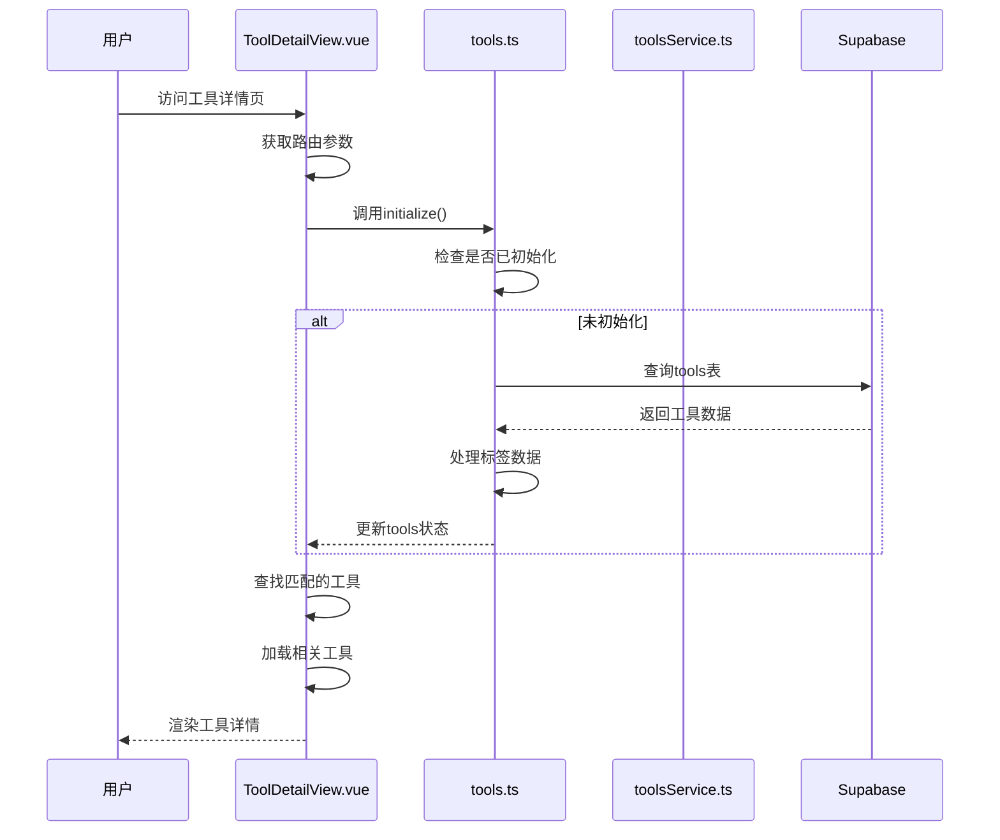
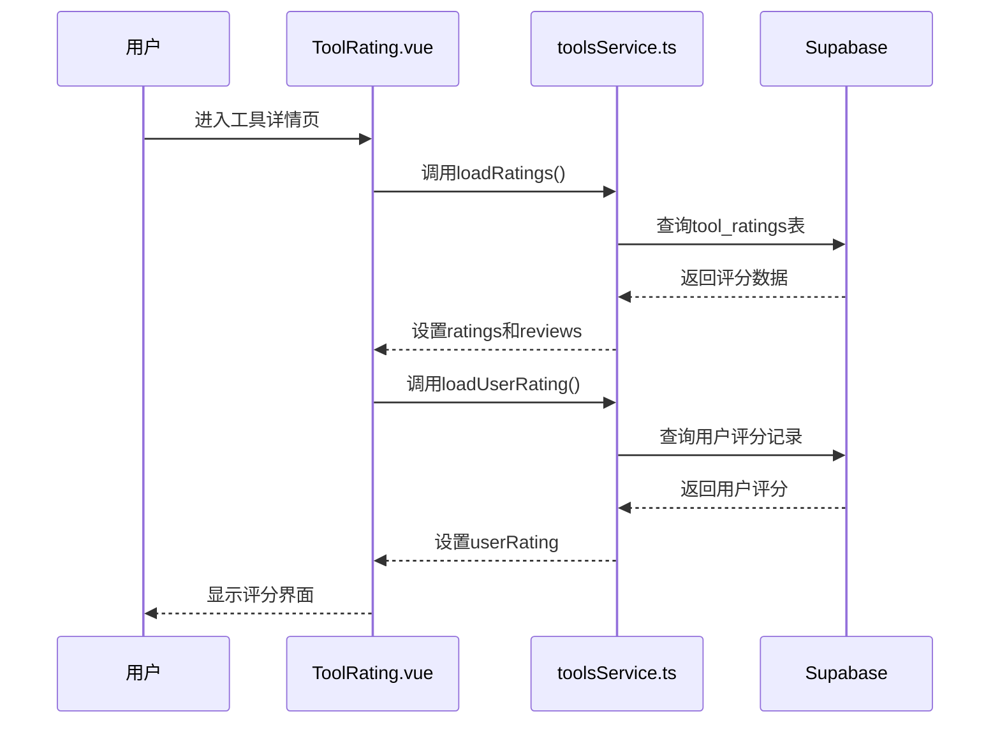
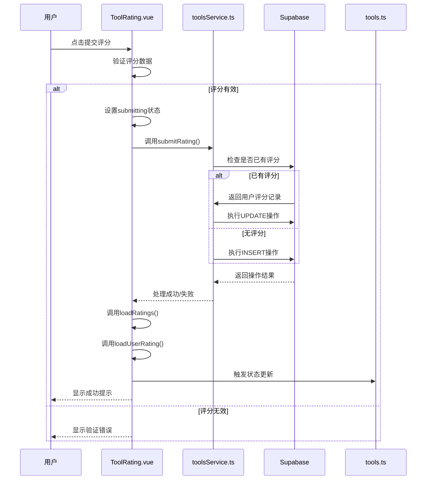
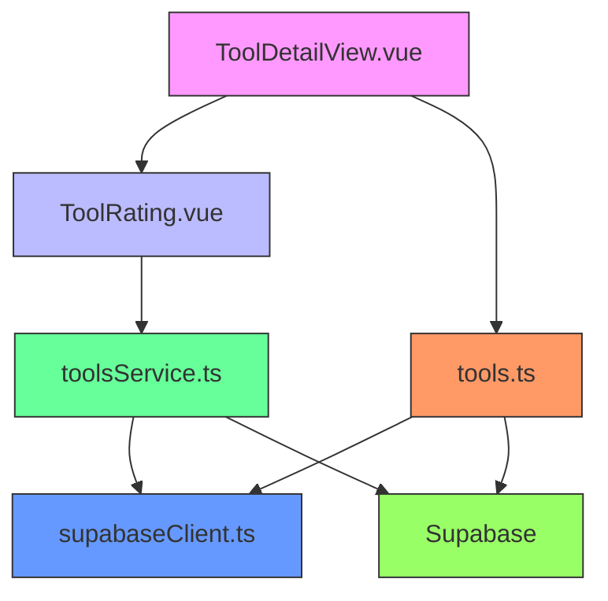

# 工具详情页与交互功能

<cite>
**本文档引用文件**   
- [ToolDetailView.vue](file://src/views/ToolDetailView.vue)
- [ToolRating.vue](file://src/components/ToolRating.vue)
- [toolsService.ts](file://src/services/toolsService.ts)
- [supabaseClient.ts](file://src/lib/supabaseClient.ts)
- [tools.ts](file://src/stores/tools.ts)
</cite>

## 目录
1. [简介](#简介)
2. [项目结构](#项目结构)
3. [核心组件](#核心组件)
4. [架构概述](#架构概述)
5. [详细组件分析](#详细组件分析)
6. [依赖分析](#依赖分析)
7. [性能考虑](#性能考虑)
8. [故障排除指南](#故障排除指南)
9. [结论](#结论)

## 简介
本文档深入探讨了工具详情页的设计与实现，重点分析了`ToolDetailView.vue`如何基于路由参数加载特定工具数据，并集成评分组件（StarRating）实现用户评分交互。文档详细说明了评分提交流程，包括UI事件触发、数据验证、调用`toolsService`更新后端，以及状态store同步刷新。通过实际代码展示评分状态持久化与实时反馈机制，并提供“用户查看工具详情并提交评分”的序列图与代码示例。此外，文档涵盖错误处理（如重复评分、网络异常）、评分权限控制与用户体验优化建议。

## 项目结构
本项目采用模块化设计，主要分为以下几个部分：
- `src/views`: 包含所有视图组件，如`ToolDetailView.vue`
- `src/components`: 包含可复用的UI组件，如`ToolRating.vue`
- `src/services`: 包含业务逻辑服务，如`toolsService.ts`
- `src/stores`: 包含状态管理store，如`tools.ts`
- `src/lib`: 包含第三方库集成，如`supabaseClient.ts`

**图表来源**
- [ToolDetailView.vue](file://src/views/ToolDetailView.vue#L1-L511)
- [ToolRating.vue](file://src/components/ToolRating.vue#L1-L483)
- [toolsService.ts](file://src/services/toolsService.ts#L1-L470)
- [supabaseClient.ts](file://src/lib/supabaseClient.ts#L1-L267)
- [tools.ts](file://src/stores/tools.ts#L1-L342)

**章节来源**
- [ToolDetailView.vue](file://src/views/ToolDetailView.vue#L1-L511)
- [ToolRating.vue](file://src/components/ToolRating.vue#L1-L483)

## 核心组件
`ToolDetailView.vue`是工具详情页的核心组件，负责加载和展示特定工具的详细信息。它通过路由参数获取工具ID，并从store中加载相应的工具数据。页面布局包括工具头部信息、功能特性、使用教程、视频教程、优缺点分析、价格信息、工具评分和相关工具推荐等部分。

`ToolRating.vue`是评分组件，允许已认证用户对工具进行评分和评论。组件显示平均评分、评分分布，并提供评分输入界面。用户可以点击星星进行评分，输入评论内容，并选择是否匿名评价。

**章节来源**
- [ToolDetailView.vue](file://src/views/ToolDetailView.vue#L1-L511)
- [ToolRating.vue](file://src/components/ToolRating.vue#L1-L483)

## 架构概述
系统采用Vue 3 + Pinia + Supabase的技术栈，实现了前后端分离的架构。前端通过Vue Router进行路由管理，使用Pinia进行状态管理，通过Supabase Client与后端数据库进行交互。整体架构分为视图层、组件层、服务层、状态层和数据层。

**图表来源**
- [ToolDetailView.vue](file://src/views/ToolDetailView.vue#L1-L511)
- [ToolRating.vue](file://src/components/ToolRating.vue#L1-L483)
- [toolsService.ts](file://src/services/toolsService.ts#L1-L470)
- [supabaseClient.ts](file://src/lib/supabaseClient.ts#L1-L267)
- [tools.ts](file://src/stores/tools.ts#L1-L342)

## 详细组件分析
### ToolDetailView.vue 分析
`ToolDetailView.vue`是工具详情页的主视图组件，负责加载和展示特定工具的完整信息。组件通过Vue Router的`useRoute`获取路由参数中的工具ID，然后调用`toolsStore`的`initialize`方法加载工具数据。

**图表来源**
- [ToolDetailView.vue](file://src/views/ToolDetailView.vue#L1-L511)
- [tools.ts](file://src/stores/tools.ts#L1-L342)

**章节来源**
- [ToolDetailView.vue](file://src/views/ToolDetailView.vue#L1-L511)
- [tools.ts](file://src/stores/tools.ts#L1-L342)

### ToolRating.vue 分析
`ToolRating.vue`是独立的评分组件，实现了完整的用户评分交互流程。组件通过props接收工具ID，然后加载该工具的所有评分数据和当前用户的评分记录。

**图表来源**
- [ToolRating.vue](file://src/components/ToolRating.vue#L1-L483)
- [toolsService.ts](file://src/services/toolsService.ts#L1-L470)

**章节来源**
- [ToolRating.vue](file://src/components/ToolRating.vue#L1-L483)
- [toolsService.ts](file://src/services/toolsService.ts#L1-L470)

### 评分提交流程分析
当用户提交评分时，系统执行一系列操作确保数据的一致性和用户体验的流畅性。流程从UI事件触发开始，经过数据验证，调用服务更新后端，最后同步刷新状态store。

**图表来源**
- [ToolRating.vue](file://src/components/ToolRating.vue#L1-L483)
- [toolsService.ts](file://src/services/toolsService.ts#L1-L470)
- [tools.ts](file://src/stores/tools.ts#L1-L342)

**章节来源**
- [ToolRating.vue](file://src/components/ToolRating.vue#L1-L483)
- [toolsService.ts](file://src/services/toolsService.ts#L1-L470)

## 依赖分析
系统各组件之间存在明确的依赖关系，形成了清晰的调用链。`ToolDetailView.vue`依赖`ToolRating.vue`组件来实现评分功能，同时依赖`tools.ts` store来获取工具数据。`ToolRating.vue`组件依赖`toolsService.ts`服务来处理评分相关的业务逻辑，而`toolsService.ts`又依赖`supabaseClient.ts`来进行数据库操作。

**图表来源**
- [ToolDetailView.vue](file://src/views/ToolDetailView.vue#L1-L511)
- [ToolRating.vue](file://src/components/ToolRating.vue#L1-L483)
- [toolsService.ts](file://src/services/toolsService.ts#L1-L470)
- [supabaseClient.ts](file://src/lib/supabaseClient.ts#L1-L267)
- [tools.ts](file://src/stores/tools.ts#L1-L342)

**章节来源**
- [ToolDetailView.vue](file://src/views/ToolDetailView.vue#L1-L511)
- [ToolRating.vue](file://src/components/ToolRating.vue#L1-L483)
- [toolsService.ts](file://src/services/toolsService.ts#L1-L470)
- [supabaseClient.ts](file://src/lib/supabaseClient.ts#L1-L267)
- [tools.ts](file://src/stores/tools.ts#L1-L342)

## 性能考虑
系统在性能方面做了多项优化，包括数据缓存、批量操作和错误处理。`toolsService.ts`中的`getTools`、`getTool`等方法都实现了缓存机制，减少对数据库的重复查询。`supabaseClient.ts`中的`withCache`装饰器统一管理API调用的缓存策略。

在用户交互方面，`ToolRating.vue`组件通过`submitting`状态防止重复提交，提升了用户体验。同时，组件在提交评分后会立即重新加载评分数据，确保用户看到最新的评分结果。

**章节来源**
- [toolsService.ts](file://src/services/toolsService.ts#L1-L470)
- [supabaseClient.ts](file://src/lib/supabaseClient.ts#L1-L267)
- [ToolRating.vue](file://src/components/ToolRating.vue#L1-L483)

## 故障排除指南
在使用工具详情页和评分功能时，可能会遇到一些常见问题。以下是针对这些问题的解决方案：

1. **工具加载失败**：检查网络连接，确认Supabase环境变量配置正确。如果环境变量未配置，系统会使用模拟数据。
2. **评分提交失败**：确保用户已登录，评分值有效（1-5星）。检查网络连接，确认Supabase服务正常运行。
3. **重复评分**：系统会自动检测用户是否已评分，如果是，则执行更新操作而非插入新记录。
4. **缓存问题**：如果发现数据不一致，可以尝试清除浏览器缓存或重新加载页面。

**章节来源**
- [ToolDetailView.vue](file://src/views/ToolDetailView.vue#L1-L511)
- [ToolRating.vue](file://src/components/ToolRating.vue#L1-L483)
- [toolsService.ts](file://src/services/toolsService.ts#L1-L470)
- [supabaseClient.ts](file://src/lib/supabaseClient.ts#L1-L267)

## 结论
本文档详细分析了工具详情页的设计与实现，涵盖了从数据加载到用户交互的完整流程。通过`ToolDetailView.vue`和`ToolRating.vue`组件的协同工作，系统实现了流畅的用户体验和可靠的数据管理。评分功能的实现展示了前后端分离架构的优势，通过清晰的组件划分和依赖管理，确保了代码的可维护性和可扩展性。未来可以进一步优化性能，如实现更精细的缓存策略和增加离线支持功能。