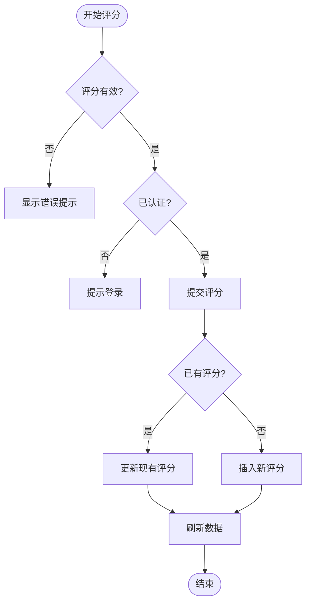

# 评分与收藏系统集成

<cite>
**本文档引用的文件**  
- [StarRating.vue](file://src/components/ui/StarRating.vue)
- [ToolRating.vue](file://src/components/ToolRating.vue)
- [toolsService.ts](file://src/services/toolsService.ts)
- [favoritesService.ts](file://src/services/favoritesService.ts)
- [tools.ts](file://src/stores/tools.ts)
- [localManagement.ts](file://src/stores/localManagement.ts)
</cite>

## 目录
1. [简介](#简介)
2. [项目结构](#项目结构)
3. [核心组件](#核心组件)
4. [架构概览](#架构概览)
5. [详细组件分析](#详细组件分析)
6. [依赖分析](#依赖分析)
7. [性能考虑](#性能考虑)
8. [故障排除指南](#故障排除指南)
9. [结论](#结论)

## 简介
本系统实现了工具导航平台中的评分与收藏功能，通过组件化设计和状态管理机制，为用户提供直观的交互体验。系统采用Vue 3组合式API与Pinia状态管理，结合Supabase后端服务，实现了评分提交、收藏状态变更、本地状态同步与缓存一致性等核心功能。文档将深入解析StarRating组件封装、服务层API调用流程、Pinia store作用机制及并行操作处理策略。

## 项目结构
系统采用分层架构设计，主要分为组件层、服务层和状态管理层。组件层包含UI交互元素；服务层封装业务逻辑与API调用；状态管理层负责全局状态同步与缓存管理。

**图示来源**  
- [StarRating.vue](file://src/components/ui/StarRating.vue)
- [ToolRating.vue](file://src/components/ToolRating.vue)
- [toolsService.ts](file://src/services/toolsService.ts)
- [favoritesService.ts](file://src/services/favoritesService.ts)
- [tools.ts](file://src/stores/tools.ts)
- [localManagement.ts](file://src/stores/localManagement.ts)

**本节来源**  
- [src/components/ui/StarRating.vue](file://src/components/ui/StarRating.vue)
- [src/services/toolsService.ts](file://src/services/toolsService.ts)
- [src/stores/tools.ts](file://src/stores/tools.ts)

## 核心组件
`StarRating`组件封装了评分交互逻辑，通过`v-model`双向绑定实现值的同步，并对外暴露`update:modelValue`事件。该组件支持只读模式控制，确保在不同场景下的灵活使用。`ToolRating`组件整合评分与评论功能，提供完整的用户反馈界面。

**本节来源**  
- [StarRating.vue](file://src/components/ui/StarRating.vue#L0-L53)
- [ToolRating.vue](file://src/components/ToolRating.vue#L0-L42)

## 架构概览
系统通过清晰的职责划分实现评分与收藏功能的集成。前端组件触发事件后，由对应的服务类处理API调用，最终通过Pinia store维护本地状态一致性。

**图示来源**  
- [toolsService.ts](file://src/services/toolsService.ts#L222-L268)
- [favoritesService.ts](file://src/services/favoritesService.ts#L151-L203)
- [tools.ts](file://src/stores/tools.ts#L278-L340)

## 详细组件分析

### StarRating组件分析
`StarRating`组件作为基础UI控件，实现了星级评分的可视化与交互逻辑。组件通过`modelValue`接收当前评分值，利用`v-for`生成5个可点击的星形元素。点击时触发`updateRating`方法，若非只读状态则发射`update:modelValue`事件。

**图示来源**  
- [StarRating.vue](file://src/components/ui/StarRating.vue#L0-L53)

**本节来源**  
- [StarRating.vue](file://src/components/ui/StarRating.vue#L0-L53)

### 工具评分功能分析
`ToolRating`组件负责展示工具的平均评分、分布情况及用户评分输入。组件通过`onMounted`钩子加载评分数据和用户已有评分，支持匿名评论与评分提交。提交逻辑区分新建与更新场景，确保数据完整性。

**图示来源**  
- [ToolRating.vue](file://src/components/ToolRating.vue#L112-L167)
- [ToolRating.vue](file://src/components/ToolRating.vue#L212-L269)

**本节来源**  
- [ToolRating.vue](file://src/components/ToolRating.vue#L0-L42)
- [ToolRating.vue](file://src/components/ToolRating.vue#L112-L167)
- [ToolRating.vue](file://src/components/ToolRating.vue#L212-L269)

### 服务层分析

#### 工具服务分析
`toolsService`提供工具相关的业务逻辑封装，包括评分提交、点击统计和收藏状态更新。服务采用缓存策略优化性能，通过`withCache`装饰器实现API响应缓存，并在数据变更后清理相关缓存。

**图示来源**  
- [toolsService.ts](file://src/services/toolsService.ts#L43-L90)
- [toolsService.ts](file://src/services/toolsService.ts#L262-L317)

**本节来源**  
- [toolsService.ts](file://src/services/toolsService.ts#L43-L90)
- [toolsService.ts](file://src/services/toolsService.ts#L222-L268)
- [toolsService.ts](file://src/services/toolsService.ts#L262-L317)

#### 收藏服务分析
`favoritesService`管理用户的收藏行为，提供添加、移除、检查收藏状态等功能。服务通过`checkFavoriteExists`方法避免重复收藏，并在操作失败时抛出明确错误信息。

**图示来源**  
- [favoritesService.ts](file://src/services/favoritesService.ts#L110-L154)
- [favoritesService.ts](file://src/services/favoritesService.ts#L199-L251)

**本节来源**  
- [favoritesService.ts](file://src/services/favoritesService.ts#L0-L41)
- [favoritesService.ts](file://src/services/favoritesService.ts#L110-L154)
- [favoritesService.ts](file://src/services/favoritesService.ts#L199-L251)

### 状态管理分析

#### 工具状态管理
`tools` store管理所有工具的全局状态，包括工具列表、搜索条件和选中分类。`toggleFavorite`方法暂未实现完整逻辑，但已预留接口用于未来扩展。

**图示来源**  
- [tools.ts](file://src/stores/tools.ts#L188-L226)
- [tools.ts](file://src/stores/tools.ts#L278-L340)

**本节来源**  
- [tools.ts](file://src/stores/tools.ts#L188-L226)
- [tools.ts](file://src/stores/tools.ts#L278-L340)

#### 本地管理状态
`localManagement` store负责管理用户本地偏好设置，如侧边栏展开状态、搜索查询等。该store确保用户界面状态在页面刷新后仍能保持一致。

**本节来源**  
- [localManagement.ts](file://src/stores/localManagement.ts)

## 依赖分析
系统各组件间存在明确的依赖关系，形成清晰的数据流。UI组件依赖服务层进行数据操作，服务层依赖状态管理层维护本地状态，同时所有数据持久化操作均通过Supabase API完成。

**图示来源**  
- [StarRating.vue](file://src/components/ui/StarRating.vue)
- [ToolRating.vue](file://src/components/ToolRating.vue)
- [toolsService.ts](file://src/services/toolsService.ts)
- [favoritesService.ts](file://src/services/favoritesService.ts)
- [tools.ts](file://src/stores/tools.ts)
- [localManagement.ts](file://src/stores/localManagement.ts)

**本节来源**  
- [src/components/ui/StarRating.vue](file://src/components/ui/StarRating.vue)
- [src/components/ToolRating.vue](file://src/components/ToolRating.vue)
- [src/services/toolsService.ts](file://src/services/toolsService.ts)
- [src/services/favoritesService.ts](file://src/services/favoritesService.ts)
- [src/stores/tools.ts](file://src/stores/tools.ts)
- [src/stores/localManagement.ts](file://src/stores/localManagement.ts)

## 性能考虑
系统在性能优化方面采取了多项措施：使用API响应缓存减少重复请求、通过`withCache`装饰器统一管理缓存策略、在数据变更后及时清理相关缓存以保证数据新鲜度。此外，分页查询和懒加载机制有效控制了单次数据传输量。

## 故障排除指南
常见问题包括评分提交失败、收藏状态不同步等。排查时应首先检查网络连接和用户认证状态，然后查看浏览器控制台错误日志。对于缓存相关问题，可尝试强制刷新页面或清除本地存储数据。

**本节来源**  
- [toolsService.ts](file://src/services/toolsService.ts#L87-L141)
- [favoritesService.ts](file://src/services/favoritesService.ts#L295-L340)

## 结论
本系统通过合理的架构设计实现了评分与收藏功能的高效集成。组件化开发提高了代码复用性，服务层抽象简化了业务逻辑处理，Pinia状态管理确保了全局状态的一致性。未来可完善`toggleFavorite`方法的实现，并增加离线操作支持以提升用户体验。