# 高级搜索功能实现

<cite>
**本文档引用的文件**
- [useAdvancedSearch.ts](file://src/composables/useAdvancedSearch.ts)
- [AdvancedSearchPanel.vue](file://src/components/search/AdvancedSearchPanel.vue)
- [EnhancedSearchBox.vue](file://src/components/search/EnhancedSearchBox.vue)
- [searchService.ts](file://src/services/searchService.ts)
- [tools.ts](file://src/stores/tools.ts)
- [categories.ts](file://src/stores/categories.ts)
- [SearchResultsView.vue](file://src/views/SearchResultsView.vue)
- [supabaseClient.ts](file://src/lib/supabaseClient.ts)
- [database.ts](file://src/types/database.ts)
</cite>

## 目录
1. [简介](#简介)
2. [项目结构](#项目结构)
3. [核心组件](#核心组件)
4. [架构概述](#架构概述)
5. [详细组件分析](#详细组件分析)
6. [依赖分析](#依赖分析)
7. [性能考虑](#性能考虑)
8. [故障排除指南](#故障排除指南)
9. [结论](#结论)

## 简介
高级搜索功能为用户提供了一套完整的搜索解决方案，包括智能搜索、多条件筛选、排序和搜索建议等功能。该功能由组合式函数`useAdvancedSearch`、组件`AdvancedSearchPanel`和`EnhancedSearchBox`以及服务`searchService`共同实现，为用户提供了高效、直观的搜索体验。

## 项目结构
高级搜索功能的实现分布在多个目录中，主要包括组合式函数、组件、服务和状态管理模块。

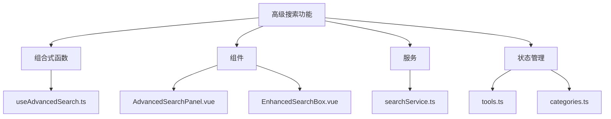

**图表来源**
- [useAdvancedSearch.ts](file://src/composables/useAdvancedSearch.ts)
- [AdvancedSearchPanel.vue](file://src/components/search/AdvancedSearchPanel.vue)
- [EnhancedSearchBox.vue](file://src/components/search/EnhancedSearchBox.vue)
- [searchService.ts](file://src/services/searchService.ts)
- [tools.ts](file://src/stores/tools.ts)
- [categories.ts](file://src/stores/categories.ts)

**章节来源**
- [useAdvancedSearch.ts](file://src/composables/useAdvancedSearch.ts)
- [AdvancedSearchPanel.vue](file://src/components/search/AdvancedSearchPanel.vue)
- [EnhancedSearchBox.vue](file://src/components/search/EnhancedSearchBox.vue)
- [searchService.ts](file://src/services/searchService.ts)

## 核心组件
高级搜索功能的核心由`useAdvancedSearch`组合式函数实现，它提供了搜索逻辑、筛选和排序功能。`AdvancedSearchPanel`和`EnhancedSearchBox`组件负责UI交互，而`searchService`则处理与后端的通信。

**章节来源**
- [useAdvancedSearch.ts](file://src/composables/useAdvancedSearch.ts#L1-L310)
- [AdvancedSearchPanel.vue](file://src/components/search/AdvancedSearchPanel.vue#L1-L594)
- [EnhancedSearchBox.vue](file://src/components/search/EnhancedSearchBox.vue#L1-L1017)
- [searchService.ts](file://src/services/searchService.ts#L1-L653)

## 架构概述
高级搜索功能采用分层架构，从UI组件到组合式函数再到服务层，每一层都有明确的职责。

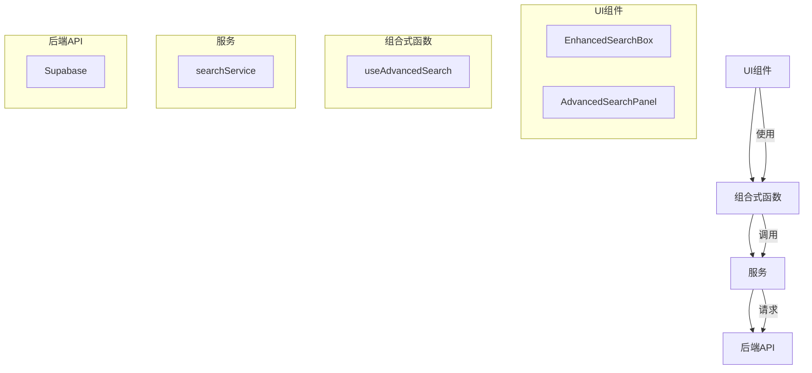

**图表来源**
- [EnhancedSearchBox.vue](file://src/components/search/EnhancedSearchBox.vue)
- [AdvancedSearchPanel.vue](file://src/components/search/AdvancedSearchPanel.vue)
- [useAdvancedSearch.ts](file://src/composables/useAdvancedSearch.ts)
- [searchService.ts](file://src/services/searchService.ts)
- [supabaseClient.ts](file://src/lib/supabaseClient.ts)

## 详细组件分析

### useAdvancedSearch组合式函数分析
`useAdvancedSearch`组合式函数是高级搜索功能的核心，它实现了查询构建、筛选和排序逻辑。

#### 查询构建逻辑
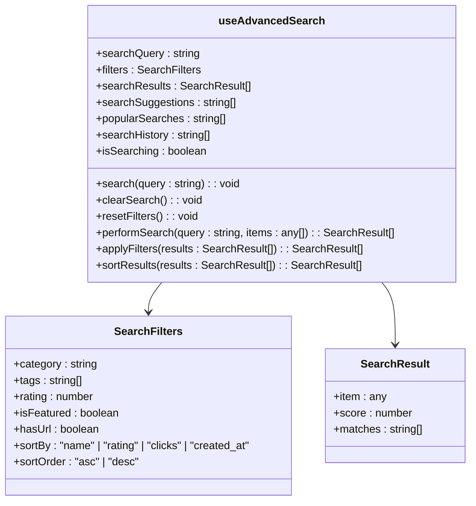

**图表来源**
- [useAdvancedSearch.ts](file://src/composables/useAdvancedSearch.ts#L1-L310)

#### 多条件组合与模糊匹配
`useAdvancedSearch`实现了多条件组合搜索，包括关键词、分类、标签等。它还实现了模糊匹配算法，提高了搜索的容错性。

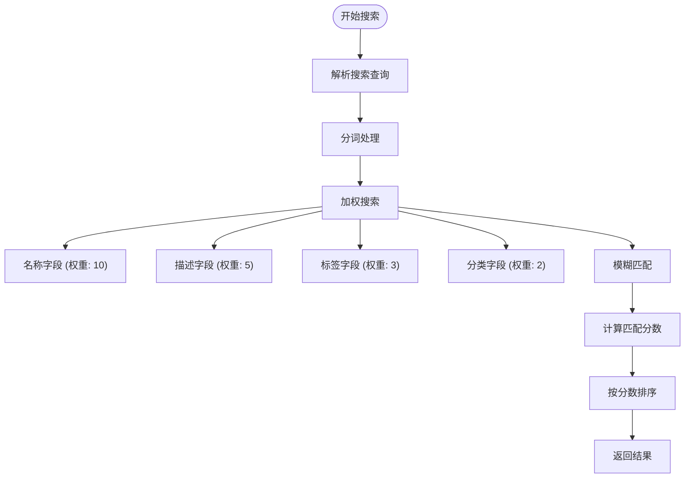

**图表来源**
- [useAdvancedSearch.ts](file://src/composables/useAdvancedSearch.ts#L50-L150)

**章节来源**
- [useAdvancedSearch.ts](file://src/composables/useAdvancedSearch.ts#L50-L150)

#### 排序策略
`useAdvancedSearch`提供了多种排序策略，包括按名称、评分、点击次数和创建时间排序。

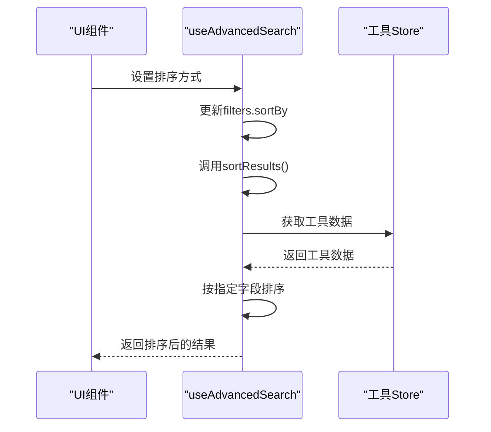

**图表来源**
- [useAdvancedSearch.ts](file://src/composables/useAdvancedSearch.ts#L150-L200)
- [tools.ts](file://src/stores/tools.ts)

### AdvancedSearchPanel组件分析
`AdvancedSearchPanel`组件提供了高级搜索的UI界面，用户可以通过它进行多条件筛选。

#### UI交互设计
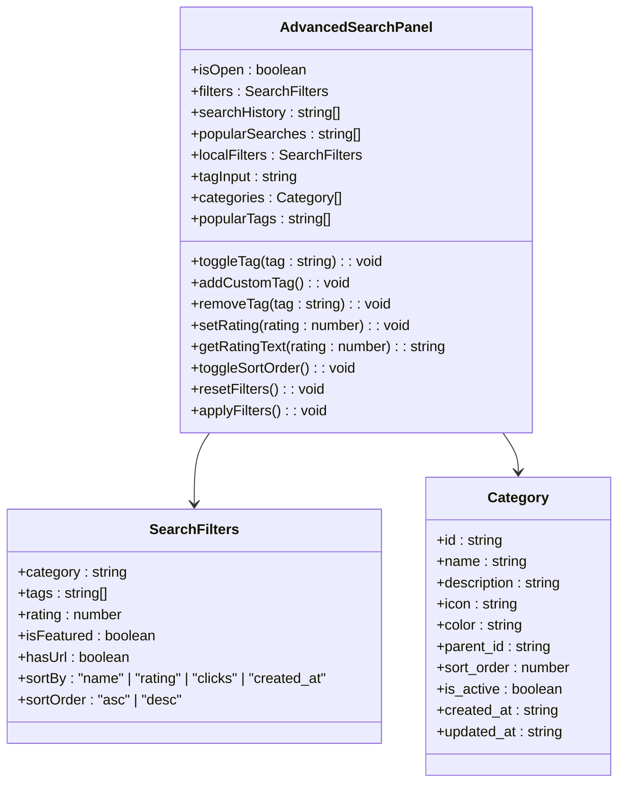

**图表来源**
- [AdvancedSearchPanel.vue](file://src/components/search/AdvancedSearchPanel.vue#L1-L594)
- [categories.ts](file://src/stores/categories.ts)

#### 状态绑定机制
`AdvancedSearchPanel`组件通过props接收外部状态，并通过emit事件将状态变化通知给父组件。

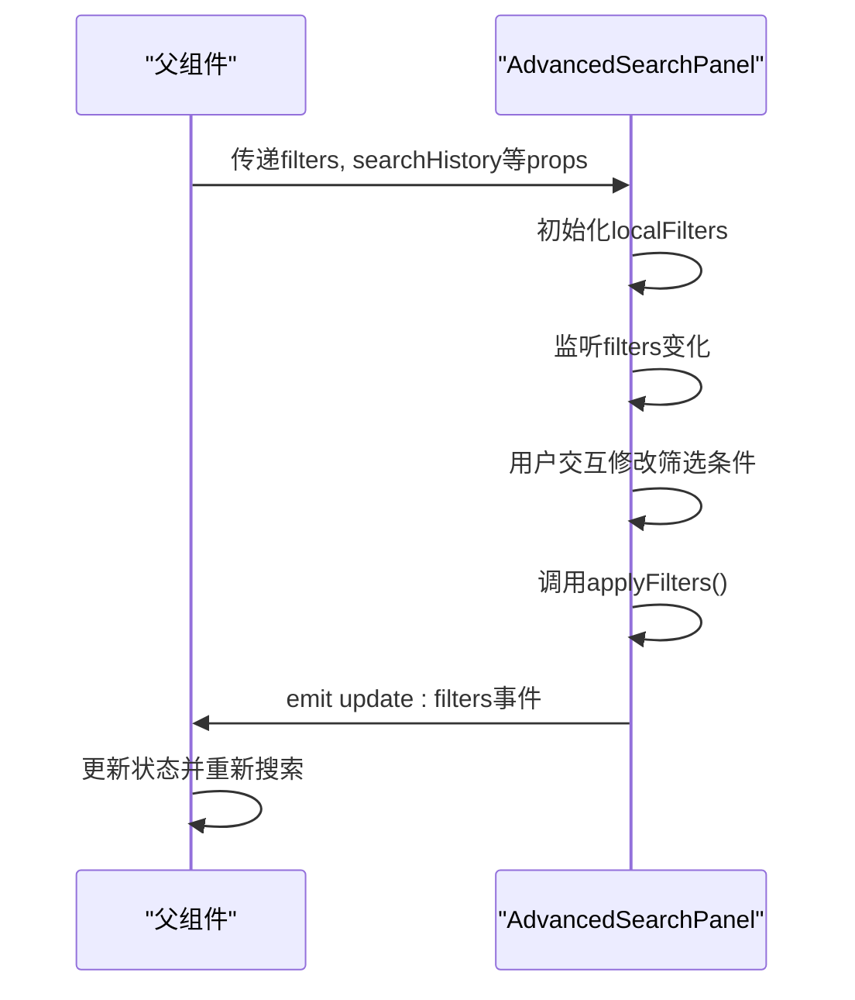

**图表来源**
- [AdvancedSearchPanel.vue](file://src/components/search/AdvancedSearchPanel.vue#L200-L300)

**章节来源**
- [AdvancedSearchPanel.vue](file://src/components/search/AdvancedSearchPanel.vue#L200-L300)

### EnhancedSearchBox组件分析
`EnhancedSearchBox`组件是一个增强的搜索框，集成了搜索输入、建议和高级搜索功能。

#### UI交互设计
```mermaid
classDiagram
class EnhancedSearchBox {
+query : string
+searchType : string
+isFocused : boolean
+isExpanded : boolean
+showSuggestions : boolean
+showAdvanced : boolean
+isSearching : boolean
+selectedIndex : number
+suggestions : SearchSuggestion[]
+searchHistory : SearchHistory[]
+popularSearches : string[]
+filters : AdvancedFilters
+selectedTags : Tag[]
+tagQuery : string
+availableTags : Tag[]
+lastSearchResult : SearchResult
+handleFocus() : void
+handleBlur() : void
+handleInput() : void
+handleKeydown(event : KeyboardEvent) : void
+loadSuggestions() : Promise<void>
+selectSuggestion(text : string) : void
+performSearch() : Promise<void>
+clearSearch() : void
+clearHistory() : void
+toggleAdvanced() : void
+resetFilters() : void
+applyFilters() : void
+searchTags() : void
+addTag(tag : Tag) : void
+removeTag(tag : Tag) : void
}
class SearchSuggestion {
+text : string
+type : "query" | "category" | "tag" | "tool" | "product"
+count? : number
}
class SearchHistory {
+id : string
+query : string
+type : string
+timestamp : Date
+results_count : number
}
class SearchResult {
+items : any[]
+total : number
+query : string
+suggestions : string[]
+facets : SearchFacets
+searchTime : number
}
class SearchFacets {
+categories : { name : string; count : number }[]
+tags : { name : string; count : number }[]
+priceRanges : { range : string; count : number }[]
}
class AdvancedFilters {
+category : string
+sortBy : "relevance" | "name" | "created_at" | "click_count" | "price"
+sortOrder : "asc" | "desc"
+priceMin : number | null
+priceMax : number | null
}
class Tag {
+id : string
+name : string
+color : string
}
EnhancedSearchBox --> SearchSuggestion
EnhancedSearchBox --> SearchHistory
EnhancedSearchBox --> SearchResult
EnhancedSearchBox --> SearchFacets
EnhancedSearchBox --> AdvancedFilters
EnhancedSearchBox --> Tag
```

**图表来源**
- [EnhancedSearchBox.vue](file://src/components/search/EnhancedSearchBox.vue#L1-L1017)

#### 状态绑定机制
`EnhancedSearchBox`组件通过props接收配置，并通过emit事件将搜索结果通知给父组件。

```mermaid
sequenceDiagram
participant Parent as "父组件"
participant Box as "EnhancedSearchBox"
participant Service as "searchService"
Parent->>Box : 传递placeholder, autoFocus等props
Box->>Box : 初始化状态
Box->>Box : 用户输入搜索关键词
Box->>Box : 调用debouncedLoadSuggestions()
Box->>Service : 调用getSmartSuggestions()
Service-->>Box : 返回建议
Box->>Box : 显示建议下拉框
Box->>Box : 用户选择建议或按回车
Box->>Box : 调用performSearch()
Box->>Service : 调用search()
Service-->>Box : 返回搜索结果
Box->>Parent : emit search事件
Parent->>Parent : 处理搜索结果
```

**图表来源**
- [EnhancedSearchBox.vue](file://src/components/search/EnhancedSearchBox.vue#L300-L500)
- [searchService.ts](file://src/services/searchService.ts)

**章节来源**
- [EnhancedSearchBox.vue](file://src/components/search/EnhancedSearchBox.vue#L300-L500)
- [searchService.ts](file://src/services/searchService.ts)

### searchService服务分析
`searchService`服务负责与后端API通信，执行搜索操作并处理响应结果。

#### 搜索请求流程
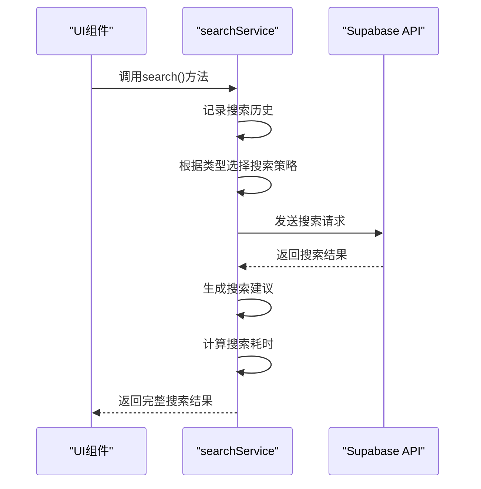

**图表来源**
- [searchService.ts](file://src/services/searchService.ts#L1-L653)

#### 后端通信处理
`searchService`使用Supabase客户端与后端数据库进行通信，执行各种搜索操作。

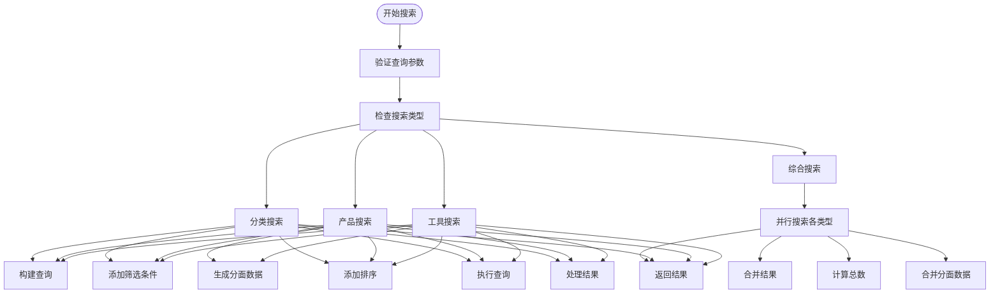

**图表来源**
- [searchService.ts](file://src/services/searchService.ts#L50-L300)
- [supabaseClient.ts](file://src/lib/supabaseClient.ts)

**章节来源**
- [searchService.ts](file://src/services/searchService.ts#L50-L300)
- [supabaseClient.ts](file://src/lib/supabaseClient.ts)

## 依赖分析
高级搜索功能依赖于多个模块和服务，这些依赖关系确保了功能的完整性和可维护性。

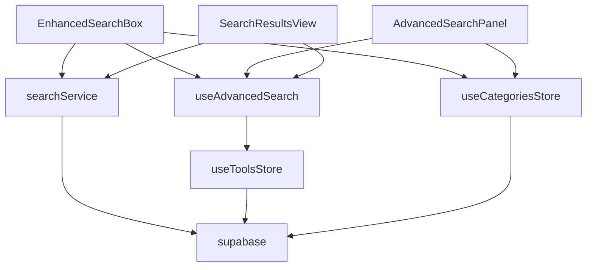

**图表来源**
- [EnhancedSearchBox.vue](file://src/components/search/EnhancedSearchBox.vue)
- [AdvancedSearchPanel.vue](file://src/components/search/AdvancedSearchPanel.vue)
- [useAdvancedSearch.ts](file://src/composables/useAdvancedSearch.ts)
- [searchService.ts](file://src/services/searchService.ts)
- [tools.ts](file://src/stores/tools.ts)
- [categories.ts](file://src/stores/categories.ts)
- [supabaseClient.ts](file://src/lib/supabaseClient.ts)
- [SearchResultsView.vue](file://src/views/SearchResultsView.vue)

**章节来源**
- [EnhancedSearchBox.vue](file://src/components/search/EnhancedSearchBox.vue)
- [AdvancedSearchPanel.vue](file://src/components/search/AdvancedSearchPanel.vue)
- [useAdvancedSearch.ts](file://src/composables/useAdvancedSearch.ts)
- [searchService.ts](file://src/services/searchService.ts)
- [tools.ts](file://src/stores/tools.ts)
- [categories.ts](file://src/stores/categories.ts)
- [supabaseClient.ts](file://src/lib/supabaseClient.ts)
- [SearchResultsView.vue](file://src/views/SearchResultsView.vue)

## 性能考虑
高级搜索功能在设计时考虑了性能优化，包括防抖、缓存和查询优化等策略。

### 搜索性能调优策略
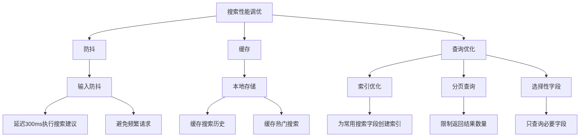

**图表来源**
- [EnhancedSearchBox.vue](file://src/components/search/EnhancedSearchBox.vue#L200-L300)
- [searchService.ts](file://src/services/searchService.ts#L300-L400)
- [useAdvancedSearch.ts](file://src/composables/useAdvancedSearch.ts#L200-L250)

**章节来源**
- [EnhancedSearchBox.vue](file://src/components/search/EnhancedSearchBox.vue#L200-L300)
- [searchService.ts](file://src/services/searchService.ts#L300-L400)
- [useAdvancedSearch.ts](file://src/composables/useAdvancedSearch.ts#L200-L250)

### 复杂查询优化建议
对于复杂的搜索查询，建议采用以下优化策略：

1. **使用分面搜索**：通过分面数据（facets）提供筛选建议，减少不必要的查询。
2. **限制搜索范围**：通过分类、标签等条件限制搜索范围，提高查询效率。
3. **缓存常用查询**：对于热门搜索词，可以缓存其结果，减少数据库查询。
4. **异步加载**：对于大量数据的搜索，采用异步加载和分页显示，避免阻塞UI。

## 故障排除指南
在使用高级搜索功能时，可能会遇到一些常见问题，以下是解决方案。

### 常见问题及解决方案
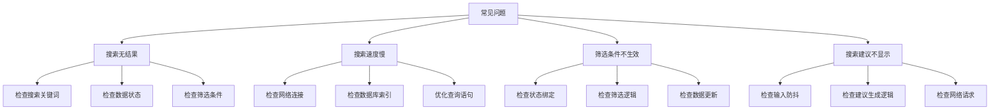

**图表来源**
- [useAdvancedSearch.ts](file://src/composables/useAdvancedSearch.ts)
- [searchService.ts](file://src/services/searchService.ts)
- [EnhancedSearchBox.vue](file://src/components/search/EnhancedSearchBox.vue)
- [AdvancedSearchPanel.vue](file://src/components/search/AdvancedSearchPanel.vue)

**章节来源**
- [useAdvancedSearch.ts](file://src/composables/useAdvancedSearch.ts)
- [searchService.ts](file://src/services/searchService.ts)
- [EnhancedSearchBox.vue](file://src/components/search/EnhancedSearchBox.vue)
- [AdvancedSearchPanel.vue](file://src/components/search/AdvancedSearchPanel.vue)

## 结论
高级搜索功能通过组合式函数、组件和服务的协同工作，为用户提供了一套完整、高效的搜索解决方案。该功能不仅实现了基本的搜索和筛选功能，还通过智能建议、性能优化和错误处理等特性，提升了用户体验。通过合理的架构设计和代码组织，该功能具有良好的可维护性和扩展性，为未来的功能迭代奠定了基础。