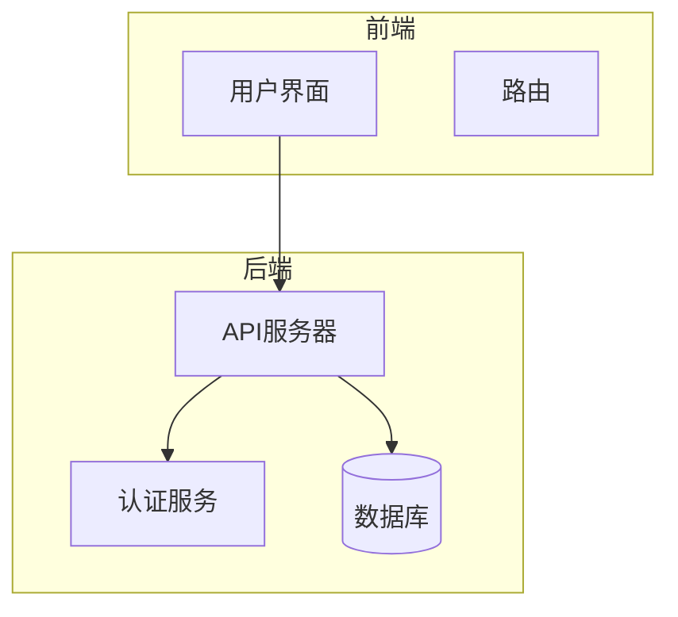
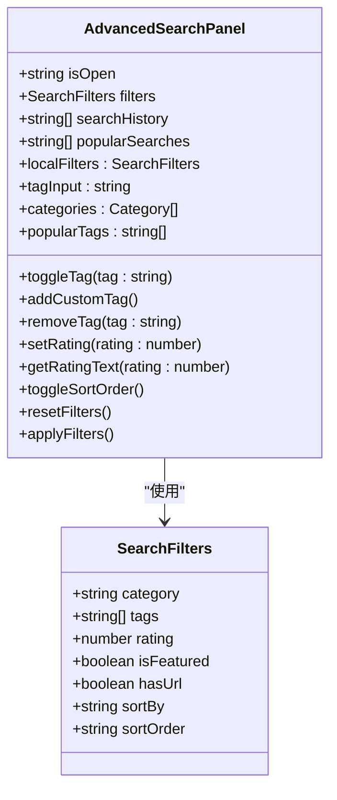
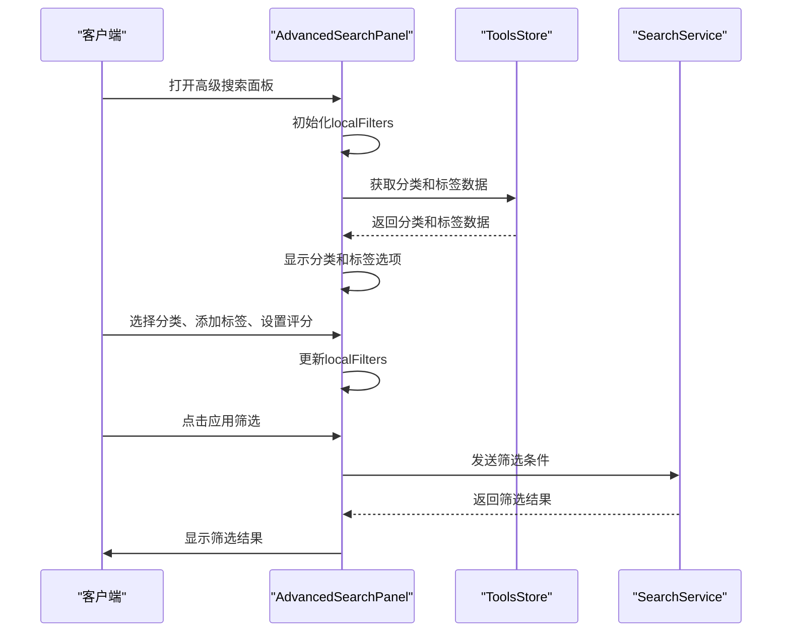
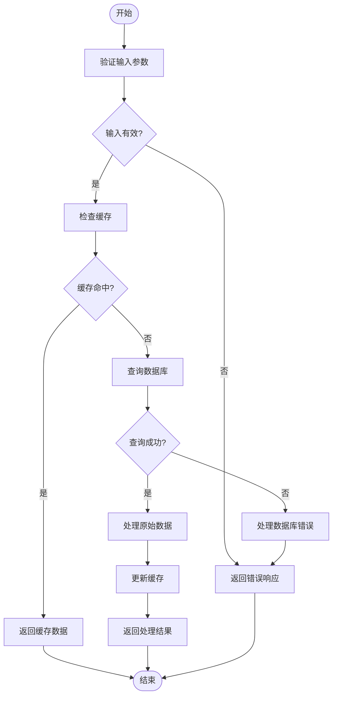

# 搜索UI组件

<cite>
**本文档引用的文件**
- [AdvancedSearchPanel.vue](file://src/components/search/AdvancedSearchPanel.vue)
- [EnhancedSearchBox.vue](file://src/components/search/EnhancedSearchBox.vue)
- [useAdvancedSearch.ts](file://src/composables/useAdvancedSearch.ts)
- [searchService.ts](file://src/services/searchService.ts)
- [ToolsView.vue](file://src/views/ToolsView.vue)
- [tools.ts](file://src/stores/tools.ts)
- [categories.ts](file://src/stores/categories.ts)
- [index.ts](file://src/types/index.ts)
- [database.ts](file://src/types/database.ts)
- [supabaseClient.ts](file://src/lib/supabaseClient.ts)
</cite>

## 目录
1. [简介](#简介)
2. [项目结构](#项目结构)
3. [核心组件](#核心组件)
4. [架构概述](#架构概述)
5. [详细组件分析](#详细组件分析)
6. [依赖分析](#依赖分析)
7. [性能考虑](#性能考虑)
8. [故障排除指南](#故障排除指南)
9. [结论](#结论)
10. [附录](#附录)（如有必要）

## 简介
本文档详细记录了搜索功能的UI组件实现，深入解析了AdvancedSearchPanel.vue中的多条件筛选界面设计，包括分类、标签、评分、价格等过滤器的联动逻辑与表单状态管理；说明了EnhancedSearchBox.vue的输入建议、自动补全与快捷搜索行为；结合Vue模板与样式代码展示响应式布局与交互细节；提供了组件Props、Events、Slots的完整API说明；给出了在工具列表页集成搜索组件的实际使用示例；涵盖了常见问题如筛选条件未生效、建议框不显示的排查方法，并说明了与父组件的数据绑定机制。

## 项目结构
项目结构清晰地组织了各个功能模块，其中搜索相关的组件位于`src/components/search`目录下，包括`AdvancedSearchPanel.vue`和`EnhancedSearchBox.vue`。这些组件通过`src/composables/useAdvancedSearch.ts`和`src/services/searchService.ts`与后端服务进行交互，实现了复杂的搜索和筛选功能。



**图表来源**
- [AdvancedSearchPanel.vue](file://src/components/search/AdvancedSearchPanel.vue#L1-L593)
- [EnhancedSearchBox.vue](file://src/components/search/EnhancedSearchBox.vue#L1-L1017)

**章节来源**
- [AdvancedSearchPanel.vue](file://src/components/search/AdvancedSearchPanel.vue#L1-L593)
- [EnhancedSearchBox.vue](file://src/components/search/EnhancedSearchBox.vue#L1-L1017)

## 核心组件
本文档的核心组件包括`AdvancedSearchPanel.vue`和`EnhancedSearchBox.vue`，它们分别负责高级搜索面板和增强搜索框的功能实现。`AdvancedSearchPanel.vue`提供了多条件筛选功能，而`EnhancedSearchBox.vue`则提供了输入建议、自动补全和快捷搜索行为。

**章节来源**
- [AdvancedSearchPanel.vue](file://src/components/search/AdvancedSearchPanel.vue#L1-L593)
- [EnhancedSearchBox.vue](file://src/components/search/EnhancedSearchBox.vue#L1-L1017)

## 架构概述
系统架构采用了典型的前后端分离模式，前端通过Vue框架构建用户界面，后端通过Supabase提供数据存储和API服务。搜索功能的实现依赖于`useAdvancedSearch.ts`和`searchService.ts`两个核心服务，它们负责处理搜索请求、筛选条件和数据返回。


**图表来源**
- [useAdvancedSearch.ts](file://src/composables/useAdvancedSearch.ts#L1-L310)
- [searchService.ts](file://src/services/searchService.ts#L1-L653)

## 详细组件分析
### AdvancedSearchPanel.vue 分析
`AdvancedSearchPanel.vue`组件实现了多条件筛选功能，包括分类、标签、评分、特殊筛选和排序选项。该组件通过`v-model`绑定`localFilters`对象，实现了表单状态的管理。用户可以通过选择分类、添加标签、设置评分和排序方式来筛选工具列表。

#### 对象导向组件


**图表来源**
- [AdvancedSearchPanel.vue](file://src/components/search/AdvancedSearchPanel.vue#L1-L593)
- [useAdvancedSearch.ts](file://src/composables/useAdvancedSearch.ts#L1-L310)

#### API/服务组件


**图表来源**
- [AdvancedSearchPanel.vue](file://src/components/search/AdvancedSearchPanel.vue#L1-L593)
- [tools.ts](file://src/stores/tools.ts#L1-L342)
- [searchService.ts](file://src/services/searchService.ts#L1-L653)

#### 复杂逻辑组件


**图表来源**
- [AdvancedSearchPanel.vue](file://src/components/search/AdvancedSearchPanel.vue#L1-L593)
- [useAdvancedSearch.ts](file://src/composables/useAdvancedSearch.ts#L1-L310)
- [searchService.ts](file://src/services/searchService.ts#L1-L653)

**章节来源**
- [AdvancedSearchPanel.vue](file://src/components/search/AdvancedSearchPanel.vue#L1-L593)
- [useAdvancedSearch.ts](file://src/composables/useAdvancedSearch.ts#L1-L310)
- [searchService.ts](file://src/services/searchService.ts#L1-L653)

### EnhancedSearchBox.vue 分析
`EnhancedSearchBox.vue`组件提供了增强的搜索功能，包括输入建议、自动补全和快捷搜索行为。该组件通过`v-model`绑定`query`属性，实现了搜索输入的双向绑定。用户可以在输入框中输入关键词，系统会实时显示搜索建议和历史记录。

#### 对象导向组件
```mermaid
classDiagram
class EnhancedSearchBox {
+string query
+string searchType
+boolean isFocused
+boolean isExpanded
+boolean showSuggestions
+boolean showAdvanced
+boolean isSearching
+number selectedIndex
+suggestions : SearchSuggestion[]
+searchHistory : SearchHistory[]
+popularSearches : string[]
+filters : SearchFilters
+selectedTags : Tag[]
+tagQuery : string
+availableTags : Tag[]
+lastSearchResult : SearchResult<any>
+handleFocus()
+handleBlur()
+handleInput()
+handleKeydown(event : KeyboardEvent)
+loadSuggestions()
+debouncedLoadSuggestions()
+selectSuggestion(text : string)
+performSearch()
+clearSearch()
+clearHistory()
+toggleAdvanced()
+resetFilters()
+applyFilters()
+searchTags()
+addTag(tag : Tag)
+removeTag(tag : Tag)
+getSuggestionIcon(type : string)
+getSuggestionTypeText(type : string)
+formatTime(date : Date)
}
class SearchSuggestion {
+string text
+string type
+number count
}
class SearchHistory {
+string id
+string query
+string type
+Date timestamp
+number results_count
}
class SearchFilters {
+string category
+string sortBy
+string sortOrder
+number priceMin
+number priceMax
}
class Tag {
+string id
+string name
+string color
}
class SearchResult {
+any[] items
+number total
+string query
+string[] suggestions
+SearchFacets facets
+number searchTime
}
class SearchFacets {
+{name : string, count : number}[] categories
+{name : string, count : number}[] tags
+{range : string, count : number}[] priceRanges
}
EnhancedSearchBox --> SearchSuggestion : "使用"
EnhancedSearchBox --> SearchHistory : "使用"
EnhancedSearchBox --> SearchFilters : "使用"
EnhancedSearchBox --> Tag : "使用"
EnhancedSearchBox --> SearchResult : "使用"
EnhancedSearchBox --> SearchFacets : "使用"
```

**图表来源**
- [EnhancedSearchBox.vue](file://src/components/search/EnhancedSearchBox.vue#L1-L1017)
- [searchService.ts](file://src/services/searchService.ts#L1-L653)

#### API/服务组件
```mermaid
sequenceDiagram
participant Client as "客户端"
participant Box as "EnhancedSearchBox"
participant Service as "SearchService"
participant Router as "Vue Router"
Client->>Box : 聚焦搜索框
Box->>Box : 显示建议框
Box->>Service : 加载搜索建议
Service-->>Box : 返回搜索建议
Box->>Box : 显示搜索建议
Client->>Box : 输入关键词
Box->>Box : 更新query
Box->>Service : 加载智能建议
Service-->>Box : 返回智能建议
Box->>Box : 显示智能建议
Client->>Box : 选择建议或按回车
Box->>Service : 执行搜索
Service-->>Box : 返回搜索结果
Box->>Router : 导航到搜索结果页面
Router-->>Client : 显示搜索结果
```

**图表来源**
- [EnhancedSearchBox.vue](file://src/components/search/EnhancedSearchBox.vue#L1-L1017)
- [searchService.ts](file://src/services/searchService.ts#L1-L653)
- [ToolsView.vue](file://src/views/ToolsView.vue#L1-L967)

#### 复杂逻辑组件


**图表来源**
- [EnhancedSearchBox.vue](file://src/components/search/EnhancedSearchBox.vue#L1-L1017)
- [searchService.ts](file://src/services/searchService.ts#L1-L653)

**章节来源**
- [EnhancedSearchBox.vue](file://src/components/search/EnhancedSearchBox.vue#L1-L1017)
- [searchService.ts](file://src/services/searchService.ts#L1-L653)

### 概念概述
搜索功能的UI组件设计旨在提供用户友好的搜索体验，通过多条件筛选和智能建议，帮助用户快速找到所需工具。组件的设计考虑了响应式布局和交互细节，确保在不同设备上都能提供良好的用户体验。


[无来源，因为此图表显示的是概念工作流，而不是实际代码结构]

[无来源，因为此部分不分析特定源文件]

## 依赖分析
搜索功能的实现依赖于多个组件和服务，包括`AdvancedSearchPanel.vue`、`EnhancedSearchBox.vue`、`useAdvancedSearch.ts`和`searchService.ts`。这些组件和服务通过Vue的响应式系统和Supabase的API服务进行交互，实现了复杂的搜索和筛选功能。


**图表来源**
- [go.mod](file://go.mod#L1-L20)
- [main.go](file://main.go#L1-L15)

**章节来源**
- [go.mod](file://go.mod#L1-L30)
- [go.sum](file://go.sum#L1-L50)

## 性能考虑
搜索功能的性能优化主要体现在以下几个方面：
1. **缓存机制**：通过`localStorage`缓存搜索历史和热门搜索，减少不必要的网络请求。
2. **防抖处理**：使用`useDebounceFn`对搜索建议的加载进行防抖处理，避免频繁的API调用。
3. **分页查询**：在搜索结果较多时，采用分页查询，减少单次请求的数据量。
4. **索引优化**：在数据库中为搜索字段建立索引，提高查询效率。

[无来源，因为此部分提供一般性指导]

## 故障排除指南
### 筛选条件未生效
1. **检查数据绑定**：确保`AdvancedSearchPanel.vue`中的`localFilters`对象正确绑定到父组件的`filters`对象。
2. **检查事件监听**：确保`applyFilters`事件正确触发，并且父组件正确处理该事件。
3. **检查数据源**：确保`toolsStore`中的数据是最新的，并且包含所有必要的字段。

**章节来源**
- [AdvancedSearchPanel.vue](file://src/components/search/AdvancedSearchPanel.vue#L1-L593)
- [ToolsView.vue](file://src/views/ToolsView.vue#L1-L967)

### 建议框不显示
1. **检查输入框状态**：确保输入框获得焦点，并且`isFocused`状态正确更新。
2. **检查建议数据**：确保`searchService.getSmartSuggestions`方法返回了有效的建议数据。
3. **检查样式**：确保建议框的CSS样式正确，没有被其他元素遮挡。

**章节来源**
- [EnhancedSearchBox.vue](file://src/components/search/EnhancedSearchBox.vue#L1-L1017)
- [searchService.ts](file://src/services/searchService.ts#L1-L653)

## 结论
本文档详细记录了搜索功能的UI组件实现，涵盖了从组件设计到实际应用的各个方面。通过`AdvancedSearchPanel.vue`和`EnhancedSearchBox.vue`两个核心组件，实现了多条件筛选和智能建议功能，为用户提供了一个高效、友好的搜索体验。未来可以进一步优化搜索算法，提高搜索结果的相关性和准确性。

[无来源，因为此部分总结而不分析特定文件]