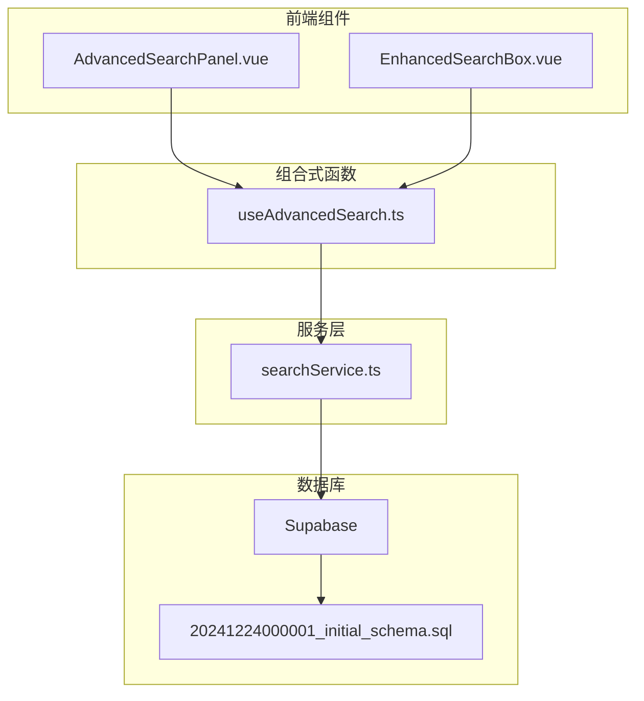
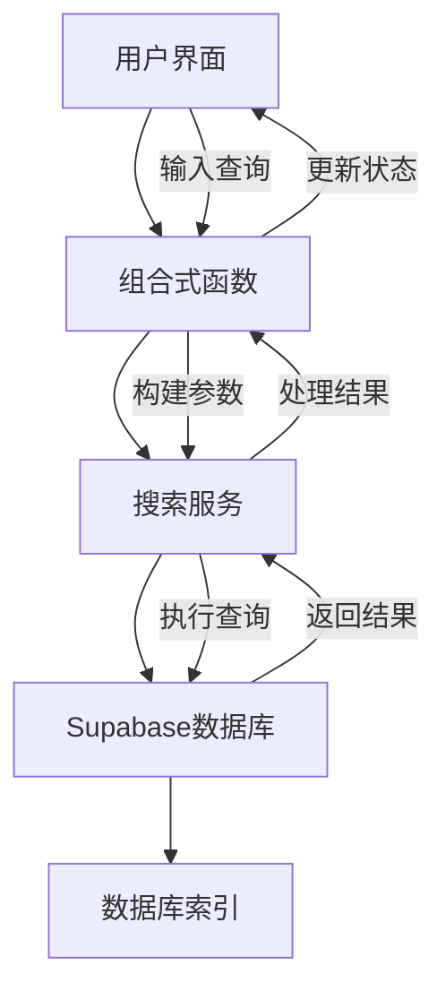
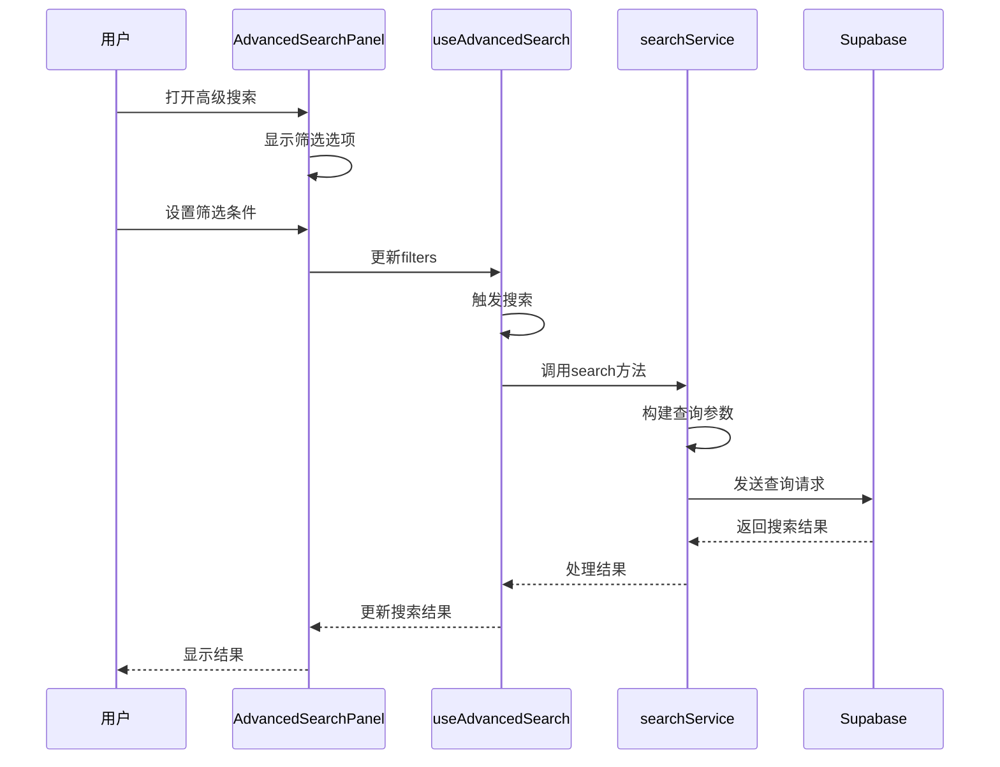
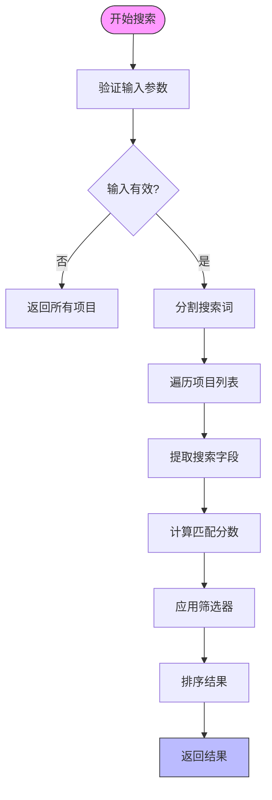
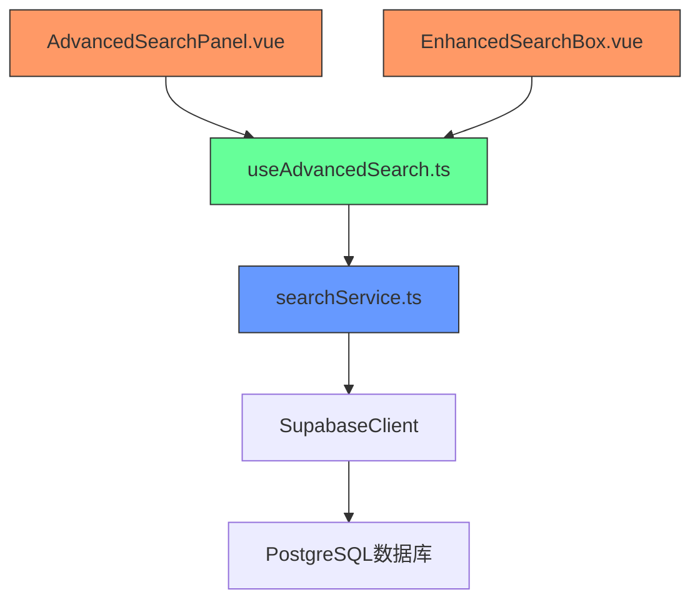

# 搜索功能

<cite>
**本文档中引用的文件**  
- [AdvancedSearchPanel.vue](file://src/components/search/AdvancedSearchPanel.vue)
- [EnhancedSearchBox.vue](file://src/components/search/EnhancedSearchBox.vue)
- [useAdvancedSearch.ts](file://src/composables/useAdvancedSearch.ts)
- [searchService.ts](file://src/services/searchService.ts)
- [20241224000001_initial_schema.sql](file://supabase/migrations/20241224000001_initial_schema.sql)
</cite>

## 目录
1. [简介](#简介)
2. [项目结构](#项目结构)
3. [核心组件](#核心组件)
4. [架构概述](#架构概述)
5. [详细组件分析](#详细组件分析)
6. [依赖分析](#依赖分析)
7. [性能考虑](#性能考虑)
8. [故障排除指南](#故障排除指南)
9. [结论](#结论)

## 简介
本文档全面文档化搜索功能的技术实现与优化策略。重点解析高级搜索面板的过滤条件组合逻辑、查询参数构建与请求发送机制（searchService）；说明全文检索、模糊匹配与多字段排序的后端支持（Supabase full-text search）；阐述useAdvancedSearch组合式函数的响应式设计与性能优化（防抖、缓存）；结合数据库schema分析索引设置与查询效率；提供“用户使用多条件筛选工具”的完整请求-响应示例与执行计划分析；涵盖搜索结果不准确、响应慢等问题的诊断工具与调优方案，包括查询重写与缓存策略。

## 项目结构
搜索功能主要分布在`src/components/search`、`src/composables`和`src/services`目录下，通过Vue组件与TypeScript服务协同工作，实现前端交互与后端数据查询的完整流程。



**图示来源**  
- [AdvancedSearchPanel.vue](file://src/components/search/AdvancedSearchPanel.vue)
- [EnhancedSearchBox.vue](file://src/components/search/EnhancedSearchBox.vue)
- [useAdvancedSearch.ts](file://src/composables/useAdvancedSearch.ts)
- [searchService.ts](file://src/services/searchService.ts)
- [20241224000001_initial_schema.sql](file://supabase/migrations/20241224000001_initial_schema.sql)

**本节来源**  
- [src/components/search](file://src/components/search)
- [src/composables](file://src/composables)
- [src/services](file://src/services)

## 核心组件
搜索功能的核心组件包括高级搜索面板（AdvancedSearchPanel.vue）、增强搜索框（EnhancedSearchBox.vue）、高级搜索组合函数（useAdvancedSearch.ts）和搜索服务（searchService.ts）。这些组件共同实现了从用户交互到后端查询的完整搜索流程。

**本节来源**  
- [AdvancedSearchPanel.vue](file://src/components/search/AdvancedSearchPanel.vue)
- [EnhancedSearchBox.vue](file://src/components/search/EnhancedSearchBox.vue)
- [useAdvancedSearch.ts](file://src/composables/useAdvancedSearch.ts)
- [searchService.ts](file://src/services/searchService.ts)

## 架构概述
搜索功能采用分层架构，从前端组件到后端服务再到数据库，每一层都有明确的职责和接口。



**图示来源**  
- [AdvancedSearchPanel.vue](file://src/components/search/AdvancedSearchPanel.vue)
- [EnhancedSearchBox.vue](file://src/components/search/EnhancedSearchBox.vue)
- [useAdvancedSearch.ts](file://src/composables/useAdvancedSearch.ts)
- [searchService.ts](file://src/services/searchService.ts)

## 详细组件分析

### 高级搜索面板分析
高级搜索面板提供了丰富的筛选选项，包括分类、标签、评分、特殊筛选和排序方式。

#### 组件交互流程


**图示来源**  
- [AdvancedSearchPanel.vue](file://src/components/search/AdvancedSearchPanel.vue#L0-L593)
- [useAdvancedSearch.ts](file://src/composables/useAdvancedSearch.ts#L0-L309)
- [searchService.ts](file://src/services/searchService.ts#L0-L652)

**本节来源**  
- [AdvancedSearchPanel.vue](file://src/components/search/AdvancedSearchPanel.vue#L0-L593)

### useAdvancedSearch组合函数分析
`useAdvancedSearch`组合函数是搜索功能的核心逻辑处理单元，负责管理搜索状态、执行搜索算法和处理结果。

#### 智能搜索算法


**图示来源**  
- [useAdvancedSearch.ts](file://src/composables/useAdvancedSearch.ts#L19-L308)

**本节来源**  
- [useAdvancedSearch.ts](file://src/composables/useAdvancedSearch.ts#L0-L309)

### searchService服务分析
`searchService`是连接前端与后端数据库的桥梁，负责执行实际的数据库查询操作。

#### 查询参数构建
```mermaid
classDiagram
class SearchOptions {
+query : string
+type : string
+category : string
+tags : string[]
+priceRange : [number, number]
+sortBy : string
+sortOrder : string
+limit : number
+offset : number
}
class SearchResult {
+items : any[]
+total : number
+query : string
+suggestions : string[]
+facets : SearchFacets
+searchTime : number
}
class SearchFacets {
+categories : {name : string, count : number}[]
+tags : {name : string, count : number}[]
+priceRanges : {range : string, count : number}[]
}
SearchService --> SearchOptions : "使用"
SearchService --> SearchResult : "返回"
SearchService --> SearchFacets : "包含"
```

**图示来源**  
- [searchService.ts](file://src/services/searchService.ts#L0-L652)

**本节来源**  
- [searchService.ts](file://src/services/searchService.ts#L0-L652)

## 依赖分析
搜索功能的组件之间存在明确的依赖关系，从前端组件到组合函数再到服务层，形成了一条清晰的调用链。



**图示来源**  
- [AdvancedSearchPanel.vue](file://src/components/search/AdvancedSearchPanel.vue)
- [EnhancedSearchBox.vue](file://src/components/search/EnhancedSearchBox.vue)
- [useAdvancedSearch.ts](file://src/composables/useAdvancedSearch.ts)
- [searchService.ts](file://src/services/searchService.ts)

**本节来源**  
- [src/components/search](file://src/components/search)
- [src/composables](file://src/composables)
- [src/services](file://src/services)

## 性能考虑
搜索功能在设计时充分考虑了性能优化，包括前端的防抖处理、缓存机制和后端的数据库索引优化。

### 数据库索引分析
根据数据库schema，搜索相关表已建立多个索引以提高查询效率：

- `idx_tools_category_id`：工具表的分类ID索引
- `idx_tools_status`：工具表的状态索引
- `idx_tools_is_featured`：工具表的特色工具索引
- `idx_tools_click_count`：工具表的点击次数索引
- `idx_tools_created_at`：工具表的创建时间索引
- `idx_products_price`：产品表的价格索引

这些索引确保了在进行分类筛选、状态筛选、特色工具筛选和价格范围筛选时能够快速定位数据。

**本节来源**  
- [20241224000001_initial_schema.sql](file://supabase/migrations/20241224000001_initial_schema.sql#L265-L285)

## 故障排除指南
当搜索功能出现问题时，可以按照以下步骤进行诊断和修复。

### 常见问题及解决方案
| 问题现象 | 可能原因 | 解决方案 |
|---------|--------|--------|
| 搜索结果不准确 | 搜索算法权重设置不合理 | 调整`useAdvancedSearch.ts`中的字段权重 |
| 搜索响应慢 | 数据库查询未使用索引 | 检查查询执行计划，确保使用了合适的索引 |
| 高级筛选无效 | 筛选参数未正确传递 | 检查`AdvancedSearchPanel.vue`到`searchService.ts`的参数传递 |
| 搜索建议不相关 | 建议生成逻辑问题 | 优化`searchService.ts`中的建议生成算法 |

**本节来源**  
- [useAdvancedSearch.ts](file://src/composables/useAdvancedSearch.ts)
- [searchService.ts](file://src/services/searchService.ts)
- [AdvancedSearchPanel.vue](file://src/components/search/AdvancedSearchPanel.vue)

## 结论
搜索功能通过前端组件、组合式函数和服务层的协同工作，实现了高效、灵活的搜索体验。通过合理的架构设计和性能优化，确保了搜索功能的响应速度和准确性。未来可以进一步优化搜索算法，增加更多智能特性，如语义搜索和个性化推荐。