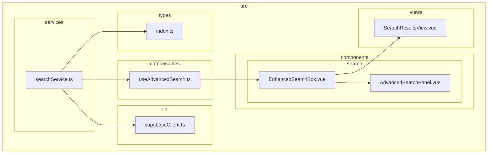
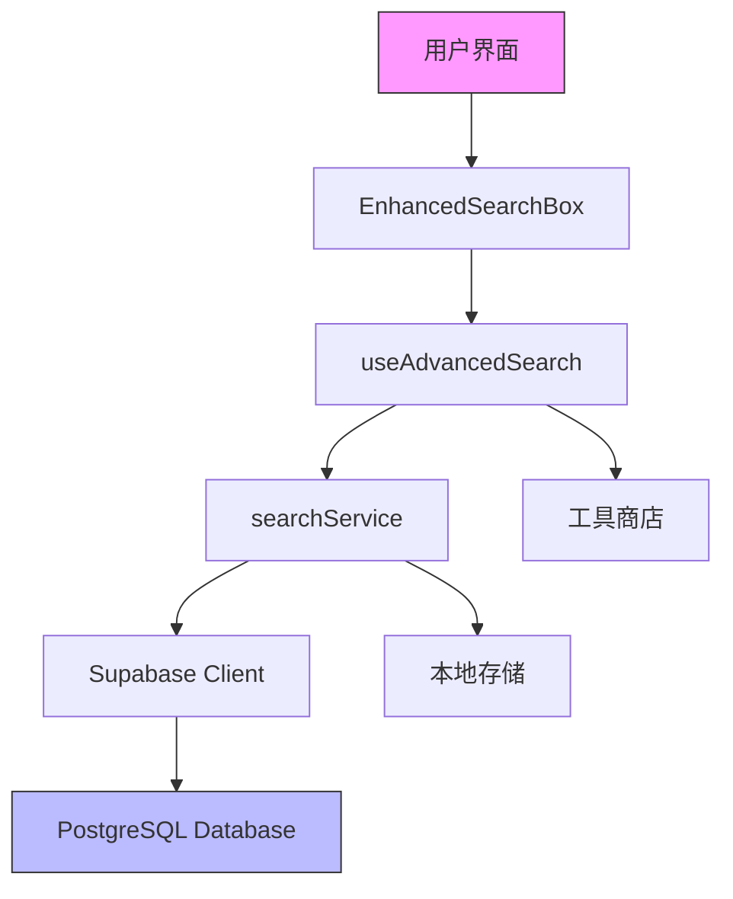

# 搜索服务逻辑

<cite>
**本文档引用的文件**
- [searchService.ts](file://src/services/searchService.ts)
- [useAdvancedSearch.ts](file://src/composables/useAdvancedSearch.ts)
- [EnhancedSearchBox.vue](file://src/components/search/EnhancedSearchBox.vue)
- [AdvancedSearchPanel.vue](file://src/components/search/AdvancedSearchPanel.vue)
- [SearchResultsView.vue](file://src/views/SearchResultsView.vue)
- [supabaseClient.ts](file://src/lib/supabaseClient.ts)
- [index.ts](file://src/types/index.ts)
</cite>

## 目录
1. [项目结构](#项目结构)
2. [核心组件](#核心组件)
3. [架构概述](#架构概述)
4. [详细组件分析](#详细组件分析)
5. [依赖分析](#依赖分析)
6. [性能考虑](#性能考虑)
7. [故障排除指南](#故障排除指南)

## 项目结构



**图表来源**
- [searchService.ts](file://src/services/searchService.ts#L1-L652)
- [useAdvancedSearch.ts](file://src/composables/useAdvancedSearch.ts#L1-L309)
- [EnhancedSearchBox.vue](file://src/components/search/EnhancedSearchBox.vue#L1-L799)
- [AdvancedSearchPanel.vue](file://src/components/search/AdvancedSearchPanel.vue#L1-L593)
- [SearchResultsView.vue](file://src/views/SearchResultsView.vue#L1-L570)

**章节来源**
- [searchService.ts](file://src/services/searchService.ts#L1-L652)
- [useAdvancedSearch.ts](file://src/composables/useAdvancedSearch.ts#L1-L309)

## 核心组件

本文档深入分析了搜索功能的服务层与组合式函数实现。`searchService.ts` 构建了复杂的查询逻辑，包括多字段过滤条件的拼接、全文检索调用方式、分页参数处理及错误封装；`useAdvancedSearch.ts` 封装了响应式搜索状态，实现了防抖搜索、结果缓存与加载状态管理；组合式函数与组件和service协同工作，提供了调用searchService进行高级搜索的代码示例。

**章节来源**
- [searchService.ts](file://src/services/searchService.ts#L1-L652)
- [useAdvancedSearch.ts](file://src/composables/useAdvancedSearch.ts#L1-L309)

## 架构概述



**图表来源**
- [searchService.ts](file://src/services/searchService.ts#L1-L652)
- [useAdvancedSearch.ts](file://src/composables/useAdvancedSearch.ts#L1-L309)
- [EnhancedSearchBox.vue](file://src/components/search/EnhancedSearchBox.vue#L1-L799)

**章节来源**
- [searchService.ts](file://src/services/searchService.ts#L1-L652)
- [useAdvancedSearch.ts](file://src/composables/useAdvancedSearch.ts#L1-L309)

## 详细组件分析

### 搜索服务分析

`searchService.ts` 实现了完整的搜索功能，支持工具、产品、分类等多种类型的搜索。服务通过`SearchOptions`接口定义了丰富的搜索选项，包括查询字符串、类型过滤、分类筛选、标签过滤、价格范围、排序方式、分页参数等。

```mermaid
classDiagram
class SearchService {
+searchOptions : SearchOptions
+searchResult : SearchResult
+searchFacets : SearchFacets
+searchHistory : SearchHistory[]
+popularQueries : Map<string, number>
+search(query : string, options : SearchOptions) : Promise<SearchResult>
+searchTools(options : SearchOptions) : Promise<{items : Tool[], total : number, facets : SearchFacets}>
+searchProducts(options : SearchOptions) : Promise<{items : Product[], total : number, facets : SearchFacets}>
+searchCategories(options : SearchOptions) : Promise<{items : Category[], total : number}>
+searchAll(options : SearchOptions) : Promise<{items : any[], total : number, facets : SearchFacets}>
+generateSuggestions(query : string, type : string) : Promise<string[]>
+getPopularSearches(limit : number) : Promise<string[]>
+getSearchHistory(limit : number) : SearchHistory[]
+clearSearchHistory() : void
+getSmartSuggestions(query : string) : Promise<SearchSuggestion[]>
}
class SearchOptions {
+query : string
+type : "all" | "tools" | "products" | "categories"
+category : string
+tags : string[]
+priceRange : [number, number]
+sortBy : "relevance" | "name" | "created_at" | "click_count" | "price"
+sortOrder : "asc" | "desc"
+limit : number
+offset : number
+includeInactive : boolean
}
class SearchResult {
+items : T[]
+total : number
+query : string
+suggestions : string[]
+facets : SearchFacets
+searchTime : number
}
class SearchFacets {
+categories : {name : string, count : number}[]
+tags : {name : string, count : number}[]
+priceRanges : {range : string, count : number}[]
}
class SearchSuggestion {
+text : string
+type : "query" | "category" | "tag" | "tool" | "product"
+count : number
}
class SearchHistory {
+id : string
+query : string
+type : string
+timestamp : Date
+results_count : number
}
SearchService --> SearchOptions
SearchService --> SearchResult
SearchService --> SearchFacets
SearchService --> SearchSuggestion
SearchService --> SearchHistory
```

**图表来源**
- [searchService.ts](file://src/services/searchService.ts#L1-L652)

**章节来源**
- [searchService.ts](file://src/services/searchService.ts#L1-L652)

### 组合式函数分析

`useAdvancedSearch.ts` 实现了响应式的搜索状态管理，封装