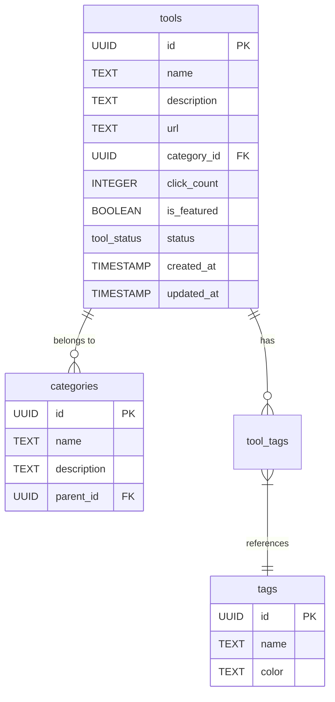
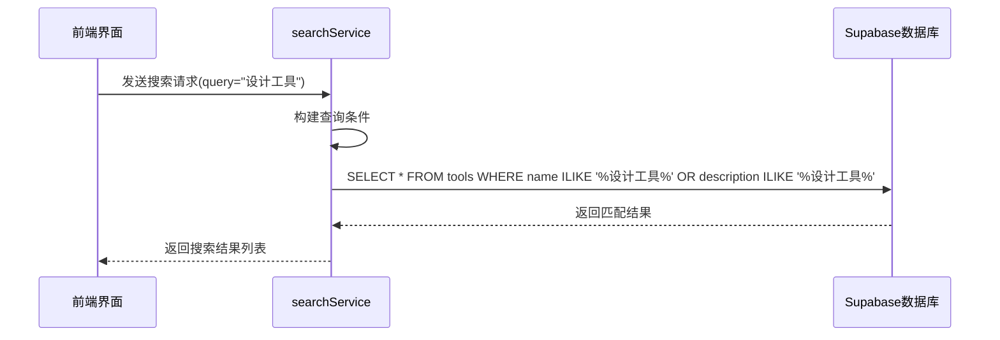
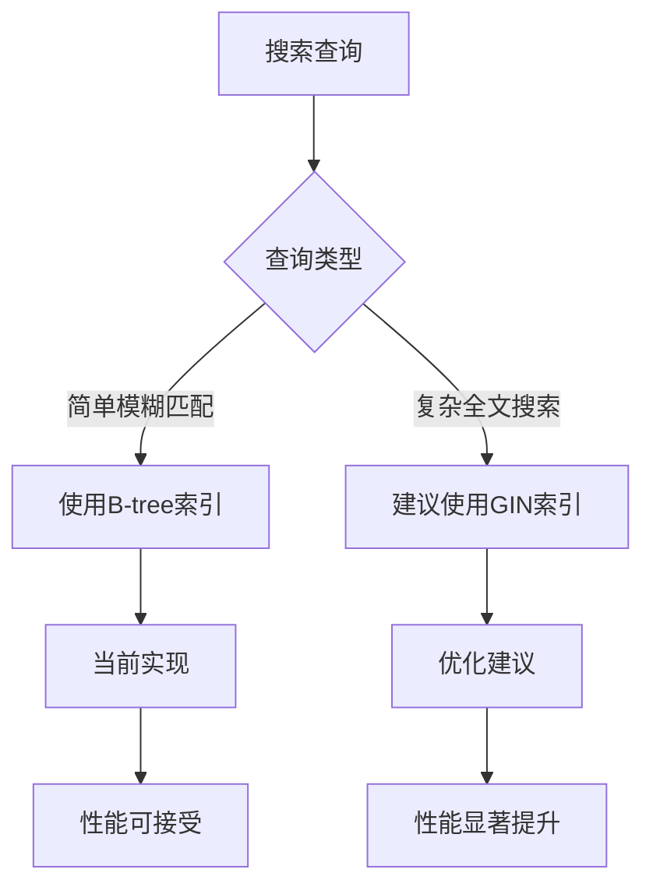
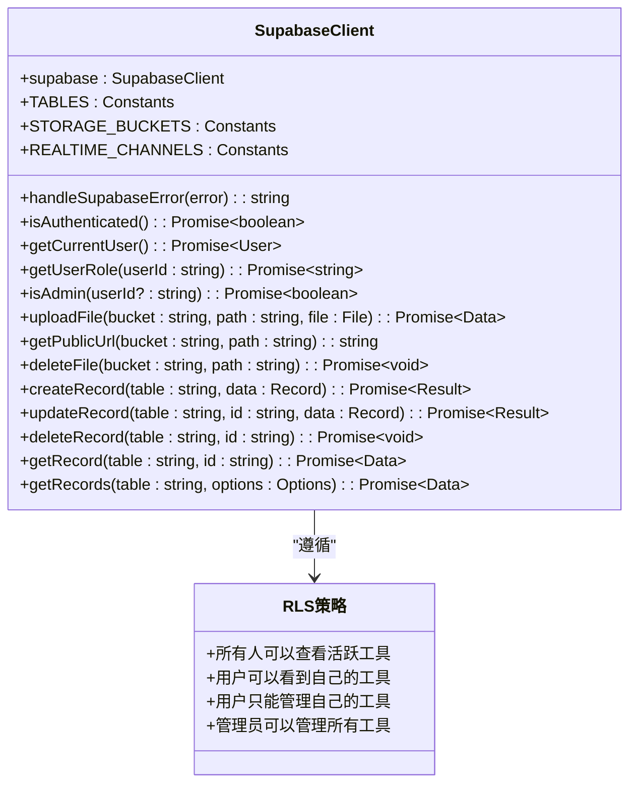
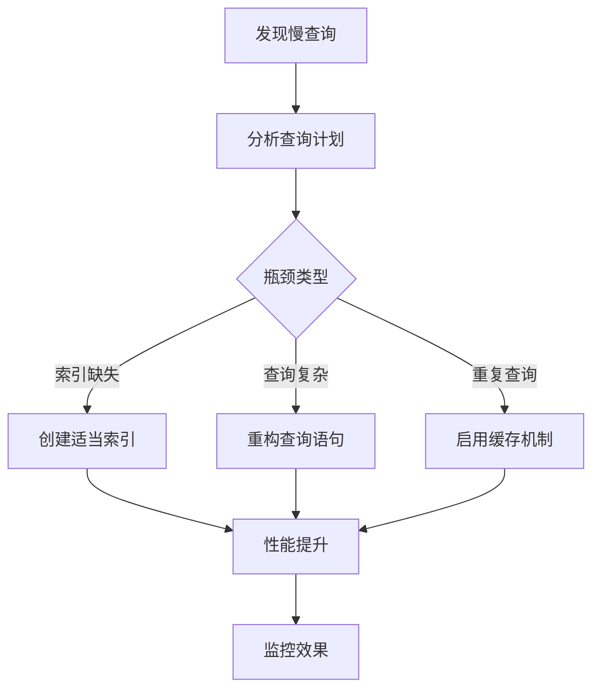

# 数据库集成与查询优化

<cite>
**本文档引用的文件**
- [20241224000001_initial_schema.sql](file://supabase/migrations/20241224000001_initial_schema.sql)
- [supabaseClient.ts](file://src/lib/supabaseClient.ts)
- [toolsService.ts](file://src/services/toolsService.ts)
- [searchService.ts](file://src/services/searchService.ts)
- [20250101000002_fix_schema_issues.sql](file://supabase/migrations/20250101000002_fix_schema_issues.sql)
</cite>

## 目录
1. [引言](#引言)
2. [工具表结构设计与索引策略](#工具表结构设计与索引策略)
3. [全文检索实现机制](#全文检索实现机制)
4. [查询计划与GIN索引优化](#查询计划与gin索引优化)
5. [安全性控制与性能考量](#安全性控制与性能考量)
6. [慢查询诊断与优化手段](#慢查询诊断与优化手段)
7. [搜索性能最佳实践](#搜索性能最佳实践)
8. [结论](#结论)

## 引言
本文档深入分析了基于Supabase的搜索功能在数据库层面的实现与性能优化策略。通过研究`tools`表的结构设计、全文检索机制、查询计划优化以及安全性控制，全面阐述了如何构建高效、安全的搜索系统。文档重点分析了用于搜索的关键字段（如name、description、category、tags）及其索引策略，解释了如何利用Supabase的全文检索功能实现高效的模糊匹配，并提供了慢查询的诊断方法和优化建议。

## 工具表结构设计与索引策略
`tools`表是系统中存储工具信息的核心表，其结构设计充分考虑了搜索功能的需求。表中包含多个用于搜索的关键字段，包括`name`（工具名称）、`description`（描述）、`category_id`（分类ID）和状态字段`status`。



**图源**
- [20241224000001_initial_schema.sql](file://supabase/migrations/20241224000001_initial_schema.sql#L1-L285)

**本节来源**
- [20241224000001_initial_schema.sql](file://supabase/migrations/20241224000001_initial_schema.sql#L1-L285)

## 全文检索实现机制
系统通过Supabase客户端结合PostgreSQL的模糊匹配功能实现了高效的全文检索。搜索功能主要在`toolsService.ts`和`searchService.ts`中实现，利用`ilike`操作符进行不区分大小写的模糊匹配。

当用户执行搜索时，系统会构建一个包含多个搜索条件的查询，主要针对`name`和`description`字段进行匹配。查询通过`or`操作符连接多个条件，实现跨字段的全文检索。



**图源**
- [toolsService.ts](file://src/services/toolsService.ts#L43-L90)
- [searchService.ts](file://src/services/searchService.ts#L139-L188)

**本节来源**
- [toolsService.ts](file://src/services/toolsService.ts#L43-L90)
- [searchService.ts](file://src/services/searchService.ts#L139-L188)

## 查询计划与GIN索引优化
为了优化搜索查询的性能，系统在多个关键字段上创建了适当的索引。虽然初始架构中未直接为`name`和`description`字段创建GIN（Generalized Inverted Index）索引，但系统通过复合索引和常规B-tree索引来优化查询性能。

在`20250101000002_fix_schema_issues.sql`迁移文件中，系统添加了多个复合索引，这些索引对于优化带有多个过滤条件的搜索查询至关重要：

```sql
-- 工具表按分类和状态的复合索引
CREATE INDEX IF NOT EXISTS idx_tools_category_status ON tools(category_id, status);
-- 产品表按分类和状态的复合索引
CREATE INDEX IF NOT EXISTS idx_products_category_status ON products(category_id, status);
-- 产品表按价格和状态的复合索引
CREATE INDEX IF NOT EXISTS idx_products_price_status ON products(price, status);
```

这些复合索引能够显著提高同时包含分类筛选和状态过滤的查询性能。对于全文检索场景，虽然当前实现主要依赖`ilike`操作符，但可以通过创建GIN索引来进一步优化模糊搜索性能。



**图源**
- [20250101000002_fix_schema_issues.sql](file://supabase/migrations/20250101000002_fix_schema_issues.sql#L152-L176)

**本节来源**
- [20250101000002_fix_schema_issues.sql](file://supabase/migrations/20250101000002_fix_schema_issues.sql#L152-L176)

## 安全性控制与性能考量
系统通过Supabase的行级安全（RLS）策略和客户端的安全控制机制，确保搜索功能的安全性和性能平衡。在`supabaseClient.ts`中，系统定义了统一的数据库访问接口，并通过RLS策略控制数据访问权限。



**图源**
- [supabaseClient.ts](file://src/lib/supabaseClient.ts#L0-L266)
- [20250101000002_fix_schema_issues.sql](file://supabase/migrations/20250101000002_fix_schema_issues.sql#L64-L94)

**本节来源**
- [supabaseClient.ts](file://src/lib/supabaseClient.ts#L0-L266)
- [20250101000002_fix_schema_issues.sql](file://supabase/migrations/20250101000002_fix_schema_issues.sql#L64-L94)

## 慢查询诊断与优化手段
针对可能出现的慢查询问题，系统提供了多种诊断和优化手段。首先，可以通过分析查询计划（Query Plan）来识别性能瓶颈。对于包含模糊搜索的查询，建议考虑以下优化策略：

1. **查询重写**：将多个`or`条件的模糊搜索重构为更高效的查询模式
2. **索引调整**：为频繁搜索的字段创建适当的索引
3. **缓存策略**：利用前端缓存减少对数据库的重复查询

在`toolsService.ts`中，系统已经实现了基于缓存的优化机制，通过`withCache`装饰器对搜索结果进行缓存，有效减少了数据库的负载。



**图源**
- [toolsService.ts](file://src/services/toolsService.ts#L43-L90)
- [databaseService.ts](file://src/services/databaseService.ts#L303-L367)

**本节来源**
- [toolsService.ts](file://src/services/toolsService.ts#L43-L90)
- [databaseService.ts](file://src/services/databaseService.ts#L303-L367)

## 搜索性能最佳实践
为了确保搜索功能的高性能，建议遵循以下最佳实践：

1. **合理使用索引**：为经常用于搜索和过滤的字段创建索引，特别是复合索引
2. **实施缓存策略**：对频繁访问的搜索结果进行缓存，减少数据库查询次数
3. **优化查询语句**：避免在查询中使用不必要的复杂条件，简化查询逻辑
4. **监控查询性能**：定期分析慢查询日志，及时发现和解决性能问题
5. **考虑全文搜索扩展**：对于复杂的全文检索需求，可以考虑使用PostgreSQL的`tsvector`和`tsquery`功能

系统已经在多个层面实现了这些最佳实践，如通过复合索引优化查询性能，通过缓存机制减少数据库负载，通过RLS策略确保数据安全。

## 结论
本文档详细分析了搜索功能在数据库层面的实现与优化策略。通过合理的表结构设计、有效的索引策略、安全的访问控制和性能优化措施，系统实现了高效、安全的搜索功能。未来可以考虑引入更高级的全文检索技术，如PostgreSQL的`tsvector`，以进一步提升搜索的准确性和性能。