# 核心功能模块

<cite>
**本文档引用的文件**  
- [authService.ts](file://src/services/authService.ts)
- [userService.ts](file://src/services/userService.ts)
- [favoritesService.ts](file://src/services/favoritesService.ts)
- [orderService.ts](file://src/services/orderService.ts)
- [searchService.ts](file://src/services/searchService.ts)
- [notificationService.ts](file://src/services/notificationService.ts)
- [useAdvancedSearch.ts](file://src/composables/useAdvancedSearch.ts)
- [RegisterView.vue](file://src/views/auth/RegisterView.vue)
- [LoginView.vue](file://src/views/auth/LoginView.vue)
- [ForgotPasswordView.vue](file://src/views/auth/ForgotPasswordView.vue)
- [ProfileView.vue](file://src/views/user/ProfileView.vue)
- [FavoritesView.vue](file://src/views/user/FavoritesView.vue)
- [OrdersView.vue](file://src/views/user/OrdersView.vue)
- [PaymentView.vue](file://src/views/PaymentView.vue)
- [DashboardView.vue](file://src/views/admin/DashboardView.vue)
- [UserManagementView.vue](file://src/views/admin/UserManagementView.vue)
- [ProductManagementView.vue](file://src/views/admin/ProductManagementView.vue)
- [OrderManagementView.vue](file://src/views/admin/OrderManagementView.vue)
- [NotificationCenter.vue](file://src/components/notifications/NotificationCenter.vue)
- [NotificationSettings.vue](file://src/components/notifications/NotificationSettings.vue)
- [ToolsView.vue](file://src/views/ToolsView.vue)
- [ProductsView.vue](file://src/views/ProductsView.vue)
- [SearchResultsView.vue](file://src/views/SearchResultsView.vue)
- [database.ts](file://src/types/database.ts)
</cite>

## 目录
1. [用户系统](#用户系统)
2. [工具导航模块](#工具导航模块)
3. [产品商城模块](#产品商城模块)
4. [管理后台](#管理后台)
5. [通知系统](#通知系统)
6. [搜索功能](#搜索功能)

## 用户系统

### 注册流程
用户注册功能通过 `RegisterView.vue` 组件实现，结合 `authService.ts` 中的注册逻辑。注册表单包含邮箱、密码、确认密码、姓名和同意条款等字段。密码强度通过实时计算反馈给用户，确保安全性。注册时会检查用户名可用性，并在 Supabase 数据库中创建用户账户和对应资料。

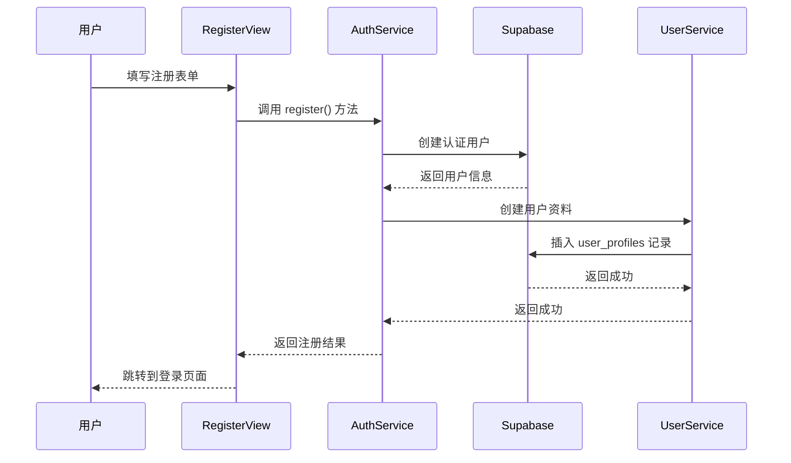
```mermaid
sequenceDiagram
participant 用户
participant RegisterView
participant AuthService
participant Supabase
用户->>RegisterView : 填写注册表单
RegisterView->>AuthService : 调用 register() 方法
AuthService->>Supabase : 创建认证用户
Supabase-->>AuthService : 返回用户信息
AuthService->>UserService : 创建用户资料
UserService->>Supabase : 插入 user_profiles 记录
Supabase-->>UserService : 返回成功
UserService-->>AuthService : 返回成功
AuthService-->>RegisterView : 返回注册结果
RegisterView-->>用户 : 跳转到登录页面
```

**图示来源**  
- [RegisterView.vue](file://src/views/auth/RegisterView.vue)
- [authService.ts](file://src/services/authService.ts)
- [userService.ts](file://src/services/userService.ts)

**本节来源**  
- [RegisterView.vue](file://src/views/auth/RegisterView.vue#L0-L440)
- [authService.ts](file://src/services/authService.ts#L45-L120)

### 登录流程
登录功能由 `LoginView.vue` 组件和 `authService.ts` 协同完成。用户输入邮箱和密码后，系统调用 Supabase 的认证接口进行验证。登录成功后会更新用户的最后登录时间，并获取完整的用户资料信息。支持"记住我"功能，可保持用户会话。

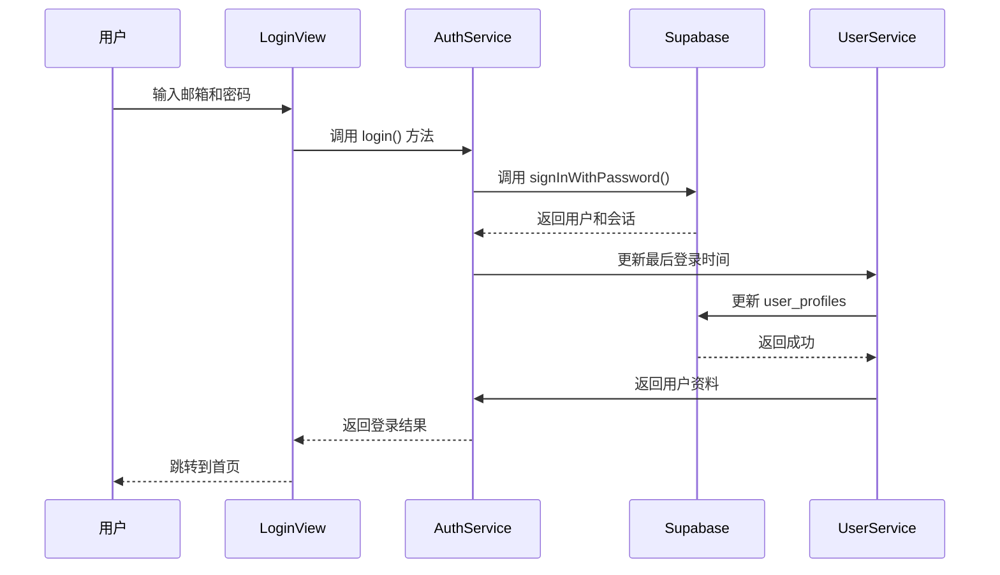
```mermaid
sequenceDiagram
participant 用户
participant LoginView
participant AuthService
participant Supabase
用户->>LoginView : 输入邮箱和密码
LoginView->>AuthService : 调用 login() 方法
AuthService->>Supabase : 调用 signInWithPassword()
Supabase-->>AuthService : 返回用户和会话
AuthService->>UserService : 更新最后登录时间
UserService->>Supabase : 更新 user_profiles
Supabase-->>UserService : 返回成功
UserService->>AuthService : 返回用户资料
AuthService-->>LoginView : 返回登录结果
LoginView-->>用户 : 跳转到首页
```

**图示来源**  
- [LoginView.vue](file://src/views/auth/LoginView.vue)
- [authService.ts](file://src/services/authService.ts)

**本节来源**  
- [LoginView.vue](file://src/views/auth/LoginView.vue#L0-L324)
- [authService.ts](file://src/services/authService.ts#L1-L44)

### 密码重置流程
密码重置功能通过 `ForgotPasswordView.vue` 实现。用户输入注册邮箱后，系统发送包含重置链接的邮件。为防止滥用，设置了60秒的重发冷却时间。该功能利用 Supabase 的密码重置机制，确保安全性。

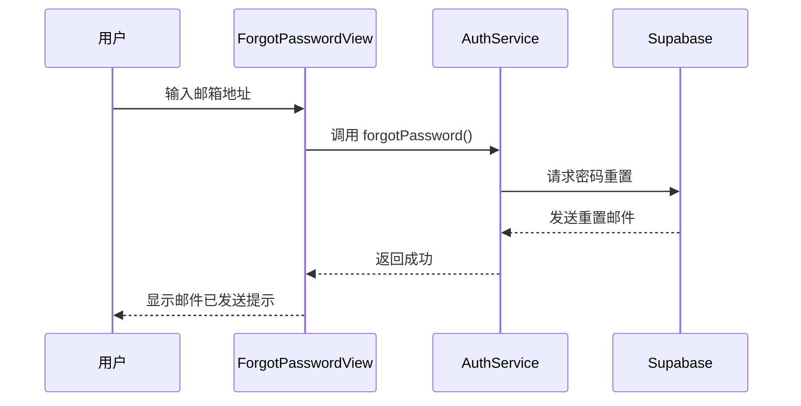
```mermaid
sequenceDiagram
participant 用户
participant ForgotPasswordView
participant AuthService
participant Supabase
用户->>ForgotPasswordView : 输入邮箱地址
ForgotPasswordView->>AuthService : 调用 forgotPassword()
AuthService->>Supabase : 请求密码重置
Supabase-->>AuthService : 发送重置邮件
AuthService-->>ForgotPasswordView : 返回成功
ForgotPasswordView-->>用户 : 显示邮件已发送提示
```

**图示来源**  
- [ForgotPasswordView.vue](file://src/views/auth/ForgotPasswordView.vue)
- [authService.ts](file://src/services/authService.ts)

**本节来源**  
- [ForgotPasswordView.vue](file://src/views/auth/ForgotPasswordView.vue#L0-L346)

### 个人中心管理
个人中心包含收藏、订单和资料编辑功能，分别由 `ProfileView.vue`、`FavoritesView.vue` 和 `OrdersView.vue` 组件实现。

#### 资料编辑
`ProfileView.vue` 允许用户编辑个人信息，包括姓名、用户名、简介、网站和位置等。支持头像上传功能，通过文件输入控件实现。

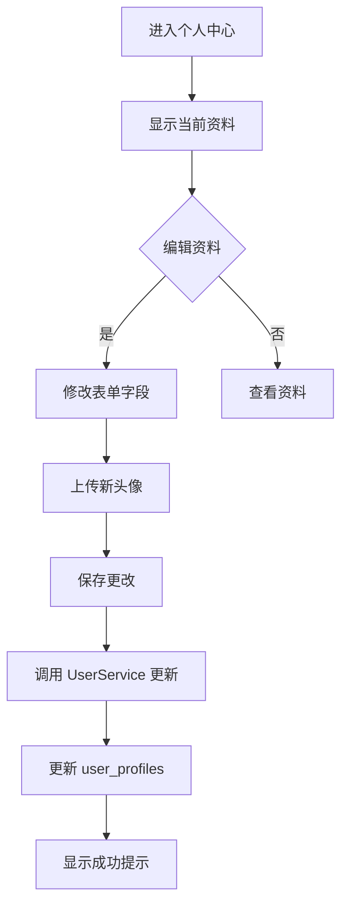
```mermaid
flowchart TD
A[进入个人中心] --> B[显示当前资料]
B --> C{编辑资料}
C --> |是| D[修改表单字段]
D --> E[上传新头像]
E --> F[保存更改]
F --> G[调用 UserService 更新]
G --> H[更新 user_profiles]
H --> I[显示成功提示]
C --> |否| J[查看资料]
```

**图示来源**  
- [ProfileView.vue](file://src/views/user/ProfileView.vue)
- [userService.ts](file://src/services/userService.ts)

**本节来源**  
- [ProfileView.vue](file://src/views/user/ProfileView.vue#L0-L44)
- [userService.ts](file://src/services/userService.ts#L47-L174)

#### 收藏管理
`FavoritesView.vue` 展示用户收藏的工具和产品。通过 `favoritesService.ts` 提供的接口，用户可以添加、移除和清空收藏。

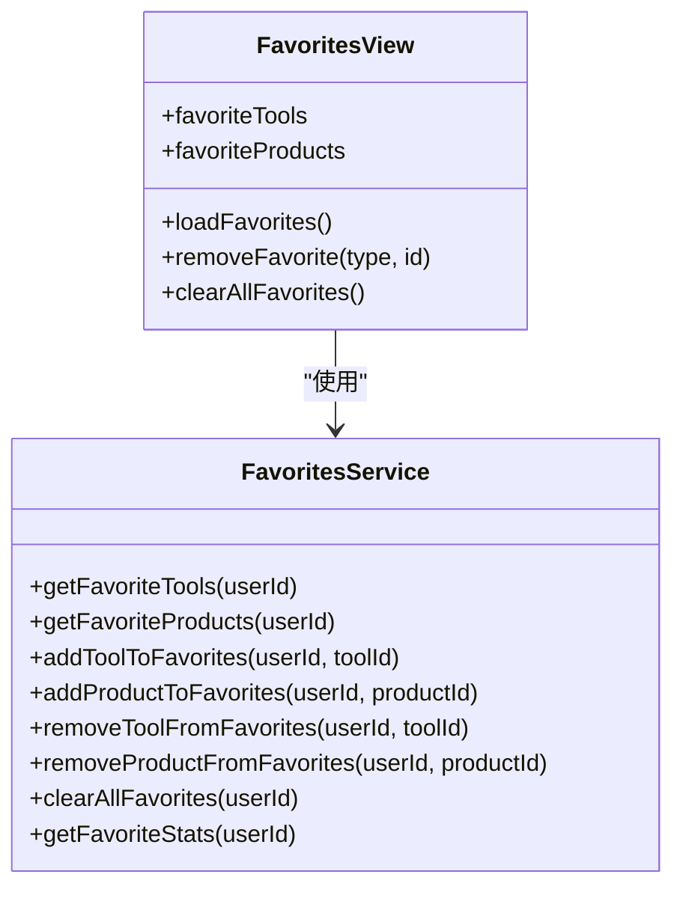
```mermaid
classDiagram
class FavoritesService {
+getFavoriteTools(userId)
+getFavoriteProducts(userId)
+addToolToFavorites(userId, toolId)
+addProductToFavorites(userId, productId)
+removeToolFromFavorites(userId, toolId)
+removeProductFromFavorites(userId, productId)
+clearAllFavorites(userId)
+getFavoriteStats(userId)
}
class FavoritesView {
+favoriteTools
+favoriteProducts
+loadFavorites()
+removeFavorite(type, id)
+clearAllFavorites()
}
FavoritesView --> FavoritesService : "使用"
```

**图示来源**  
- [FavoritesView.vue](file://src/views/user/FavoritesView.vue)
- [favoritesService.ts](file://src/services/favoritesService.ts)

**本节来源**  
- [FavoritesView.vue](file://src/views/user/FavoritesView.vue#L73-L308)
- [favoritesService.ts](file://src/services/favoritesService.ts#L0-L340)

#### 订单管理
`OrdersView.vue` 展示用户的订单历史，包括待支付、已支付和已取消的订单。用户可以查看订单详情、下载已购产品或取消待支付订单。

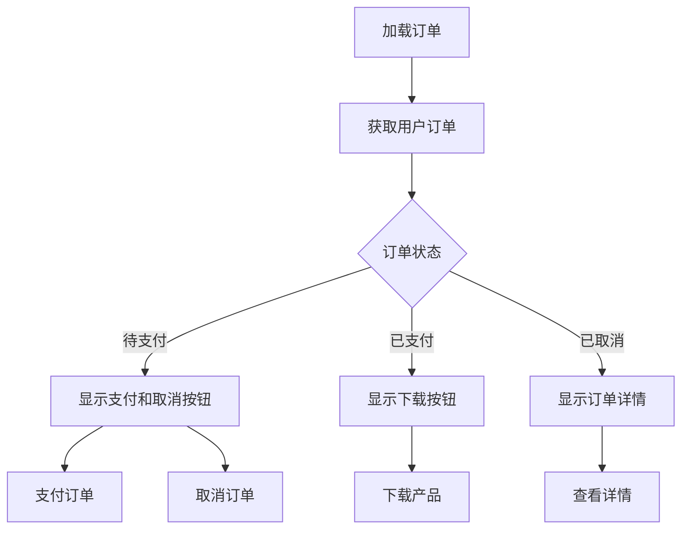
```mermaid
flowchart TD
A[加载订单] --> B[获取用户订单]
B --> C{订单状态}
C --> |待支付| D[显示支付和取消按钮]
C --> |已支付| E[显示下载按钮]
C --> |已取消| F[显示订单详情]
D --> G[支付订单]
D --> H[取消订单]
E --> I[下载产品]
F --> J[查看详情]
```

**图示来源**  
- [OrdersView.vue](file://src/views/user/OrdersView.vue)
- [orderService.ts](file://src/services/orderService.ts)

**本节来源**  
- [OrdersView.vue](file://src/views/user/OrdersView.vue#L73-L240)
- [orderService.ts](file://src/services/orderService.ts#L266-L391)

## 工具导航模块

### 分类浏览
工具导航支持按分类浏览，用户可以通过点击分类标签查看该分类下的所有工具。分类信息存储在 `categories` 表中，包含名称、描述、图标和颜色等属性。

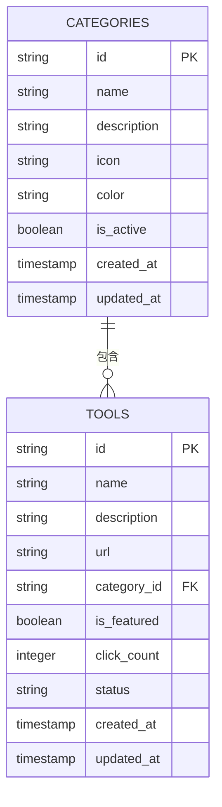
```mermaid
erDiagram
CATEGORIES ||--o{ TOOLS : "包含"
CATEGORIES {
string id PK
string name
string description
string icon
string color
boolean is_active
timestamp created_at
timestamp updated_at
}
TOOLS {
string id PK
string name
string description
string url
string category_id FK
boolean is_featured
integer click_count
string status
timestamp created_at
timestamp updated_at
}
```

**图示来源**  
- [database.ts](file://src/types/database.ts)
- [ToolsView.vue](file://src/views/ToolsView.vue)

**本节来源**  
- [database.ts](file://src/types/database.ts#L168-L220)
- [ToolsView.vue](file://src/views/ToolsView.vue#L229-L281)

### 评分与收藏
每个工具都显示评分和收藏状态。用户可以通过点击星标按钮收藏或取消收藏工具。收藏状态实时更新，提升用户体验。

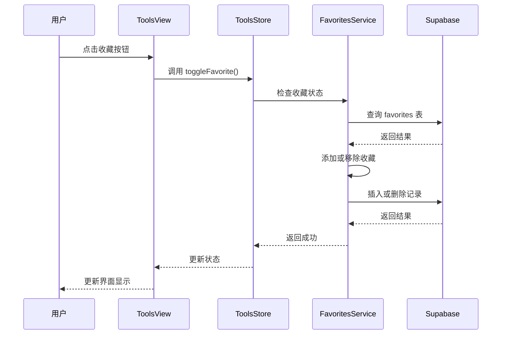
```mermaid
sequenceDiagram
participant 用户
participant ToolsView
participant ToolsStore
participant FavoritesService
participant Supabase
用户->>ToolsView : 点击收藏按钮
ToolsView->>ToolsStore : 调用 toggleFavorite()
ToolsStore->>FavoritesService : 检查收藏状态
FavoritesService->>Supabase : 查询 favorites 表
Supabase-->>FavoritesService : 返回结果
FavoritesService->>FavoritesService : 添加或移除收藏
FavoritesService->>Supabase : 插入或删除记录
Supabase-->>FavoritesService : 返回结果
FavoritesService-->>ToolsStore : 返回成功
ToolsStore-->>ToolsView : 更新状态
ToolsView-->>用户 : 更新界面显示
```

**图示来源**  
- [ToolsView.vue](file://src/views/ToolsView.vue)
- [favoritesService.ts](file://src/services/favoritesService.ts)

**本节来源**  
- [ToolsView.vue](file://src/views/ToolsView.vue#L192-L232)
- [favoritesService.ts](file://src/services/favoritesService.ts#L110-L154)

### 高级搜索功能
工具导航提供高级搜索功能，支持按分类、标签、评分等条件筛选。搜索算法采用权重评分机制，确保相关性高的结果排在前面。

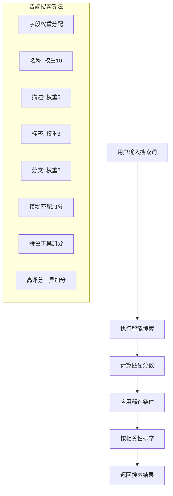
```mermaid
flowchart TD
A[用户输入搜索词] --> B[执行智能搜索]
B --> C[计算匹配分数]
C --> D[应用筛选条件]
D --> E[按相关性排序]
E --> F[返回搜索结果]
subgraph 智能搜索算法
C1[字段权重分配]
C2[名称: 权重10]
C3[描述: 权重5]
C4[标签: 权重3]
C5[分类: 权重2]
C6[模糊匹配加分]
C7[特色工具加分]
C8[高评分工具加分]
end
```

**图示来源**  
- [useAdvancedSearch.ts](file://src/composables/useAdvancedSearch.ts)
- [searchService.ts](file://src/services/searchService.ts)

**本节来源**  
- [useAdvancedSearch.ts](file://src/composables/useAdvancedSearch.ts#L0-L144)
- [searchService.ts](file://src/services/searchService.ts#L185-L242)

## 产品商城模块

### 商品展示
产品商城通过 `ProductsView.vue` 组件展示商品列表，支持分页和排序功能。每个商品显示名称、简要描述、价格和原价等信息。

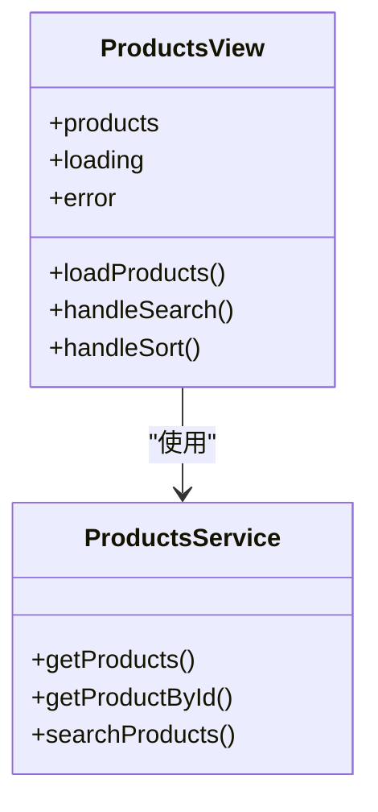
```mermaid
classDiagram
class ProductsView {
+products
+loading
+error
+loadProducts()
+handleSearch()
+handleSort()
}
class ProductsService {
+getProducts()
+getProductById()
+searchProducts()
}
ProductsView --> ProductsService : "使用"
```

**图示来源**  
- [ProductsView.vue](file://src/views/ProductsView.vue)
- [productsService.ts](file://src/services/productsService.ts)

**本节来源**  
- [ProductsView.vue](file://src/views/ProductsView.vue)
- [productsService.ts](file://src/services/productsService.ts)

### 详情页
`ProductDetailView.vue` 提供商品的详细信息，包括完整描述、特性列表、图片轮播和用户评价等。详情页还显示相关推荐商品，提升转化率。

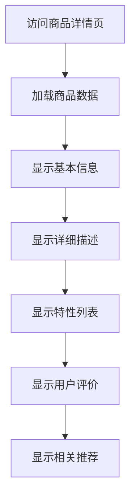
```mermaid
flowchart TD
A[访问商品详情页] --> B[加载商品数据]
B --> C[显示基本信息]
C --> D[显示详细描述]
D --> E[显示特性列表]
E --> F[显示用户评价]
F --> G[显示相关推荐]
```

**本节来源**  
- [ProductDetailView.vue](file://src/views/ProductDetailView.vue)

### 支付流程
支付流程由 `PaymentView.vue` 组件实现，支持多种支付方式，包括支付宝、微信支付和信用卡。支付流程包括订单信息确认、账单地址填写和支付方式选择。

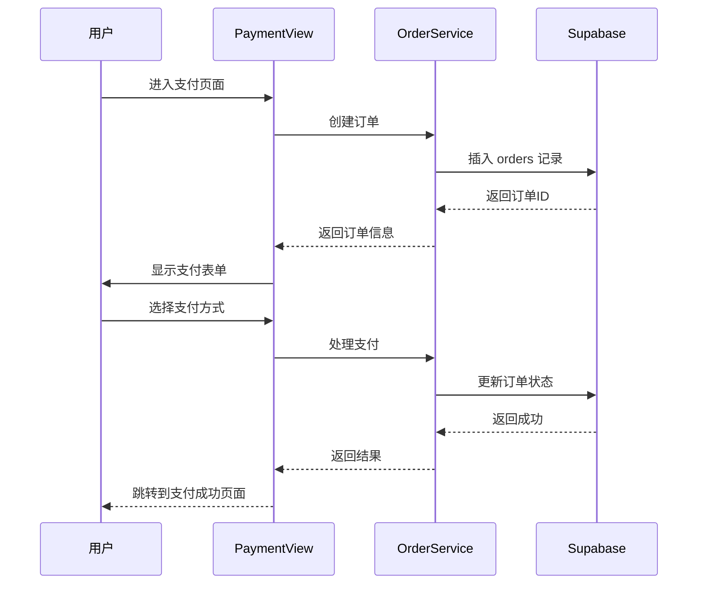
```mermaid
sequenceDiagram
participant 用户
participant PaymentView
participant OrderService
participant Supabase
用户->>PaymentView : 进入支付页面
PaymentView->>OrderService : 创建订单
OrderService->>Supabase : 插入 orders 记录
Supabase-->>OrderService : 返回订单ID
OrderService-->>PaymentView : 返回订单信息
PaymentView->>用户 : 显示支付表单
用户->>PaymentView : 选择支付方式
PaymentView->>OrderService : 处理支付
OrderService->>Supabase : 更新订单状态
Supabase-->>OrderService : 返回成功
OrderService-->>PaymentView : 返回结果
PaymentView-->>用户 : 跳转到支付成功页面
```

**图示来源**  
- [PaymentView.vue](file://src/views/PaymentView.vue)
- [orderService.ts](file://src/services/orderService.ts)

**本节来源**  
- [PaymentView.vue](file://src/views/PaymentView.vue#L0-L302)
- [orderService.ts](file://src/services/orderService.ts#L353-L391)

### 订单管理
订单管理功能允许用户查看订单历史、下载已购产品和取消待支付订单。订单状态包括待支付、已支付、已取消和已退款。

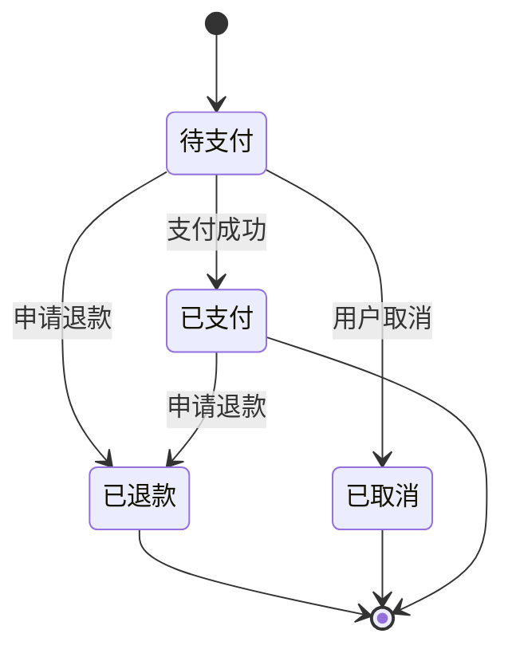
```mermaid
stateDiagram-v2
[*] --> 待支付
待支付 --> 已支付 : 支付成功
待支付 --> 已取消 : 用户取消
待支付 --> 已退款 : 申请退款
已支付 --> 已退款 : 申请退款
已退款 --> [*]
已取消 --> [*]
已支付 --> [*]
```

**本节来源**  
- [OrdersView.vue](file://src/views/user/OrdersView.vue)
- [orderService.ts](file://src/services/orderService.ts)

## 管理后台

### 仪表盘
管理后台的仪表盘 (`DashboardView.vue`) 提供系统关键指标的可视化展示，包括用户增长、收入趋势、热门工具和最近订单等。

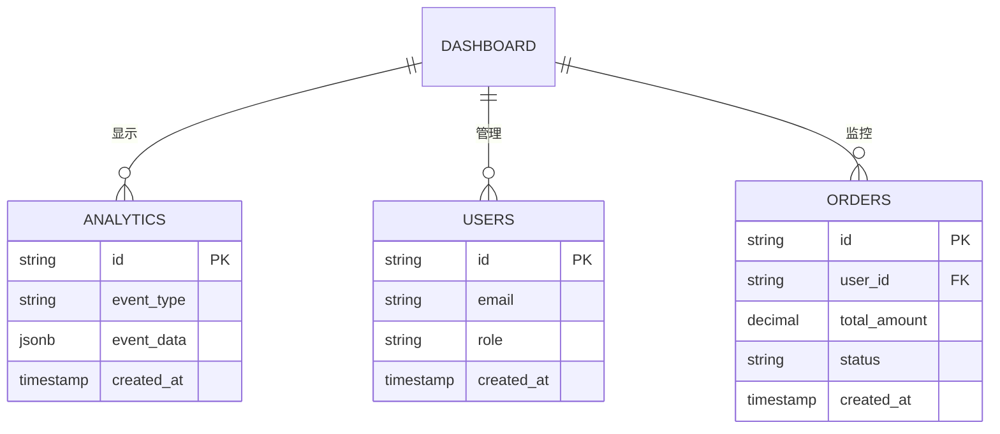
```mermaid
erDiagram
DASHBOARD ||--o{ ANALYTICS : "显示"
DASHBOARD ||--o{ USERS : "管理"
DASHBOARD ||--o{ ORDERS : "监控"
ANALYTICS {
string id PK
string event_type
jsonb event_data
timestamp created_at
}
USERS {
string id PK
string email
string role
timestamp created_at
}
ORDERS {
string id PK
string user_id FK
decimal total_amount
string status
timestamp created_at
}
```

**本节来源**  
- [DashboardView.vue](file://src/views/admin/DashboardView.vue)

### 工具管理
管理员可以通过 `AdminToolsView.vue` 管理工具，包括添加、编辑和删除工具。工具管理界面支持批量操作和高级筛选。

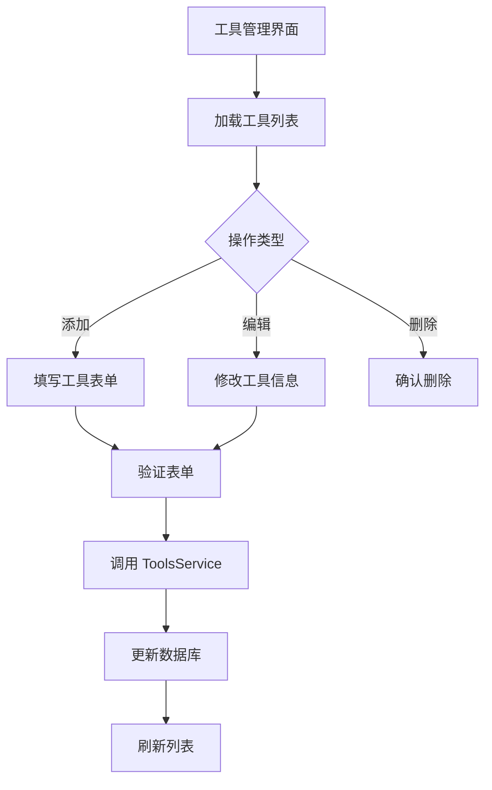
```mermaid
flowchart TD
A[工具管理界面] --> B[加载工具列表]
B --> C{操作类型}
C --> |添加| D[填写工具表单]
C --> |编辑| E[修改工具信息]
C --> |删除| F[确认删除]
D --> G[验证表单]
E --> G
G --> H[调用 ToolsService]
H --> I[更新数据库]
I --> J[刷新列表]
```

**本节来源**  
- [AdminToolsView.vue](file://src/views/AdminToolsView.vue)
- [ToolForm.vue](file://src/components/admin/ToolForm.vue)

### 产品管理
产品管理功能 (`ProductManagementView.vue`) 允许管理员管理商品信息，包括价格、库存、分类和状态等。支持上传产品图片和设置下载链接。

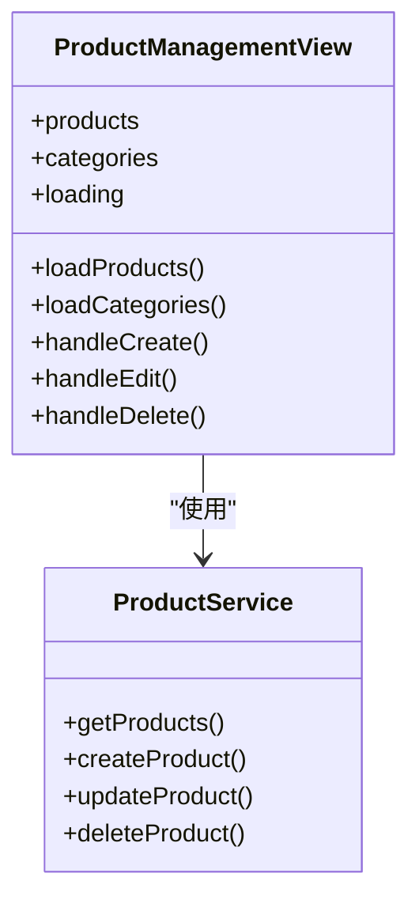
```mermaid
classDiagram
class ProductManagementView {
+products
+categories
+loading
+loadProducts()
+loadCategories()
+handleCreate()
+handleEdit()
+handleDelete()
}
class ProductService {
+getProducts()
+createProduct()
+updateProduct()
+deleteProduct()
}
ProductManagementView --> ProductService : "使用"
```

**本节来源**  
- [ProductManagementView.vue](file://src/views/admin/ProductManagementView.vue)
- [productsService.ts](file://src/services/productsService.ts)

### 用户管理
用户管理界面 (`UserManagementView.vue`) 提供用户列表展示和管理功能，支持按角色、状态和注册时间筛选。管理员可以查看用户详情、修改角色和禁用账户。

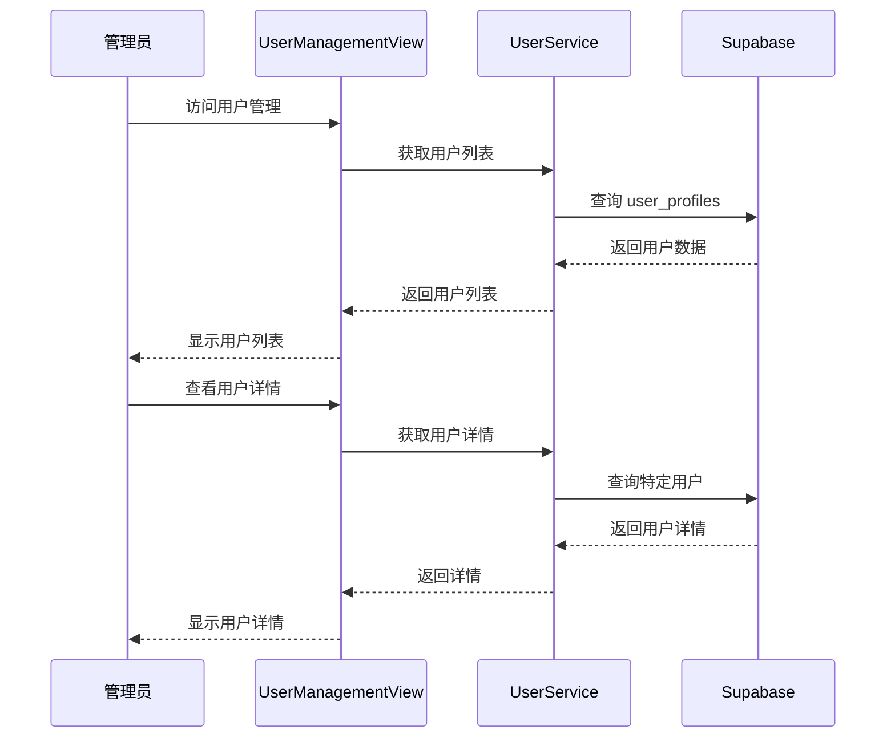
```mermaid
sequenceDiagram
participant 管理员
participant UserManagementView
participant UserService
participant Supabase
管理员->>UserManagementView : 访问用户管理
UserManagementView->>UserService : 获取用户列表
UserService->>Supabase : 查询 user_profiles
Supabase-->>UserService : 返回用户数据
UserService-->>UserManagementView : 返回用户列表
UserManagementView-->>管理员 : 显示用户列表
管理员->>UserManagementView : 查看用户详情
UserManagementView->>UserService : 获取用户详情
UserService->>Supabase : 查询特定用户
Supabase-->>UserService : 返回用户详情
UserService-->>UserManagementView : 返回详情
UserManagementView-->>管理员 : 显示用户详情
```

**图示来源**  
- [UserManagementView.vue](file://src/views/admin/UserManagementView.vue)
- [userService.ts](file://src/services/userService.ts)

**本节来源**  
- [UserManagementView.vue](file://src/views/admin/UserManagementView.vue)
- [userService.ts](file://src/services/userService.ts#L175-L266)

### 订单管理
订单管理界面 (`OrderManagementView.vue`) 允许管理员查看所有订单、更新订单状态和处理退款请求。支持按状态、支付方式和时间范围筛选订单。

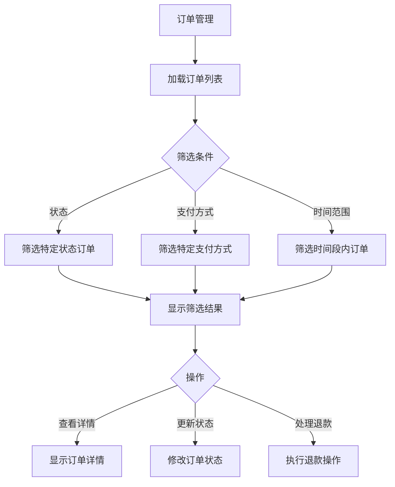
```mermaid
flowchart TD
A[订单管理] --> B[加载订单列表]
B --> C{筛选条件}
C --> |状态| D[筛选特定状态订单]
C --> |支付方式| E[筛选特定支付方式]
C --> |时间范围| F[筛选时间段内订单]
D --> G[显示筛选结果]
E --> G
F --> G
G --> H{操作}
H --> |查看详情| I[显示订单详情]
H --> |更新状态| J[修改订单状态]
H --> |处理退款| K[执行退款操作]
```

**本节来源**  
- [OrderManagementView.vue](file://src/views/admin/OrderManagementView.vue)
- [orderService.ts](file://src/services/orderService.ts)

## 通知系统

### 实时消息推送
通知系统通过 `NotificationCenter.vue` 组件实现，支持实时消息推送。系统利用 Supabase 的实时功能，当有新通知时立即推送给用户。

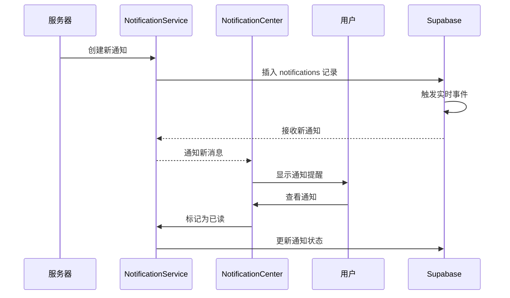
```mermaid
sequenceDiagram
participant 服务器
participant NotificationService
participant NotificationCenter
participant 用户
服务器->>NotificationService : 创建新通知
NotificationService->>Supabase : 插入 notifications 记录
Supabase->>Supabase : 触发实时事件
Supabase-->>NotificationService : 接收新通知
NotificationService-->>NotificationCenter : 通知新消息
NotificationCenter->>用户 : 显示通知提醒
用户->>NotificationCenter : 查看通知
NotificationCenter->>NotificationService : 标记为已读
NotificationService->>Supabase : 更新通知状态
```

**图示来源**  
- [NotificationCenter.vue](file://src/components/notifications/NotificationCenter.vue)
- [notificationService.ts](file://src/services/notificationService.ts)

**本节来源**  
- [NotificationCenter.vue](file://src/components/notifications/NotificationCenter.vue#L301-L405)
- [notificationService.ts](file://src/services/notificationService.ts#L352-L404)

### 未读状态管理
系统精确管理通知的未读状态，用户查看通知后会自动标记为已读。通知中心显示未读通知数量，帮助用户了解消息状态。

```mermaid
flowchart TD
A[用户打开通知中心] --> B[加载通知列表]
B --> C[过滤未读通知]
C --> D[显示未读数量]
D --> E{查看通知}
E --> |是| F[标记为已读]
F --> G[更新本地状态]
G --> H[调用 markAsRead()]
H --> I[更新数据库]
I --> J[刷新未读计数]
E --> |否| K[保持未读状态]
```

**本节来源**  
- [NotificationCenter.vue](file://src/components/notifications/NotificationCenter.vue#L255-L303)

### 设置界面
通知设置界面 (`NotificationSettings.vue`) 允许用户自定义接收哪些类型的通知，包括邮件通知、浏览器通知、系统通知等。还支持设置免打扰时间段。

```mermaid
classDiagram
class NotificationSettings {
+preferences
+loading
+saving
+loadSettings()
+saveSettings()
+resetToDefault()
}
class NotificationPreferences {
+email_notifications : boolean
+push_notifications : boolean
+system_notifications : boolean
+product_notifications : boolean
+order_notifications : boolean
+quiet_hours_start : string
+quiet_hours_end : string
}
NotificationSettings --> NotificationPreferences : "管理"
```

**图示来源**  
- [NotificationSettings.vue](file://src/components/notifications/NotificationSettings.vue)
- [notificationService.ts](file://src/services/notificationService.ts)

**本节来源**  
- [NotificationSettings.vue](file://src/components/notifications/NotificationSettings.vue#L0-L173)
- [notificationService.ts](file://src/services/notificationService.ts#L352-L404)

## 搜索功能

### 全文检索
搜索功能支持全文检索，可以在工具名称、描述、标签和分类中搜索关键词。搜索算法采用多字段匹配策略，确保搜索结果的相关性。

```mermaid
flowchart TD
A[用户输入搜索词] --> B[解析搜索条件]
B --> C[执行全文搜索]
C --> D[匹配名称字段]
D --> E[匹配描述字段]
E --> F[匹配标签字段]
F --> G[匹配分类字段]
G --> H[合并搜索结果]
H --> I[按相关性排序]
I --> J[返回最终结果]
```

**本节来源**  
- [searchService.ts](file://src/services/searchService.ts#L185-L242)

### 过滤条件
搜索功能提供多种过滤条件，包括分类、标签、评分和价格范围等。用户可以组合多个条件进行精确筛选。

```mermaid
classDiagram
class SearchFilters {
+category : string
+tags : string[]
+rating : number
+isFeatured : boolean
+hasUrl : boolean
+sortBy : string
+sortOrder : string
+priceMin : number
+priceMax : number
}
class SearchService {
+searchTools()
+searchProducts()
+searchCategories()
+applyFilters()
+sortResults()
}
SearchService --> SearchFilters : "使用"
```

**图示来源**  
- [useAdvancedSearch.ts](file://src/composables/useAdvancedSearch.ts)
- [searchService.ts](file://src/services/searchService.ts)

**本节来源**  
- [useAdvancedSearch.ts](file://src/composables/useAdvancedSearch.ts#L0-L53)
- [searchService.ts](file://src/services/searchService.ts#L238-L293)

### 性能优化策略
为提升搜索性能，系统采用了多种优化策略，包括数据库索引、查询缓存和分页加载等。

```mermaid
flowchart TD
A[搜索请求] --> B{缓存检查}
B --> |命中| C[返回缓存结果]
B --> |未命中| D[执行数据库查询]
D --> E[应用复合索引]
E --> F[返回分页结果]
F --> G[存入缓存]
G --> H[返回结果]
subgraph 数据库优化
E1[创建GIN索引]
E2[创建复合索引]
E3[优化查询语句]
end
```

**本节来源**  
- [supabase_deploy_fixed.sql](file://scripts/database/supabase_deploy_fixed.sql#L82-L122)
- [databaseService.ts](file://src/services/databaseService.ts#L51-L99)
- [supabase_complete_deploy.sql](file://scripts/database/supabase_complete_deploy.sql#L82-L122)