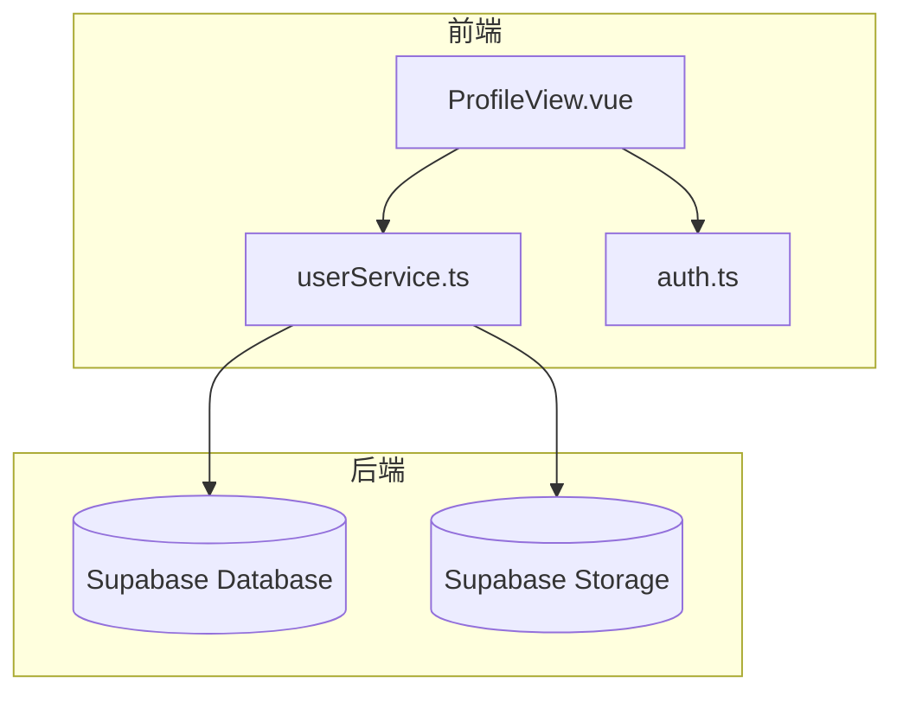
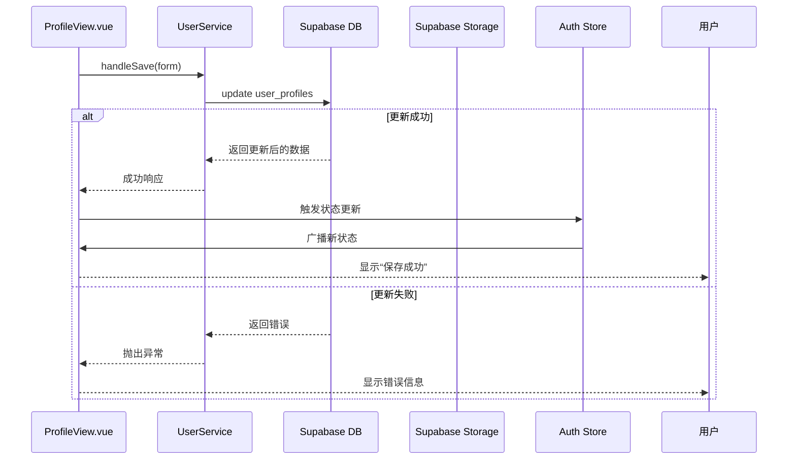
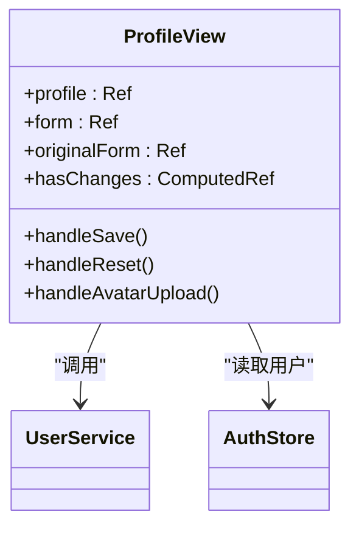
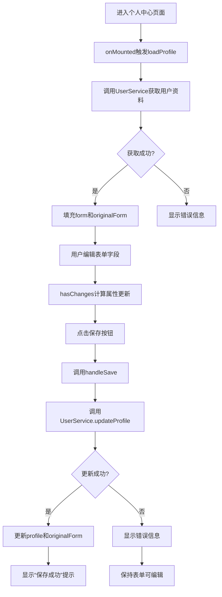
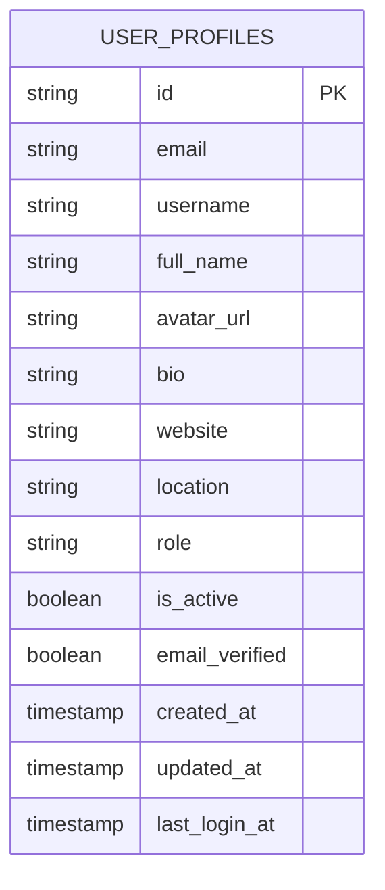
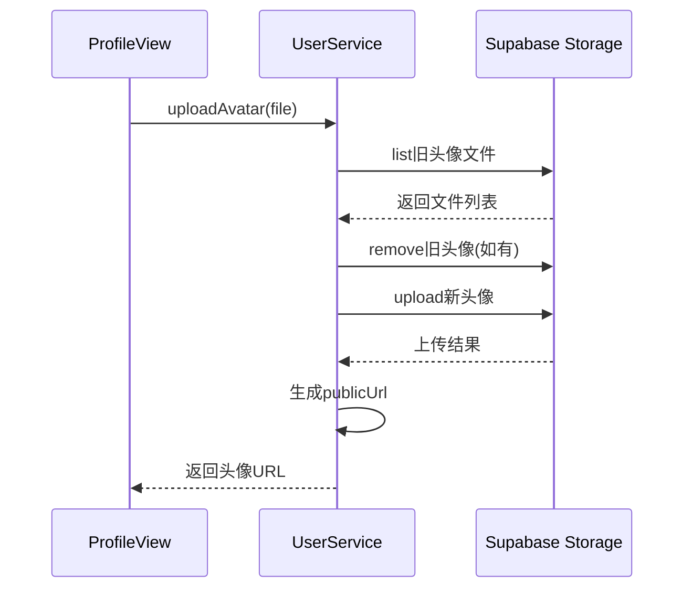
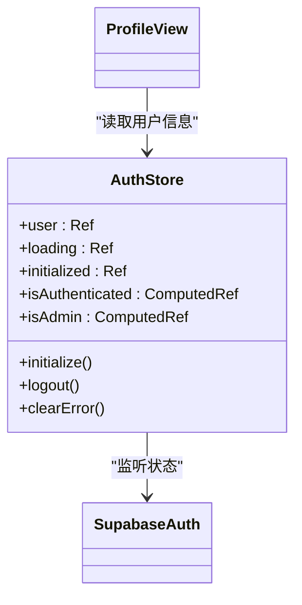
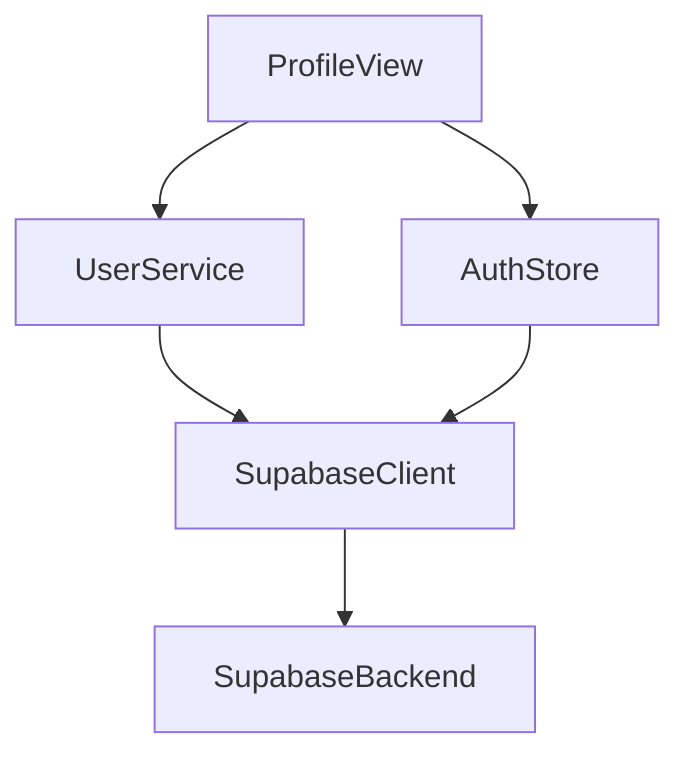

# 个人中心管理

<cite>
**本文档引用文件**  
- [ProfileView.vue](file://src/views/user/ProfileView.vue)
- [userService.ts](file://src/services/userService.ts)
- [auth.ts](file://src/stores/auth.ts)
- [supabaseClient.ts](file://src/lib/supabaseClient.ts)
- [database.ts](file://src/types/database.ts)
</cite>

## 目录
1. [简介](#简介)
2. [项目结构](#项目结构)
3. [核心组件](#核心组件)
4. [架构概览](#架构概览)
5. [详细组件分析](#详细组件分析)
6. [依赖分析](#依赖分析)
7. [性能考虑](#性能考虑)
8. [故障排除指南](#故障排除指南)
9. [结论](#结论)

## 简介
本文档深入文档化“个人中心”功能模块，重点描述用户资料的查看与编辑流程。涵盖`ProfileView.vue`中表单字段的数据绑定机制、`userService.ts`中的更新接口调用、与Supabase数据库`users`表的字段映射关系、头像上传集成方式、`auth` store的实时同步机制，并提供用户编辑资料的交互流程图与异常处理建议。

## 项目结构
个人中心功能模块位于`src/views/user/ProfileView.vue`，依赖于`src/services/userService.ts`进行数据操作，通过`src/stores/auth.ts`实现用户状态管理，并与Supabase后端服务进行通信。整体结构遵循Vue 3 + TypeScript + Pinia + Supabase的技术栈。

**Diagram sources**  
- [ProfileView.vue](file://src/views/user/ProfileView.vue#L1-L554)
- [userService.ts](file://src/services/userService.ts#L1-L288)
- [auth.ts](file://src/stores/auth.ts#L1-L152)

**Section sources**
- [ProfileView.vue](file://src/views/user/ProfileView.vue#L1-L554)
- [userService.ts](file://src/services/userService.ts#L1-L288)

## 核心组件
`ProfileView.vue`是用户资料管理的核心组件，实现了表单展示、数据绑定、提交保存、头像上传等功能。`userService.ts`封装了所有与用户资料相关的业务逻辑，包括资料更新和头像上传。`auth.ts` store负责维护当前用户状态并实现权限校验。

**Section sources**
- [ProfileView.vue](file://src/views/user/ProfileView.vue#L1-L554)
- [userService.ts](file://src/services/userService.ts#L1-L288)
- [auth.ts](file://src/stores/auth.ts#L1-L152)

## 架构概览
系统采用分层架构，前端组件通过服务层与Supabase后端进行交互。`ProfileView.vue`通过响应式数据绑定展示用户信息，用户操作触发`userService.ts`中的方法，这些方法通过Supabase客户端与数据库和存储服务通信，完成后更新`auth` store中的用户状态。

**Diagram sources**  
- [ProfileView.vue](file://src/views/user/ProfileView.vue#L1-L554)
- [userService.ts](file://src/services/userService.ts#L1-L288)
- [auth.ts](file://src/stores/auth.ts#L1-L152)

## 详细组件分析

### ProfileView.vue 分析
`ProfileView.vue`使用Vue 3的`<script setup>`语法，通过`ref`和`computed`创建响应式状态。表单字段通过`v-model`实现双向数据绑定，保存按钮的禁用状态由`hasChanges`计算属性控制。

#### 数据绑定机制

**Diagram sources**  
- [ProfileView.vue](file://src/views/user/ProfileView.vue#L1-L554)

#### 用户编辑资料交互流程

**Diagram sources**  
- [ProfileView.vue](file://src/views/user/ProfileView.vue#L1-L554)
- [userService.ts](file://src/services/userService.ts#L1-L288)

**Section sources**
- [ProfileView.vue](file://src/views/user/ProfileView.vue#L1-L554)

### UserService.ts 分析
`UserService`类提供了用户资料管理的完整服务接口，包括资料更新和头像上传。

#### 资料更新与数据库映射

**Diagram sources**  
- [database.ts](file://src/types/database.ts#L200-L250)
- [userService.ts](file://src/services/userService.ts#L1-L288)

#### 头像上传流程

**Diagram sources**  
- [userService.ts](file://src/services/userService.ts#L1-L288)
- [supabaseClient.ts](file://src/lib/supabaseClient.ts#L1-L2)

**Section sources**
- [userService.ts](file://src/services/userService.ts#L1-L288)

### Auth Store 分析
`auth.ts`使用Pinia实现用户状态管理，通过监听Supabase的认证状态变化来保持用户信息的实时同步。

**Diagram sources**  
- [auth.ts](file://src/stores/auth.ts#L1-L152)

**Section sources**
- [auth.ts](file://src/stores/auth.ts#L1-L152)

## 依赖分析
个人中心模块依赖于多个核心服务和库，形成清晰的依赖链。

**Diagram sources**  
- [ProfileView.vue](file://src/views/user/ProfileView.vue#L1-L554)
- [userService.ts](file://src/services/userService.ts#L1-L288)
- [auth.ts](file://src/stores/auth.ts#L1-L152)
- [supabaseClient.ts](file://src/lib/supabaseClient.ts#L1-L2)

**Section sources**
- [ProfileView.vue](file://src/views/user/ProfileView.vue#L1-L554)
- [userService.ts](file://src/services/userService.ts#L1-L288)
- [auth.ts](file://src/stores/auth.ts#L1-L152)

## 性能考虑
- **头像上传优化**：上传前自动清理用户旧头像文件，避免存储空间浪费。
- **状态管理**：使用Pinia进行集中式状态管理，避免重复请求用户信息。
- **响应式设计**：组件支持移动端适配，确保在不同设备上均有良好体验。
- **错误处理**：所有异步操作均包含完整的错误处理机制，提升用户体验。

## 故障排除指南
### 常见问题及解决方案

| 问题现象 | 可能原因 | 解决方案 |
|--------|--------|--------|
| 头像上传失败 | 网络问题或文件过大 | 检查网络连接，压缩图片后重试 |
| 保存按钮灰色不可用 | 表单无修改或正在加载 | 修改任意字段或等待当前操作完成 |
| 资料加载失败 | 网络中断或认证过期 | 刷新页面或重新登录 |
| 邮箱显示为只读 | 安全策略限制 | 邮箱地址不可修改，如需变更请联系管理员 |

### 异常处理建议
- **头像上传失败**：建议在`handleAvatarUpload`中添加文件大小和类型验证，提前拦截不合规文件。
- **字段验证错误**：可在`handleSave`前添加表单验证逻辑，使用`validation.ts`工具函数进行数据校验。
- **网络请求超时**：建议在`userService.ts`中实现请求重试机制，提高系统健壮性。
- **权限校验失败**：确保`auth` store已正确初始化，检查用户角色是否具有编辑权限。

**Section sources**
- [ProfileView.vue](file://src/views/user/ProfileView.vue#L1-L554)
- [userService.ts](file://src/services/userService.ts#L1-L288)
- [auth.ts](file://src/stores/auth.ts#L1-L152)

## 结论
个人中心功能模块实现了完整的用户资料管理流程，通过清晰的分层架构和响应式设计，提供了良好的用户体验。系统与Supabase深度集成，实现了数据持久化和文件存储的无缝衔接。通过`auth` store的实时同步机制，确保了用户状态的一致性。建议后续可增加表单验证、请求重试等健壮性功能，进一步提升系统稳定性。