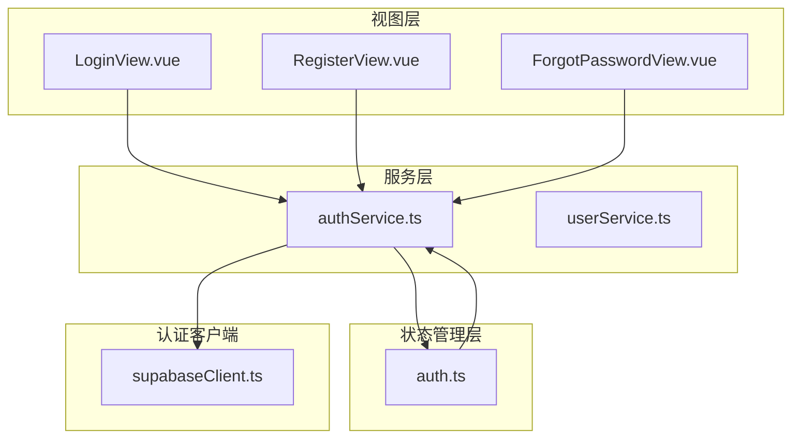
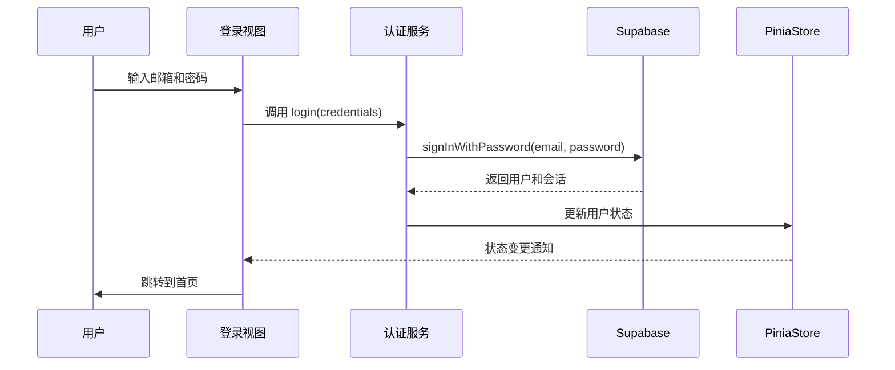
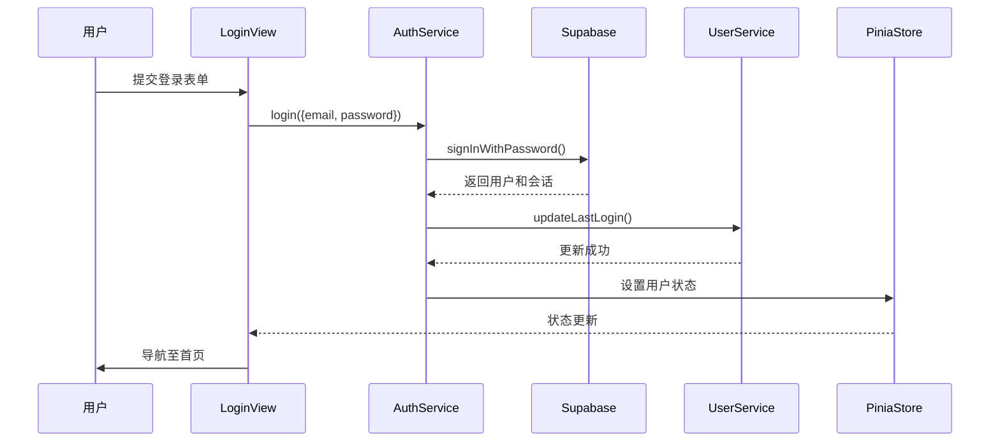
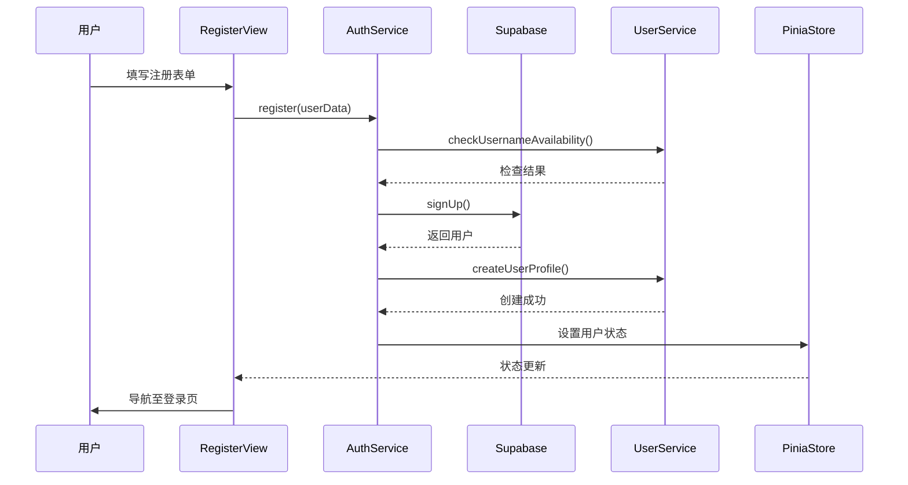
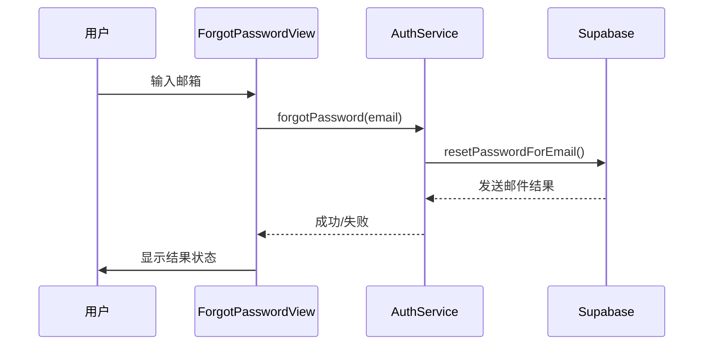
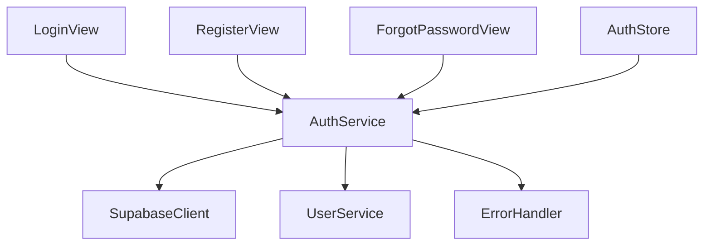

# 用户系统

<cite>
**本文档引用的文件**
- [LoginView.vue](file://src/views/auth/LoginView.vue)
- [RegisterView.vue](file://src/views/auth/RegisterView.vue)
- [ForgotPasswordView.vue](file://src/views/auth/ForgotPasswordView.vue)
- [authService.ts](file://src/services/authService.ts)
- [supabaseClient.ts](file://src/lib/supabaseClient.ts)
- [auth.ts](file://src/stores/auth.ts)
</cite>

## 目录
1. [简介](#简介)
2. [项目结构](#项目结构)
3. [核心组件](#核心组件)
4. [架构概述](#架构概述)
5. [详细组件分析](#详细组件分析)
6. [依赖分析](#依赖分析)
7. [性能考虑](#性能考虑)
8. [故障排除指南](#故障排除指南)
9. [结论](#结论)

## 简介
本系统实现了基于 Supabase Auth 的完整用户认证体系，涵盖注册、登录、密码重置等核心功能。前端采用 Vue 3 和 Pinia 构建响应式界面与状态管理，后端通过 Supabase 提供安全的身份验证服务。系统支持邮箱密码认证、第三方登录（Google、GitHub）、密码强度检测、表单验证、错误处理及会话持久化。个人中心模块包括资料编辑、收藏管理、订单历史等功能，结合 Pinia store 实现用户状态同步与权限控制。

## 项目结构
用户系统主要由视图层、服务层、状态管理层和 Supabase 客户端组成，各层职责分明，便于维护与扩展。

**图示来源**
- [LoginView.vue](file://src/views/auth/LoginView.vue#L1-L325)
- [RegisterView.vue](file://src/views/auth/RegisterView.vue#L1-L441)
- [ForgotPasswordView.vue](file://src/views/auth/ForgotPasswordView.vue#L1-L347)
- [authService.ts](file://src/services/authService.ts#L1-L293)

**本节来源**
- [src/views/auth](file://src/views/auth)
- [src/services](file://src/services)

## 核心组件
系统核心组件包括认证视图组件、认证服务类和 Pinia 认证 Store。`LoginView`、`RegisterView` 和 `ForgotPasswordView` 负责用户交互与表单处理；`AuthService` 封装了所有与 Supabase Auth 的交互逻辑；`auth store` 管理全局用户状态，实现跨组件状态同步。

**本节来源**
- [LoginView.vue](file://src/views/auth/LoginView.vue#L25-L100)
- [RegisterView.vue](file://src/views/auth/RegisterView.vue#L25-L120)
- [authService.ts](file://src/services/authService.ts#L10-L50)

## 架构概述
系统采用分层架构，前端通过 Vue 组件接收用户输入，调用 `AuthService` 进行认证操作，`AuthService` 使用 Supabase 客户端与后端服务通信，认证成功后更新 Pinia Store 中的用户状态，实现页面跳转与权限控制。

**图示来源**
- [LoginView.vue](file://src/views/auth/LoginView.vue#L150-L180)
- [authService.ts](file://src/services/authService.ts#L15-L35)
- [supabaseClient.ts](file://src/lib/supabaseClient.ts#L1-L10)
- [auth.ts](file://src/stores/auth.ts#L1-L20)

## 详细组件分析

### 登录功能分析
登录组件提供邮箱密码输入、密码可见性切换、记住我选项和忘记密码链接。表单提交后调用 `AuthService.login` 方法进行认证。

#### 登录流程时序图

**图示来源**
- [LoginView.vue](file://src/views/auth/LoginView.vue#L150-L180)
- [authService.ts](file://src/services/authService.ts#L15-L35)

**本节来源**
- [LoginView.vue](file://src/views/auth/LoginView.vue#L1-L325)
- [authService.ts](file://src/services/authService.ts#L15-L45)

### 注册功能分析
注册组件包含姓名、邮箱、密码、确认密码和用户协议勾选。提供密码强度实时评估和密码匹配验证。

#### 注册流程时序图

**图示来源**
- [RegisterView.vue](file://src/views/auth/RegisterView.vue#L200-L230)
- [authService.ts](file://src/services/authService.ts#L50-L85)

**本节来源**
- [RegisterView.vue](file://src/views/auth/RegisterView.vue#L1-L441)
- [authService.ts](file://src/services/authService.ts#L50-L90)

### 密码重置功能分析
密码重置功能分为两步：发送重置链接和设置新密码。用户输入邮箱后，系统发送包含 token 的重置链接。

#### 忘记密码流程时序图

**图示来源**
- [ForgotPasswordView.vue](file://src/views/auth/ForgotPasswordView.vue#L100-L130)
- [authService.ts](file://src/services/authService.ts#L150-L165)

**本节来源**
- [ForgotPasswordView.vue](file://src/views/auth/ForgotPasswordView.vue#L1-L347)
- [authService.ts](file://src/services/authService.ts#L150-L170)

## 依赖分析
用户系统依赖 Supabase Auth 服务进行身份验证，通过 `supabaseClient` 实例与后端通信。`AuthService` 依赖 `UserService` 处理用户资料相关操作，同时依赖 `ErrorHandler` 统一处理 API 错误。

**图示来源**
- [authService.ts](file://src/services/authService.ts#L1-L10)
- [supabaseClient.ts](file://src/lib/supabaseClient.ts#L1-L5)

**本节来源**
- [authService.ts](file://src/services/authService.ts#L1-L293)
- [package.json](file://package.json#L1-L10)

## 性能考虑
系统在用户认证过程中采用了异步非阻塞调用，避免界面卡顿。密码强度计算使用 `computed` 属性，确保仅在密码变化时重新计算。重置密码邮件发送设置了 60 秒冷却时间，防止滥用。

## 故障排除指南
常见问题包括认证失败、Token 过期和网络错误。认证失败时应检查邮箱密码是否正确，账户是否已验证。Token 过期通常发生在重置密码链接长时间未使用，需重新发送。网络错误应检查 Supabase 服务状态和网络连接。

**本节来源**
- [authService.ts](file://src/services/authService.ts#L20-L30)
- [errorHandler.ts](file://src/utils/errorHandler.ts#L1-L20)

## 结论
本用户系统实现了完整的认证流程，结合 Supabase Auth 提供了安全可靠的用户管理功能。通过 Pinia 实现状态集中管理，确保用户会话的一致性和持久性。系统设计清晰，易于维护和扩展，为后续功能开发奠定了坚实基础。