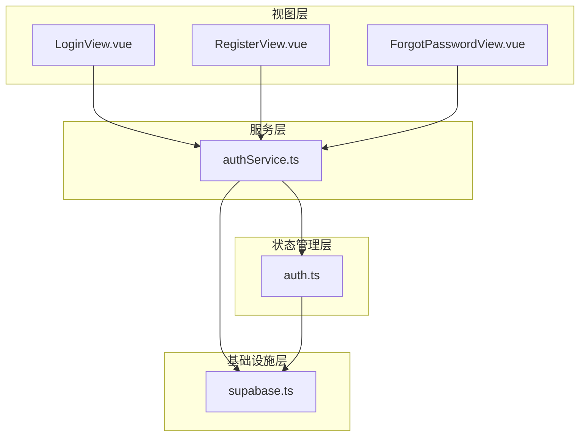
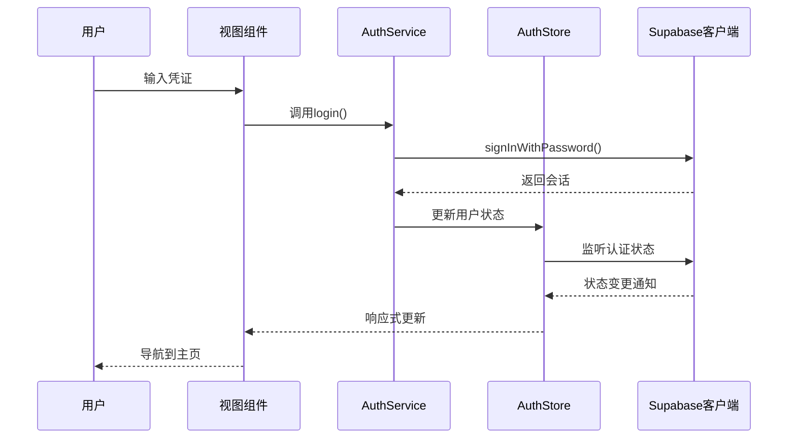
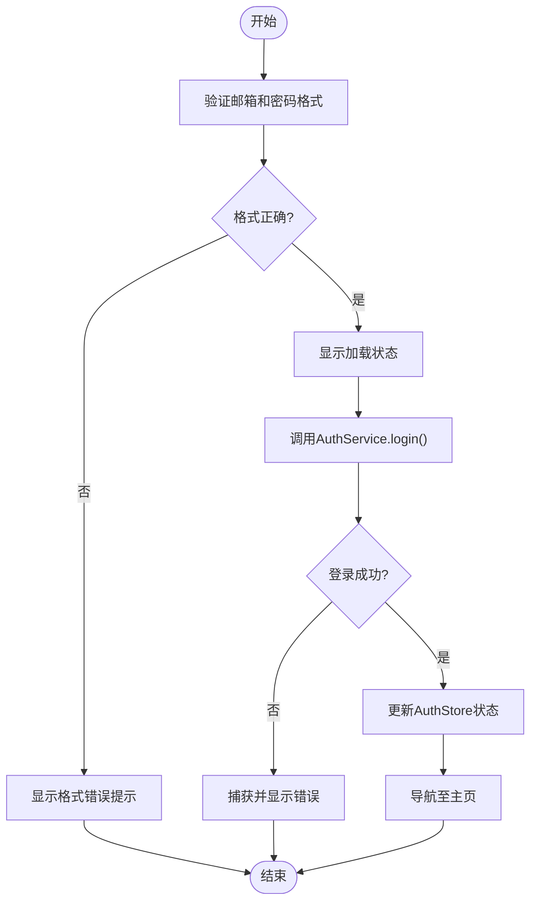
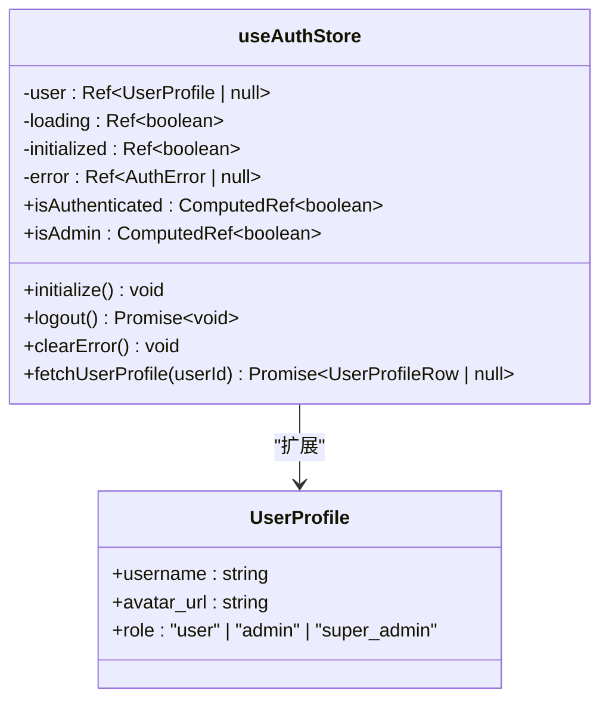
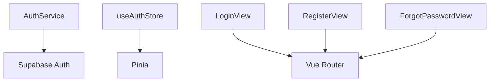

# 认证流程

<cite>
**本文档中引用的文件**
- [LoginView.vue](file://src/views/auth/LoginView.vue)
- [RegisterView.vue](file://src/views/auth/RegisterView.vue)
- [ForgotPasswordView.vue](file://src/views/auth/ForgotPasswordView.vue)
- [authService.ts](file://src/services/authService.ts)
- [auth.ts](file://src/stores/auth.ts)
- [supabase.ts](file://src/lib/supabase.ts)
</cite>

## 目录
1. [简介](#简介)
2. [项目结构](#项目结构)
3. [核心组件](#核心组件)
4. [架构概述](#架构概述)
5. [详细组件分析](#详细组件分析)
6. [依赖分析](#依赖分析)
7. [性能考虑](#性能考虑)
8. [故障排除指南](#故障排除指南)
9. [结论](#结论)

## 简介
本文档详细说明了基于Vue与Supabase Auth集成的用户认证流程实现，涵盖注册、登录和密码重置三大功能。重点描述前端组件如何通过Vue与Supabase进行交互，`authService.ts`中封装的认证方法及其与Pinia `auth` store的状态管理逻辑，用户会话持久化机制，以及完整的用户操作时序流程。同时提供常见问题排查步骤和安全实践建议。

## 项目结构
认证相关功能主要集中在`src/views/auth/`目录下，包含登录、注册和密码重置三个视图组件。业务逻辑封装在`src/services/authService.ts`中，状态管理由`src/stores/auth.ts`实现，底层依赖`src/lib/supabase.ts`提供的Supabase客户端。



**图示来源**
- [LoginView.vue](file://src/views/auth/LoginView.vue)
- [RegisterView.vue](file://src/views/auth/RegisterView.vue)
- [ForgotPasswordView.vue](file://src/views/auth/ForgotPasswordView.vue)
- [authService.ts](file://src/services/authService.ts)
- [auth.ts](file://src/stores/auth.ts)
- [supabase.ts](file://src/lib/supabase.ts)

**本节来源**
- [src/views/auth/LoginView.vue](file://src/views/auth/LoginView.vue)
- [src/services/authService.ts](file://src/services/authService.ts)
- [src/stores/auth.ts](file://src/stores/auth.ts)

## 核心组件
核心认证组件包括三个Vue视图组件（登录、注册、忘记密码）、一个服务类`AuthService`和一个Pinia store `useAuthStore`。这些组件协同工作，实现了完整的用户认证生命周期管理。

**本节来源**
- [authService.ts](file://src/services/authService.ts#L1-L292)
- [auth.ts](file://src/stores/auth.ts#L1-L151)

## 架构概述
系统采用分层架构，前端视图组件负责用户交互，服务层封装业务逻辑，状态管理层管理用户会话状态，底层通过Supabase客户端与后端认证服务通信。这种分层设计确保了代码的可维护性和可测试性。



**图示来源**
- [authService.ts](file://src/services/authService.ts#L15-L45)
- [auth.ts](file://src/stores/auth.ts#L50-L100)

## 详细组件分析

### 登录功能分析
登录功能由`LoginView.vue`组件实现，包含表单输入验证、密码可见性切换、加载状态反馈和错误处理机制。



**图示来源**
- [LoginView.vue](file://src/views/auth/LoginView.vue#L1-L324)

**本节来源**
- [LoginView.vue](file://src/views/auth/LoginView.vue#L1-L324)

### 注册功能分析
注册功能由`RegisterView.vue`组件实现，包含用户名可用性检查、邮箱验证邮件发送和用户资料创建。

**本节来源**
- [RegisterView.vue](file://src/views/auth/RegisterView.vue)

### 密码重置功能分析
密码重置功能由`ForgotPasswordView.vue`组件实现，包含忘记密码请求和密码重置两个阶段。

**本节来源**
- [ForgotPasswordView.vue](file://src/views/auth/ForgotPasswordView.vue)

### 认证服务分析
`AuthService`类封装了所有认证相关操作，包括登录、注册、登出、密码重置等。

#### 认证服务类图
```mermaid
classDiagram
class AuthService {
+login(credentials) Promise~{user, session}~
+register(userData) Promise~{user, session}~
+logout() Promise~void~
+forgotPassword(email) Promise~void~
+resetPassword(newPassword) Promise~void~
+changePassword(newPassword) Promise~void~
+updateEmail(newEmail) Promise~void~
+verifyEmail(token, type) Promise~void~
+resendVerificationEmail() Promise~void~
+getSession() Promise~any~
+refreshSession() Promise~any~
+isAuthenticated() Promise~boolean~
+onAuthStateChange(callback) Subscription
+signInWithGoogle() Promise~void~
+signInWithGitHub() Promise~void~
+deleteAccount() Promise~void~
}
class UserService {
+checkUsernameAvailability(username) Promise~boolean~
+createUserProfile(userId, email) Promise~User~
+updateProfile(userId, data) Promise~User~
+updateLastLogin(userId) Promise~void~
+deleteAccount(userId) Promise~void~
+getCurrentUser() Promise~User~
}
class ErrorHandler {
+handleApiError(error) AppError
+logError(error, context) void
}
AuthService --> UserService : "使用"
AuthService --> ErrorHandler : "使用"
```

**图示来源**
- [authService.ts](file://src/services/authService.ts#L1-L292)

**本节来源**
- [authService.ts](file://src/services/authService.ts#L1-L292)

### 状态管理分析
`useAuthStore`使用Pinia管理用户认证状态，包括用户信息、加载状态和错误信息。

#### 状态管理类图


**图示来源**
- [auth.ts](file://src/stores/auth.ts#L1-L151)

**本节来源**
- [auth.ts](file://src/stores/auth.ts#L1-L151)

## 依赖分析
认证模块依赖Supabase Auth服务进行身份验证，依赖Pinia进行状态管理，依赖Vue Router进行页面导航。



**图示来源**
- [authService.ts](file://src/services/authService.ts#L1-L10)
- [auth.ts](file://src/stores/auth.ts#L1-L10)

**本节来源**
- [authService.ts](file://src/services/authService.ts#L1-L30)
- [auth.ts](file://src/stores/auth.ts#L1-L30)

## 性能考虑
认证流程中，会话状态通过Supabase的自动刷新机制保持有效，减少频繁的重新登录。错误处理机制避免了不必要的网络请求，提升了用户体验。

## 故障排除指南
### 常见问题及解决方案
- **网络错误**: 检查网络连接，确认Supabase服务可用
- **邮箱已被使用**: 提示用户使用其他邮箱或尝试找回账户
- **Token过期**: 重新发送验证邮件或重置密码
- **用户名不可用**: 提示用户选择其他用户名
- **第三方登录失败**: 检查重定向URL配置和OAuth应用设置

**本节来源**
- [authService.ts](file://src/services/authService.ts#L100-L200)
- [auth.ts](file://src/stores/auth.ts#L100-L150)

## 结论
本文档详细描述了基于Vue和Supabase的认证流程实现。通过分层架构设计，将视图、服务和状态管理分离，提高了代码的可维护性。实现了完整的用户认证生命周期管理，包括注册、登录、密码重置等功能，并提供了完善的错误处理和安全机制。