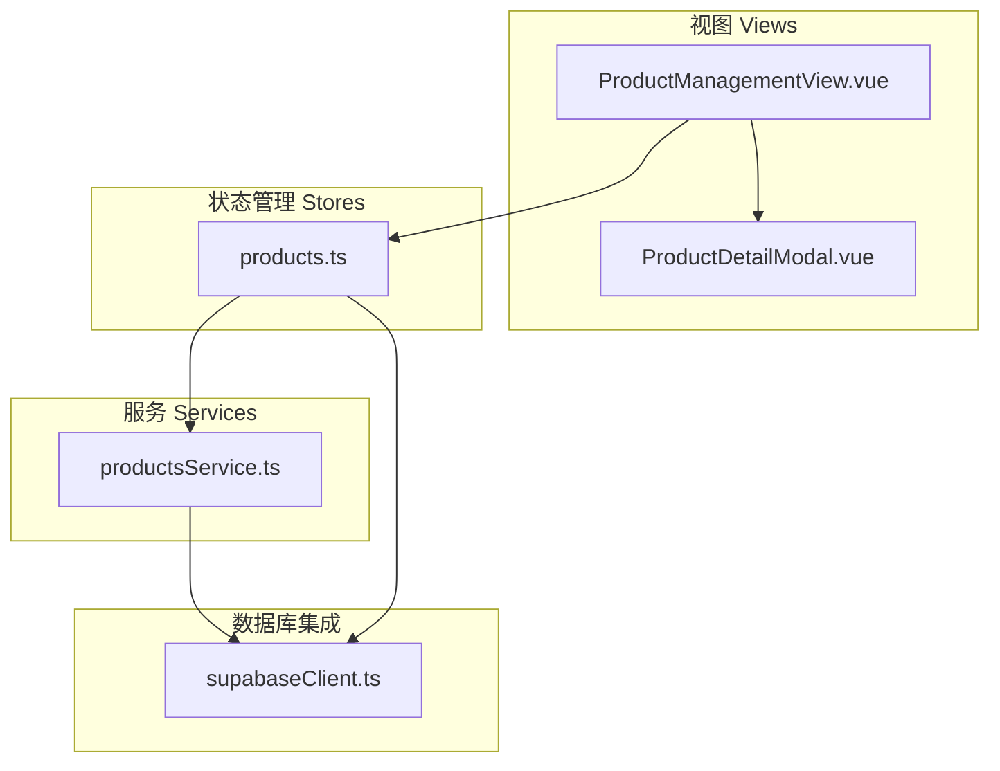
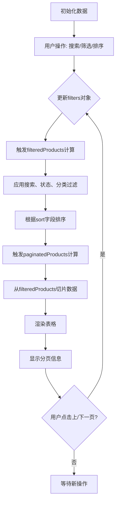
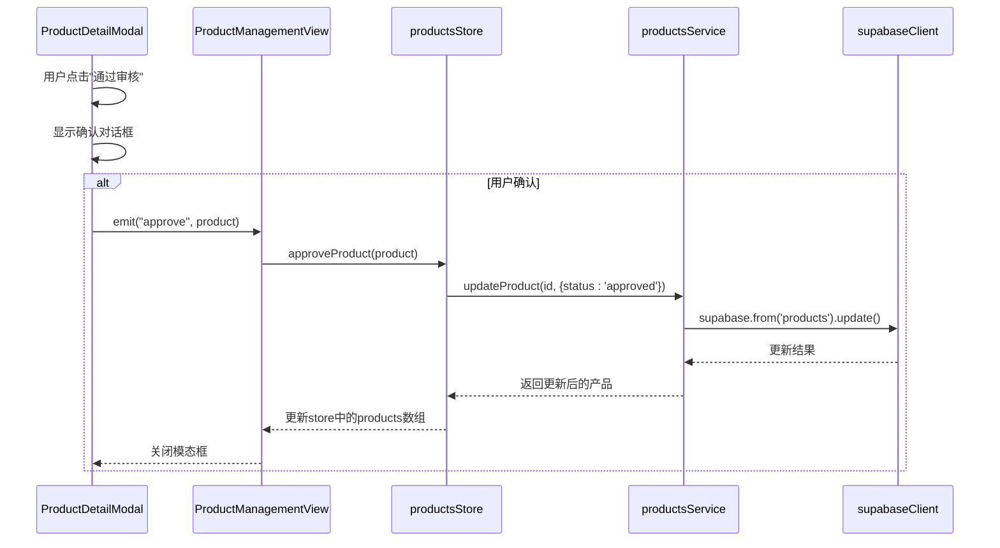
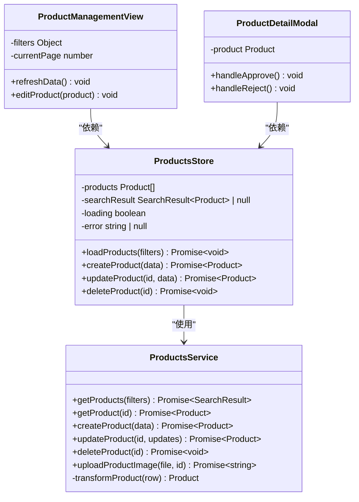
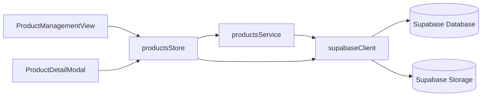

# 产品管理

<cite>
**本文档中引用的文件**  
- [ProductManagementView.vue](file://src/views/admin/ProductManagementView.vue)
- [ProductDetailModal.vue](file://src/components/admin/ProductDetailModal.vue)
- [productsService.ts](file://src/services/productsService.ts)
- [products.ts](file://src/stores/products.ts)
- [supabaseClient.ts](file://src/lib/supabaseClient.ts)
</cite>

## 目录
1. [介绍](#介绍)
2. [项目结构](#项目结构)
3. [核心组件](#核心组件)
4. [架构概览](#架构概览)
5. [详细组件分析](#详细组件分析)
6. [依赖分析](#依赖分析)
7. [性能考虑](#性能考虑)
8. [故障排除指南](#故障排除指南)
9. [结论](#结论)

## 介绍
本文件深入文档化产品管理模块的完整功能链。详细解析 `ProductManagementView` 中的表格渲染、分页、搜索与批量操作实现机制，说明 `ProductDetailModal` 在创建/编辑产品时的表单验证、图片上传（集成 Supabase Storage）与数据提交流程。阐述 `productsService` 中 CRUD 操作的具体实现，包括与 Supabase 数据库的交互、错误处理及与 Pinia store（`products.ts`）的状态同步。提供“审核新产品上架”和“下架违规产品”的详细操作步骤，分析其对数据库和缓存的影响。包含性能优化建议，如大数据量下的分页策略和图片懒加载。

## 项目结构



**图示来源**  
- [ProductManagementView.vue](file://src/views/admin/ProductManagementView.vue)
- [ProductDetailModal.vue](file://src/components/admin/ProductDetailModal.vue)
- [productsService.ts](file://src/services/productsService.ts)
- [products.ts](file://src/stores/products.ts)
- [supabaseClient.ts](file://src/lib/supabaseClient.ts)

**本节来源**  
- [ProductManagementView.vue](file://src/views/admin/ProductManagementView.vue)
- [productsService.ts](file://src/services/productsService.ts)
- [products.ts](file://src/stores/products.ts)

## 核心组件

`ProductManagementView` 是产品管理模块的主视图，负责展示产品列表、统计信息、筛选控件和分页功能。它通过 Pinia store (`products.ts`) 与 `productsService` 交互，获取和更新产品数据。`ProductDetailModal` 作为子组件，用于展示产品详情并执行审核、编辑、发布等操作。`productsService` 封装了所有与 Supabase 数据库的交互逻辑，而 `products.ts` store 则负责全局状态管理、数据缓存和业务逻辑的协调。

**本节来源**  
- [ProductManagementView.vue](file://src/views/admin/ProductManagementView.vue#L1-L663)
- [ProductDetailModal.vue](file://src/components/admin/ProductDetailModal.vue#L1-L396)
- [productsService.ts](file://src/services/productsService.ts#L1-L339)
- [products.ts](file://src/stores/products.ts#L1-L362)

## 架构概览

```mermaid
sequenceDiagram
participant PMV as ProductManagementView
participant PTS as productsStore
participant PS as productsService
participant SC as supabaseClient
participant DB as Supabase Database
PMV->>PTS : loadProducts(filters)
activate PTS
PTS->>PS : getProducts(filters)
activate PS
PS->>SC : supabase.from('products').select().range()
activate SC
SC->>DB : SQL Query
DB-->>SC : Data + Count
deactivate SC
SC-->>PS : 返回数据
deactivate PS
PS-->>PTS : 转换后的Product[]和元数据
deactivate PS
PTS-->>PMV : 更新products状态和searchResult
deactivate PTS
PMV->>PMV : 渲染表格和分页
```

**图示来源**  
- [ProductManagementView.vue](file://src/views/admin/ProductManagementView.vue#L150-L170)
- [products.ts](file://src/stores/products.ts#L80-L100)
- [productsService.ts](file://src/services/productsService.ts#L10-L80)
- [supabaseClient.ts](file://src/lib/supabaseClient.ts#L30-L35)

## 详细组件分析

### ProductManagementView 分析

`ProductManagementView` 实现了产品管理的核心界面。其数据流始于 `onMounted` 生命周期钩子，通过调用 `initData` 初始化模拟数据。用户交互（如搜索、筛选、分页）会更新 `filters` 响应式对象，触发 `filteredProducts` 计算属性的重新计算。该属性首先应用搜索、状态和分类过滤，然后根据 `sort` 字段进行排序。最终，`paginatedProducts` 计算属性从 `filteredProducts` 中切片出当前页的数据进行渲染。分页控件通过 `currentPage` 和 `pageSize` 控制数据切片的范围。

**本节来源**  
- [ProductManagementView.vue](file://src/views/admin/ProductManagementView.vue#L150-L300)

#### 表格渲染与分页流程图



**图示来源**  
- [ProductManagementView.vue](file://src/views/admin/ProductManagementView.vue#L170-L250)

### ProductDetailModal 分析

`ProductDetailModal` 组件接收一个 `product` prop 并展示其详细信息。它提供了根据产品当前状态（如“待审核”）动态显示的审核操作按钮。当用户点击“通过审核”或“拒绝审核”时，会弹出确认对话框，然后通过 `$emit` 触发相应的事件（`approve` 或 `reject`），这些事件被父组件 `ProductManagementView` 监听并处理。

**本节来源**  
- [ProductDetailModal.vue](file://src/components/admin/ProductDetailModal.vue#L1-L396)

#### 审核操作序列图



**图示来源**  
- [ProductDetailModal.vue](file://src/components/admin/ProductDetailModal.vue#L250-L300)
- [ProductManagementView.vue](file://src/views/admin/ProductManagementView.vue#L300-L350)
- [products.ts](file://src/stores/products.ts#L200-L220)
- [productsService.ts](file://src/services/productsService.ts#L150-L180)

### productsService 与 Pinia Store 分析

`productsService` 是一个静态类，封装了所有与 Supabase 数据库的 CRUD 操作。`getProducts` 方法构建了一个复杂的查询，包含 `select`、`eq`、`or`、`order` 和 `range` 等链式调用，以实现分页、搜索和排序。`transformProduct` 私有方法负责将数据库返回的扁平化数据结构转换为前端所需的嵌套对象。`products.ts` Pinia store 作为业务逻辑的中心，它调用 `productsService` 的方法，并将结果存储在自身的状态（如 `products`、`searchResult`）中。它还提供了 `loadProducts`、`createProduct` 等方法，这些方法在调用服务后会自动更新本地状态，实现了状态同步。

**本节来源**  
- [productsService.ts](file://src/services/productsService.ts#L1-L339)
- [products.ts](file://src/stores/products.ts#L1-L362)

#### CRUD 操作与状态同步类图



**图示来源**  
- [productsService.ts](file://src/services/productsService.ts#L10-L339)
- [products.ts](file://src/stores/products.ts#L10-L362)
- [ProductManagementView.vue](file://src/views/admin/ProductManagementView.vue#L1-L663)
- [ProductDetailModal.vue](file://src/components/admin/ProductDetailModal.vue#L1-L396)

## 依赖分析



**图示来源**  
- [ProductManagementView.vue](file://src/views/admin/ProductManagementView.vue)
- [ProductDetailModal.vue](file://src/components/admin/ProductDetailModal.vue)
- [products.ts](file://src/stores/products.ts)
- [productsService.ts](file://src/services/productsService.ts)
- [supabaseClient.ts](file://src/lib/supabaseClient.ts)

**本节来源**  
- [products.ts](file://src/stores/products.ts#L1-L362)
- [productsService.ts](file://src/services/productsService.ts#L1-L339)
- [supabaseClient.ts](file://src/lib/supabaseClient.ts#L1-L266)

## 性能考虑

该模块在性能方面有以下考虑和优化建议：
1.  **分页策略**：`productsService.getProducts` 使用 Supabase 的 `range()` 方法进行分页，避免了一次性加载所有数据，有效减轻了数据库和网络的压力。
2.  **计算属性优化**：`ProductManagementView` 中的 `filteredProducts` 和 `paginatedProducts` 使用 Vue 的计算属性，确保了数据只在依赖项变化时才重新计算，避免了不必要的重复计算。
3.  **图片懒加载**：虽然当前代码未直接体现，但可通过集成 `LazyImage.vue` 组件来实现图片懒加载，仅在图片进入视口时才加载，显著提升初始页面加载速度。
4.  **大数据量优化**：对于海量产品数据，建议在 `getProducts` 查询中增加更精确的索引（如对 `status`, `category_id`, `created_at` 字段建立复合索引），并考虑使用游标分页（cursor-based pagination）替代基于偏移量的分页，以避免 `OFFSET` 在大数据集上的性能退化。

## 故障排除指南

-   **问题：产品列表加载失败或为空**
    -   **检查点**：确认 `.env.local` 文件中的 `VITE_SUPABASE_URL` 和 `VITE_SUPABASE_ANON_KEY` 配置正确。
    -   **检查点**：检查 Supabase 项目中的 RLS（行级安全）策略是否已正确启用并配置。
    -   **检查点**：在浏览器开发者工具的网络面板中，检查 `getProducts` 请求是否成功，查看返回的错误信息。

-   **问题：图片上传失败**
    -   **检查点**：确认 Supabase Storage 中名为 `product-images` 的存储桶已创建。
    -   **检查点**：检查 Storage 的策略（Policies）是否允许已认证用户上传文件。
    -   **检查点**：确认上传的文件大小和类型符合 Storage 的限制。

-   **问题：状态更新后，UI 未及时刷新**
    -   **检查点**：确认 `productsService` 的 `updateProduct` 方法成功返回了更新后的数据。
    -   **检查点**：在 `products.ts` store 的 `updateProduct` 方法中，检查是否正确地更新了 `products` 数组和 `currentProduct`。

**本节来源**  
- [supabaseClient.ts](file://src/lib/supabaseClient.ts#L10-L20)
- [productsService.ts](file://src/services/productsService.ts#L20-L30)
- [products.ts](file://src/stores/products.ts#L220-L250)

## 结论

产品管理模块通过清晰的分层架构（视图-状态-服务-数据库）实现了高效的功能。`ProductManagementView` 提供了直观的管理界面，`ProductDetailModal` 支持精细化的操作，`productsService` 确保了与 Supabase 的可靠交互，而 `products.ts` Pinia store 则完美地协调了全局状态。该设计易于维护和扩展。未来可进一步优化性能，如实现图片懒加载和更高级的分页策略，并加强错误处理和用户反馈机制。