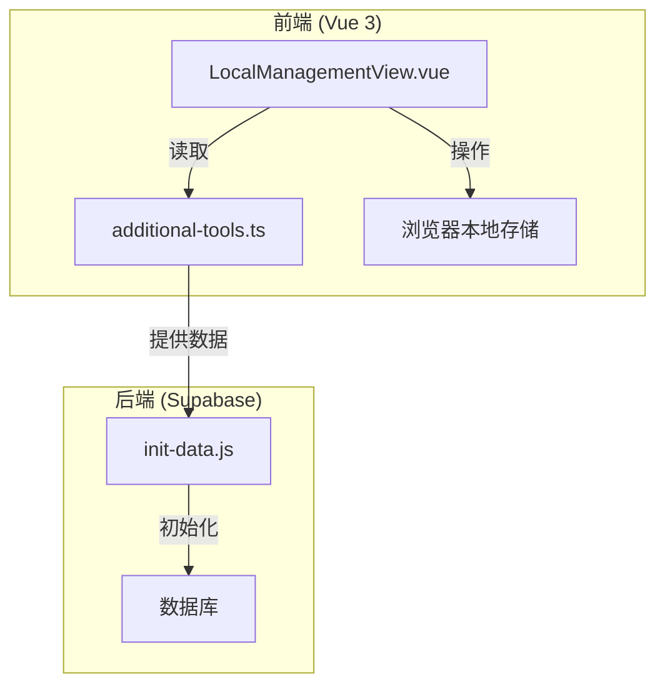
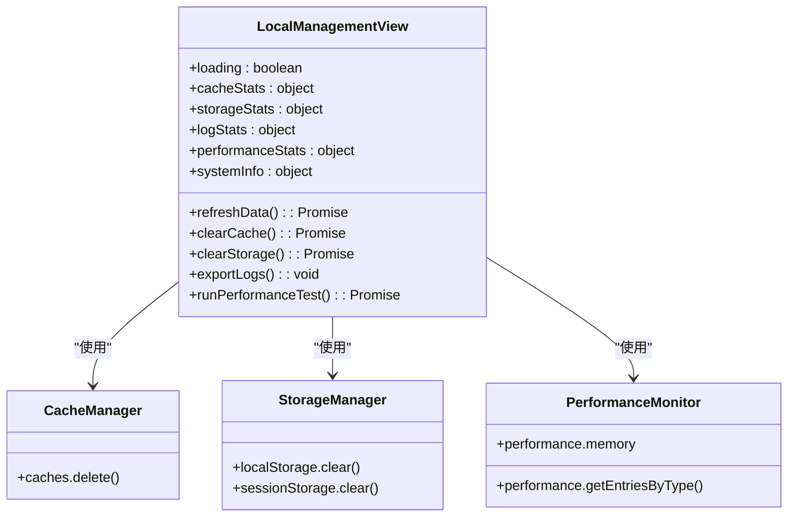
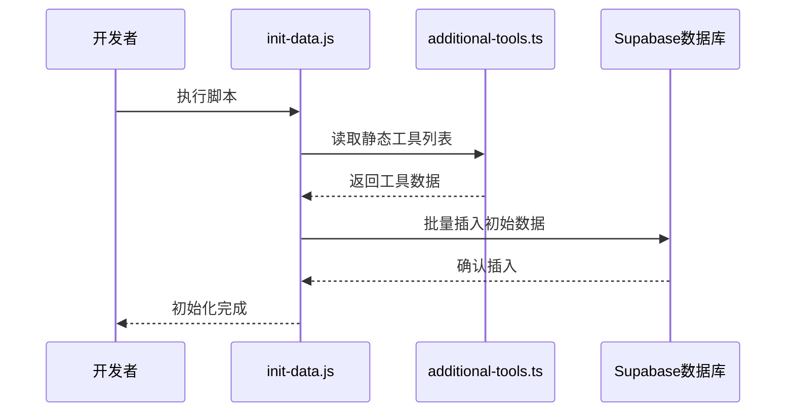
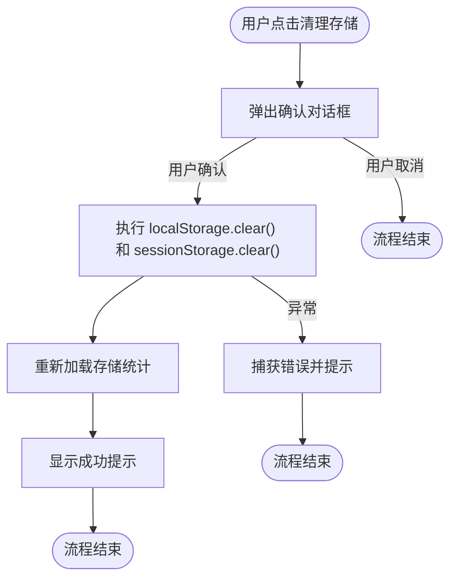
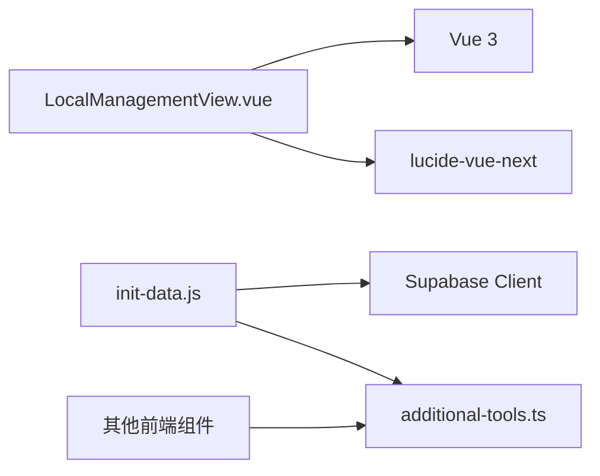

# 本地化管理

<cite>
**本文档中引用的文件**  
- [LocalManagementView.vue](file://src/views/admin/LocalManagementView.vue)
- [init-data.js](file://scripts/init-data.js)
- [additional-tools.ts](file://src/data/additional-tools.ts)
</cite>

## 目录
1. [简介](#简介)
2. [项目结构](#项目结构)
3. [核心组件](#核心组件)
4. [架构概述](#架构概述)
5. [详细组件分析](#详细组件分析)
6. [依赖分析](#依赖分析)
7. [性能考虑](#性能考虑)
8. [故障排除指南](#故障排除指南)
9. [结论](#结论)

## 简介
`LocalManagementView` 是一个用于管理前端本地状态、缓存、存储和系统信息的管理界面。尽管其名称为“本地化管理”，但根据代码分析，该功能主要关注的是**本地运行时数据管理**，而非多语言或区域设置（i18n/l10n）的维护。该视图为管理员提供了对浏览器端数据的可视化监控与操作能力，包括缓存清理、存储管理、日志查看和性能监控等功能。

**Section sources**
- [LocalManagementView.vue](file://src/views/admin/LocalManagementView.vue#L1-L767)

## 项目结构
`LocalManagementView.vue` 位于 `src/views/admin/` 目录下，是管理后台的一部分。它与 `scripts/init-data.js` 和 `src/data/additional-tools.ts` 共同构成了系统初始化和静态数据管理的体系。`init-data.js` 负责数据库的初始数据填充，而 `additional-tools.ts` 则存储了应用的静态工具列表，这些数据可能在初始化时被 `init-data.js` 写入后端数据库。

**Section sources**
- [LocalManagementView.vue](file://src/views/admin/LocalManagementView.vue#L1-L767)
- [init-data.js](file://scripts/init-data.js#L1-L100)
- [additional-tools.ts](file://src/data/additional-tools.ts#L1-L50)

## 核心组件
`LocalManagementView` 的核心功能是提供一个管理员控制台，用于监控和管理客户端的运行时状态。它通过调用浏览器的 Web API（如 `navigator.storage.estimate()`、`performance.memory`）来获取系统信息，并提供了清理缓存和本地存储的用户界面。其核心组件包括缓存管理、本地存储管理、日志管理和性能监控四个功能卡片。

**Section sources**
- [LocalManagementView.vue](file://src/views/admin/LocalManagementView.vue#L15-L200)

## 架构概述
该功能的架构是典型的 Vue 3 Composition API 模式，使用 `<script setup>` 语法。前端视图负责展示数据和接收用户操作，后端服务（如 Supabase）通过 `init-data.js` 脚本进行初始化。`additional-tools.ts` 作为静态数据源，为初始化过程提供数据。

**Diagram sources**
- [LocalManagementView.vue](file://src/views/admin/LocalManagementView.vue#L1-L767)
- [init-data.js](file://scripts/init-data.js#L1-L100)
- [additional-tools.ts](file://src/data/additional-tools.ts#L1-L50)

## 详细组件分析

### LocalManagementView 分析
`LocalManagementView` 是一个独立的管理界面，不直接处理多语言内容，而是专注于本地数据管理。

#### 功能卡片分析

**Diagram sources**
- [LocalManagementView.vue](file://src/views/admin/LocalManagementView.vue#L100-L500)

#### 数据初始化流程

**Diagram sources**
- [init-data.js](file://scripts/init-data.js#L1-L100)
- [additional-tools.ts](file://src/data/additional-tools.ts#L1-L50)

#### 本地存储管理流程

**Diagram sources**
- [LocalManagementView.vue](file://src/views/admin/LocalManagementView.vue#L550-L650)

**Section sources**
- [LocalManagementView.vue](file://src/views/admin/LocalManagementView.vue#L1-L767)

## 依赖分析
`LocalManagementView` 依赖于 Vue 3 框架和 `lucide-vue-next` 图标库。`init-data.js` 作为 Node.js 脚本，依赖于 Supabase 客户端库来与数据库交互。`additional-tools.ts` 是一个纯数据文件，被 `init-data.js` 和前端组件共同引用，是连接静态数据与动态初始化的关键。

**Diagram sources**
- [package.json](file://package.json#L1-L50)
- [LocalManagementView.vue](file://src/views/admin/LocalManagementView.vue#L1-L767)
- [init-data.js](file://scripts/init-data.js#L1-L100)
- [additional-tools.ts](file://src/data/additional-tools.ts#L1-L50)

**Section sources**
- [package.json](file://package.json#L1-L50)
- [init-data.js](file://scripts/init-data.js#L1-L100)
- [additional-tools.ts](file://src/data/additional-tools.ts#L1-L50)

## 性能考虑
`LocalManagementView` 在性能监控方面集成了浏览器的 `performance.memory` API 来获取内存使用情况，并通过 `performance.getEntriesByType()` 获取页面加载时间。这些功能为管理员提供了诊断应用性能问题的直接工具。然而，频繁调用这些 API 可能会带来轻微的性能开销，建议仅在需要时使用。

**Section sources**
- [LocalManagementView.vue](file://src/views/admin/LocalManagementView.vue#L350-L400)

## 故障排除指南
当 `LocalManagementView` 的功能无法正常工作时，可参考以下步骤：
1.  **缓存/存储清理失败**：检查浏览器是否禁用了 `caches` 或 `localStorage` API。
2.  **统计数据显示“未知”**：`navigator.storage.estimate()` 或 `performance.memory` 可能不被当前浏览器支持。
3.  **数据初始化失败**：确保 `init-data.js` 中的数据库连接配置正确，并且 `additional-tools.ts` 的数据格式符合数据库表结构。

**Section sources**
- [LocalManagementView.vue](file://src/views/admin/LocalManagementView.vue#L450-L700)
- [init-data.js](file://scripts/init-data.js#L1-L100)

## 结论
`LocalManagementView` 是一个功能强大的前端管理工具，它使管理员能够直接与客户端的运行时环境进行交互。虽然其名称容易与“国际化”混淆，但其实际功能是“本地运行时管理”。通过与 `init-data.js` 和 `additional-tools.ts` 的配合，该系统实现了从数据初始化到运行时监控的完整生命周期管理。最佳实践是确保 `additional-tools.ts` 中的静态数据与数据库 schema 保持一致，并在执行清理操作前进行充分的用户确认，以维护数据一致性。