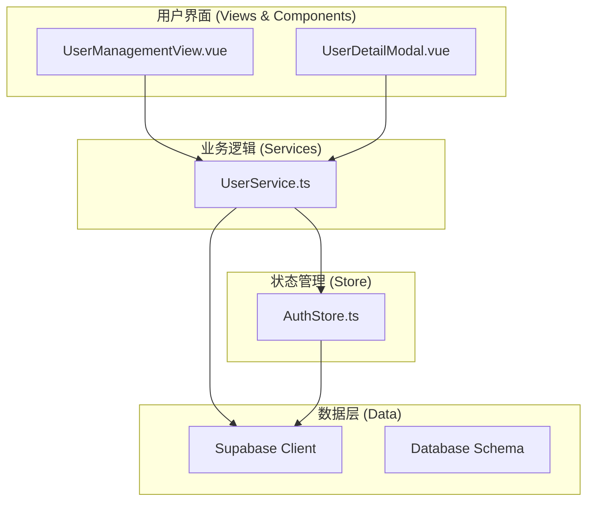
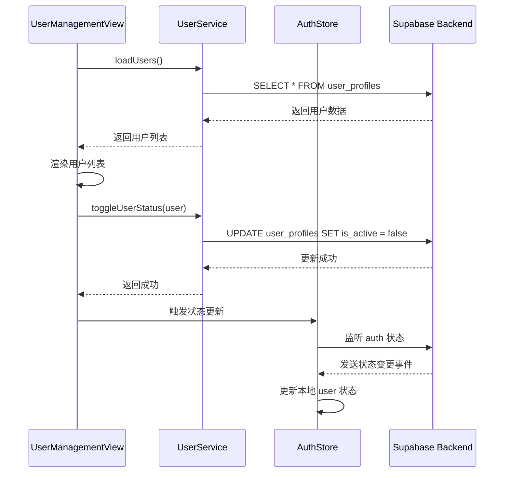
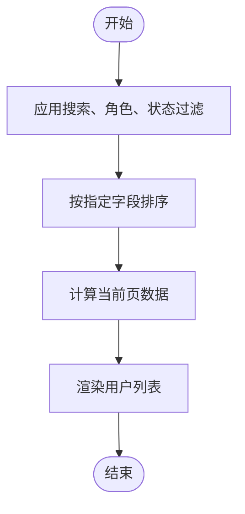
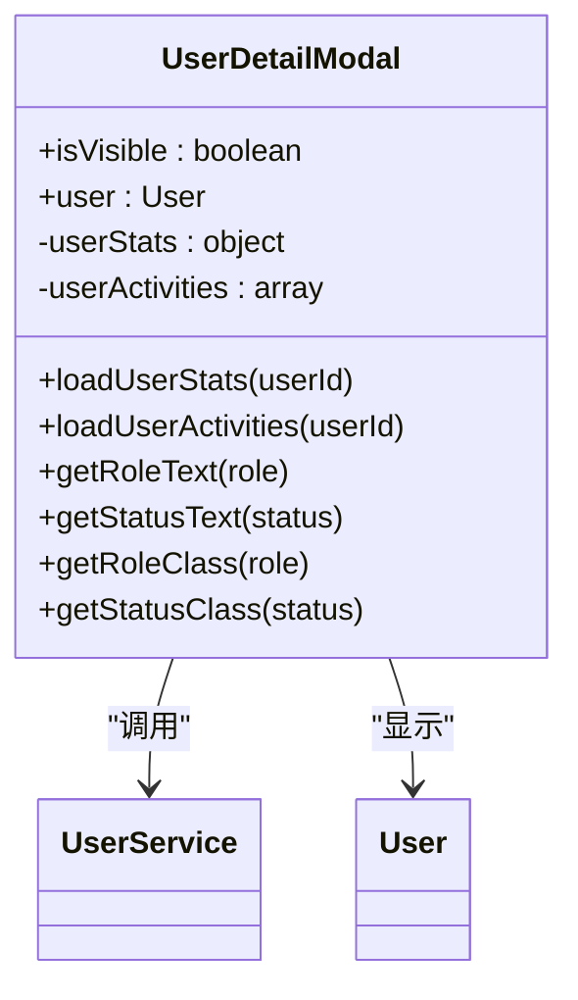
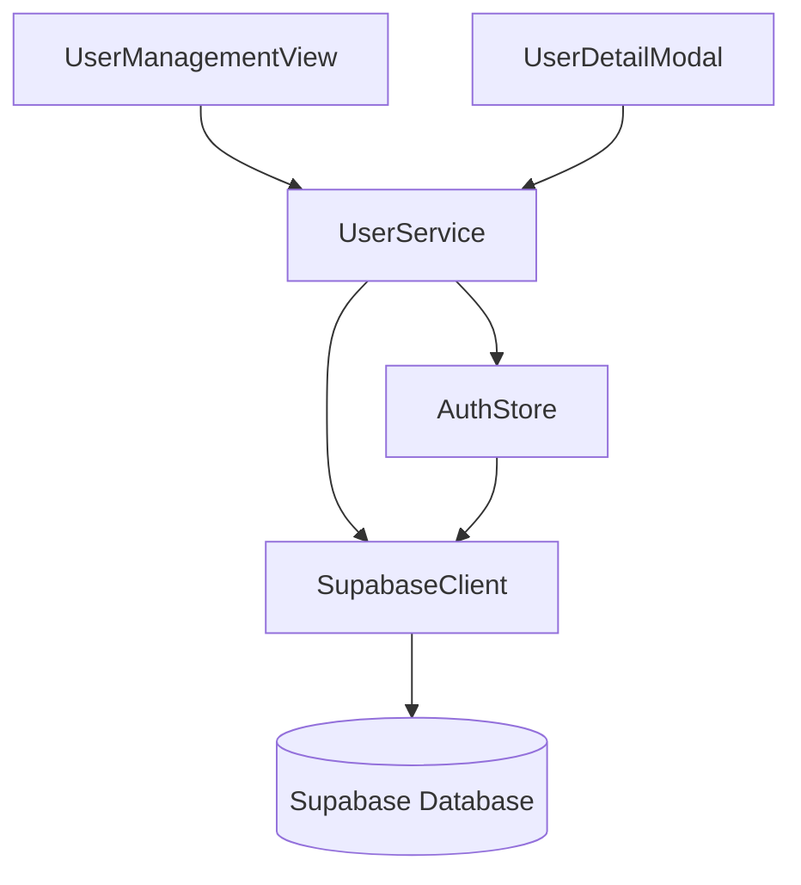

# 用户管理

<cite>
**本文档引用文件**   
- [UserManagementView.vue](file://src/views/admin/UserManagementView.vue)
- [UserDetailModal.vue](file://src/components/admin/UserDetailModal.vue)
- [userService.ts](file://src/services/userService.ts)
- [auth.ts](file://src/stores/auth.ts)
- [database.ts](file://src/types/database.ts)
- [index.ts](file://src/types/index.ts)
- [20241224000001_initial_schema.sql](file://supabase/migrations/20241224000001_initial_schema.sql)
</cite>

## 目录
1. [简介](#简介)
2. [项目结构](#项目结构)
3. [核心组件](#核心组件)
4. [架构概览](#架构概览)
5. [详细组件分析](#详细组件分析)
6. [依赖分析](#依赖分析)
7. [性能考量](#性能考量)
8. [故障排除指南](#故障排除指南)
9. [结论](#结论)

## 简介
本文档全面记录了用户管理功能的技术实现与操作流程。重点描述了管理员如何通过 `UserManagementView` 查看、搜索和管理用户，以及如何通过 `UserDetailModal` 查看和编辑用户详细信息。文档详细说明了 `userService` 中管理用户状态（如启用/禁用）、删除账户等敏感操作的API调用逻辑，以及这些操作如何触发Supabase Auth和数据库的同步更新。同时，解释了与 `auth store` 的集成机制，确保管理员操作后本地状态能及时刷新。最后，提供了关键操作的指南和大规模数据处理的性能建议。

## 项目结构
用户管理功能的代码分布在多个目录中，遵循了清晰的分层架构。核心的用户界面组件位于 `src/views/admin/` 和 `src/components/admin/` 目录下，业务逻辑和服务封装在 `src/services/` 目录，全局状态管理使用 `src/stores/` 目录下的Pinia store，而数据类型定义则统一在 `src/types/` 目录。

**图示来源**
- [UserManagementView.vue](file://src/views/admin/UserManagementView.vue)
- [UserDetailModal.vue](file://src/components/admin/UserDetailModal.vue)
- [userService.ts](file://src/services/userService.ts)
- [auth.ts](file://src/stores/auth.ts)

## 核心组件
本功能的核心是 `UserManagementView` 和 `UserDetailModal` 两个Vue组件，它们共同构成了管理员操作用户的主要界面。`UserManagementView` 负责展示用户列表、提供筛选和搜索功能，并显示关键统计数据。`UserDetailModal` 则提供了一个弹出式窗口，用于展示单个用户的详细信息、活动统计和操作历史。这两个组件通过 `userService` 与后端进行数据交互，并依赖 `auth store` 来获取当前用户权限和状态。

**组件来源**
- [UserManagementView.vue](file://src/views/admin/UserManagementView.vue)
- [UserDetailModal.vue](file://src/components/admin/UserDetailModal.vue)

## 架构概览
用户管理功能的架构是一个典型的前后端分离模式，前端通过Vue 3和Pinia构建，后端使用Supabase作为BaaS（Backend as a Service）。前端组件通过调用 `userService` 中的静态方法与Supabase进行通信。`userService` 封装了所有与用户相关的数据库操作和认证管理。`auth store` 监听Supabase的认证状态变化，确保应用的全局用户状态与后端保持一致。

**图示来源**
- [UserManagementView.vue](file://src/views/admin/UserManagementView.vue#L153-L207)
- [userService.ts](file://src/services/userService.ts#L262-L286)
- [auth.ts](file://src/stores/auth.ts#L42-L84)

## 详细组件分析

### UserManagementView 分析
`UserManagementView` 是用户管理的主界面，它实现了用户列表的展示、搜索过滤和分页功能。

#### 用户列表与搜索过滤
该组件通过 `filters` 响应式对象管理搜索和筛选条件。`filteredUsers` 计算属性根据 `search`、`role` 和 `status` 等条件对用户数据进行实时过滤。排序功能通过 `sort` 字段控制，支持按注册时间、最后登录时间等多种方式排序。分页由 `currentPage` 和 `pageSize` 控制，`paginatedUsers` 计算属性返回当前页的数据。

**图示来源**
- [UserManagementView.vue](file://src/views/admin/UserManagementView.vue#L118-L156)

#### 统计卡片
页面顶部的统计卡片通过 `stats` 计算属性动态生成。它会计算总用户数、活跃用户数、管理员数量和本月新增用户数，为管理员提供关键的运营指标。

### UserDetailModal 分析
`UserDetailModal` 组件用于展示单个用户的详细信息，包括基本信息、个人资料、活动统计和操作历史。

#### 信息展示与数据加载
当模态框打开时，`watch` 监听器会检测到 `user` prop 的变化，并调用 `loadUserStats` 和 `loadUserActivities` 方法来获取用户的统计信息和活动记录。这些信息通过 `userStats` 和 `userActivities` 响应式对象在模板中展示。

#### 用户状态与角色显示
该组件使用 `getRoleText` 和 `getStatusText` 等方法将数据库中的英文状态（如 "admin", "active"）转换为中文（如 "管理员", "活跃"），并使用 `getRoleClass` 和 `getStatusClass` 方法为不同状态应用相应的CSS类，实现视觉上的区分。

**图示来源**
- [UserDetailModal.vue](file://src/components/admin/UserDetailModal.vue#L195-L264)
- [userService.ts](file://src/services/userService.ts#L0-L46)

## 依赖分析
用户管理功能依赖于多个核心模块，形成了一个紧密协作的系统。

**图示来源**
- [go.mod](file://package.json)
- [UserManagementView.vue](file://src/views/admin/UserManagementView.vue)
- [userService.ts](file://src/services/userService.ts)

## 性能考量
在处理大规模用户数据时，前端性能至关重要。`UserManagementView` 通过分页（`pageSize`）限制了单次渲染的数据量，避免了长列表导致的页面卡顿。搜索和过滤操作在前端进行，利用了Vue的响应式系统，实现了即时反馈。对于后端，`userService` 中的 `getUserStats` 方法使用了 `Promise.all` 并行查询收藏和订单数据，减少了数据库往返次数，提升了响应速度。

## 故障排除指南
当用户管理功能出现问题时，应首先检查浏览器控制台的错误日志。常见的问题包括：
- **无法加载用户列表**：检查 `userService.loadUsers` 方法的实现，确认Supabase客户端配置正确，网络连接正常。
- **状态更新不同步**：检查 `auth store` 的 `initialize` 方法是否被正确调用，确保 `onAuthStateChange` 监听器正常工作。
- **敏感操作失败**：检查Supabase的RLS（Row Level Security）策略，确保管理员角色有权限执行相关操作。

**故障排除来源**
- [userService.ts](file://src/services/userService.ts#L262-L286)
- [auth.ts](file://src/stores/auth.ts#L42-L84)

## 结论
本文档详细阐述了用户管理功能的实现细节。该功能通过清晰的组件划分和分层架构，实现了高效、安全的用户管理。`UserManagementView` 和 `UserDetailModal` 提供了直观的管理界面，`userService` 封装了复杂的业务逻辑，而 `auth store` 确保了状态的一致性。通过理解这些组件的交互和数据流，管理员可以更有效地管理用户，并在出现问题时快速定位和解决。