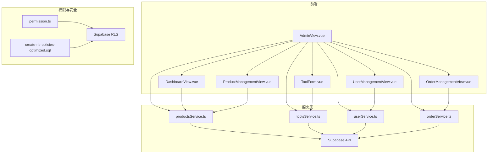
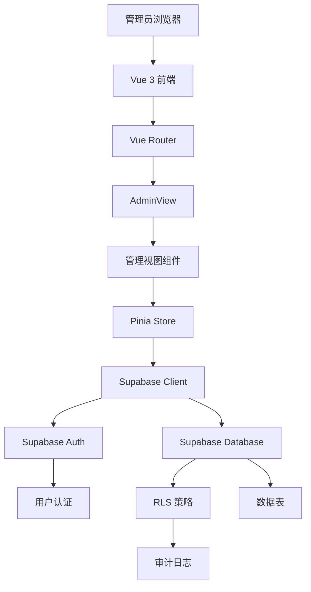
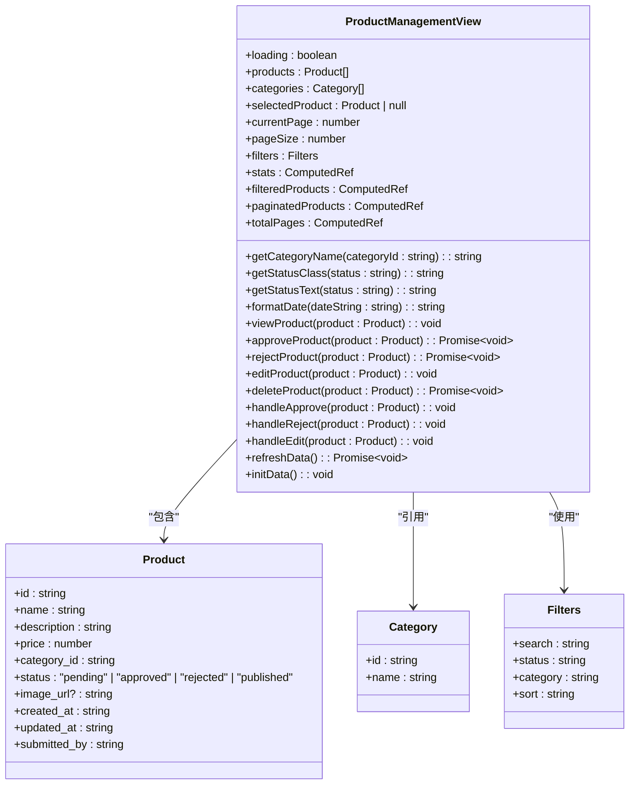
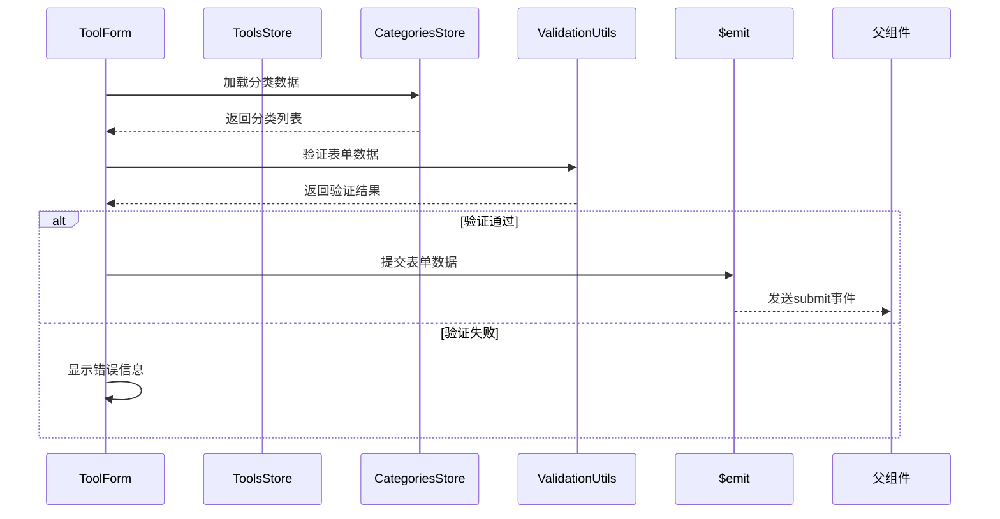
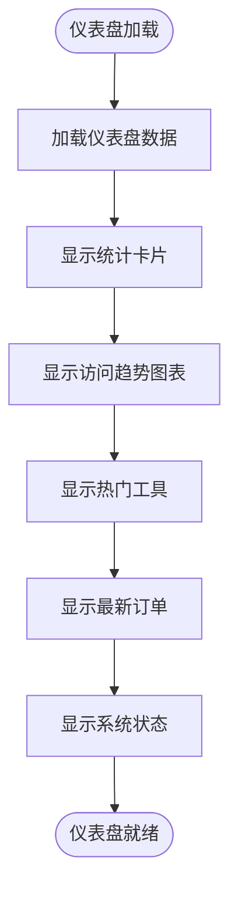
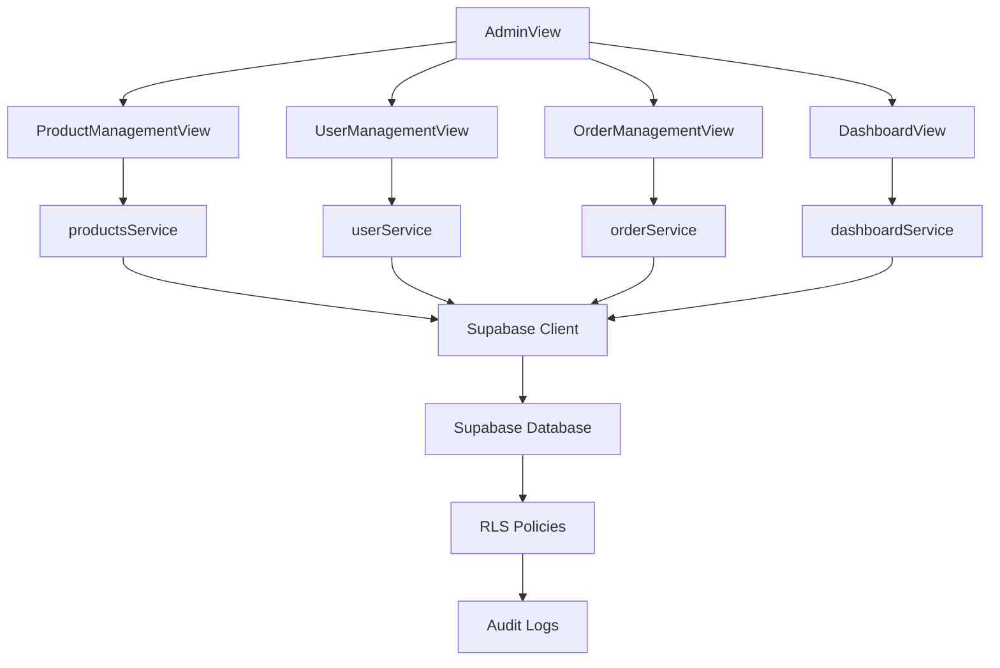

# 管理后台

<cite>
**本文档引用文件**  
- [AdminView.vue](file://src/views/admin/AdminView.vue)
- [ProductManagementView.vue](file://src/views/admin/ProductManagementView.vue)
- [ToolForm.vue](file://src/components/admin/ToolForm.vue)
- [DashboardView.vue](file://src/views/admin/DashboardView.vue)
- [UserManagementView.vue](file://src/views/admin/UserManagementView.vue)
- [OrderManagementView.vue](file://src/views/admin/OrderManagementView.vue)
- [supabase_complete_deploy.sql](file://scripts/database/supabase_complete_deploy.sql)
- [create-rls-policies-optimized.sql](file://scripts/database/create-rls-policies-optimized.sql)
- [productsService.ts](file://src/services/productsService.ts)
- [toolsService.ts](file://src/services/toolsService.ts)
- [userService.ts](file://src/services/userService.ts)
- [orderService.ts](file://src/services/orderService.ts)
- [permission.ts](file://src/permission.ts)
</cite>

## 目录
1. [简介](#简介)
2. [项目结构](#项目结构)
3. [核心组件](#核心组件)
4. [架构概览](#架构概览)
5. [详细组件分析](#详细组件分析)
6. [依赖分析](#依赖分析)
7. [性能考量](#性能考量)
8. [故障排除指南](#故障排除指南)
9. [结论](#结论)

## 简介
管理后台是系统的核心管理界面，提供对产品、工具、用户和订单的全面管理功能。该系统基于Vue 3和Supabase构建，采用模块化架构设计，支持管理员角色的权限控制和敏感操作审计。后台包含仪表盘、产品管理、工具管理、用户管理和订单管理等多个功能模块，通过直观的界面和高效的数据处理机制，帮助管理员完成日常运营任务。

## 项目结构
管理后台的项目结构遵循Vue 3的标准组织方式，主要功能模块集中在`src/views/admin`目录下。系统采用组件化设计，将UI元素、业务逻辑和服务层分离，提高了代码的可维护性和可扩展性。

**图示来源**  
- [AdminView.vue](file://src/views/admin/AdminView.vue#L0-L286)
- [ProductManagementView.vue](file://src/views/admin/ProductManagementView.vue#L0-L663)
- [ToolForm.vue](file://src/components/admin/ToolForm.vue#L0-L511)

**本节来源**  
- [AdminView.vue](file://src/views/admin/AdminView.vue#L0-L286)
- [src/views/admin](file://src/views/admin)

## 核心组件
管理后台的核心组件包括`AdminView.vue`作为主容器，`ProductManagementView.vue`用于产品管理，`UserManagementView.vue`用于用户管理，以及`ToolForm.vue`作为工具创建和编辑的表单组件。这些组件通过Vue Router进行导航，使用Pinia存储管理状态，并通过Supabase客户端与后端数据库交互。

**本节来源**  
- [AdminView.vue](file://src/views/admin/AdminView.vue#L0-L286)
- [ProductManagementView.vue](file://src/views/admin/ProductManagementView.vue#L0-L663)
- [UserManagementView.vue](file://src/views/admin/UserManagementView.vue#L0-L1)
- [ToolForm.vue](file://src/components/admin/ToolForm.vue#L0-L511)

## 架构概览
管理后台采用分层架构设计，前端界面层与后端服务层通过清晰的接口进行通信。系统权限控制基于Supabase的行级安全（RLS）策略实现，确保只有授权管理员才能访问敏感数据和执行关键操作。

**图示来源**  
- [AdminView.vue](file://src/views/admin/AdminView.vue#L0-L286)
- [permission.ts](file://src/permission.ts#L0-L1)
- [supabase_complete_deploy.sql](file://scripts/database/supabase_complete_deploy.sql#L0-L1)

## 详细组件分析

### 产品管理视图分析
`ProductManagementView.vue`是产品管理的核心组件，提供产品列表展示、筛选、排序和分页功能。该组件还包含统计卡片，显示总产品数、待审核产品数、已发布产品数和已拒绝产品数。

**图示来源**  
- [ProductManagementView.vue](file://src/views/admin/ProductManagementView.vue#L0-L663)

**本节来源**  
- [ProductManagementView.vue](file://src/views/admin/ProductManagementView.vue#L0-L663)

### 工具表单组件分析
`ToolForm.vue`是工具创建和编辑的表单组件，支持基本信息、可选信息和SEO信息的输入。该组件包含表单验证逻辑，确保提交的数据符合要求。

**图示来源**  
- [ToolForm.vue](file://src/components/admin/ToolForm.vue#L0-L511)
- [productsService.ts](file://src/services/productsService.ts#L0-L1)
- [toolsService.ts](file://src/services/toolsService.ts#L0-L1)

**本节来源**  
- [ToolForm.vue](file://src/components/admin/ToolForm.vue#L0-L511)

### 仪表盘视图分析
`DashboardView.vue`提供系统概览和关键指标的可视化展示，包括统计卡片、访问趋势图表、热门工具列表、最新订单列表和系统状态监控。

**图示来源**  
- [DashboardView.vue](file://src/views/admin/DashboardView.vue#L0-L561)

**本节来源**  
- [DashboardView.vue](file://src/views/admin/DashboardView.vue#L0-L561)

## 依赖分析
管理后台的组件之间存在明确的依赖关系，前端组件依赖于服务层提供的API接口，服务层则依赖于Supabase客户端与后端数据库交互。

**图示来源**  
- [AdminView.vue](file://src/views/admin/AdminView.vue#L0-L286)
- [productsService.ts](file://src/services/productsService.ts#L0-L1)
- [userService.ts](file://src/services/userService.ts#L0-L1)
- [orderService.ts](file://src/services/orderService.ts#L0-L1)
- [supabase_complete_deploy.sql](file://scripts/database/supabase_complete_deploy.sql#L0-L1)

**本节来源**  
- [AdminView.vue](file://src/views/admin/AdminView.vue#L0-L286)
- [productsService.ts](file://src/services/productsService.ts#L0-L1)
- [userService.ts](file://src/services/userService.ts#L0-L1)
- [orderService.ts](file://src/services/orderService.ts#L0-L1)

## 性能考量
管理后台在性能方面进行了多项优化，包括数据分页、懒加载、缓存机制和批量操作。产品管理视图采用分页显示，每页最多显示10条记录，避免一次性加载大量数据导致页面卡顿。系统还实现了数据缓存，减少对后端API的重复请求。

**本节来源**  
- [ProductManagementView.vue](file://src/views/admin/ProductManagementView.vue#L0-L663)
- [productsService.ts](file://src/services/productsService.ts#L0-L1)

## 故障排除指南
当管理后台出现问题时，可以按照以下步骤进行排查：

1. 检查管理员权限是否正确配置
2. 验证Supabase连接是否正常
3. 检查RLS策略是否正确应用
4. 查看浏览器控制台是否有错误信息
5. 检查网络请求是否成功

**本节来源**  
- [permission.ts](file://src/permission.ts#L0-L1)
- [supabase_complete_deploy.sql](file://scripts/database/supabase_complete_deploy.sql#L0-L1)
- [AdminView.vue](file://src/views/admin/AdminView.vue#L0-L286)

## 结论
管理后台是一个功能完善、结构清晰的管理系统，通过模块化设计和权限控制机制，为管理员提供了高效的产品、工具、用户和订单管理能力。系统采用现代化的前端技术栈，结合Supabase的强大后端服务，实现了安全、可靠和可扩展的管理功能。未来可以进一步优化性能，增加更多数据分析功能，提升管理员的工作效率。