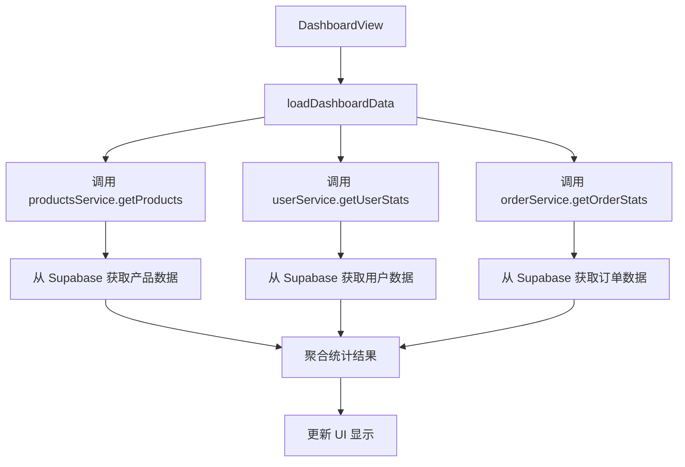
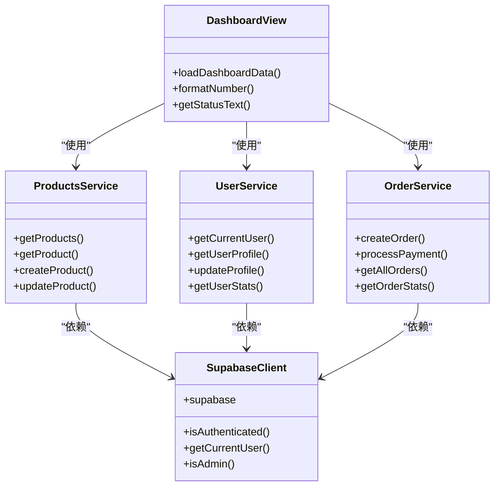
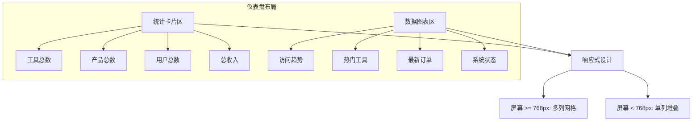
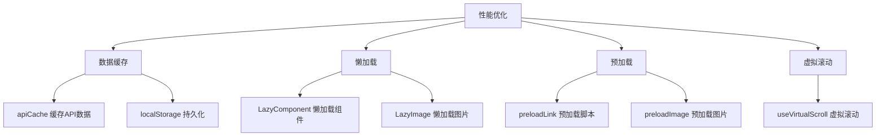
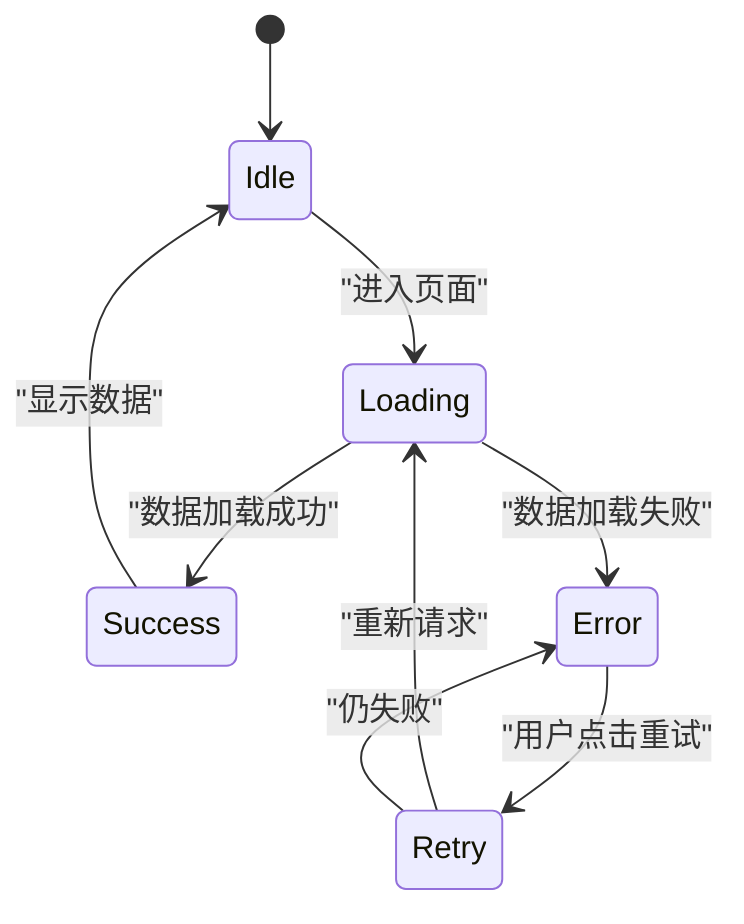

# 管理后台概览

<cite>
**本文档引用文件**  
- [DashboardView.vue](file://src/views/admin/DashboardView.vue)
- [productsService.ts](file://src/services/productsService.ts)
- [userService.ts](file://src/services/userService.ts)
- [orderService.ts](file://src/services/orderService.ts)
- [supabaseClient.ts](file://src/lib/supabaseClient.ts)
- [cacheManager.ts](file://src/utils/cacheManager.ts)
- [useLazyLoading.ts](file://src/composables/useLazyLoading.ts)
- [LazyComponent.vue](file://src/components/common/LazyComponent.vue)
- [LazyImage.vue](file://src/components/common/LazyImage.vue)
</cite>

## 目录
1. [简介](#简介)
2. [核心功能与数据聚合逻辑](#核心功能与数据聚合逻辑)
3. [系统集成与权限控制](#系统集成与权限控制)
4. [仪表盘布局与响应式设计](#仪表盘布局与响应式设计)
5. [性能优化策略](#性能优化策略)
6. [数据可视化与用户体验](#数据可视化与用户体验)
7. [结论](#结论)

## 简介
本文件旨在全面概述管理后台的仪表盘视图（DashboardView），重点介绍其核心功能、系统集成方式及用户体验设计。该仪表盘为管理员提供关键业务指标的实时概览，包括用户增长、工具数量、产品状态和订单统计等信息。通过集成多个服务模块并利用Supabase作为后端数据库，系统实现了高效的数据获取与展示。同时，基于Supabase RLS（行级安全策略）的权限控制机制确保了数据访问的安全性。

## 核心功能与数据聚合逻辑

管理后台的仪表盘视图通过调用多个服务接口从Supabase数据库中获取实时数据，并对这些数据进行聚合处理以生成关键指标。主要功能包括：

- **工具总数统计**：通过查询 `tools` 表中的记录数来获取当前系统中所有工具的数量。
- **产品总数统计**：调用 `ProductsService.getProducts()` 方法获取处于“活跃”状态的产品总数。
- **用户总数统计**：从 `user_profiles` 表中统计注册用户的总数。
- **收入统计**：结合 `orders` 表中状态为“已支付”的订单金额，计算总收入及月度增长率。
- **新增统计**：按月度维度统计新添加的工具、产品和注册用户数量。

数据聚合过程由 `DashboardView.vue` 中的 `loadDashboardData` 方法驱动，该方法在组件挂载时被调用。尽管当前代码中使用的是模拟数据，但其设计意图是通过调用 `productsService`、`userService` 和 `orderService` 提供的API来获取真实数据。

**图表来源**  
- [DashboardView.vue](file://src/views/admin/DashboardView.vue#L150-L180)
- [productsService.ts](file://src/services/productsService.ts#L10-L50)
- [userService.ts](file://src/services/userService.ts#L10-L50)
- [orderService.ts](file://src/services/orderService.ts#L450-L500)

**章节来源**  
- [DashboardView.vue](file://src/views/admin/DashboardView.vue#L150-L180)

## 系统集成与权限控制

仪表盘视图依赖于多个服务模块与Supabase数据库进行交互，确保数据的安全性和一致性。

### 服务集成
- **ProductsService**：负责处理与产品相关的CRUD操作，支持分页、排序和过滤功能。
- **UserService**：管理用户资料的读取、更新和删除，同时提供用户统计信息。
- **OrderService**：处理订单创建、支付流程、状态更新及管理员端的订单查询。

所有服务均通过 `supabaseClient.ts` 提供的统一客户端实例与Supabase进行通信，确保连接配置的一致性。

### 权限控制机制
系统采用Supabase的RLS（Row Level Security）策略来实现细粒度的数据访问控制。管理员仅能访问其权限范围内的数据，具体实现如下：
- 在数据库层面定义策略，限制非管理员角色对敏感表（如 `orders`、`user_profiles`）的访问。
- 前端通过 `supabaseClient.ts` 中的 `isAdmin()` 函数判断当前用户是否具备管理员权限。
- 所有涉及敏感数据的操作（如订单管理、用户管理）均需通过权限校验后方可执行。

**图表来源**  
- [supabaseClient.ts](file://src/lib/supabaseClient.ts#L50-L100)
- [productsService.ts](file://src/services/productsService.ts#L10-L50)
- [userService.ts](file://src/services/userService.ts#L10-L50)
- [orderService.ts](file://src/services/orderService.ts#L10-L50)

**章节来源**  
- [supabaseClient.ts](file://src/lib/supabaseClient.ts#L50-L100)

## 仪表盘布局与响应式设计

仪表盘采用现代化的网格布局，确保在不同设备上均能提供良好的视觉体验。

### 布局结构
- **统计卡片区**：使用 `stats-grid` 容器展示四个关键指标（工具、产品、用户、收入），每个卡片包含图标、数值和变化趋势。
- **数据图表区**：采用 `dashboard-grid` 布局展示访问趋势、热门工具、最新订单和系统状态等信息。
- **响应式适配**：通过CSS媒体查询实现移动端适配，在屏幕宽度小于768px时，网格布局自动调整为单列显示。

### 组件化设计
- 使用 `LazyComponent.vue` 实现组件的懒加载，提升初始渲染性能。
- 图片资源通过 `LazyImage.vue` 进行延迟加载，减少不必要的网络请求。

**图表来源**  
- [DashboardView.vue](file://src/views/admin/DashboardView.vue#L20-L100)
- [LazyComponent.vue](file://src/components/common/LazyComponent.vue#L10-L50)
- [LazyImage.vue](file://src/components/common/LazyImage.vue#L10-L50)

**章节来源**  
- [DashboardView.vue](file://src/views/admin/DashboardView.vue#L20-L100)

## 性能优化策略

为提升用户体验和系统响应速度，项目采用了多种性能优化技术。

### 数据缓存机制
- 使用 `cacheManager.ts` 提供的 `apiCache` 实例对API响应数据进行缓存，设置默认缓存时间为3分钟。
- 缓存支持版本控制，可通过 `refreshVersion()` 方法强制刷新缓存。
- 支持将缓存序列化存储至 `localStorage`，实现跨会话持久化。

### 懒加载与预加载
- **组件懒加载**：通过 `useLazyLoading.ts` 中的 `useLazyComponent()` 实现非首屏组件的按需加载。
- **图片懒加载**：`LazyImage.vue` 组件结合 `IntersectionObserver` API，仅在图片进入视口时才发起请求。
- **资源预加载**：利用 `useResourcePreloader()` 提前加载关键脚本、字体和图像资源。

### 虚拟滚动
对于大数据列表（如订单列表），采用 `useVirtualScroll()` 实现虚拟滚动，仅渲染可视区域内的项目，显著降低DOM节点数量。

**图表来源**  
- [cacheManager.ts](file://src/utils/cacheManager.ts#L10-L100)
- [useLazyLoading.ts](file://src/composables/useLazyLoading.ts#L10-L100)
- [LazyComponent.vue](file://src/components/common/LazyComponent.vue#L10-L50)
- [LazyImage.vue](file://src/components/common/LazyImage.vue#L10-L50)

**章节来源**  
- [cacheManager.ts](file://src/utils/cacheManager.ts#L10-L100)
- [useLazyLoading.ts](file://src/composables/useLazyLoading.ts#L10-L100)

## 数据可视化与用户体验

仪表盘注重数据的可视化呈现和用户交互体验的设计。

### 数据可视化
- 使用图标（如 `WrenchIcon`、`UsersIcon`）增强数据可读性。
- 数值格式化：通过 `formatNumber()` 方法对大数字进行千分位分隔。
- 状态标签：订单状态使用不同颜色标识（如绿色表示“已支付”，橙色表示“待支付”）。

### 异常处理与加载状态
- **加载状态**：在数据请求期间显示骨架屏（skeleton）或旋转动画，提升感知性能。
- **错误处理**：捕获服务调用异常并在控制台输出详细错误信息，同时提供重试机制。
- **用户体验**：通过 `GlobalErrorHandler.vue` 统一处理前端异常，确保系统稳定性。

**图表来源**  
- [DashboardView.vue](file://src/views/admin/DashboardView.vue#L150-L180)
- [errorHandler.ts](file://src/utils/errorHandler.ts#L10-L50)
- [GlobalErrorHandler.vue](file://src/components/error/GlobalErrorHandler.vue#L10-L50)

**章节来源**  
- [DashboardView.vue](file://src/views/admin/DashboardView.vue#L150-L180)

## 结论
管理后台的仪表盘视图通过集成 `productsService`、`userService` 和 `orderService` 等服务模块，实现了对关键业务指标的实时监控。系统采用Supabase RLS机制保障数据安全，结合缓存、懒加载和虚拟滚动等技术优化性能。整体设计兼顾功能性与用户体验，为管理员提供了直观、高效的数据管理界面。未来可进一步完善数据可视化图表（如折线图、柱状图）以增强分析能力。