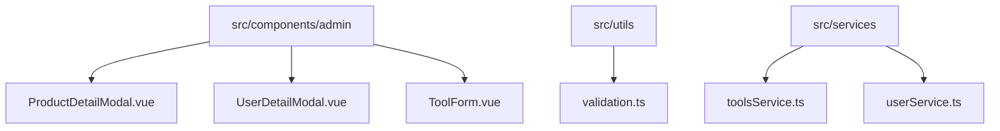
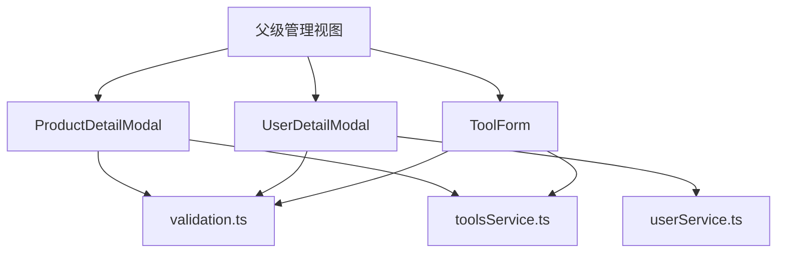
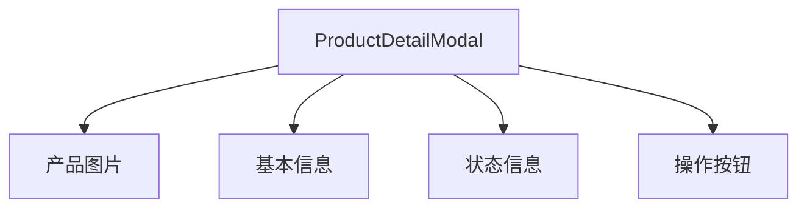
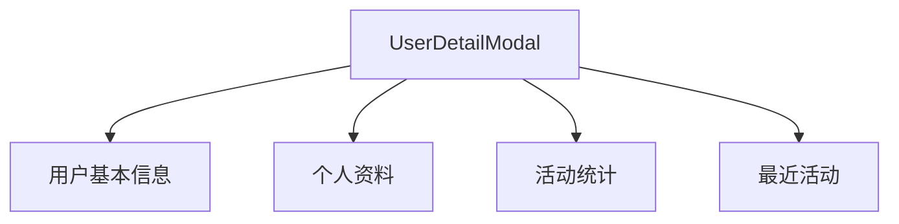
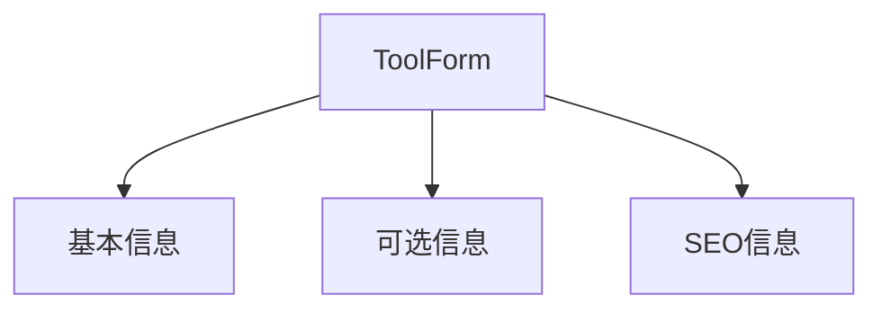
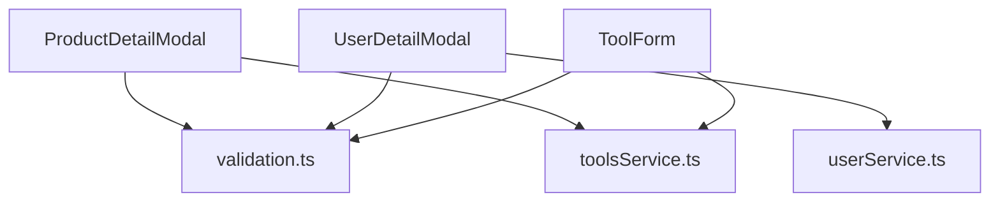

# 管理表单组件

<cite>
**本文档引用的文件**
- [ProductDetailModal.vue](file://src/components/admin/ProductDetailModal.vue)
- [UserDetailModal.vue](file://src/components/admin/UserDetailModal.vue)
- [ToolForm.vue](file://src/components/admin/ToolForm.vue)
- [validation.ts](file://src/utils/validation.ts)
- [toolsService.ts](file://src/services/toolsService.ts)
- [userService.ts](file://src/services/userService.ts)
- [index.ts](file://src/types/index.ts)
</cite>

## 目录
1. [简介](#简介)
2. [项目结构](#项目结构)
3. [核心组件](#核心组件)
4. [架构概述](#架构概述)
5. [详细组件分析](#详细组件分析)
6. [依赖分析](#依赖分析)
7. [性能考虑](#性能考虑)
8. [故障排除指南](#故障排除指南)
9. [结论](#结论)
10. [附录](#附录)（如有必要）

## 简介
本文档集中文档化管理后台使用的表单组件，详细描述ProductDetailModal、UserDetailModal和ToolForm的UI结构、表单字段、验证规则和提交逻辑。解释它们如何通过props接收数据，通过emits或服务层提交变更，并与父级管理视图进行通信。提供这些组件的复用模式和定制化指南，确保UI一致性。

## 项目结构
管理表单组件位于`src/components/admin`目录下，包括ProductDetailModal.vue、UserDetailModal.vue和ToolForm.vue。这些组件通过props接收数据，通过emits或服务层提交变更，并与父级管理视图进行通信。

**图表来源**
- [ProductDetailModal.vue](file://src/components/admin/ProductDetailModal.vue)
- [UserDetailModal.vue](file://src/components/admin/UserDetailModal.vue)
- [ToolForm.vue](file://src/components/admin/ToolForm.vue)
- [validation.ts](file://src/utils/validation.ts)
- [toolsService.ts](file://src/services/toolsService.ts)
- [userService.ts](file://src/services/userService.ts)

**章节来源**
- [ProductDetailModal.vue](file://src/components/admin/ProductDetailModal.vue)
- [UserDetailModal.vue](file://src/components/admin/UserDetailModal.vue)
- [ToolForm.vue](file://src/components/admin/ToolForm.vue)

## 核心组件
管理后台的表单组件包括ProductDetailModal、UserDetailModal和ToolForm，它们分别用于产品详情展示、用户详情展示和工具表单提交。这些组件通过props接收数据，通过emits或服务层提交变更，并与父级管理视图进行通信。

**章节来源**
- [ProductDetailModal.vue](file://src/components/admin/ProductDetailModal.vue)
- [UserDetailModal.vue](file://src/components/admin/UserDetailModal.vue)
- [ToolForm.vue](file://src/components/admin/ToolForm.vue)

## 架构概述
管理表单组件采用Vue 3的组合式API，通过props接收数据，通过emits或服务层提交变更，并与父级管理视图进行通信。验证规则使用validation.ts，提交逻辑通过服务层调用。

**图表来源**
- [ProductDetailModal.vue](file://src/components/admin/ProductDetailModal.vue)
- [UserDetailModal.vue](file://src/components/admin/UserDetailModal.vue)
- [ToolForm.vue](file://src/components/admin/ToolForm.vue)
- [validation.ts](file://src/utils/validation.ts)
- [toolsService.ts](file://src/services/toolsService.ts)
- [userService.ts](file://src/services/userService.ts)

## 详细组件分析
对ProductDetailModal、UserDetailModal和ToolForm进行详细分析，包括UI结构、表单字段、验证规则和提交逻辑。

### ProductDetailModal 分析
ProductDetailModal组件用于展示产品详情，包括产品信息、状态信息和操作按钮。它通过props接收产品数据，通过emits提交变更。

#### UI结构
ProductDetailModal的UI结构包括产品图片、基本信息、状态信息和操作按钮。产品图片显示在左侧，基本信息和状态信息显示在右侧。

**图表来源**
- [ProductDetailModal.vue](file://src/components/admin/ProductDetailModal.vue)

#### 表单字段
ProductDetailModal的表单字段包括产品名称、描述、价格、分类、产品链接、状态、提交时间、更新时间、提交用户等。

**章节来源**
- [ProductDetailModal.vue](file://src/components/admin/ProductDetailModal.vue)

#### 验证规则
ProductDetailModal使用validation.ts中的验证规则，包括必填字段、最小长度、最大长度、正则表达式等。

**章节来源**
- [validation.ts](file://src/utils/validation.ts)

#### 提交逻辑
ProductDetailModal通过emits提交变更，包括关闭、通过审核、拒绝审核、编辑、发布、取消发布和删除产品。

**章节来源**
- [ProductDetailModal.vue](file://src/components/admin/ProductDetailModal.vue)

### UserDetailModal 分析
UserDetailModal组件用于展示用户详情，包括用户基本信息、个人资料、活动统计和最近活动。它通过props接收用户数据，通过emits提交变更。

#### UI结构
UserDetailModal的UI结构包括用户基本信息、个人资料、活动统计和最近活动。用户基本信息显示在顶部，个人资料、活动统计和最近活动显示在下方。

**图表来源**
- [UserDetailModal.vue](file://src/components/admin/UserDetailModal.vue)

#### 表单字段
UserDetailModal的表单字段包括用户ID、用户名、邮箱、角色、状态、注册时间、最后登录、邮箱验证等。

**章节来源**
- [UserDetailModal.vue](file://src/components/admin/UserDetailModal.vue)

#### 验证规则
UserDetailModal使用validation.ts中的验证规则，包括必填字段、最小长度、最大长度、正则表达式等。

**章节来源**
- [validation.ts](file://src/utils/validation.ts)

#### 提交逻辑
UserDetailModal通过emits提交变更，包括关闭和编辑用户。

**章节来源**
- [UserDetailModal.vue](file://src/components/admin/UserDetailModal.vue)

### ToolForm 分析
ToolForm组件用于提交工具表单，包括基本信息、可选信息和SEO信息。它通过props接收工具数据，通过emits提交变更。

#### UI结构
ToolForm的UI结构包括基本信息、可选信息和SEO信息。基本信息包括工具名称、描述、链接和分类，可选信息包括图标和推荐工具，SEO信息包括SEO标题和描述。

**图表来源**
- [ToolForm.vue](file://src/components/admin/ToolForm.vue)

#### 表单字段
ToolForm的表单字段包括工具名称、描述、链接、分类、图标、推荐工具、SEO标题和描述。

**章节来源**
- [ToolForm.vue](file://src/components/admin/ToolForm.vue)

#### 验证规则
ToolForm使用validation.ts中的验证规则，包括必填字段、最小长度、最大长度、正则表达式等。

**章节来源**
- [validation.ts](file://src/utils/validation.ts)

#### 提交逻辑
ToolForm通过emits提交变更，包括提交和取消。

**章节来源**
- [ToolForm.vue](file://src/components/admin/ToolForm.vue)

## 依赖分析
管理表单组件依赖于validation.ts、toolsService.ts和userService.ts。validation.ts提供验证规则，toolsService.ts和userService.ts提供数据提交逻辑。

**图表来源**
- [validation.ts](file://src/utils/validation.ts)
- [toolsService.ts](file://src/services/toolsService.ts)
- [userService.ts](file://src/services/userService.ts)

**章节来源**
- [ProductDetailModal.vue](file://src/components/admin/ProductDetailModal.vue)
- [UserDetailModal.vue](file://src/components/admin/UserDetailModal.vue)
- [ToolForm.vue](file://src/components/admin/ToolForm.vue)
- [validation.ts](file://src/utils/validation.ts)
- [toolsService.ts](file://src/services/toolsService.ts)
- [userService.ts](file://src/services/userService.ts)

## 性能考虑
管理表单组件采用Vue 3的组合式API，通过props接收数据，通过emits或服务层提交变更，并与父级管理视图进行通信。验证规则使用validation.ts，提交逻辑通过服务层调用。这些设计考虑了性能和可维护性。

## 故障排除指南
如果管理表单组件出现问题，可以检查以下方面：
- 确保props数据正确传递
- 确保emits事件正确触发
- 确保验证规则正确应用
- 确保服务层调用正确

**章节来源**
- [ProductDetailModal.vue](file://src/components/admin/ProductDetailModal.vue)
- [UserDetailModal.vue](file://src/components/admin/UserDetailModal.vue)
- [ToolForm.vue](file://src/components/admin/ToolForm.vue)
- [validation.ts](file://src/utils/validation.ts)
- [toolsService.ts](file://src/services/toolsService.ts)
- [userService.ts](file://src/services/userService.ts)

## 结论
本文档详细描述了管理后台使用的表单组件，包括ProductDetailModal、UserDetailModal和ToolForm的UI结构、表单字段、验证规则和提交逻辑。这些组件通过props接收数据，通过emits或服务层提交变更，并与父级管理视图进行通信。提供这些组件的复用模式和定制化指南，确保UI一致性。

## 附录
无