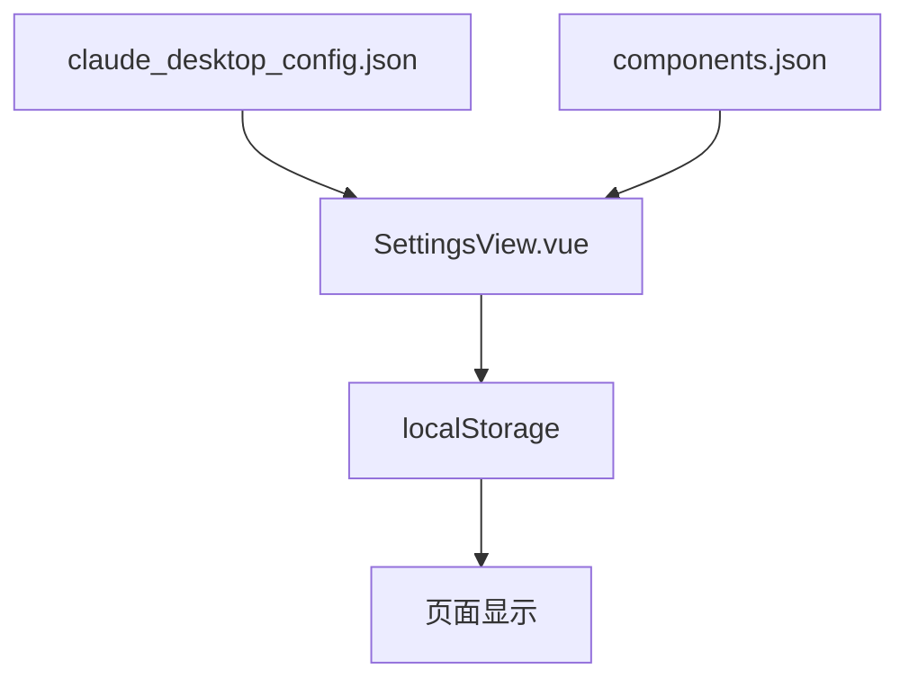
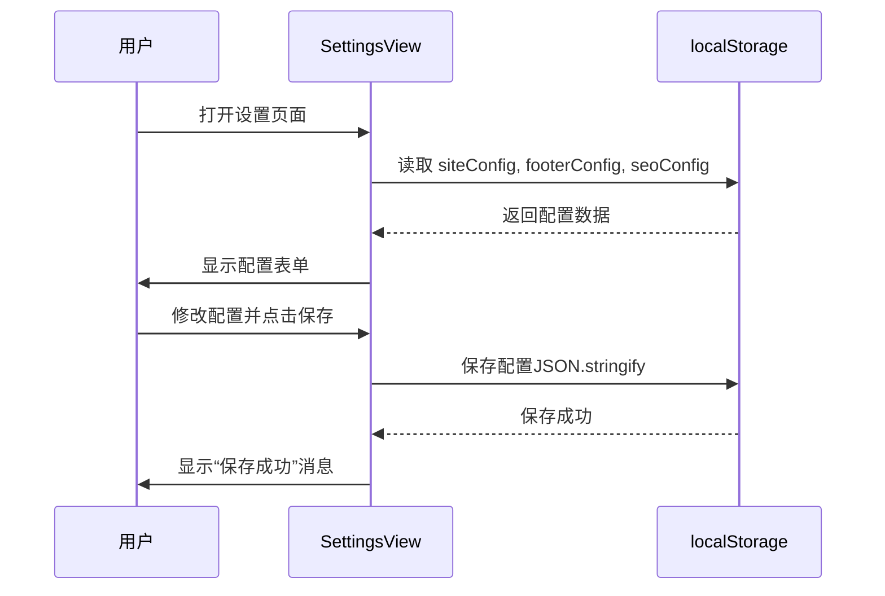
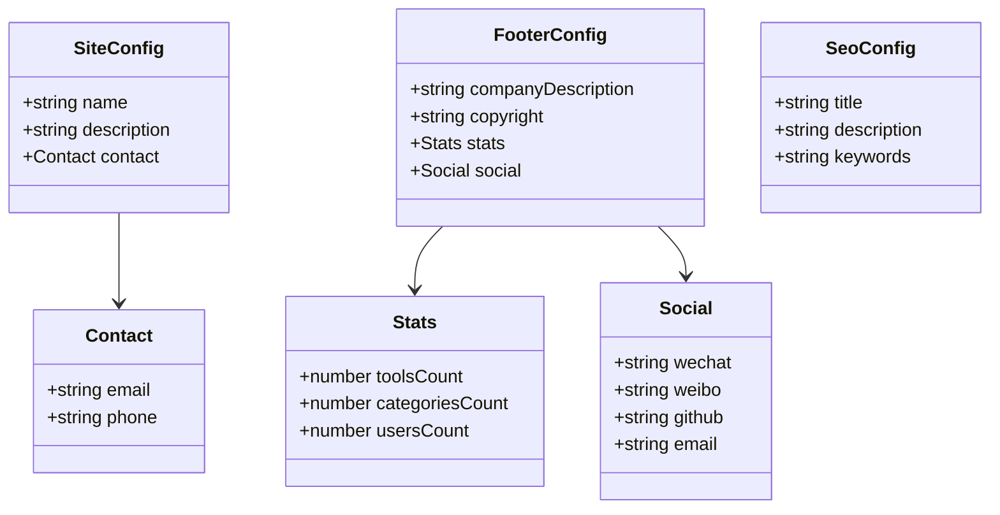
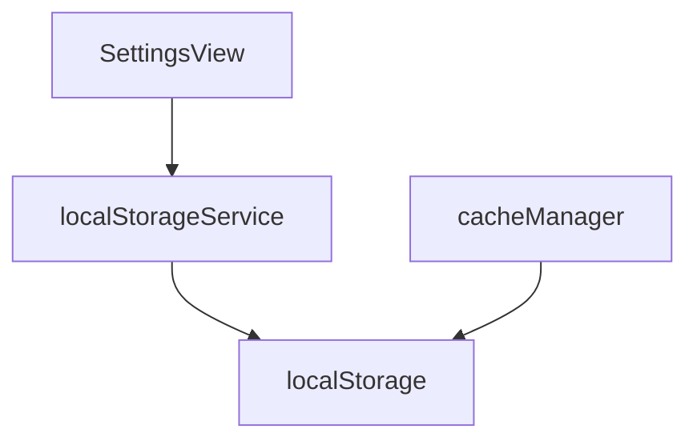

# 系统设置

<cite>
**本文档引用的文件**  
- [SettingsView.vue](file://src/views/admin/SettingsView.vue)
- [claude_desktop_config.json](file://config/development/claude_desktop_config.json)
- [components.json](file://config/development/components.json)
- [localStorageService.ts](file://src/services/localStorageService.ts)
- [cacheManager.ts](file://src/utils/cacheManager.ts)
</cite>

## 目录
1. [简介](#简介)
2. [项目结构](#项目结构)
3. [核心组件](#核心组件)
4. [架构概览](#架构概览)
5. [详细组件分析](#详细组件分析)
6. [依赖分析](#依赖分析)
7. [性能考虑](#性能考虑)
8. [故障排除指南](#故障排除指南)
9. [结论](#结论)

## 简介
本系统设置模块（SettingsView）用于配置应用的全局参数，包括网站基本信息、页面底部信息、SEO设置等。管理员可通过该界面进行系统调优，所有配置项均通过前端逻辑进行读取和更新，存储于浏览器的 `localStorage` 中，无需重启即可实时生效。敏感配置通过前端校验和确认对话框进行保护。

## 项目结构
系统设置模块位于 `src/views/admin/SettingsView.vue`，配置文件存储在 `config/development/` 目录下，包括 `claude_desktop_config.json` 和 `components.json`。前端使用 Vue 3 和 TypeScript 实现，配置数据通过 `localStorage` 持久化。



**Diagram sources**
- [SettingsView.vue](file://src/views/admin/SettingsView.vue)
- [claude_desktop_config.json](file://config/development/claude_desktop_config.json)
- [components.json](file://config/development/components.json)

**Section sources**
- [SettingsView.vue](file://src/views/admin/SettingsView.vue#L1-L521)
- [config/development](file://config/development)

## 核心组件
`SettingsView.vue` 是系统设置的核心组件，包含网站名称、描述、联系信息、SEO设置等可配置项。所有设置通过 `localStorage` 进行持久化存储，支持保存和重置功能。

**Section sources**
- [SettingsView.vue](file://src/views/admin/SettingsView.vue#L1-L521)

## 架构概览
系统设置模块采用前端集中管理方式，所有配置项在组件初始化时从 `localStorage` 加载，修改后立即保存回 `localStorage`，无需后端交互。配置更改实时生效，无需重启应用。



**Diagram sources**
- [SettingsView.vue](file://src/views/admin/SettingsView.vue#L1-L521)
- [localStorageService.ts](file://src/services/localStorageService.ts#L49-L105)

## 详细组件分析

### 系统设置分析
`SettingsView.vue` 提供了多个配置区域，包括网站基本信息、页面底部信息和SEO设置。每个配置项均通过 `v-model` 双向绑定到响应式数据对象。

#### 配置数据结构


**Diagram sources**
- [SettingsView.vue](file://src/views/admin/SettingsView.vue#L1-L521)

#### 配置读取与保存流程
```mermaid
flowchart TD
A[组件挂载] --> B[loadSettings()]
B --> C{localStorage 中有数据?}
C --> |是| D[JSON.parse 并合并到默认值]
C --> |否| E[使用默认配置]
D --> F[显示表单]
E --> F
F --> G[用户点击保存]
G --> H[saveSettings()]
H --> I[JSON.stringify 配置]
I --> J[保存到 localStorage]
J --> K[显示成功消息]
```

**Diagram sources**
- [SettingsView.vue](file://src/views/admin/SettingsView.vue#L1-L521)

**Section sources**
- [SettingsView.vue](file://src/views/admin/SettingsView.vue#L1-L521)

### 配置文件说明
`components.json` 和 `claude_desktop_config.json` 是静态配置文件，用于项目构建和开发环境设置，不通过 `SettingsView` 进行修改。

#### components.json 配置项
| 配置项 | 说明 | 示例值 |
|--------|------|--------|
| style | UI 组件样式 | "default" |
| rsc | 是否启用 React Server Components | true |
| tsx | 是否使用 TSX | true |
| tailwind.config | Tailwind CSS 配置文件路径 | "tailwind.config.ts" |
| aliases | 模块路径别名 | { "components": "@/components" } |
| iconLibrary | 图标库 | "lucide" |

#### claude_desktop_config.json 配置项
| 配置项 | 说明 | 示例值 |
|--------|------|--------|
| mcpServers.context7.command | MCP 服务启动命令 | "npx" |
| mcpServers.context7.args | MCP 服务启动参数 | ["@upstash/context7-mcp"] |

**Section sources**
- [components.json](file://config/development/components.json#L1-L20)
- [claude_desktop_config.json](file://config/development/claude_desktop_config.json#L1-L8)

## 依赖分析
系统设置模块依赖 `localStorage` 进行数据持久化，通过 `localStorageService.ts` 提供统一的本地存储接口。`cacheManager.ts` 用于管理应用缓存，但不直接参与设置模块。



**Diagram sources**
- [localStorageService.ts](file://src/services/localStorageService.ts)
- [cacheManager.ts](file://src/utils/cacheManager.ts)

**Section sources**
- [localStorageService.ts](file://src/services/localStorageService.ts#L0-L55)
- [cacheManager.ts](file://src/utils/cacheManager.ts#L0-L51)

## 性能考虑
- 所有配置项均存储在 `localStorage`，读写性能良好。
- 配置数据量小，无需分页或懒加载。
- 使用 `JSON.stringify` 和 `JSON.parse` 进行序列化，性能可接受。
- 建议定期清理无效配置以保持存储整洁。

## 故障排除指南
- **配置未保存**：检查浏览器是否禁用了 `localStorage`。
- **配置未生效**：尝试刷新页面，因设置实时生效，无需重启。
- **数据丢失**：确保用户未手动清除浏览器数据。
- **重置失败**：确认浏览器支持 `confirm()` 对话框。

**Section sources**
- [SettingsView.vue](file://src/views/admin/SettingsView.vue#L1-L521)
- [localStorageService.ts](file://src/services/localStorageService.ts#L299-L337)

## 结论
系统设置模块通过前端 `localStorage` 实现配置管理，简单高效，适合中小型应用。配置更改实时生效，无需重启。敏感操作通过确认对话框保护，确保数据安全。建议未来可扩展为支持后端存储和多环境配置。