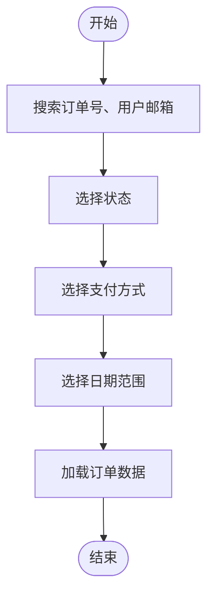

# 订单管理

<cite>
**本文档中引用的文件**  
- [OrderManagementView.vue](file://src/views/admin/OrderManagementView.vue)
- [orderService.ts](file://src/services/orderService.ts)
- [products.ts](file://src/stores/products.ts)
- [productsService.ts](file://src/services/productsService.ts)
</cite>

## 目录
1. [简介](#简介)
2. [项目结构](#项目结构)
3. [核心组件](#核心组件)
4. [架构概述](#架构概述)
5. [详细组件分析](#详细组件分析)
6. [依赖分析](#依赖分析)
7. [性能考虑](#性能考虑)
8. [故障排除指南](#故障排除指南)
9. [结论](#结论)

## 简介
本系统文档详细说明了订单管理视图的功能与实现。重点阐述了`OrderManagementView`如何展示订单列表、筛选不同状态（待支付、已发货、已完成）的订单，并支持订单详情查看。同时，深入解析了`orderService`提供的查询、状态更新（如标记为已发货）等接口的实现，包括事务处理和数据一致性保障。此外，还说明了订单状态变更时如何通过products store/service更新库存，提供了“处理退款请求”和“批量导出订单数据”的操作说明，并包含处理高并发订单查询的性能优化建议。

## 项目结构
项目采用模块化结构，主要分为以下几个部分：
- `src/views/admin/OrderManagementView.vue`：管理员订单管理视图，负责订单的展示、筛选和操作。
- `src/services/orderService.ts`：订单服务，提供订单相关的业务逻辑和数据访问接口。
- `src/stores/products.ts`：产品状态管理，使用Pinia进行状态管理。
- `src/services/productsService.ts`：产品服务，提供产品相关的业务逻辑和数据访问接口。

**图表来源**
- [OrderManagementView.vue](file://src/views/admin/OrderManagementView.vue)
- [orderService.ts](file://src/services/orderService.ts)
- [productsService.ts](file://src/services/productsService.ts)

**章节来源**
- [OrderManagementView.vue](file://src/views/admin/OrderManagementView.vue)
- [orderService.ts](file://src/services/orderService.ts)

## 核心组件
核心组件包括`OrderManagementView`、`orderService`、`productsStore`和`productsService`。这些组件协同工作，实现了订单管理的完整功能。

**章节来源**
- [OrderManagementView.vue](file://src/views/admin/OrderManagementView.vue)
- [orderService.ts](file://src/services/orderService.ts)
- [productsService.ts](file://src/services/productsService.ts)

## 架构概述
系统采用前后端分离架构，前端使用Vue 3和Pinia进行状态管理，后端使用Supabase作为数据库和API服务。订单管理视图通过调用订单服务的接口获取和操作订单数据，产品状态管理通过调用产品服务的接口获取和操作产品数据。

**图表来源**
- [OrderManagementView.vue](file://src/views/admin/OrderManagementView.vue)
- [orderService.ts](file://src/services/orderService.ts)
- [productsService.ts](file://src/services/productsService.ts)

## 详细组件分析

### OrderManagementView 分析
`OrderManagementView`是管理员订单管理的主要界面，提供了订单列表的展示、筛选和操作功能。

#### 订单列表展示
`OrderManagementView`通过调用`orderService.getAllOrders`方法获取订单列表，并在表格中展示。表格包含订单信息、用户、金额、支付方式、状态、创建时间和操作列。

**图表来源**
- [OrderManagementView.vue](file://src/views/admin/OrderManagementView.vue)

#### 订单筛选
`OrderManagementView`提供了多种筛选条件，包括搜索、状态、支付方式和日期范围。用户可以通过这些条件筛选订单列表。

**图表来源**
- [OrderManagementView.vue](file://src/views/admin/OrderManagementView.vue)

#### 订单操作
`OrderManagementView`提供了多种订单操作，包括查看订单详情、处理订单（标记为已支付）和取消订单。这些操作通过调用`orderService`的相应方法实现。

**图表来源**
- [OrderManagementView.vue](file://src/views/admin/OrderManagementView.vue)
- [orderService.ts](file://src/services/orderService.ts)

**章节来源**
- [OrderManagementView.vue](file://src/views/admin/OrderManagementView.vue)
- [orderService.ts](file://src/services/orderService.ts)

### orderService 分析
`orderService`是订单服务的核心，提供了订单相关的业务逻辑和数据访问接口。

#### 订单查询
`orderService.getAllOrders`方法用于获取所有订单，支持多种筛选条件，包括状态、支付方式、搜索和日期范围。该方法通过Supabase的`select`和`eq`方法构建查询语句，并返回分页的订单数据。

**图表来源**
- [orderService.ts](file://src/services/orderService.ts)

#### 订单状态更新
`orderService.updateOrderStatus`方法用于更新订单状态，支持将订单状态更新为“待支付”、“已支付”、“已取消”或“已退款”。该方法通过Supabase的`update`方法更新订单状态，并记录更新时间。

**图表来源**
- [orderService.ts](file://src/services/orderService.ts)

#### 事务处理和数据一致性保障
`orderService`在处理订单创建和支付时，通过Supabase的事务机制确保数据一致性。例如，在创建订单时，先插入订单记录，再插入订单项记录，如果任一操作失败，整个事务将回滚。

**图表来源**
- [orderService.ts](file://src/services/orderService.ts)

**章节来源**
- [orderService.ts](file://src/services/orderService.ts)

### productsStore 和 productsService 分析
`productsStore`和`productsService`负责产品数据的管理和访问。

#### 产品状态管理
`productsStore`使用Pinia进行状态管理，提供了产品列表、分类、搜索结果、特色产品和当前产品等状态。通过`loadProducts`、`loadProduct`等方法加载产品数据。

**图表来源**
- [products.ts](file://src/stores/products.ts)

#### 产品服务
`productsService`提供了产品相关的业务逻辑和数据访问接口，包括获取产品列表、获取单个产品、获取特色产品、获取相关产品、创建产品、更新产品、删除产品和上传产品图片等。

**图表来源**
- [productsService.ts](file://src/services/productsService.ts)

**章节来源**
- [products.ts](file://src/stores/products.ts)
- [productsService.ts](file://src/services/productsService.ts)

## 依赖分析
系统的主要依赖包括Vue 3、Pinia、Supabase和Lucide图标库。这些依赖通过`package.json`文件进行管理。

**图表来源**
- [package.json](file://package.json)

**章节来源**
- [package.json](file://package.json)

## 性能考虑
为了处理高并发订单查询，系统采用了以下性能优化措施：
- 使用Supabase的分页查询，减少单次查询的数据量。
- 在`orderService.getAllOrders`方法中，通过`range`方法实现分页，避免一次性加载大量数据。
- 使用`count: "exact"`选项获取精确的总记录数，确保分页的准确性。

**图表来源**
- [orderService.ts](file://src/services/orderService.ts)

**章节来源**
- [orderService.ts](file://src/services/orderService.ts)

## 故障排除指南
### 处理退款请求
处理退款请求时，需要调用`orderService.updateOrderStatus`方法，将订单状态更新为“已退款”。同时，需要确保退款金额正确，并更新相关财务记录。

### 批量导出订单数据
批量导出订单数据时，调用`orderService.exportOrders`方法，该方法返回CSV格式的订单数据。用户可以通过点击“导出订单”按钮触发导出操作。

**章节来源**
- [orderService.ts](file://src/services/orderService.ts)
- [OrderManagementView.vue](file://src/views/admin/OrderManagementView.vue)

## 结论
本文档详细介绍了订单管理视图的功能与实现，涵盖了订单列表展示、筛选、操作、状态更新、事务处理、数据一致性保障、库存更新、退款处理和批量导出等方面。通过合理的架构设计和性能优化，系统能够高效地处理高并发订单查询，确保数据的一致性和完整性。