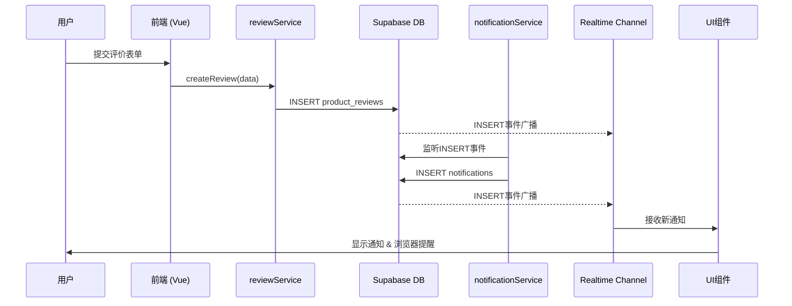

# 实时数据流路径

<cite>
**本文档引用的文件**  
- [reviewService.ts](file://src/services/reviewService.ts)
- [notificationService.ts](file://src/services/notificationService.ts)
- [useRealtime.ts](file://src/composables/useRealtime.ts)
- [supabaseClient.ts](file://src/lib/supabaseClient.ts)
- [databaseService.ts](file://src/services/databaseService.ts)
- [NotificationCenter.vue](file://src/components/notifications/NotificationCenter.vue)
- [NotificationItem.vue](file://src/components/notifications/NotificationItem.vue)
</cite>

## 目录
1. [简介](#简介)
2. [核心流程概述](#核心流程概述)
3. [端到端数据流详解](#端到端数据流详解)
4. [时序图：新评价触发通知流程](#时序图新评价触发通知流程)
5. [关键组件分析](#关键组件分析)
6. [调试技巧与工具](#调试技巧与工具)
7. [结论](#结论)

## 简介
本文档旨在构建从数据库变更到前端更新的端到端实时数据流全景图。以“新评价触发通知”为例，详细描述用户提交评价 → 数据库插入review记录 → 触发Supabase Realtime事件 → notificationService生成通知 → useRealtime接收并更新UI的完整流程。通过时序图展示各组件交互顺序，包含关键时间点与数据格式变化，并提供实用的调试技巧。

## 核心流程概述
当用户提交一条新产品评价时，系统将经历以下关键阶段：
1. 前端调用`reviewService.createReview()`发起请求
2. Supabase数据库插入`product_reviews`表并触发Realtime事件
3. `notificationService`监听到变更并创建通知记录
4. 前端`useRealtime`组合式函数订阅通知通道
5. `NotificationCenter`组件实时接收并渲染新通知

该流程实现了毫秒级的数据同步，确保用户操作后能立即看到反馈，提升了整体交互体验。

## 端到端数据流详解
### 用户提交评价
用户在产品详情页填写评价表单并提交，前端调用`reviewService.createReview()`方法。该方法验证用户是否已购买该产品，并构造包含评分、标题、内容等信息的评价对象。

**Section sources**
- [reviewService.ts](file://src/services/reviewService.ts#L250-L300)

### 数据库插入与实时事件触发
评价数据通过Supabase客户端插入`product_reviews`表。一旦插入成功，Supabase自动广播`INSERT`事件至所有订阅该表的客户端。此过程无需额外配置，由Supabase Realtime服务自动处理。

**Section sources**
- [supabaseClient.ts](file://src/lib/supabaseClient.ts#L150-L160)

### 通知服务生成通知
`notificationService`通过`subscribeToNotifications`方法监听`notifications`表的变化。当新的评价被创建后，系统自动生成一条类型为`product`的通知，包含评价摘要和跳转链接，并将其插入数据库。

**Section sources**
- [notificationService.ts](file://src/services/notificationService.ts#L250-L280)

### 前端实时接收更新
前端使用`useRealtime`组合式函数建立WebSocket连接，监听指定表的变更事件。`NotificationCenter`组件利用`useRealtimeList`自动同步通知列表，新通知到达时立即添加至列表顶部，并触发浏览器原生通知。

**Section sources**
- [useRealtime.ts](file://src/composables/useRealtime.ts#L100-L150)
- [NotificationCenter.vue](file://src/components/notifications/NotificationCenter.vue#L150-L200)

## 时序图新评价触发通知流程


**Diagram sources**
- [reviewService.ts](file://src/services/reviewService.ts#L250-L300)
- [notificationService.ts](file://src/services/notificationService.ts#L250-L280)
- [useRealtime.ts](file://src/composables/useRealtime.ts#L100-L150)
- [NotificationCenter.vue](file://src/components/notifications/NotificationCenter.vue#L150-L200)

## 关键组件分析
### reviewService：评价管理核心
`reviewService`负责评价的增删改查操作，包含权限校验、重复提交检查、关联数据查询等功能。其`createReview`方法是整个流程的起点。

**Section sources**
- [reviewService.ts](file://src/services/reviewService.ts#L250-L300)

### notificationService：通知分发中枢
该服务不仅提供CRUD接口，还封装了实时订阅逻辑。`sendRealTimeNotification`方法通过Supabase通道发送广播，确保所有客户端能即时收到通知。

**Section sources**
- [notificationService.ts](file://src/services/notificationService.ts#L250-L280)

### useRealtime：前端实时同步
作为组合式API，`useRealtime`抽象了WebSocket连接管理、事件监听、错误处理等复杂逻辑，使组件能以声明式方式使用实时功能。

**Section sources**
- [useRealtime.ts](file://src/composables/useRealtime.ts#L10-L50)

### NotificationCenter：用户界面呈现
该组件集成了通知展示、筛选、标记已读、删除等功能，并通过实时订阅保持数据最新。支持浏览器推送通知，增强用户体验。

**Section sources**
- [NotificationCenter.vue](file://src/components/notifications/NotificationCenter.vue#L1-L100)

## 调试技巧与工具
### 使用Supabase仪表板查看实时事件流
1. 登录Supabase项目控制台
2. 进入“Realtime”标签页
3. 订阅`public:product_reviews`和`public:notifications`表
4. 观察INSERT/UPDATE/DELETE事件的实时推送情况

### 浏览器开发者工具监控WebSocket消息
1. 打开Chrome DevTools的Network面板
2. 筛选WS（WebSocket）连接
3. 查看与Supabase的WebSocket通信
4. 检查`broadcast`和`postgres_changes`事件的有效载荷

### 启用客户端日志
在开发环境中，可在`supabaseClient.ts`中添加详细日志输出：
```ts
supabase.realtime.setDebug(true);
```
这将打印所有实时事件的详细信息，便于排查连接或订阅问题。

**Section sources**
- [supabaseClient.ts](file://src/lib/supabaseClient.ts#L10-L20)

## 结论
本系统通过Supabase Realtime能力实现了高效的端到端数据同步。从用户提交评价到通知更新的全过程在数百毫秒内完成，展现了现代全栈应用的响应速度。合理分层的架构设计使得各组件职责清晰，便于维护和扩展。未来可进一步优化通知聚合策略，减少频繁推送对用户体验的影响。