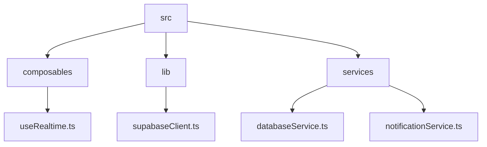
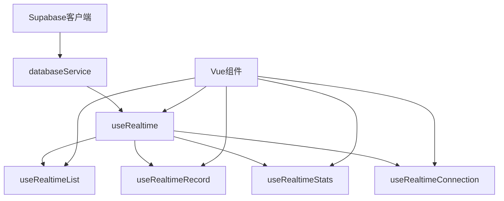
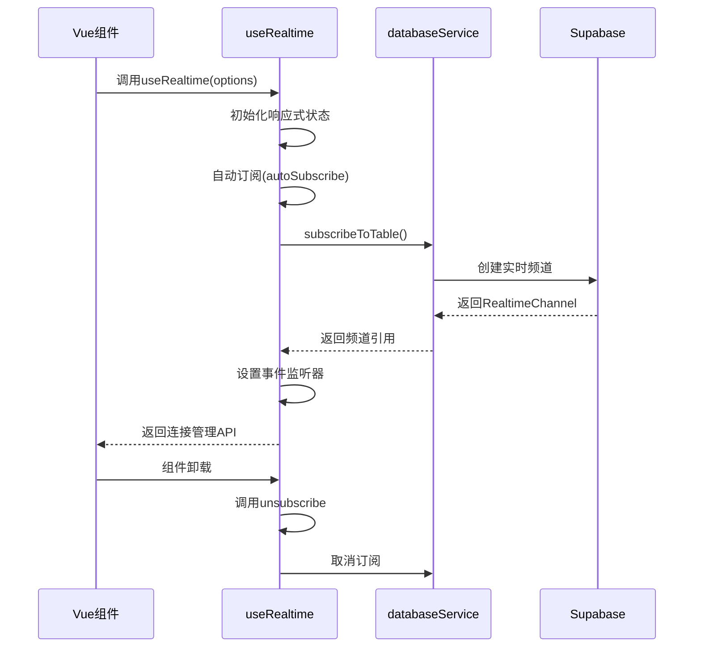
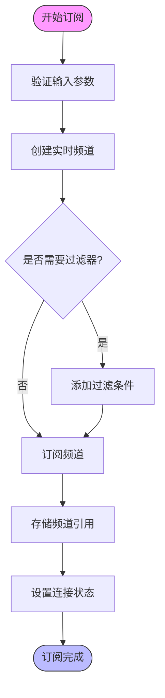
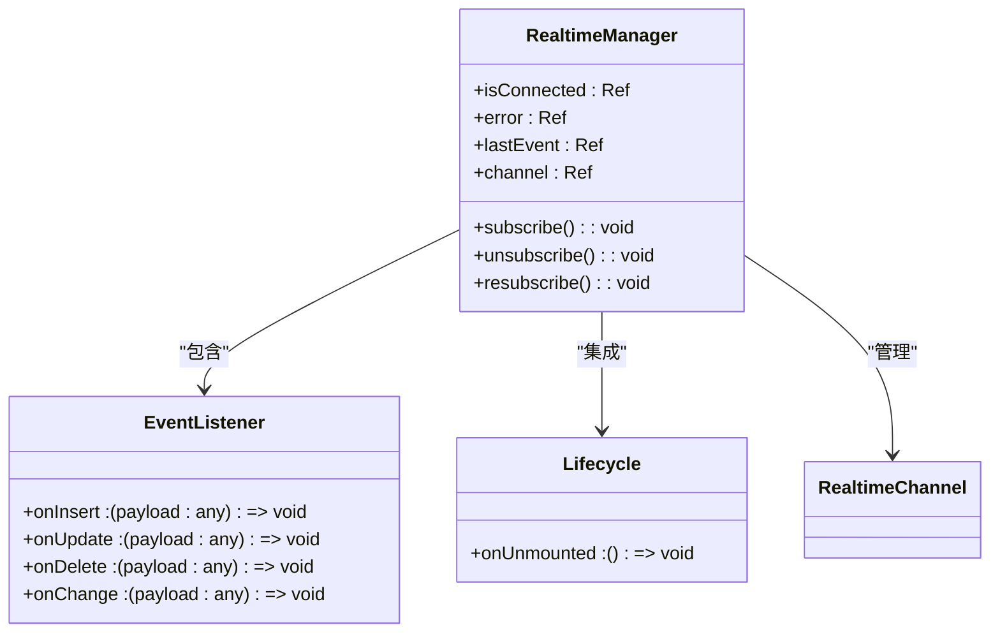
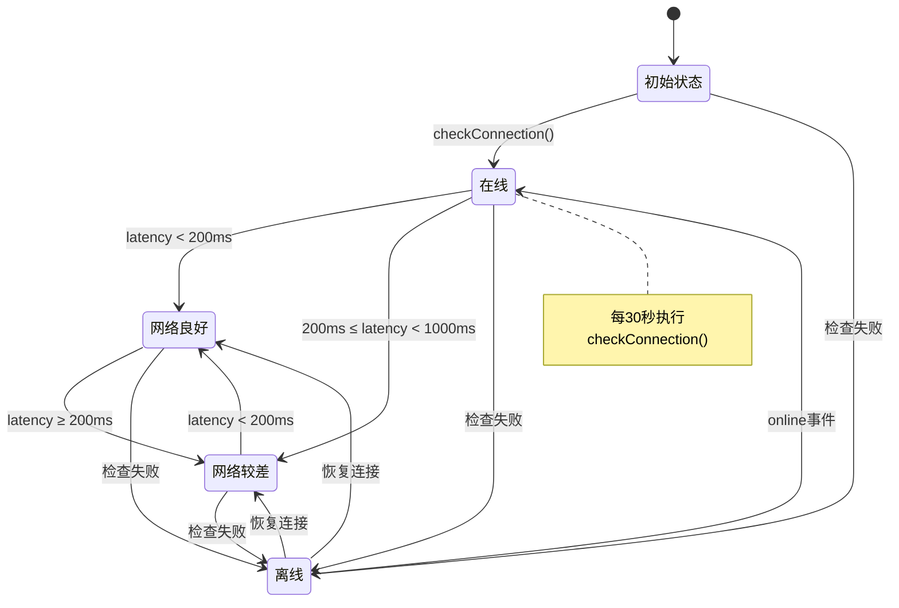
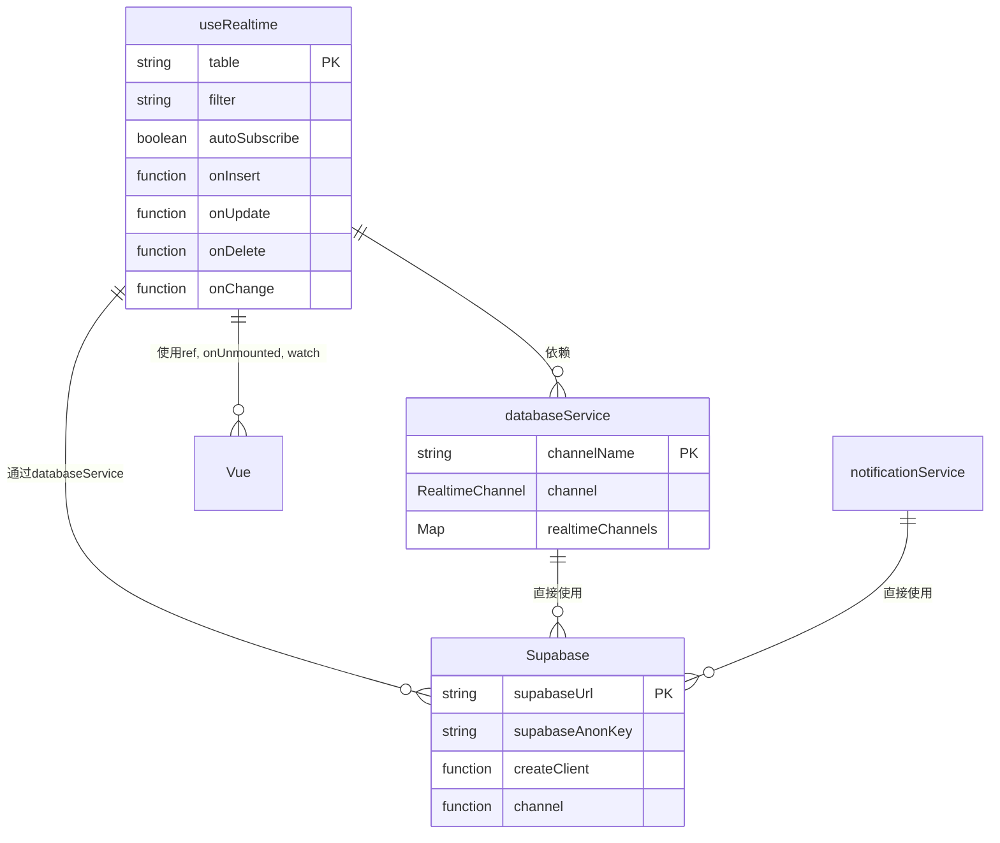
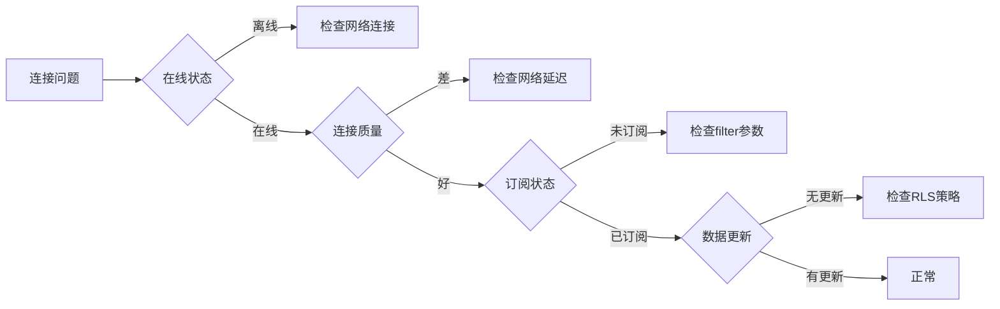

# 实时连接管理

<cite>
**本文档中引用的文件**
- [useRealtime.ts](file://src/composables/useRealtime.ts)
- [supabaseClient.ts](file://src/lib/supabaseClient.ts)
- [databaseService.ts](file://src/services/databaseService.ts)
- [notificationService.ts](file://src/services/notificationService.ts)
</cite>

## 目录
1. [项目结构](#项目结构)
2. [核心组件](#核心组件)
3. [架构概述](#架构概述)
4. [详细组件分析](#详细组件分析)
5. [依赖分析](#依赖分析)
6. [性能考虑](#性能考虑)
7. [故障排除指南](#故障排除指南)
8. [结论](#结论)

## 项目结构

**Diagram sources**
- [useRealtime.ts](file://src/composables/useRealtime.ts)
- [supabaseClient.ts](file://src/lib/supabaseClient.ts)
- [databaseService.ts](file://src/services/databaseService.ts)

**Section sources**
- [useRealtime.ts](file://src/composables/useRealtime.ts)
- [supabaseClient.ts](file://src/lib/supabaseClient.ts)

## 核心组件

`useRealtime.ts` 文件提供了WebSocket连接生命周期管理的核心功能，包括连接初始化、频道订阅、事件监听和状态监控。该文件通过组合式API模式封装了Supabase实时功能，提供了`useRealtime`、`useRealtimeList`、`useRealtimeRecord`和`useRealtimeStats`等可复用的组合函数。

**Section sources**
- [useRealtime.ts](file://src/composables/useRealtime.ts#L1-L402)

## 架构概述

**Diagram sources**
- [useRealtime.ts](file://src/composables/useRealtime.ts#L1-L402)
- [databaseService.ts](file://src/services/databaseService.ts#L1-L404)

## 详细组件分析

### useRealtime 分析

`useRealtime` 函数是WebSocket连接管理的基础，负责处理连接配置、认证集成和自动重连机制。

**Diagram sources**
- [useRealtime.ts](file://src/composables/useRealtime.ts#L46-L107)
- [databaseService.ts](file://src/services/databaseService.ts#L250-L309)

**Section sources**
- [useRealtime.ts](file://src/composables/useRealtime.ts#L1-L107)

### 频道创建与订阅逻辑

系统实现了基于用户ID的私有频道订阅模式，通过`filter`参数实现数据访问控制。

**Diagram sources**
- [useRealtime.ts](file://src/composables/useRealtime.ts#L46-L107)
- [databaseService.ts](file://src/services/databaseService.ts#L250-L309)

**Section sources**
- [useRealtime.ts](file://src/composables/useRealtime.ts#L46-L107)

### 事件监听器管理

系统实现了完整的事件监听器注册与销毁流程，防止内存泄漏。

**Diagram sources**
- [useRealtime.ts](file://src/composables/useRealtime.ts#L1-L402)

**Section sources**
- [useRealtime.ts](file://src/composables/useRealtime.ts#L98-L107)

### 连接状态监控

系统实现了全面的连接状态监控和心跳检测机制。

**Diagram sources**
- [useRealtime.ts](file://src/composables/useRealtime.ts#L315-L373)

**Section sources**
- [useRealtime.ts](file://src/composables/useRealtime.ts#L315-L401)

## 依赖分析

**Diagram sources**
- [useRealtime.ts](file://src/composables/useRealtime.ts#L1-L402)
- [databaseService.ts](file://src/services/databaseService.ts#L1-L404)
- [supabaseClient.ts](file://src/lib/supabaseClient.ts#L1-L266)

**Section sources**
- [useRealtime.ts](file://src/composables/useRealtime.ts#L1-L402)
- [databaseService.ts](file://src/services/databaseService.ts#L1-L404)

## 性能考虑

系统在实时连接管理方面实现了多项性能优化：

1. **自动重连机制**：通过`resubscribe`函数实现异常断线后的自动恢复
2. **心跳检测**：每30秒执行一次连接质量检查
3. **内存泄漏防护**：在组件卸载时自动清理事件监听器
4. **延迟更新**：在`useRealtimeStats`中使用`setTimeout`避免频繁查询

**Section sources**
- [useRealtime.ts](file://src/composables/useRealtime.ts#L315-L401)

## 故障排除指南

常见连接问题及解决方案：

1. **连接失败**：检查环境变量`VITE_SUPABASE_URL`和`VITE_SUPABASE_ANON_KEY`配置
2. **订阅超时**：检查网络连接质量，确保WebSocket端口未被防火墙阻止
3. **数据不同步**：验证过滤器条件是否正确，检查RLS（行级安全）策略
4. **内存泄漏**：确保在组件卸载时正确调用`unsubscribe`

**Diagram sources**
- [useRealtime.ts](file://src/composables/useRealtime.ts#L315-L401)
- [databaseService.ts](file://src/services/databaseService.ts#L374-L404)

**Section sources**
- [useRealtime.ts](file://src/composables/useRealtime.ts#L46-L107)
- [databaseService.ts](file://src/services/databaseService.ts#L374-L404)

## 结论

`useRealtime.ts` 文件提供了一套完整的WebSocket连接生命周期管理解决方案，通过组合式API模式封装了复杂的实时功能。系统实现了连接初始化、频道订阅、事件监听、状态监控和自动恢复等核心功能，同时注重内存泄漏防护和性能优化。基于用户ID的私有频道订阅模式确保了数据安全，而全面的错误处理机制提高了系统的健壮性。