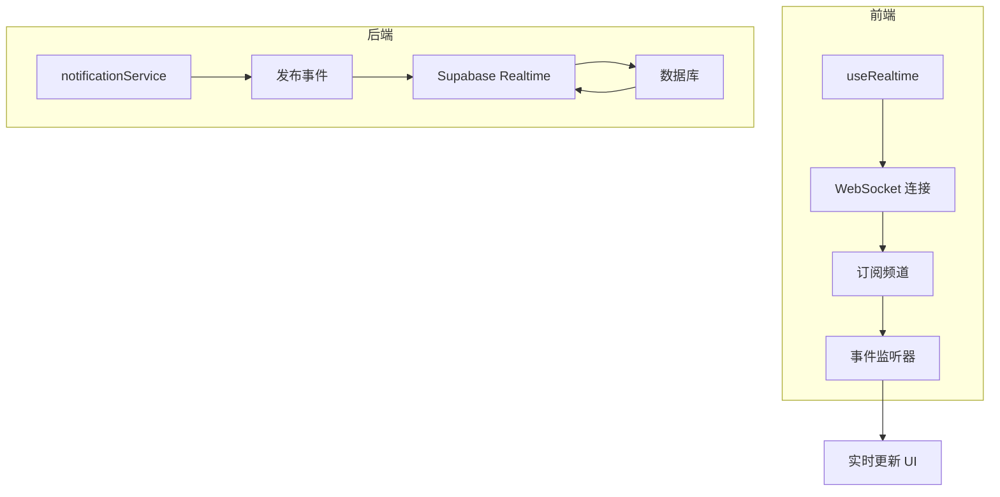
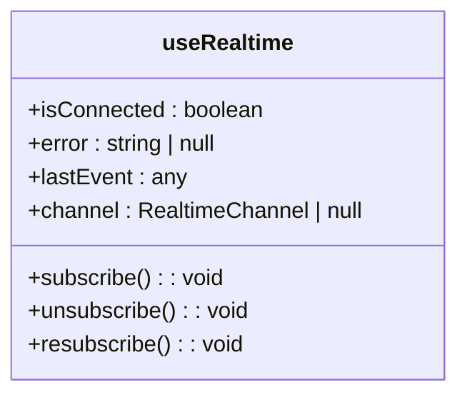
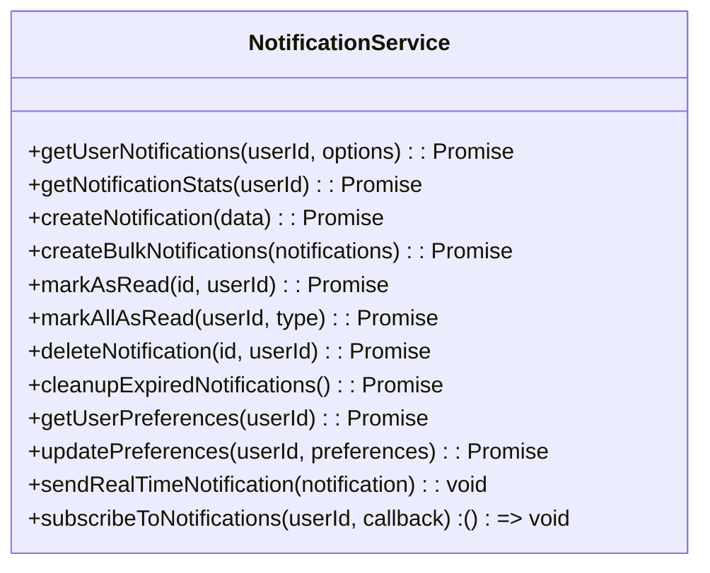
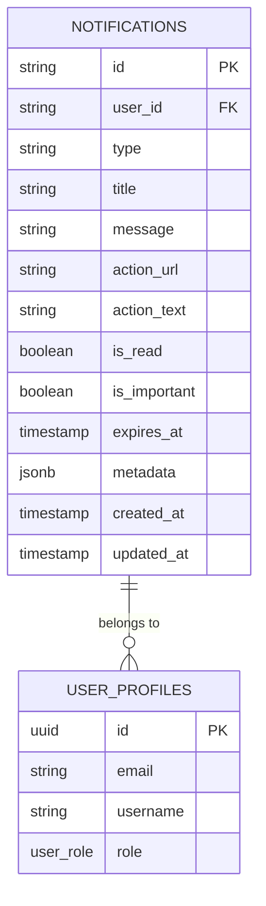
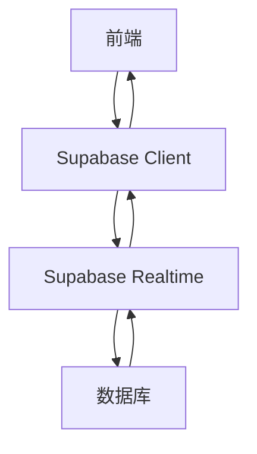

# 实时通知机制

<cite>
**本文档中引用的文件**  
- [useRealtime.ts](file://src/composables/useRealtime.ts)
- [notificationService.ts](file://src/services/notificationService.ts)
- [20241224000001_initial_schema.sql](file://supabase/migrations/20241224000001_initial_schema.sql)
- [20241224000002_rls_policies.sql](file://supabase/migrations/20241224000002_rls_policies.sql)
</cite>

## 目录
1. [简介](#简介)
2. [项目结构](#项目结构)
3. [核心组件](#核心组件)
4. [架构概览](#架构概览)
5. [详细组件分析](#详细组件分析)
6. [依赖分析](#依赖分析)
7. [性能考虑](#性能考虑)
8. [故障排除指南](#故障排除指南)
9. [结论](#结论)

## 简介
本文档全面阐述了基于 Supabase Realtime 的实时通知推送机制。涵盖 WebSocket 连接初始化、频道订阅、事件监听器注册、数据库表结构设计、RLS 策略、索引优化、数据流路径、断线重连机制、消息去重策略、批量更新性能优化及错误处理实践。

## 项目结构
项目结构清晰，主要分为前端组件、服务、组合式函数、数据库迁移脚本等部分。实时通知机制的核心文件位于 `src/composables` 和 `src/services` 目录下，数据库架构定义在 `supabase/migrations` 中。

**Section sources**
- [useRealtime.ts](file://src/composables/useRealtime.ts)
- [notificationService.ts](file://src/services/notificationService.ts)
- [20241224000001_initial_schema.sql](file://supabase/migrations/20241224000001_initial_schema.sql)

## 核心组件
实时通知机制的核心组件包括 `useRealtime.ts` 中的 WebSocket 连接管理、`notificationService.ts` 中的通知发布与消费逻辑，以及数据库中的 `notifications` 表结构和 RLS 策略。

**Section sources**
- [useRealtime.ts](file://src/composables/useRealtime.ts#L1-L403)
- [notificationService.ts](file://src/services/notificationService.ts#L1-L514)

## 架构概览
系统通过 Supabase 的 Realtime 功能实现前后端实时通信。前端使用 `useRealtime` 组合式函数建立 WebSocket 连接并订阅频道，后端通过 `notificationService` 发布和消费实时事件。

**Diagram sources**
- [useRealtime.ts](file://src/composables/useRealtime.ts#L1-L403)
- [notificationService.ts](file://src/services/notificationService.ts#L1-L514)

## 详细组件分析

### useRealtime 分析
`useRealtime` 提供了 WebSocket 连接的初始化、订阅、取消订阅和重新订阅功能。支持自动订阅和组件卸载时自动取消订阅。

**Diagram sources**
- [useRealtime.ts](file://src/composables/useRealtime.ts#L1-L403)

### notificationService 分析
`notificationService` 负责通知的创建、查询、更新和删除。通过 Supabase 客户端发布和消费实时事件，支持批量操作和统计信息获取。

**Diagram sources**
- [notificationService.ts](file://src/services/notificationService.ts#L1-L514)

### 数据库架构分析
`notifications` 表设计合理，包含用户 ID、通知类型、标题、消息、是否已读等字段。通过 RLS 策略确保数据安全，使用复合索引优化查询性能。

**Diagram sources**
- [20241224000001_initial_schema.sql](file://supabase/migrations/20241224000001_initial_schema.sql#L1-L286)
- [20241224000002_rls_policies.sql](file://supabase/migrations/20241224000002_rls_policies.sql#L1-L296)

## 依赖分析
系统依赖 Supabase 的 Realtime 功能和数据库服务。前端通过 `supabaseClient` 与后端通信，后端通过数据库迁移脚本管理表结构和 RLS 策略。

**Diagram sources**
- [lib/supabaseClient.ts](file://src/lib/supabaseClient.ts)
- [useRealtime.ts](file://src/composables/useRealtime.ts#L1-L403)
- [notificationService.ts](file://src/services/notificationService.ts#L1-L514)

## 性能考虑
- 使用 `user_id + is_read` 复合索引优化查询性能
- 批量创建通知减少数据库操作次数
- 定期清理过期通知减少数据量
- 延迟更新统计避免频繁查询

## 故障排除指南
- 检查 WebSocket 连接状态
- 验证 RLS 策略是否正确配置
- 检查数据库索引是否有效
- 查看浏览器控制台日志
- 使用 `supabase.log` 调试 Realtime 通信

**Section sources**
- [useRealtime.ts](file://src/composables/useRealtime.ts#L1-L403)
- [notificationService.ts](file://src/services/notificationService.ts#L1-L514)

## 结论
本文档详细描述了基于 Supabase Realtime 的实时通知推送机制，涵盖了从 WebSocket 连接到数据库设计的各个方面。通过合理的架构设计和性能优化，实现了高效、安全的实时通知功能。