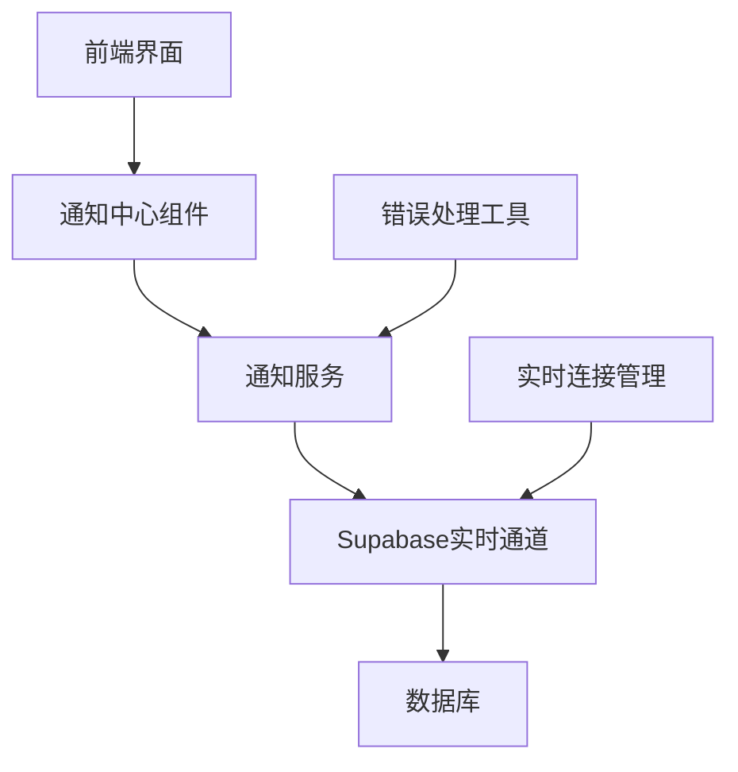
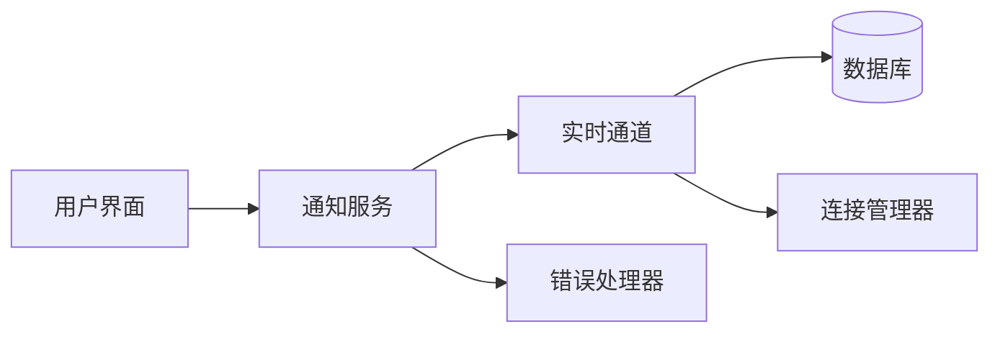
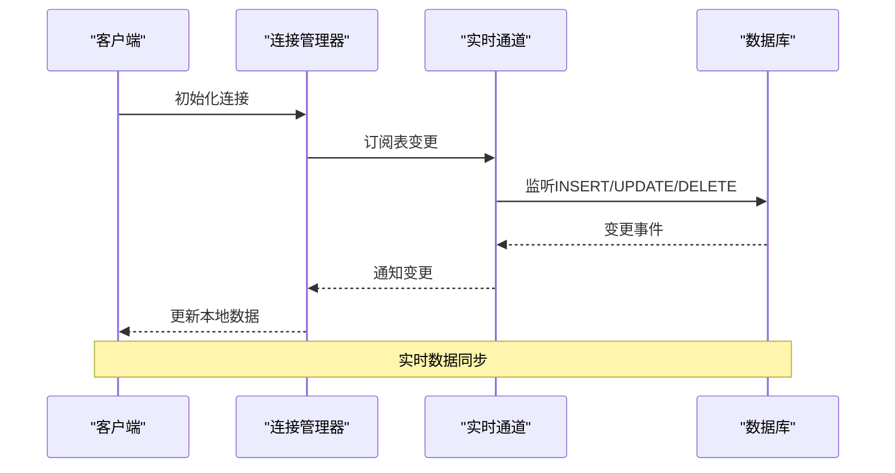
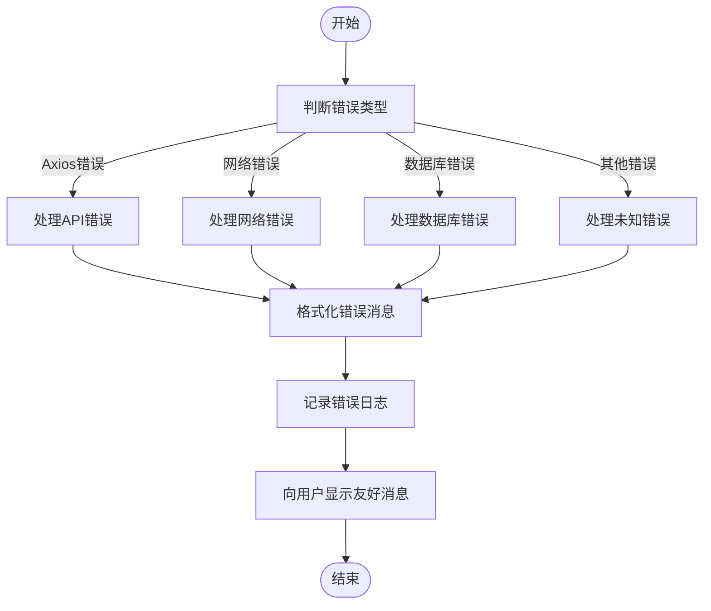
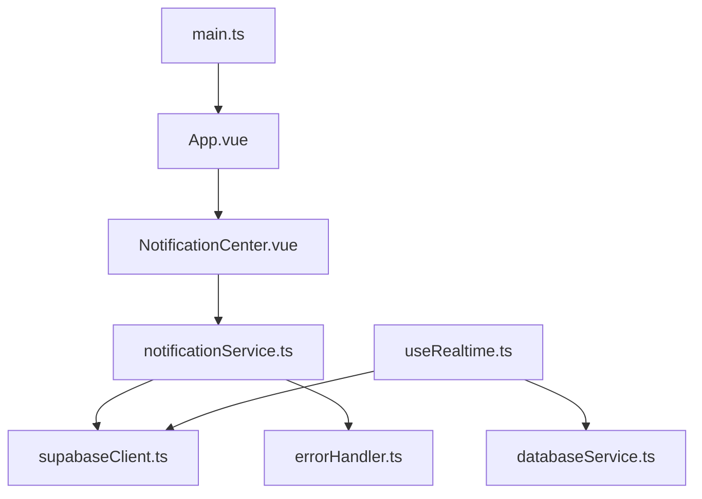

# 性能优化与错误处理

<cite>
**本文档引用的文件**  
- [notificationService.ts](file://src/services/notificationService.ts)
- [NotificationCenter.vue](file://src/components/notifications/NotificationCenter.vue)
- [useRealtime.ts](file://src/composables/useRealtime.ts)
- [errorHandler.ts](file://src/utils/errorHandler.ts)
</cite>

## 目录
1. [引言](#引言)
2. [项目结构](#项目结构)
3. [核心组件](#核心组件)
4. [架构概述](#架构概述)
5. [详细组件分析](#详细组件分析)
6. [依赖分析](#依赖分析)
7. [性能考虑](#性能考虑)
8. [故障排除指南](#故障排除指南)
9. [结论](#结论)

## 引言
本系统性文档旨在全面总结实时通知机制中的性能优化与容错设计。文档详细说明了消息去重策略、批量更新节流机制、连接断线重连的退避算法配置与状态同步逻辑。同时，分析了权限拒绝、频道订阅失败、消息积压等常见错误场景，并提供对应的日志监控、告警设置与恢复操作指南，确保系统的高可用性。

## 项目结构
项目采用模块化设计，主要分为以下几个部分：
- `src/components/notifications`：包含通知中心相关组件
- `src/services`：包含通知服务等核心业务逻辑
- `src/composables`：包含实时连接管理等可复用逻辑
- `src/utils`：包含错误处理等通用工具



**图示来源**
- [notificationService.ts](file://src/services/notificationService.ts)
- [NotificationCenter.vue](file://src/components/notifications/NotificationCenter.vue)
- [useRealtime.ts](file://src/composables/useRealtime.ts)

**章节来源**
- [notificationService.ts](file://src/services/notificationService.ts)
- [NotificationCenter.vue](file://src/components/notifications/NotificationCenter.vue)

## 核心组件
系统的核心组件包括通知服务、通知中心界面、实时连接管理器和错误处理器。这些组件协同工作，确保通知系统的高效运行和高可用性。

**章节来源**
- [notificationService.ts](file://src/services/notificationService.ts)
- [NotificationCenter.vue](file://src/components/notifications/NotificationCenter.vue)
- [useRealtime.ts](file://src/composables/useRealtime.ts)

## 架构概述
系统采用分层架构，从前端界面到后端服务，再到数据库和实时通道，形成完整的通知处理链路。各层之间通过明确定义的接口进行通信，确保系统的可维护性和可扩展性。



**图示来源**
- [notificationService.ts](file://src/services/notificationService.ts)
- [useRealtime.ts](file://src/composables/useRealtime.ts)

## 详细组件分析

### 通知服务分析
通知服务是系统的核心，负责处理所有与通知相关的业务逻辑。

#### 类图
```mermaid
classDiagram
class NotificationService {
+getUserNotifications(userId, options) Promise~{notifications, total, stats}~
+getNotificationStats(userId) Promise~NotificationStats~
+createNotification(notificationData) Promise~Notification | null~
+createBulkNotifications(notifications) Promise~Notification[]~
+markAsRead(notificationId, userId) Promise~void~
+markAllAsRead(userId, type) Promise~void~
+deleteNotification(notificationId, userId) Promise~void~
+cleanupExpiredNotifications() Promise~void~
+getUserPreferences(userId) Promise~NotificationPreferences | null~
+updatePreferences(userId, preferences) Promise~NotificationPreferences~
+sendRealTimeNotification(notification) void
+subscribeToNotifications(userId, callback) () => void
+requestNotificationPermission() Promise~NotificationPermission~
+showBrowserNotification(title, options) Promise~void~
+sendSystemNotification(userIds, title, message, options) Promise~void~
}
class Notification {
+id : string
+user_id : string
+type : string
+title : string
+message : string
+action_url? : string
+action_text? : string
+is_read : boolean
+is_important : boolean
+expires_at? : string
+metadata? : Record~string, any~
+created_at : string
+updated_at : string
}
class NotificationPreferences {
+id : string
+user_id : string
+email_notifications : boolean
+push_notifications : boolean
+system_notifications : boolean
+product_notifications : boolean
+order_notifications : boolean
+marketing_notifications : boolean
+notification_frequency : string
+quiet_hours_start? : string
+quiet_hours_end? : string
+created_at : string
+updated_at : string
}
class NotificationStats {
+total : number
+unread : number
+important : number
+by_type : Record~string, number~
}
NotificationService --> Notification : "使用"
NotificationService --> NotificationPreferences : "使用"
NotificationService --> NotificationStats : "使用"
```

**图示来源**
- [notificationService.ts](file://src/services/notificationService.ts)

**章节来源**
- [notificationService.ts](file://src/services/notificationService.ts)

### 实时连接管理分析
实时连接管理器负责处理客户端与服务器之间的实时连接，确保通知的及时传递。

#### 序列图


**图示来源**
- [useRealtime.ts](file://src/composables/useRealtime.ts)

**章节来源**
- [useRealtime.ts](file://src/composables/useRealtime.ts)

### 错误处理分析
错误处理器负责捕获和处理系统中的各种错误，确保系统的稳定运行。

#### 流程图


**图示来源**
- [errorHandler.ts](file://src/utils/errorHandler.ts)

**章节来源**
- [errorHandler.ts](file://src/utils/errorHandler.ts)

## 依赖分析
系统各组件之间的依赖关系清晰，确保了低耦合和高内聚。



**图示来源**
- [notificationService.ts](file://src/services/notificationService.ts)
- [NotificationCenter.vue](file://src/components/notifications/NotificationCenter.vue)
- [useRealtime.ts](file://src/composables/useRealtime.ts)

**章节来源**
- [notificationService.ts](file://src/services/notificationService.ts)
- [NotificationCenter.vue](file://src/components/notifications/NotificationCenter.vue)
- [useRealtime.ts](file://src/composables/useRealtime.ts)

## 性能考虑
系统在设计时充分考虑了性能优化，包括：
- 使用批量操作减少数据库交互次数
- 实现指数退避重试机制，避免服务过载
- 采用实时通道减少轮询开销
- 对统计信息进行缓存，减少重复查询

## 故障排除指南
### 常见错误场景及处理

| 错误类型 | 错误代码 | 处理方案 |
|---------|---------|---------|
| 权限拒绝 | PERMISSION_DENIED | 检查用户权限设置，重新登录 |
| 频道订阅失败 | CHANNEL_SUBSCRIPTION_FAILED | 检查网络连接，重新订阅 |
| 消息积压 | MESSAGE_BACKLOG | 增加消费者处理能力，优化消息处理逻辑 |
| 数据库连接失败 | DATABASE_CONNECTION_FAILED | 检查数据库配置，重启数据库服务 |
| 网络连接失败 | NETWORK_ERROR | 检查网络设置，重试连接 |

### 监控与告警
- 设置日志监控，捕获关键错误
- 配置告警规则，及时通知运维人员
- 定期检查系统性能指标
- 建立错误恢复流程

**章节来源**
- [errorHandler.ts](file://src/utils/errorHandler.ts)
- [useRealtime.ts](file://src/composables/useRealtime.ts)

## 结论
本系统通过精心设计的性能优化和容错机制，确保了实时通知服务的高可用性和稳定性。消息去重、批量更新、断线重连等机制有效提升了系统性能，而完善的错误处理和监控体系则保障了系统的可靠运行。未来可进一步优化消息队列和缓存策略，提升系统整体性能。