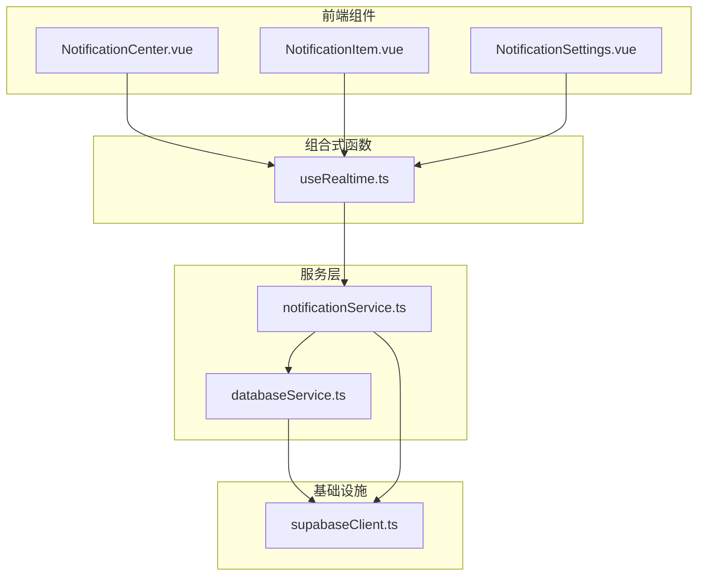
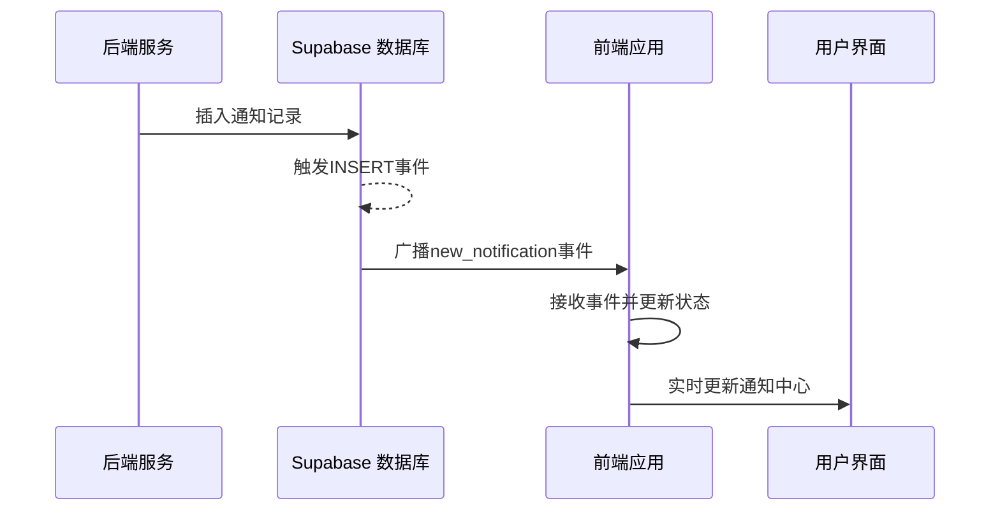
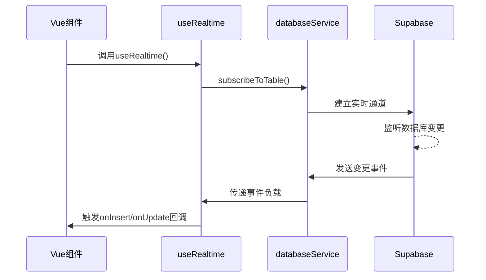
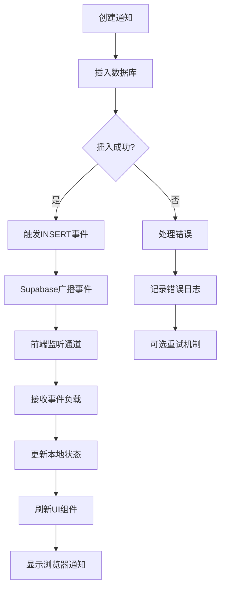
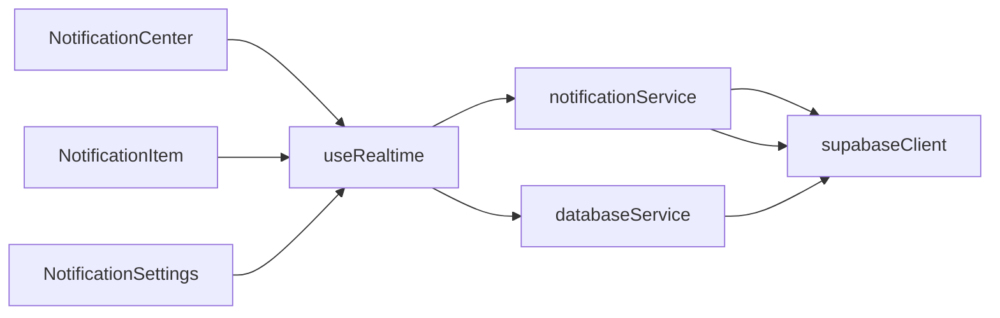

# 通知事件处理机制

<cite>
**本文档引用的文件**
- [notificationService.ts](file://src/services/notificationService.ts)
- [useRealtime.ts](file://src/composables/useRealtime.ts)
- [supabaseClient.ts](file://src/lib/supabaseClient.ts)
- [databaseService.ts](file://src/services/databaseService.ts)
- [NotificationCenter.vue](file://src/components/notifications/NotificationCenter.vue)
- [NotificationItem.vue](file://src/components/notifications/NotificationItem.vue)
- [database.ts](file://src/types/database.ts)
</cite>

## 目录
1. [简介](#简介)
2. [项目结构](#项目结构)
3. [核心组件](#核心组件)
4. [架构概述](#架构概述)
5. [详细组件分析](#详细组件分析)
6. [依赖分析](#依赖分析)
7. [性能考虑](#性能考虑)
8. [故障排除指南](#故障排除指南)
9. [结论](#结论)
10. [附录](#附录)（如有必要）

## 简介
本文档深入解析了基于 Supabase 实时 API 的通知事件处理机制。系统通过 `notificationService` 服务层触发数据库变更事件，前端组件利用 `useRealtime` 组合式函数监听并响应这些实时事件。文档详细阐述了从后端数据库插入或更新操作到前端用户界面更新的完整事件流，包括事件负载结构设计、错误传播与重试机制等关键实现细节。

## 项目结构
系统采用分层架构设计，通知相关功能分布在多个模块中。核心服务位于 `src/services` 目录下，组合式函数存放在 `src/composables` 目录，UI 组件则组织在 `src/components/notifications` 目录中。这种结构实现了关注点分离，便于维护和扩展。



**图示来源**
- [notificationService.ts](file://src/services/notificationService.ts)
- [useRealtime.ts](file://src/composables/useRealtime.ts)
- [supabaseClient.ts](file://src/lib/supabaseClient.ts)

**本节来源**
- [src/services](file://src/services)
- [src/composables](file://src/composables)
- [src/components/notifications](file://src/components/notifications)

## 核心组件
核心组件包括 `notificationService` 服务类，负责处理通知的创建、查询和实时分发；`useRealtime` 组合式函数，用于在 Vue 组件中订阅实时数据流；以及 `NotificationCenter` 等 UI 组件，负责展示通知并与用户交互。这些组件协同工作，构建了一个高效的通知系统。

**本节来源**
- [notificationService.ts](file://src/services/notificationService.ts#L1-L50)
- [useRealtime.ts](file://src/composables/useRealtime.ts#L1-L50)
- [NotificationCenter.vue](file://src/components/notifications/NotificationCenter.vue#L1-L50)

## 架构概述
系统采用事件驱动架构，当后端数据库发生 `INSERT` 或 `UPDATE` 操作时，Supabase 实时 API 会广播事件。前端通过建立的实时通道监听这些事件，并在接收到新通知时立即更新用户界面。整个流程无需轮询，实现了低延迟的实时通信。



**图示来源**
- [notificationService.ts](file://src/services/notificationService.ts#L355-L365)
- [useRealtime.ts](file://src/composables/useRealtime.ts#L10-L50)

## 详细组件分析

### NotificationService 分析
`NotificationService` 类是通知系统的核心，提供了创建、查询和管理通知的完整功能集。其主要方法包括 `createNotification` 用于创建单个通知，`getUserNotifications` 用于获取用户通知列表，以及 `subscribeToNotifications` 用于建立实时订阅。

#### 类图
```mermaid
classDiagram
class NotificationService {
+getUserNotifications(userId, options) Promise~{notifications, total, stats}~
+getNotificationStats(userId) Promise~NotificationStats~
+createNotification(data) Promise~Notification | null~
+createBulkNotifications(notifications) Promise~Notification[]~
+markAsRead(notificationId, userId) Promise~void~
+markAllAsRead(userId, type) Promise~void~
+deleteNotification(notificationId, userId) Promise~void~
+getUserPreferences(userId) Promise~NotificationPreferences | null~
+updatePreferences(userId, preferences) Promise~NotificationPreferences~
-sendRealTimeNotification(notification) void
-subscribeToNotifications(userId, callback) Function
}
class Notification {
+id : string
+user_id : string
+type : string
+title : string
+message : string
+action_url? : string
+action_text? : string
+is_read : boolean
+is_important : boolean
+expires_at? : string
+metadata? : Record~string, any~
+created_at : string
+updated_at : string
}
class NotificationPreferences {
+id : string
+user_id : string
+email_notifications : boolean
+push_notifications : boolean
+system_notifications : boolean
+product_notifications : boolean
+order_notifications : boolean
+marketing_notifications : boolean
+notification_frequency : string
+quiet_hours_start? : string
+quiet_hours_end? : string
+created_at : string
+updated_at : string
}
NotificationService --> Notification : "使用"
NotificationService --> NotificationPreferences : "使用"
```

**图示来源**
- [notificationService.ts](file://src/services/notificationService.ts#L1-L59)
- [database.ts](file://src/types/database.ts#L1-L50)

### useRealtime 分析
`useRealtime` 组合式函数封装了 Supabase 实时订阅的复杂性，为 Vue 组件提供了一个简洁的 API 来监听数据库变更。它支持自动订阅、错误处理和组件卸载时的资源清理，确保了应用的稳定性和资源的有效管理。

#### 序列图


**图示来源**
- [useRealtime.ts](file://src/composables/useRealtime.ts#L10-L50)
- [databaseService.ts](file://src/services/databaseService.ts#L200-L250)

### 事件流分析
从数据库变更到前端更新的完整事件流展示了系统各组件如何协同工作。当新通知被创建时，事件通过 Supabase 实时通道传播，最终触发前端组件的更新。

#### 流程图


**图示来源**
- [notificationService.ts](file://src/services/notificationService.ts#L200-L250)
- [useRealtime.ts](file://src/composables/useRealtime.ts#L50-L100)

**本节来源**
- [notificationService.ts](file://src/services/notificationService.ts#L1-L514)
- [useRealtime.ts](file://src/composables/useRealtime.ts#L1-L403)
- [NotificationCenter.vue](file://src/components/notifications/NotificationCenter.vue#L1-L716)

## 依赖分析
系统各组件之间存在明确的依赖关系。`notificationService` 依赖于 `supabaseClient` 进行数据库操作和实时通信，`useRealtime` 依赖于 `databaseService` 建立订阅通道，而所有 UI 组件都依赖于这些服务和组合式函数来获取数据。



**图示来源**
- [supabaseClient.ts](file://src/lib/supabaseClient.ts#L1-L50)
- [databaseService.ts](file://src/services/databaseService.ts#L1-L50)

**本节来源**
- [supabaseClient.ts](file://src/lib/supabaseClient.ts#L1-L267)
- [databaseService.ts](file://src/services/databaseService.ts#L1-L405)

## 性能考虑
系统在性能方面进行了多项优化。`notificationService` 中的 `getUserNotifications` 方法使用分页查询避免一次性加载过多数据，`databaseService` 实现了缓存机制减少重复数据库查询。实时订阅仅针对特定用户的通知进行过滤，减少了不必要的网络流量。

## 故障排除指南
当遇到通知无法实时更新的问题时，应首先检查 Supabase 连接状态，确认实时通道是否成功建立。查看浏览器控制台日志，验证事件是否被正确接收。如果问题持续存在，检查 `notificationService` 的 `subscribeToNotifications` 方法调用是否正确，并确保用户身份验证状态正常。

**本节来源**
- [useRealtime.ts](file://src/composables/useRealtime.ts#L50-L100)
- [notificationService.ts](file://src/services/notificationService.ts#L400-L450)

## 结论
本文档详细解析了基于 Supabase 的实时通知系统。通过 `notificationService` 和 `useRealtime` 的协同工作，系统实现了高效、低延迟的通知分发机制。事件负载设计合理，包含了必要的元数据字段，支持灵活的通知类型和行为。整个架构清晰，组件职责分明，为后续功能扩展奠定了良好基础。

## 附录
### 通知类型枚举
| 类型 | 描述 |
|------|------|
| info | 一般信息通知 |
| success | 成功状态通知 |
| warning | 警告通知 |
| error | 错误通知 |
| system | 系统通知 |
| product | 产品相关通知 |
| order | 订单相关通知 |

### 事件负载结构
```json
{
  "type": "broadcast",
  "event": "new_notification",
  "payload": {
    "id": "uuid",
    "user_id": "uuid",
    "type": "system",
    "title": "通知标题",
    "message": "通知内容",
    "is_read": false,
    "is_important": true,
    "created_at": "timestamp"
  }
}
```

**本节来源**
- [notificationService.ts](file://src/services/notificationService.ts#L1-L59)
- [database.ts](file://src/types/database.ts#L1-L50)