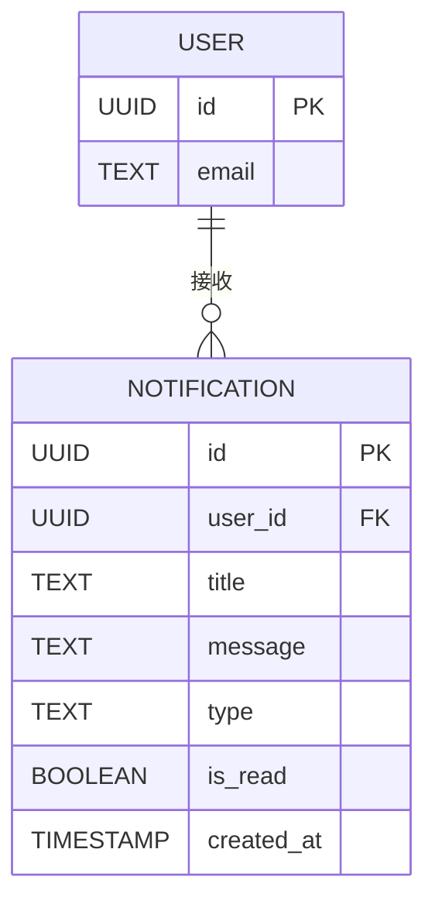
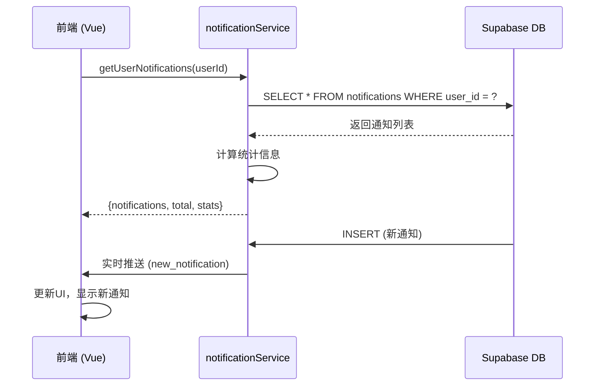

# 通知数据模型设计

<cite>
**本文档引用的文件**  
- [safe-create-tables.sql](file://scripts/database/safe-create-tables.sql)
- [notificationService.ts](file://src/services/notificationService.ts)
- [NotificationCenter.vue](file://src/components/notifications/NotificationCenter.vue)
- [NotificationSettings.vue](file://src/components/notifications/NotificationSettings.vue)
</cite>

## 目录
1. [引言](#引言)
2. [表结构与字段定义](#表结构与字段定义)
3. [行级安全策略（RLS）](#行级安全策略rls)
4. [索引设计与查询性能](#索引设计与查询性能)
5. [数据生命周期管理](#数据生命周期管理)
6. [通知服务与前端集成](#通知服务与前端集成)
7. [结论](#结论)

## 引言
本文件全面文档化 `notifications` 表的数据库设计，涵盖字段定义、安全性、性能优化及生命周期管理。该表用于存储用户个性化通知，支持系统、产品、订单等多类型消息的高效管理与访问控制。

## 表结构与字段定义

`notifications` 表是通知系统的核心数据结构，其字段设计兼顾功能性与扩展性。根据迁移脚本 `safe-create-tables.sql` 和前端服务定义，主要字段如下：

| 字段名 | 数据类型 | 是否可为空 | 默认值 | 业务含义 |
|--------|--------|----------|--------|--------|
| id | UUID | 否 | uuid_generate_v4() | 通知唯一标识符 |
| user_id | UUID | 否 | - | 接收通知的用户ID，外键关联 auth.users |
| title | TEXT | 否 | - | 通知标题，简明扼要地描述内容 |
| message | TEXT | 否 | - | 通知正文，包含详细信息 |
| type | TEXT | 否 | 'info' | 通知类型，如 'system', 'product', 'order' 等 |
| is_read | BOOLEAN | 否 | false | 阅读状态，标识通知是否已被用户查看 |
| is_important | BOOLEAN | 否 | false | 重要性标记，用于高优先级通知 |
| expires_at | TIMESTAMP WITH TIME ZONE | 是 | - | 过期时间，过期后通知将被清理或隐藏 |
| action_url | TEXT | 是 | - | 可选操作链接，点击通知可跳转 |
| action_text | TEXT | 是 | - | 操作链接的显示文本 |
| metadata | JSONB | 是 | - | 附加元数据，用于存储结构化扩展信息 |
| created_at | TIMESTAMP WITH TIME ZONE | 否 | NOW() | 通知创建时间 |
| updated_at | TIMESTAMP WITH TIME ZONE | 否 | NOW() | 通知最后更新时间 |

**Section sources**
- [safe-create-tables.sql](file://scripts/database/safe-create-tables.sql#L105-L139)

## 行级安全策略（RLS）

行级安全（Row Level Security, RLS）确保了通知数据的严格隔离，用户只能访问和操作属于自己的通知记录。

### RLS 策略实现

在 `safe-create-tables.sql` 脚本中，通过 `ALTER TABLE ... ENABLE ROW LEVEL SECURITY` 启用了 RLS。核心策略如下：

- **SELECT 策略**：用户只能查询 `user_id` 等于其自身 `auth.uid()` 的通知。
- **INSERT 策略**：插入新通知时，`user_id` 必须与当前认证用户ID匹配。
- **UPDATE 策略**：更新操作（如标记为已读）必须针对用户自己的通知。
- **DELETE 策略**：删除操作同样受限于 `user_id` 的匹配。

这些策略在 `notificationService.ts` 的服务方法中得到了应用。例如，`markAsRead` 和 `deleteNotification` 方法在构建 Supabase 查询时，都明确使用了 `.eq("user_id", userId)` 来确保操作的合法性。

**Diagram sources**
- [safe-create-tables.sql](file://scripts/database/safe-create-tables.sql#L105-L139)
- [notificationService.ts](file://src/services/notificationService.ts#L206-L258)

**Section sources**
- [safe-create-tables.sql](file://scripts/database/safe-create-tables.sql#L105-L139)
- [notificationService.ts](file://src/services/notificationService.ts#L206-L258)

## 索引设计与查询性能

精心设计的索引是保证通知系统高性能的关键。

### (user_id, is_read) 复合索引

`notifications` 表上创建了 `(user_id, is_read)` 的复合索引。此索引对以下高频查询场景有显著的性能提升作用：

1.  **获取未读通知**：当用户打开通知中心时，最常见的操作是获取所有未读通知。查询 `WHERE user_id = ? AND is_read = false` 可以完全利用该复合索引，实现高效的索引扫描（Index Scan），避免了全表扫描。
2.  **分页查询**：结合 `ORDER BY created_at DESC`，该索引也能很好地支持分页查询，确保用户能快速加载最新的通知列表。
3.  **批量标记为已读**：`markAllAsRead` 操作需要定位特定用户的所有未读通知，该索引同样能加速此过程。

### 其他相关索引

- `created_at` 索引：支持按时间排序和范围查询。
- `type` 索引：支持按通知类型进行筛选。
- `expires_at` 索引：加速过期通知的清理任务。

**Section sources**
- [safe-create-tables.sql](file://scripts/database/safe-create-tables.sql#L161-L186)

## 数据生命周期管理

通知数据需要有效的生命周期管理策略，以平衡用户体验与存储成本。

### 自动归档与清理

系统通过 `notificationService.ts` 中的 `cleanupExpiredNotifications` 方法实现自动清理：

- **过期机制**：每个通知可以设置 `expires_at` 字段。一旦当前时间超过此值，该通知即被视为过期。
- **清理任务**：通过定时任务（Cron Job）定期调用 `cleanupExpiredNotifications`，执行 `DELETE FROM notifications WHERE expires_at < NOW()`，从数据库中物理删除过期记录。
- **前端过滤**：在查询时，服务层会自动添加 `or("expires_at.is.null,expires_at.gt." + new Date().toISOString())` 条件，确保过期通知不会出现在用户界面中。

### 软删除策略

当前设计采用的是**硬删除**（物理删除）而非软删除。这体现在：
- `deleteNotification` 方法直接执行 `DELETE` 操作。
- 没有 `is_deleted` 或 `deleted_at` 这类软删除标志字段。

这种设计适用于通知这类时效性强、历史价值低的数据，简化了数据模型和查询逻辑。

**Section sources**
- [notificationService.ts](file://src/services/notificationService.ts#L254-L311)

## 通知服务与前端集成

`notificationService.ts` 提供了完整的业务逻辑层，封装了与 `notifications` 表的交互。

### 核心功能
- **获取通知** (`getUserNotifications`)：支持分页、按类型、按阅读状态筛选。
- **获取统计** (`getNotificationStats`)：实时计算总通知数、未读数、重要通知数及各类型分布，用于更新通知中心的徽标。
- **创建与发送** (`createNotification`, `sendSystemNotification`)：支持单条和批量创建，并通过 Supabase 实时功能推送。
- **状态管理** (`markAsRead`, `markAllAsRead`)：处理用户阅读行为。
- **偏好设置**：通过 `notification_preferences` 表管理用户对不同类型通知的接收偏好。

### 前端组件
- **NotificationCenter.vue**：通知中心面板，订阅实时更新，动态刷新通知列表和统计信息。
- **NotificationSettings.vue**：允许用户配置邮件、浏览器推送等通知偏好。

**Diagram sources**
- [notificationService.ts](file://src/services/notificationService.ts#L54-L113)
- [NotificationCenter.vue](file://src/components/notifications/NotificationCenter.vue#L348-L405)

**Section sources**
- [notificationService.ts](file://src/services/notificationService.ts#L54-L113)
- [NotificationCenter.vue](file://src/components/notifications/NotificationCenter.vue#L348-L405)
- [NotificationSettings.vue](file://src/components/notifications/NotificationSettings.vue#L223-L295)

## 结论
`notifications` 表的设计体现了现代Web应用中通知系统的最佳实践。通过清晰的字段定义、严格的RLS策略、高效的复合索引以及自动化的生命周期管理，该设计确保了数据的安全性、查询的高性能和系统的可维护性。前端服务与组件的紧密集成，为用户提供了流畅、实时的通知体验。