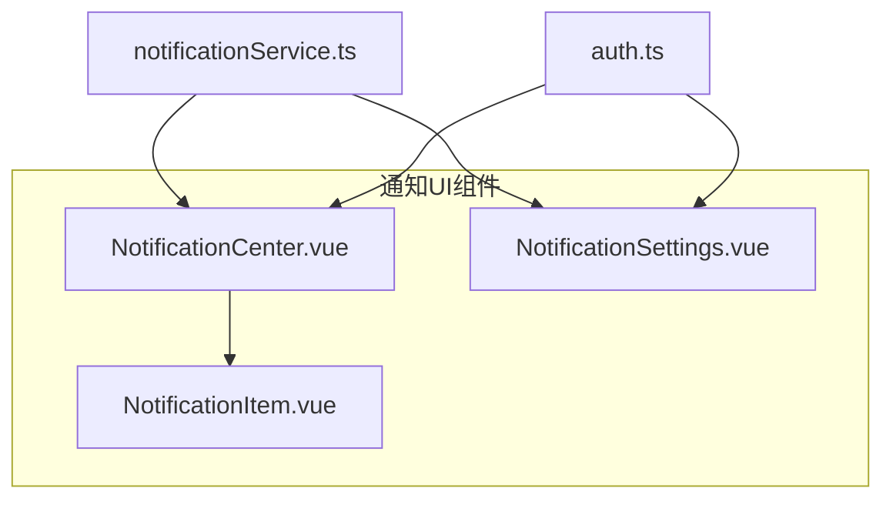
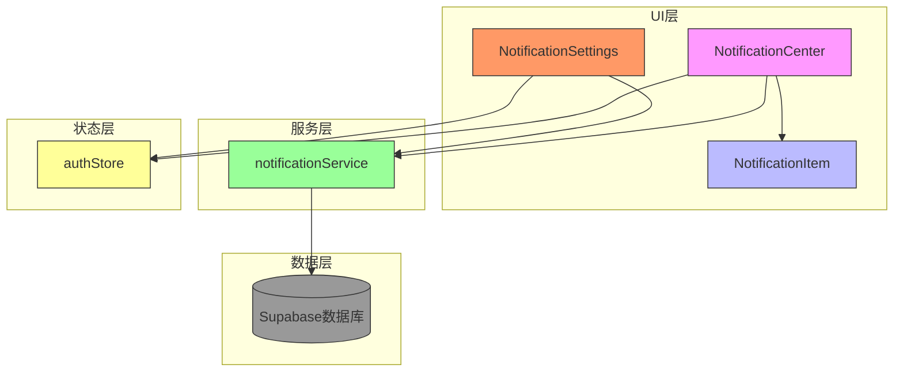
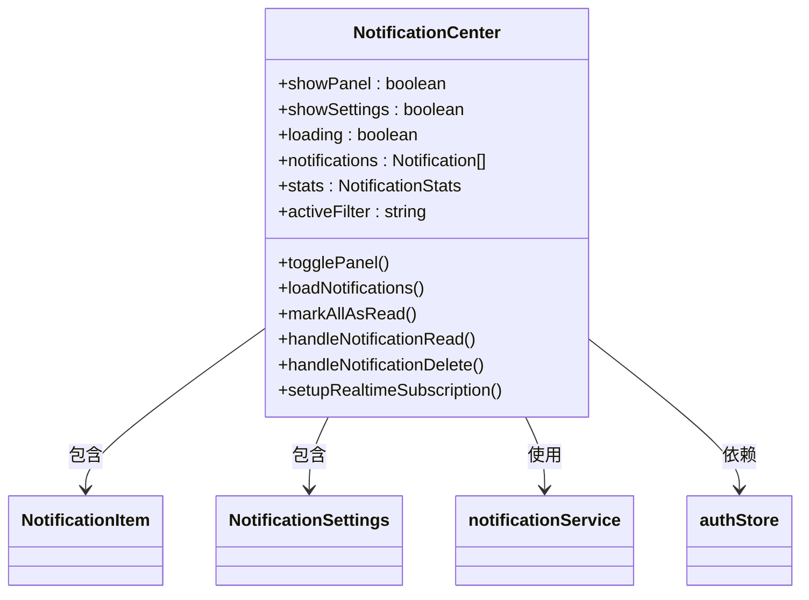
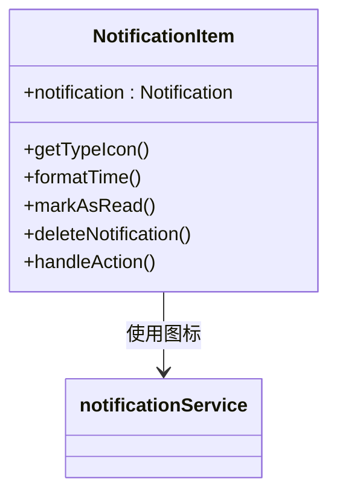
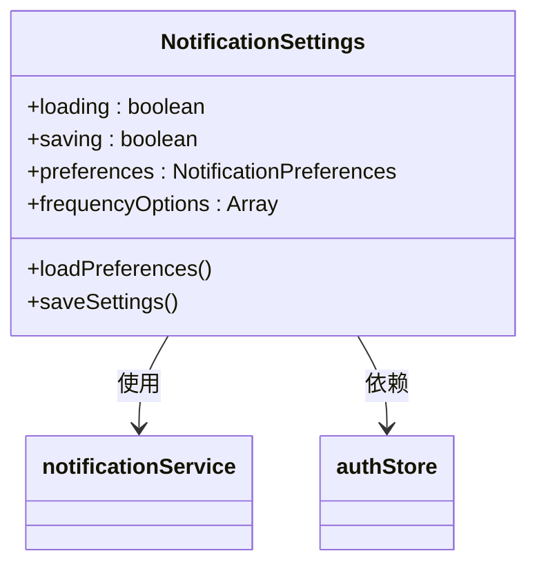
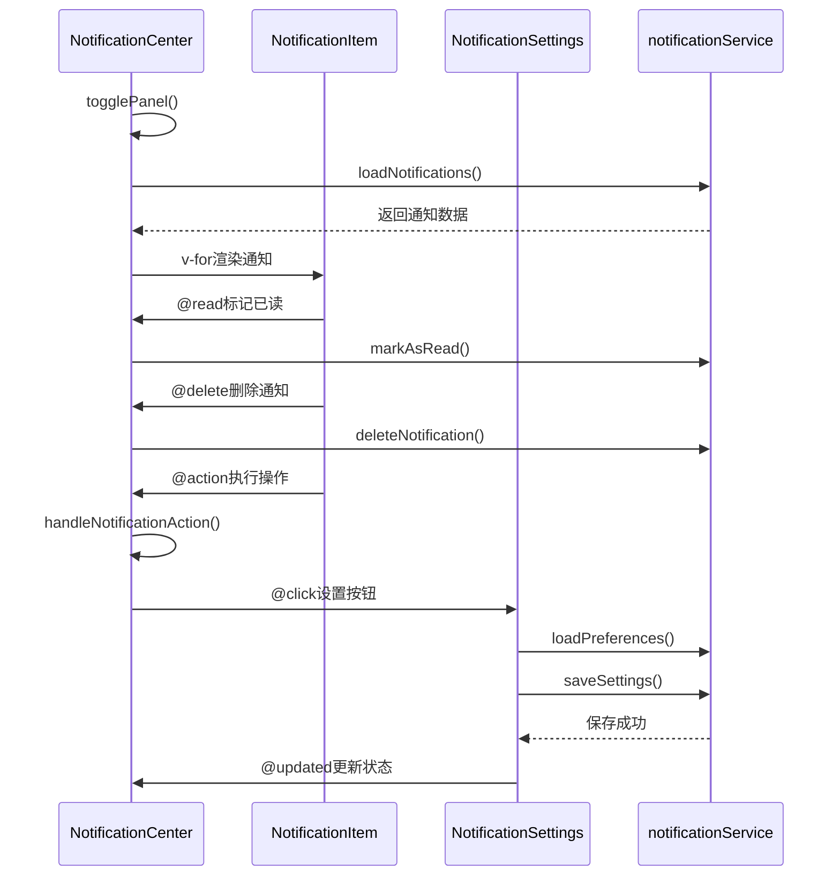
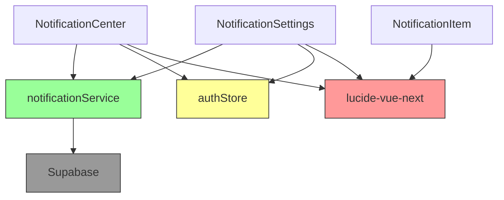
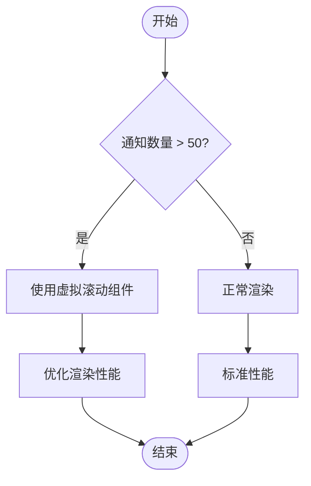
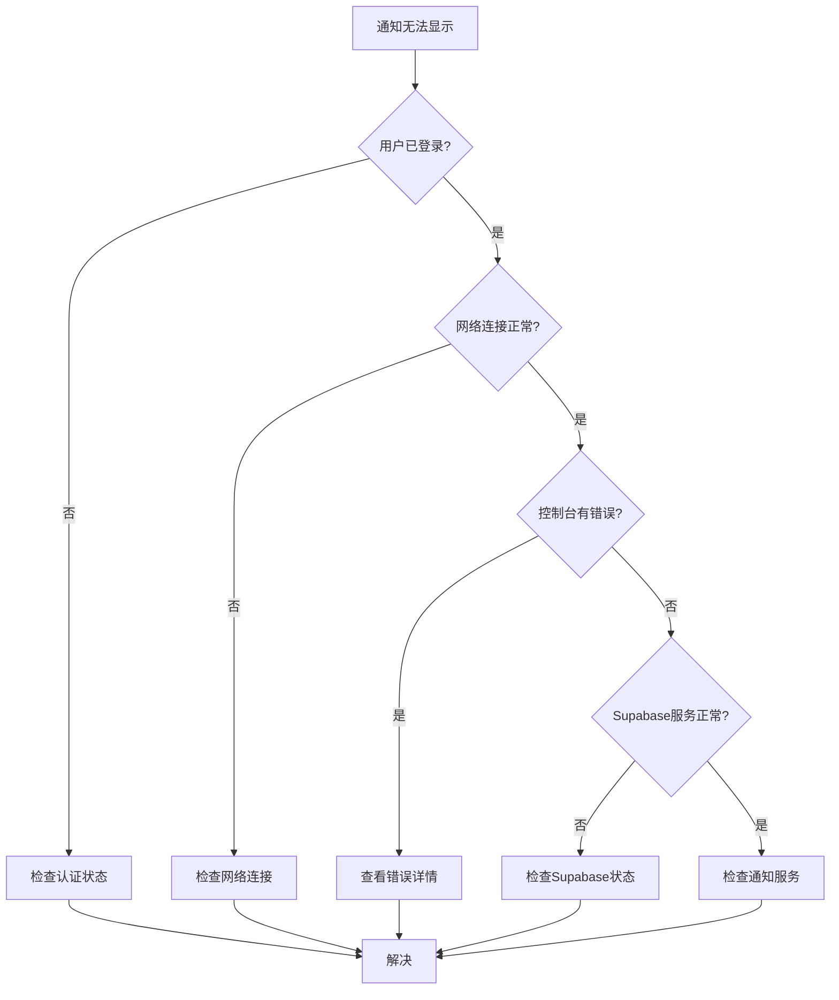

# 通知UI组件

<cite>
**本文档中引用的文件**  
- [NotificationCenter.vue](file://src/components/notifications/NotificationCenter.vue)
- [NotificationItem.vue](file://src/components/notifications/NotificationItem.vue)
- [NotificationSettings.vue](file://src/components/notifications/NotificationSettings.vue)
- [notificationService.ts](file://src/services/notificationService.ts)
- [auth.ts](file://src/stores/auth.ts)
</cite>

## 目录
1. [介绍](#介绍)
2. [项目结构](#项目结构)
3. [核心组件](#核心组件)
4. [架构概览](#架构概览)
5. [详细组件分析](#详细组件分析)
6. [依赖分析](#依赖分析)
7. [性能考虑](#性能考虑)
8. [故障排除指南](#故障排除指南)
9. [结论](#结论)

## 介绍
本项目实现了一个完整的前端通知系统，包含通知中心、通知条目和设置界面三大核心组件。系统采用Vue 3组合式API和TypeScript构建，通过Supabase实现实时数据同步和持久化存储。通知中心提供未读计数、筛选、分页加载等功能，支持响应式设计；通知条目组件实现时间格式化、状态样式控制和交互操作；设置界面允许用户配置通知偏好。整个系统通过事件驱动架构实现组件间通信，并集成浏览器通知功能提升用户体验。

## 项目结构
通知系统相关组件位于`src/components/notifications/`目录下，包含三个主要Vue组件和一个配套的服务层。组件采用模块化设计，通过props和事件实现通信，服务层封装了与后端的交互逻辑。

**Diagram sources**
- [NotificationCenter.vue](file://src/components/notifications/NotificationCenter.vue)
- [NotificationItem.vue](file://src/components/notifications/NotificationItem.vue)
- [NotificationSettings.vue](file://src/components/notifications/NotificationSettings.vue)
- [notificationService.ts](file://src/services/notificationService.ts)
- [auth.ts](file://src/stores/auth.ts)

**Section sources**
- [NotificationCenter.vue](file://src/components/notifications/NotificationCenter.vue)
- [NotificationItem.vue](file://src/components/notifications/NotificationItem.vue)
- [NotificationSettings.vue](file://src/components/notifications/NotificationSettings.vue)

## 核心组件
通知系统由三个核心Vue组件构成：`NotificationCenter`作为主控组件，管理通知的显示状态和用户交互；`NotificationItem`负责单个通知的渲染和样式控制；`NotificationSettings`提供用户偏好配置界面。这些组件通过事件总线和共享服务进行通信，形成一个完整的通知管理解决方案。

**Section sources**
- [NotificationCenter.vue](file://src/components/notifications/NotificationCenter.vue)
- [NotificationItem.vue](file://src/components/notifications/NotificationItem.vue)
- [NotificationSettings.vue](file://src/components/notifications/NotificationSettings.vue)

## 架构概览
系统采用分层架构设计，UI组件层负责用户界面展示和交互，服务层处理业务逻辑和数据持久化，状态管理层管理用户认证状态。组件间通过清晰的props和事件接口通信，确保高内聚低耦合。

**Diagram sources**
- [NotificationCenter.vue](file://src/components/notifications/NotificationCenter.vue)
- [NotificationItem.vue](file://src/components/notifications/NotificationItem.vue)
- [NotificationSettings.vue](file://src/components/notifications/NotificationSettings.vue)
- [notificationService.ts](file://src/services/notificationService.ts)
- [auth.ts](file://src/stores/auth.ts)

## 详细组件分析

### NotificationCenter.vue 分析
`NotificationCenter`组件实现了通知中心的核心功能，包括通知按钮、面板展示、筛选和分页加载。组件通过计算属性动态更新筛选器计数，利用实时订阅接收新通知。

**Diagram sources**
- [NotificationCenter.vue](file://src/components/notifications/NotificationCenter.vue)

**Section sources**
- [NotificationCenter.vue](file://src/components/notifications/NotificationCenter.vue)

### NotificationItem.vue 分析
`NotificationItem`组件负责单个通知的渲染，根据通知类型显示不同图标和颜色，实现时间格式化和状态样式控制。组件通过事件与父组件通信，处理用户交互。

**Diagram sources**
- [NotificationItem.vue](file://src/components/notifications/NotificationItem.vue)

**Section sources**
- [NotificationItem.vue](file://src/components/notifications/NotificationItem.vue)

### NotificationSettings.vue 分析
`NotificationSettings`组件提供用户通知偏好配置界面，支持通知类型开关、推送频率设置和免打扰时间配置。组件在挂载时加载用户偏好，保存时更新到后端。

**Diagram sources**
- [NotificationSettings.vue](file://src/components/notifications/NotificationSettings.vue)

**Section sources**
- [NotificationSettings.vue](file://src/components/notifications/NotificationSettings.vue)

### 组件通信机制
通知系统通过清晰的事件机制实现组件间通信，父组件通过props传递数据，子组件通过事件触发操作。

**Diagram sources**
- [NotificationCenter.vue](file://src/components/notifications/NotificationCenter.vue)
- [NotificationItem.vue](file://src/components/notifications/NotificationItem.vue)
- [NotificationSettings.vue](file://src/components/notifications/NotificationSettings.vue)
- [notificationService.ts](file://src/services/notificationService.ts)

## 依赖分析
通知系统依赖多个核心模块，包括认证服务、通知服务和UI库。这些依赖通过模块导入方式引入，确保代码的可维护性和可测试性。

**Diagram sources**
- [NotificationCenter.vue](file://src/components/notifications/NotificationCenter.vue)
- [NotificationItem.vue](file://src/components/notifications/NotificationItem.vue)
- [NotificationSettings.vue](file://src/components/notifications/NotificationSettings.vue)
- [notificationService.ts](file://src/services/notificationService.ts)
- [auth.ts](file://src/stores/auth.ts)

**Section sources**
- [NotificationCenter.vue](file://src/components/notifications/NotificationCenter.vue)
- [NotificationItem.vue](file://src/components/notifications/NotificationItem.vue)
- [NotificationSettings.vue](file://src/components/notifications/NotificationSettings.vue)
- [notificationService.ts](file://src/services/notificationService.ts)

## 性能考虑
通知系统在性能方面进行了多项优化，包括分页加载、实时订阅和虚拟滚动。对于长列表场景，建议使用虚拟滚动技术避免DOM节点过多导致的性能问题。

**Section sources**
- [NotificationCenter.vue](file://src/components/notifications/NotificationCenter.vue)

## 故障排除指南
当通知系统出现问题时，可按照以下步骤进行排查：检查认证状态、验证网络连接、查看浏览器控制台错误、确认Supabase服务状态。

**Section sources**
- [NotificationCenter.vue](file://src/components/notifications/NotificationCenter.vue)
- [notificationService.ts](file://src/services/notificationService.ts)
- [auth.ts](file://src/stores/auth.ts)

## 结论
该通知系统实现了完整的前端通知管理功能，具有良好的架构设计和代码组织。系统支持响应式布局、实时更新和用户个性化配置，为用户提供流畅的通知体验。通过模块化设计和清晰的接口定义，系统具有良好的可维护性和扩展性，可作为类似功能的参考实现。