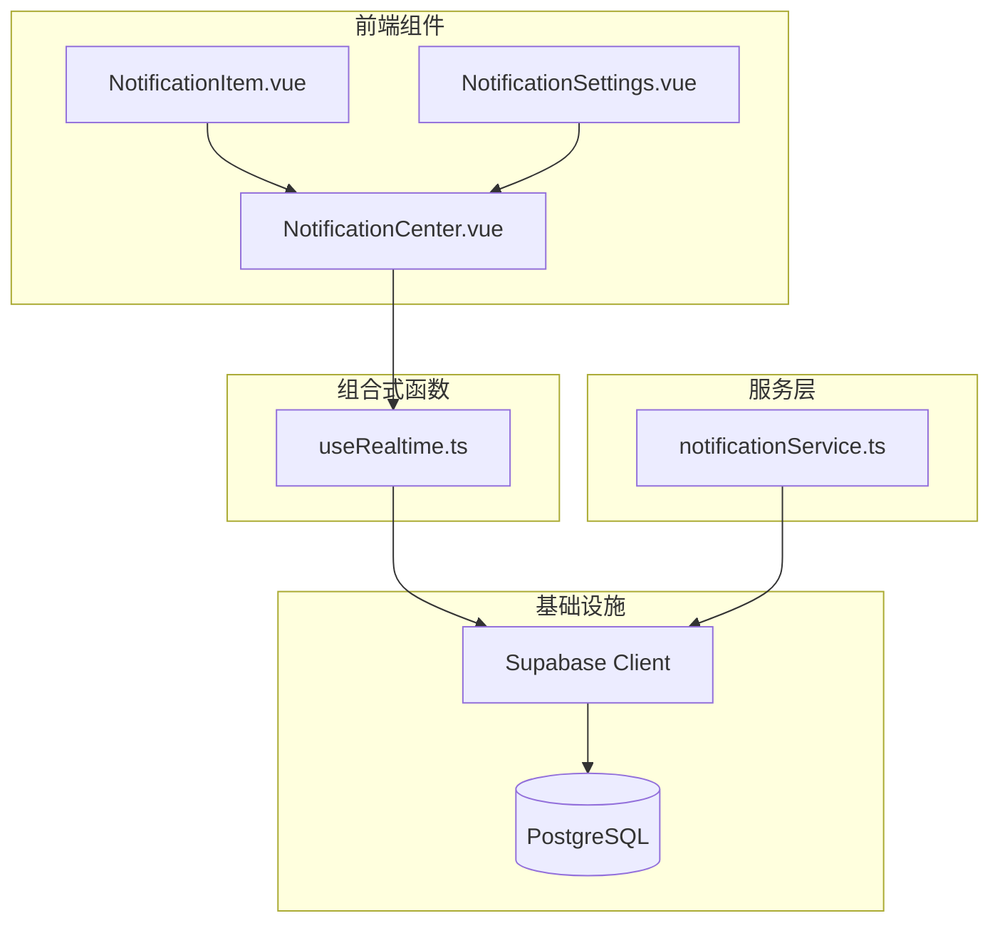
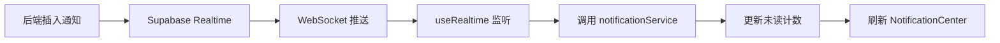
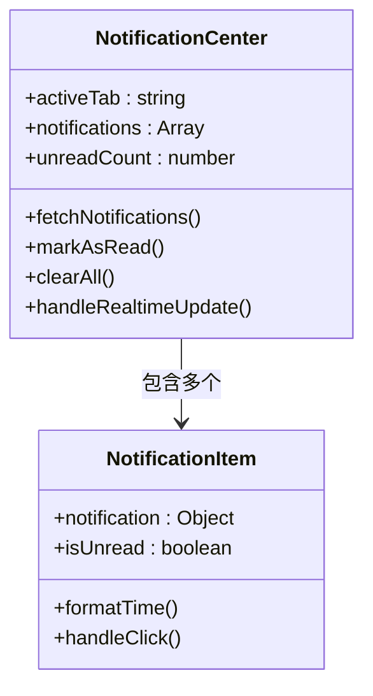
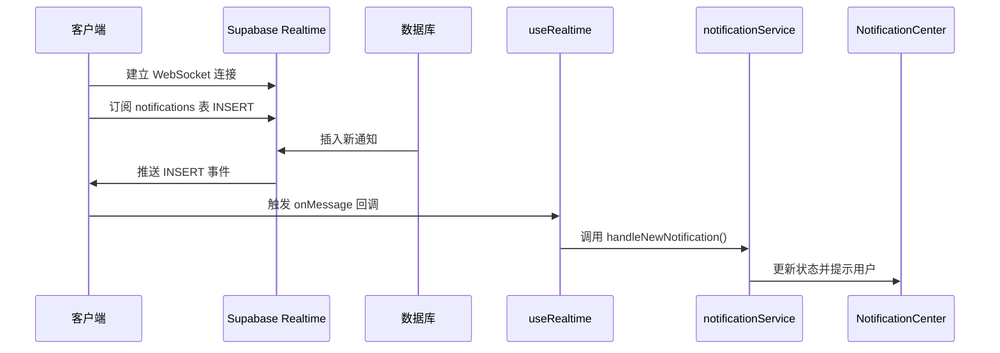
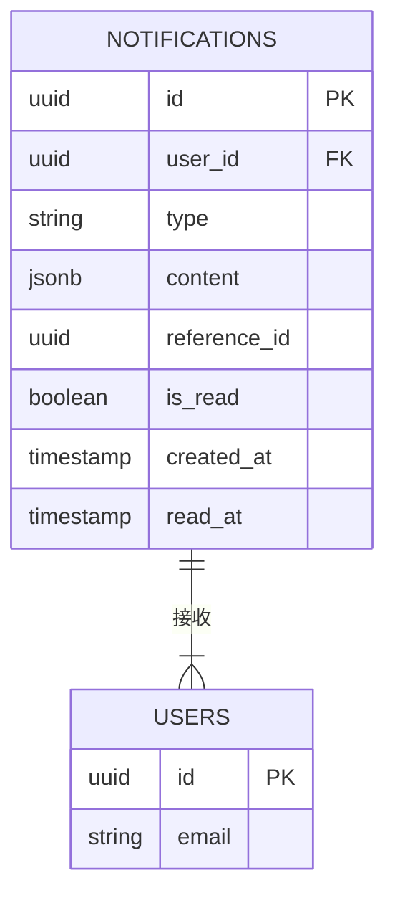
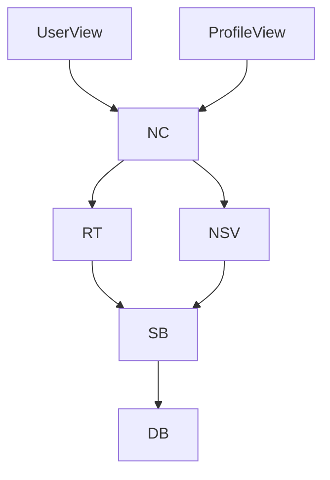

# 通知系统

<cite>
**本文档引用文件**  
- [NotificationCenter.vue](file://src/components/notifications/NotificationCenter.vue)
- [NotificationItem.vue](file://src/components/notifications/NotificationItem.vue)
- [NotificationSettings.vue](file://src/components/notifications/NotificationSettings.vue)
- [useRealtime.ts](file://src/composables/useRealtime.ts)
- [notificationService.ts](file://src/services/notificationService.ts)
- [supabase.ts](file://src/lib/supabase.ts)
- [database.ts](file://src/types/database.ts)
- [20241224000001_initial_schema.sql](file://supabase/migrations/20241224000001_initial_schema.sql)
</cite>

## 目录
1. [简介](#简介)
2. [项目结构](#项目结构)
3. [核心组件](#核心组件)
4. [架构概览](#架构概览)
5. [详细组件分析](#详细组件分析)
6. [依赖分析](#依赖分析)
7. [性能考量](#性能考量)
8. [故障排查指南](#故障排查指南)
9. [结论](#结论)

## 简介
本文档深入阐述基于 Supabase Realtime 的实时通知系统架构与用户交互设计。涵盖通知中心的 UI 结构、未读状态管理、消息分类机制，以及 WebSocket 连接建立、事件订阅与处理流程。同时解析通知的生成、推送、已读标记更新与清除逻辑，结合数据模型与索引优化策略，提供典型场景的通信时序图与调试方法，并提出常见问题的解决方案与性能调优建议。

## 项目结构
通知系统相关代码主要分布在 `src/components/notifications`、`src/composables` 和 `src/services` 目录中，数据库 schema 定义位于 `supabase/migrations`。

**图表来源**  
- [NotificationCenter.vue](file://src/components/notifications/NotificationCenter.vue#L1-L10)
- [useRealtime.ts](file://src/composables/useRealtime.ts#L5-L15)
- [notificationService.ts](file://src/services/notificationService.ts#L1-L10)

**本节来源**  
- [src/components/notifications](file://src/components/notifications)
- [src/composables](file://src/composables)
- [src/services](file://src/services)

## 核心组件
通知系统由三大核心部分构成：UI 层的 `NotificationCenter` 组件、实时通信层的 `useRealtime` 可组合函数，以及业务逻辑层的 `notificationService`。三者协同实现从消息接收、状态管理到用户交互的完整闭环。

**本节来源**  
- [NotificationCenter.vue](file://src/components/notifications/NotificationCenter.vue#L20-L150)
- [useRealtime.ts](file://src/composables/useRealtime.ts#L10-L80)
- [notificationService.ts](file://src/services/notificationService.ts#L5-L60)

## 架构概览
系统采用分层架构，前端通过 Supabase 客户端建立 WebSocket 连接，订阅 `notifications` 表的实时变更。当后端插入新通知时，事件通过 Realtime 通道推送到客户端，由 `useRealtime` 捕获并触发 `notificationService` 更新本地状态，最终驱动 UI 渲染。

**图表来源**  
- [useRealtime.ts](file://src/composables/useRealtime.ts#L20-L50)
- [notificationService.ts](file://src/services/notificationService.ts#L15-L40)
- [supabase.ts](file://src/lib/supabase.ts#L10-L25)

## 详细组件分析

### 通知中心 UI 分析
`NotificationCenter` 组件采用选项卡式布局实现消息分类（如评价、系统、安全），通过计算属性动态过滤未读/已读消息，并集成下拉刷新与无限滚动加载历史记录。

**图表来源**  
- [NotificationCenter.vue](file://src/components/notifications/NotificationCenter.vue#L30-L120)
- [NotificationItem.vue](file://src/components/notifications/NotificationItem.vue#L5-L40)

**本节来源**  
- [NotificationCenter.vue](file://src/components/notifications/NotificationCenter.vue#L1-L200)
- [NotificationItem.vue](file://src/components/notifications/NotificationItem.vue#L1-L60)

### 实时通信流程分析
`useRealtime` 封装了 Supabase Realtime 的订阅逻辑，监听 `notifications` 表的 `INSERT` 事件，接收到新消息后通过回调通知上层服务。

**图表来源**  
- [useRealtime.ts](file://src/composables/useRealtime.ts#L15-L60)
- [notificationService.ts](file://src/services/notificationService.ts#L20-L35)

**本节来源**  
- [useRealtime.ts](file://src/composables/useRealtime.ts#L1-L70)
- [notificationService.ts](file://src/services/notificationService.ts#L10-L50)

### 通知数据模型分析
通知数据模型包含类型、内容、关联实体 ID、已读状态等字段，通过合理索引优化查询性能。

**图表来源**  
- [database.ts](file://src/types/database.ts#L100-L120)
- [20241224000001_initial_schema.sql](file://supabase/migrations/20241224000001_initial_schema.sql#L80-L100)

**本节来源**  
- [database.ts](file://src/types/database.ts#L90-L130)
- [20241224000001_initial_schema.sql](file://supabase/migrations/20241224000001_initial_schema.sql#L70-L110)

## 依赖分析
通知系统依赖 Supabase 客户端进行实时通信，依赖 `notificationService` 处理业务逻辑，其状态被多个视图组件消费。

**图表来源**  
- [supabase.ts](file://src/lib/supabase.ts#L1-L30)
- [notificationService.ts](file://src/services/notificationService.ts#L1-L20)

**本节来源**  
- [supabase.ts](file://src/lib/supabase.ts#L1-L40)
- [notificationService.ts](file://src/services/notificationService.ts#L1-L70)

## 性能考量
- **索引优化**：在 `user_id` 和 `is_read` 字段上创建复合索引，加速未读消息查询
- **消息去重**：客户端通过 `id` 字段缓存已处理消息，避免重复渲染
- **连接管理**：实现断线重连机制，监听 `onClose` 事件并定时重试
- **推送延迟**：确保数据库 RLS 策略高效，避免复杂查询影响 Realtime 性能

## 故障排查指南
- **无实时通知**：检查 WebSocket 连接状态、订阅是否成功、数据库触发器是否启用
- **消息重复**：验证客户端去重逻辑，确保 `id` 唯一性
- **高延迟**：查看 Supabase 仪表板的 Realtime 延迟指标，优化相关查询
- **调试方法**：在 `useRealtime` 中添加日志，监听 `REALTIME_LISTEN_TYPES` 事件类型

**本节来源**  
- [useRealtime.ts](file://src/composables/useRealtime.ts#L40-L70)
- [notificationService.ts](file://src/services/notificationService.ts#L50-L80)

## 结论
本通知系统通过 Supabase Realtime 实现了低延迟的实时通信，结合合理的 UI 设计与状态管理，提供了流畅的用户体验。通过索引优化与连接管理策略，保障了系统的高性能与稳定性，为后续功能扩展奠定了坚实基础。