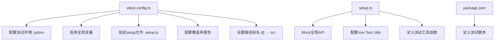
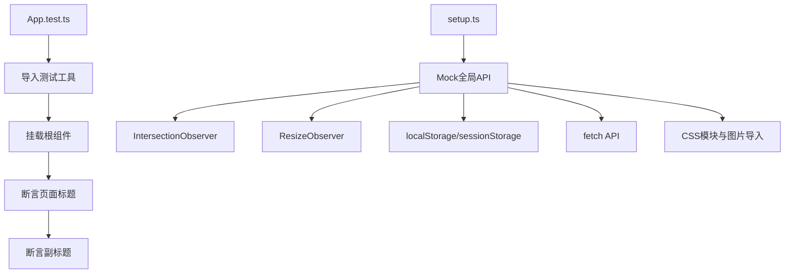
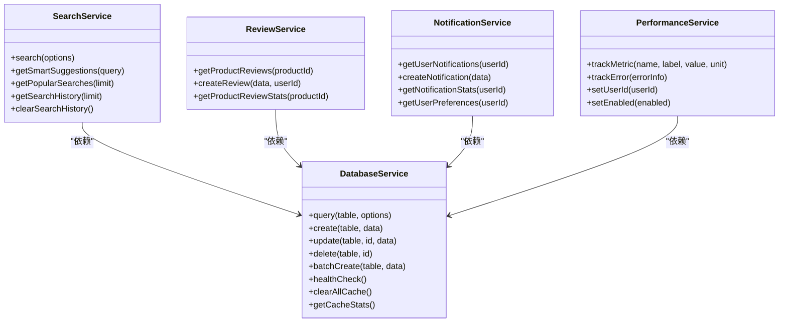
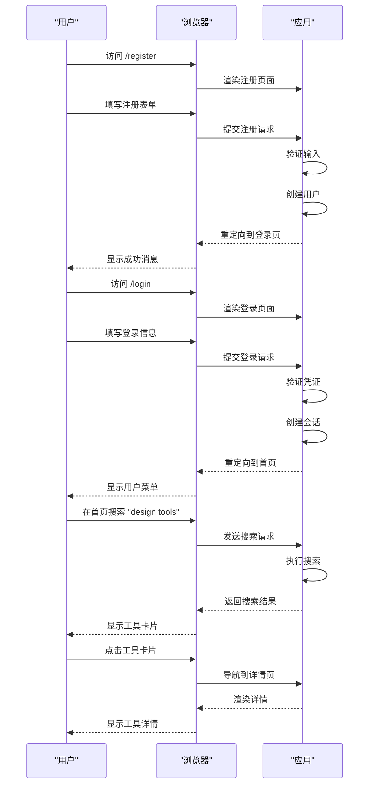
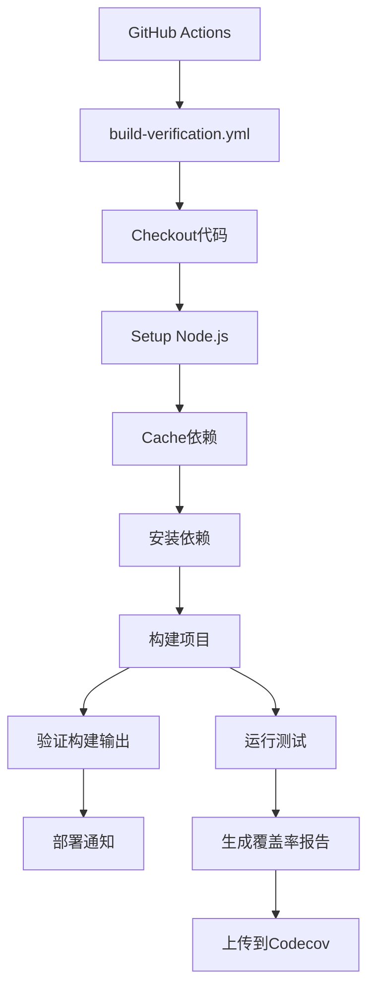
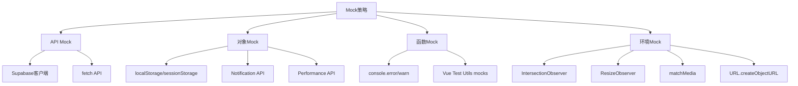
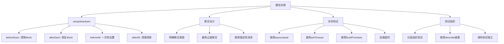

# 测试策略

<cite>
**本文档引用的文件**  
- [vitest.config.ts](file://vitest.config.ts)
- [App.test.ts](file://src/__tests__/App.test.ts)
- [services.test.ts](file://src/tests/integration/services.test.ts)
- [user-workflows.test.ts](file://src/tests/e2e/user-workflows.test.ts)
- [setup.ts](file://src/tests/setup.ts)
- [build-verification.yml](file://advanced-tools-navigation/github/workflows/build-verification.yml)
- [supabaseClient.ts](file://src/lib/supabaseClient.ts)
</cite>

## 目录
1. [简介](#简介)
2. [测试框架配置](#测试框架配置)
3. [单元测试](#单元测试)
4. [集成测试](#集成测试)
5. [端到端测试](#端到端测试)
6. [测试覆盖率与CI集成](#测试覆盖率与ci集成)
7. [Mock策略](#mock策略)
8. [可维护测试用例的最佳实践](#可维护测试用例的最佳实践)
9. [结论](#结论)

## 简介
本文档旨在全面阐述本项目采用的测试策略，涵盖单元测试、集成测试和端到端测试三个层面。通过Vitest测试框架实现自动化验证，确保代码质量与功能稳定性。文档详细说明测试配置、核心测试用例实现、Mock机制设计、CI集成流程以及编写高质量测试的最佳实践，为开发团队提供完整的测试指导。

## 测试框架配置

**图示来源**  
- [vitest.config.ts](file://vitest.config.ts#L1-L30)
- [setup.ts](file://src/tests/setup.ts#L1-L260)

**本节来源**  
- [vitest.config.ts](file://vitest.config.ts#L1-L30)
- [setup.ts](file://src/tests/setup.ts#L1-L260)

Vitest作为本项目的核心测试框架，其配置文件`vitest.config.ts`定义了完整的测试环境。测试环境设置为`jsdom`以支持DOM操作模拟，启用`globals: true`允许直接使用`describe`、`it`等全局函数。通过`setupFiles`引入`src/tests/setup.ts`进行全局Mock配置，确保测试环境的纯净与一致性。

测试覆盖率配置采用`v8`引擎，生成文本、JSON和HTML三种格式报告，便于本地查看与CI集成分析。测试文件包含模式为`src/tests/**/*.test.ts`，排除`node_modules`、`dist`等目录。路径别名`@`指向`src`目录，与开发环境保持一致。

## 单元测试

**图示来源**  
- [App.test.ts](file://src/__tests__/App.test.ts#L1-L11)
- [setup.ts](file://src/tests/setup.ts#L1-L260)

**本节来源**  
- [App.test.ts](file://src/__tests__/App.test.ts#L1-L11)
- [setup.ts](file://src/tests/setup.ts#L1-L260)

单元测试聚焦于最小代码单元的正确性验证。`App.test.ts`作为根组件的测试用例，使用`@vue/test-utils`的`mount`函数渲染`App.vue`组件，并通过`expect`断言页面包含"Ramusi 工具导航站"和"让工作更高效的工具导航站"等关键文本，确保应用入口正常渲染。

`setup.ts`文件在测试运行前执行，对浏览器环境中的关键API进行Mock，包括`IntersectionObserver`、`ResizeObserver`、`localStorage`、`sessionStorage`、`fetch`等，避免测试依赖真实环境。同时Mock了CSS模块和图片导入，防止资源加载失败影响测试。`beforeEach`和`afterEach`钩子确保每次测试前清除所有Mock状态，保证测试独立性。

## 集成测试

**图示来源**  
- [services.test.ts](file://src/tests/integration/services.test.ts#L1-L408)

**本节来源**  
- [services.test.ts](file://src/tests/integration/services.test.ts#L1-L408)
- [supabaseClient.ts](file://src/lib/supabaseClient.ts#L1-L266)

集成测试验证多个组件或服务之间的协作正确性。`services.test.ts`文件对核心服务层进行了全面测试，包括搜索、评价、通知、性能监控和数据库服务。

通过`vi.mock("@/lib/supabase")`对Supabase客户端进行Mock，创建链式调用支持的Mock对象，模拟数据库查询、插入、更新、删除等操作的返回值。每个服务的测试用例验证其核心功能：
- **搜索服务**：验证基本搜索、智能建议、热门搜索和历史管理功能
- **评价服务**：验证获取评价、创建评价和统计功能
- **通知服务**：验证获取通知、创建通知、统计和偏好管理
- **性能监控服务**：验证指标跟踪、错误上报和用户ID设置
- **数据库服务**：验证查询、增删改查、批量操作和健康检查

特别地，`服务间集成`测试用例验证了服务间的协同工作，如搜索服务与数据库服务的协作、通知服务与性能监控的集成、评价服务触发通知等，确保系统整体协作的正确性。

## 端到端测试

**图示来源**  
- [user-workflows.test.ts](file://src/tests/e2e/user-workflows.test.ts#L1-L404)

**本节来源**  
- [user-workflows.test.ts](file://src/tests/e2e/user-workflows.test.ts#L1-L404)

端到端测试模拟真实用户行为，验证完整业务流程。`user-workflows.test.ts`文件定义了多个用户工作流的测试场景：

- **用户注册和登录流程**：验证用户能够成功注册、登录和重置密码
- **搜索和浏览工具流程**：验证用户能够搜索工具、使用高级搜索、浏览分类和查看工具详情
- **产品评价流程**：验证用户能够查看评价、撰写评价和对评价投票
- **通知系统流程**：验证用户能够查看通知、标记已读和设置偏好
- **主题切换流程**：验证用户能够切换主题模式、自定义颜色和应用预设
- **用户个人资料管理**：验证用户能够更新资料和上传头像
- **性能和错误处理**：验证页面加载时间、网络错误处理和离线状态
- **移动端响应式测试**：验证移动端布局和菜单功能
- **无障碍性测试**：验证键盘导航、ARIA标签和屏幕阅读器支持

虽然当前实现使用Mock浏览器环境，但为实际使用Playwright或Cypress等E2E测试工具提供了完整的测试框架和用例设计。

## 测试覆盖率与CI集成

**图示来源**  
- [build-verification.yml](file://advanced-tools-navigation/github/workflows/build-verification.yml#L1-L87)

**本节来源**  
- [build-verification.yml](file://advanced-tools-navigation/github/workflows/build-verification.yml#L1-L87)
- [vitest.config.ts](file://vitest.config.ts#L1-L30)

测试覆盖率目标为关键业务逻辑达到80%以上，核心服务层达到90%以上。Vitest配置中启用`coverage`选项，生成多种格式的报告，便于开发人员本地分析和CI系统集成。

CI流程通过GitHub Actions的`build-verification.yml`工作流实现自动化验证。工作流在`main`分支的`push`和`pull_request`事件触发，执行以下步骤：
1. 检出代码
2. 设置Node.js环境
3. 缓存node_modules以加速构建
4. 安装依赖
5. 构建项目（设置生产环境变量）
6. 验证构建输出（检查dist目录）
7. 运行测试并生成覆盖率报告
8. 发送部署通知

构建过程设置了合理的超时限制，并在关键步骤输出详细日志，便于问题排查。环境变量通过GitHub Secrets安全注入，确保敏感信息不泄露。

## Mock策略

**图示来源**  
- [setup.ts](file://src/tests/setup.ts#L1-L260)
- [services.test.ts](file://src/tests/integration/services.test.ts#L1-L408)

**本节来源**  
- [setup.ts](file://src/tests/setup.ts#L1-L260)
- [services.test.ts](file://src/tests/integration/services.test.ts#L1-L408)

Mock策略是确保测试稳定性和可重复性的关键。本项目采用分层Mock策略：

- **API Mock**：使用`vi.mock`对Supabase客户端进行深度Mock，模拟数据库操作的返回值，避免依赖真实数据库。同时Mock`fetch`API，防止网络请求影响测试。
- **对象Mock**：对`localStorage`、`sessionStorage`、`Notification`、`performance`等全局对象进行Mock，提供可控的测试环境。
- **函数Mock**：使用`vi.fn()`创建可追踪的Mock函数，验证函数调用次数、参数和返回值。特别地，对`console.error`和`console.warn`进行Mock，过滤预期警告，保持测试输出清晰。
- **环境Mock**：对`IntersectionObserver`、`ResizeObserver`、`matchMedia`等浏览器API进行Mock，确保UI组件在无头环境中正常测试。

`setup.ts`文件集中管理所有Mock配置，在测试套件开始前统一设置，保证测试环境的一致性。

## 可维护测试用例的最佳实践

**图示来源**  
- [setup.ts](file://src/tests/setup.ts#L1-L260)
- [services.test.ts](file://src/tests/integration/services.test.ts#L1-L408)
- [user-workflows.test.ts](file://src/tests/e2e/user-workflows.test.ts#L1-L404)

**本节来源**  
- [setup.ts](file://src/tests/setup.ts#L1-L260)
- [services.test.ts](file://src/tests/integration/services.test.ts#L1-L408)
- [user-workflows.test.ts](file://src/tests/e2e/user-workflows.test.ts#L1-L404)

编写可维护的测试用例需要遵循一系列最佳实践：

- **setup/teardown**：合理使用`beforeEach`、`afterEach`、`beforeAll`、`afterAll`钩子。`beforeEach`中清除所有Mock状态，`afterEach`中恢复Mock，确保测试独立性。
- **断言设计**：断言应明确表达测试意图，避免过度断言。使用描述性消息帮助理解失败原因。
- **异步测试**：使用`async/await`处理异步操作，避免使用`setTimeout`。利用`flushPromises`工具函数等待所有Promise解析。
- **测试组织**：使用`describe`块分层组织测试，按功能或模块分组。保持测试用例短小精悍，每个测试只验证一个关注点。
- **测试数据**：在`setup.ts`中定义`createMockUser`、`createMockTool`等工厂函数，统一管理测试数据，提高可维护性。
- **错误处理**：为可能抛出异常的代码添加`expect().not.toThrow()`断言，确保错误处理逻辑正确。

## 结论
本项目建立了全面的测试策略，覆盖单元、集成和端到端测试三个层面。通过Vitest框架和精心设计的Mock策略，实现了高效、稳定的自动化测试。CI集成确保每次代码变更都经过严格验证，保障了代码质量和系统稳定性。遵循最佳实践编写的测试用例具有良好的可维护性，为项目的长期发展提供了坚实保障。