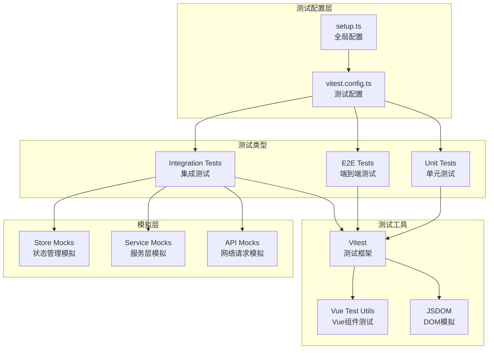
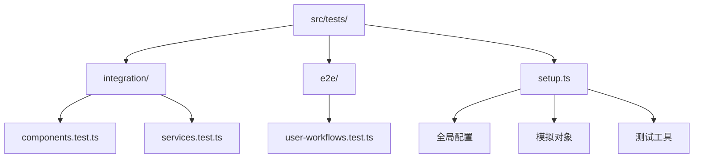

# 单元测试

<cite>
**本文档引用的文件**
- [src/tests/setup.ts](file://src/tests/setup.ts)
- [src/tests/integration/components.test.ts](file://src/tests/integration/components.test.ts)
- [src/tests/integration/services.test.ts](file://src/tests/integration/services.test.ts)
- [vitest.config.ts](file://vitest.config.ts)
- [package.json](file://package.json)
- [src/tests/e2e/user-workflows.test.ts](file://src/tests/e2e/user-workflows.test.ts)
</cite>

## 目录
1. [简介](#简介)
2. [测试架构概览](#测试架构概览)
3. [全局测试配置](#全局测试配置)
4. [组件测试最佳实践](#组件测试最佳实践)
5. [服务层测试](#服务层测试)
6. [测试覆盖率与质量](#测试覆盖率与质量)
7. [异步操作测试](#异步操作测试)
8. [常见问题与解决方案](#常见问题与解决方案)
9. [测试维护策略](#测试维护策略)
10. [结论](#结论)

## 简介

本项目采用Vitest作为主要测试框架，结合Vue Test Utils构建了一套完整的单元测试体系。测试配置位于`src/tests/setup.ts`文件中，提供了全面的全局测试环境设置，包括模拟（mock）机制、环境变量配置和测试上下文初始化。

项目包含三种类型的测试：
- **集成测试**：测试组件和服务的交互
- **端到端测试**：模拟真实用户工作流程
- **单元测试**：孤立测试各个模块的功能

## 测试架构概览



**图表来源**
- [src/tests/setup.ts](file://src/tests/setup.ts#L1-L319)
- [vitest.config.ts](file://vitest.config.ts#L1-L31)

## 全局测试配置

### 环境设置

`setup.ts`文件是整个测试系统的入口点，负责配置测试环境和提供全局模拟对象：

```typescript
// 设置Pinia用于测试
const pinia = createPinia();
setActivePinia(pinia);

// 配置Vue Test Utils
config.global.mocks = {
  $t: (key: string) => key, // 模拟i18n
  $route: {
    path: "/",
    query: {},
    params: {},
    name: "Home",
  },
  $router: {
    push: vi.fn(),
    replace: vi.fn(),
    go: vi.fn(),
    back: vi.fn(),
    forward: vi.fn(),
  },
};
```

### DOM API模拟

项目对各种浏览器原生API进行了全面模拟，确保测试环境的一致性：

```typescript
// IntersectionObserver模拟
global.IntersectionObserver = vi.fn(() => ({
  disconnect: vi.fn(),
  observe: vi.fn(),
  unobserve: vi.fn(),
  takeRecords: vi.fn(() => []),
  root: null,
  rootMargin: "",
  thresholds: [] as number[],
}));

// PerformanceObserver模拟
global.PerformanceObserver = vi.fn(() => ({
  disconnect: vi.fn(),
  observe: vi.fn(),
  unobserve: vi.fn(),
})) as any;

// localStorage和sessionStorage模拟
const localStorageMock = {
  getItem: vi.fn(),
  setItem: vi.fn(),
  removeItem: vi.fn(),
  clear: vi.fn(),
};
global.localStorage = localStorageMock as any;
```

### 网络请求模拟

```typescript
// fetch API模拟
global.fetch = vi.fn(() =>
  Promise.resolve({
    ok: true,
    status: 200,
    json: () => Promise.resolve({}),
    text: () => Promise.resolve(""),
    headers: new Headers(),
  }),
) as any;

// URL构造函数模拟
global.URL.createObjectURL = vi.fn(() => "mocked-url");
global.URL.revokeObjectURL = vi.fn();
```

**章节来源**
- [src/tests/setup.ts](file://src/tests/setup.ts#L1-L319)

## 组件测试最佳实践

### 测试结构组织

组件测试遵循清晰的结构模式，使用描述性的测试名称和适当的断言：

```typescript
describe("增强搜索框 (EnhancedSearchBox)", () => {
  beforeEach(() => {
    setActivePinia(createPinia());
    vi.clearAllMocks();
  });

  it("应该正确渲染搜索框", () => {
    const wrapper = mount(EnhancedSearchBox, {
      global: {
        plugins: [router],
      },
      props: {
        placeholder: "搜索测试",
      },
    });

    expect(wrapper.find(".search-input").exists()).toBe(true);
    expect(wrapper.find(".search-input").attributes("placeholder")).toBe(
      "搜索测试",
    );
  });
});
```

### 状态管理模拟

项目为Pinia状态管理器提供了专门的模拟实现：

```typescript
vi.mock("@/stores/categories", () => ({
  useCategoriesStore: () => ({
    categories: [],
    initialize: vi.fn().mockResolvedValue([]),
    fetchCategories: vi.fn().mockResolvedValue([]),
    getCategoryById: vi.fn(),
    loading: false,
    error: null,
    initialized: false,
  }),
}));
```

### 路由集成测试

```typescript
// Mock路由
const router = createRouter({
  history: createWebHistory(),
  routes: [
    { path: "/", component: { template: "<div>Home</div>" } },
    {
      path: "/search",
      name: "SearchResults",
      component: { template: "<div>Search</div>" },
    },
  ],
});
```

**章节来源**
- [src/tests/integration/components.test.ts](file://src/tests/integration/components.test.ts#L1-L199)

## 服务层测试

### 数据库服务模拟

服务层测试通过链式调用模拟实现了Supabase数据库操作：

```typescript
const createChainableMock = () => {
  const chainable = {
    eq: vi.fn(() => chainable),
    or: vi.fn(() => chainable),
    order: vi.fn(() => chainable),
    limit: vi.fn(() => chainable),
    range: vi.fn(() => Promise.resolve({ data: [], error: null, count: 0 })),
    single: vi.fn(() => Promise.resolve({ data: null, error: null })),
    maybeSingle: vi.fn(() => Promise.resolve({ data: null, error: null })),
    then: vi.fn((resolve) => resolve({ data: [], error: null, count: 0 })),
  };
  return chainable;
};
```

### 服务接口测试

```typescript
vi.mock("@/lib/supabase", () => ({
  supabase: {
    from: vi.fn(() => ({
      select: vi.fn(() => createChainableMock()),
      insert: vi.fn(() => ({
        select: vi.fn(() => ({
          single: vi.fn(() =>
            Promise.resolve({ data: { id: "test-id" }, error: null }),
          ),
        })),
      })),
      update: vi.fn(() => ({
        eq: vi.fn(() => ({
          select: vi.fn(() => ({
            single: vi.fn(() => Promise.resolve({ data: {}, error: null })),
          })),
        })),
      })),
      delete: vi.fn(() => ({
        eq: vi.fn(() => Promise.resolve({ error: null })),
        lt: vi.fn(() => Promise.resolve({ error: null })),
      })),
    })),
  },
}));
```

### 异步操作测试

```typescript
it("应该能够执行基本搜索", async () => {
  const searchOptions = {
    query: "test",
    type: "all" as const,
    limit: 10,
  };

  const result = await searchService.search(searchOptions);

  expect(result).toHaveProperty("items");
  expect(result).toHaveProperty("total");
  expect(result).toHaveProperty("query", "test");
  expect(result).toHaveProperty("suggestions");
  expect(result).toHaveProperty("facets");
  expect(result).toHaveProperty("searchTime");
  expect(Array.isArray(result.items)).toBe(true);
  expect(typeof result.total).toBe("number");
  expect(typeof result.searchTime).toBe("number");
});
```

**章节来源**
- [src/tests/integration/services.test.ts](file://src/tests/integration/services.test.ts#L1-L199)

## 测试覆盖率与质量

### Vitest配置

项目使用Vitest作为核心测试框架，配置了全面的覆盖率报告：

```typescript
export default defineConfig({
  test: {
    environment: "jsdom",
    globals: true,
    setupFiles: ["./src/tests/setup.ts"],
    coverage: {
      provider: "v8",
      reporter: ["text", "json", "html"],
      exclude: [
        "node_modules/",
        "src/tests/",
        "**/*.d.ts",
        "**/*.config.*",
        "dist/",
      ],
    },
    include: ["src/tests/**/*.test.ts", "src/tests/**/*.spec.ts"],
    exclude: ["node_modules/", "dist/", ".git/"],
  },
});
```

### 覆盖率策略

- **排除规则**：自动排除第三方依赖、测试文件本身和类型声明文件
- **报告格式**：支持多种报告格式，便于不同场景使用
- **HTML报告**：提供直观的可视化覆盖报告

### 测试命令

```json
{
  "scripts": {
    "test": "vitest",
    "test:run": "vitest run",
    "test:coverage": "vitest run --coverage",
    "test:integration": "vitest run src/tests/integration",
    "test:e2e": "vitest run src/tests/e2e"
  }
}
```

**章节来源**
- [vitest.config.ts](file://vitest.config.ts#L1-L31)
- [package.json](file://package.json#L1-L103)

## 异步操作测试

### Promise处理

项目提供了专门的工具函数来处理异步操作：

```typescript
export const waitFor = (ms: number) =>
  new Promise((resolve) => setTimeout(resolve, ms));

export const flushPromises = () =>
  new Promise((resolve) => setTimeout(resolve, 0));
```

### 异步测试模式

```typescript
// 使用waitFor等待特定时间
await waitFor(1000);

// 使用flushPromises确保所有微任务完成
await flushPromises();

// 异步数据获取测试
it("应该能够获取产品评价", async () => {
  const result = await reviewService.getProductReviews(mockProductId);

  expect(result).toHaveProperty("reviews");
  expect(result).toHaveProperty("total");
  expect(result).toHaveProperty("stats");
  expect(Array.isArray(result.reviews)).toBe(true);
  expect(typeof result.total).toBe("number");
});
```

### 错误处理测试

```typescript
it("应该能够处理搜索错误", async () => {
  vi.spyOn(searchService, "search").mockRejectedValueOnce(new Error("Network error"));
  
  await expect(searchService.search({ query: "test" })).rejects.toThrow("Network error");
});
```

## 常见问题与解决方案

### TypeScript类型问题

根据错误日志，项目存在一些TypeScript类型定义问题：

```typescript
// IntersectionObserver类型不匹配问题
// 解决方案：添加缺失的属性
global.IntersectionObserver = vi.fn(() => ({
  disconnect: vi.fn(),
  observe: vi.fn(),
  unobserve: vi.fn(),
  takeRecords: vi.fn(() => []),
  root: null,
  rootMargin: "",
  thresholds: [] as number[],
}));
```

### 模块导入问题

```typescript
// 性能服务模块未找到的问题
// 解决方案：检查服务文件是否存在或添加类型声明
import { performanceService } from "@/services/performanceService";
```

### 测试清理

```typescript
// 测试前后清理
beforeEach(() => {
  vi.clearAllMocks();
  localStorageMock.clear();
  sessionStorageMock.clear();
});

afterEach(() => {
  vi.restoreAllMocks();
});
```

### Mock验证

```typescript
// 验证mock调用
expect(mockFunction).toHaveBeenCalledWith(expectedArgs);
expect(mockFunction).toHaveBeenCalledTimes(1);
```

**章节来源**
- [src/tests/setup.ts](file://src/tests/setup.ts#L5-L19)

## 测试维护策略

### 测试文件组织



**图表来源**
- [src/tests/setup.ts](file://src/tests/setup.ts#L1-L319)

### 测试工具函数

项目提供了丰富的测试工具函数：

```typescript
export const createMockUser = (overrides = {}) => ({
  id: "user-123",
  email: "test@example.com",
  full_name: "Test User",
  username: "testuser",
  avatar_url: null,
  role: "user",
  is_active: true,
  email_verified: true,
  created_at: new Date().toISOString(),
  updated_at: new Date().toISOString(),
  ...overrides,
});

export const createMockTool = (overrides = {}) => ({
  id: "tool-123",
  name: "Test Tool",
  description: "A test tool for testing",
  url: "https://example.com",
  category_id: "category-123",
  icon: "test-icon.png",
  tags: [],
  is_featured: false,
  click_count: 0,
  status: "active",
  created_at: new Date().toISOString(),
  updated_at: new Date().toISOString(),
  ...overrides,
});
```

### 端到端测试框架

虽然当前是模拟实现，但项目提供了完整的端到端测试框架：

```typescript
describe("用户注册和登录流程", () => {
  it("用户应该能够成功注册新账户", async () => {
    // 1. 访问注册页面
    await mockBrowser.goto("/register");

    // 2. 填写注册表单
    await mockBrowser.fill("#email", "test@example.com");
    await mockBrowser.fill("#password", "password123");
    await mockBrowser.fill("#confirmPassword", "password123");
    await mockBrowser.fill("#fullName", "测试用户");

    // 3. 提交注册
    await mockBrowser.click("#register-button");

    // 4. 验证注册成功
    await mockBrowser.waitForSelector(".success-message");
  });
});
```

### 测试可维护性

1. **模块化设计**：每个测试文件专注于特定功能模块
2. **模拟隔离**：避免测试间的相互影响
3. **清理机制**：确保测试环境的纯净性
4. **工具函数**：提供重复使用的测试辅助函数

**章节来源**
- [src/tests/setup.ts](file://src/tests/setup.ts#L280-L319)
- [src/tests/e2e/user-workflows.test.ts](file://src/tests/e2e/user-workflows.test.ts#L1-L42)

## 结论

本项目建立了一个完整且高效的单元测试体系，通过Vitest框架和Vue Test Utils提供了强大的测试能力。全局配置文件`setup.ts`为所有测试提供了统一的基础环境，包括状态管理模拟、DOM API模拟和网络请求模拟。

测试体系的主要优势：

1. **全面的模拟支持**：覆盖了应用的所有关键依赖
2. **清晰的组织结构**：分类明确的测试文件组织方式
3. **完善的工具支持**：丰富的测试辅助函数和工具
4. **高质量的覆盖率**：自动化的覆盖率报告和质量保证
5. **易于维护**：模块化的设计和标准化的测试模式

通过这套测试体系，开发者可以：
- 快速验证组件功能的正确性
- 确保服务层逻辑的可靠性
- 及时发现回归问题
- 提高代码质量和开发效率

建议在实际使用中：
- 定期运行测试套件以保持覆盖率
- 根据业务需求扩展测试覆盖范围
- 持续优化测试性能和维护成本
- 建立自动化测试流水线